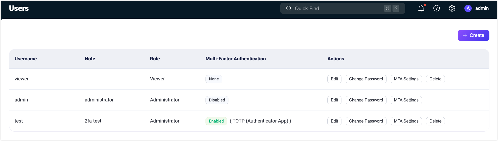
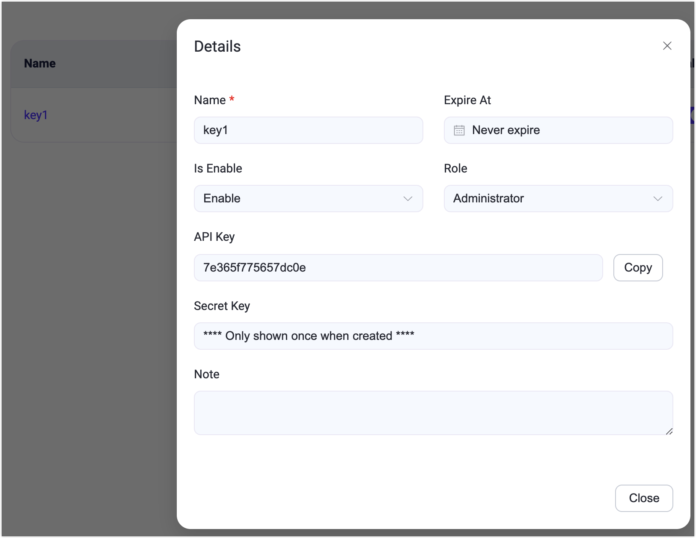
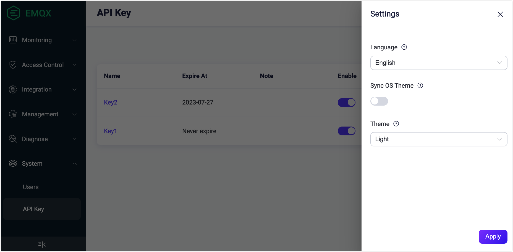

# システム

EMQX ダッシュボードの **システム** メニューには、**ユーザー**、**API キー**、**ライセンス**、および **SSO** のサブメニューが含まれています。これらの各サブメニューでは、それぞれのページでユーザーアカウント、API キー、ライセンス設定、シングルサインオン（SSO）構成を効率的に管理および設定できます。

## ユーザー

**ユーザー** ページでは、[CLI](../cli.md) で生成されたものを含む、すべてのアクティブなダッシュボードユーザーの概要を確認できます。

新しいユーザーを追加するには、ページ右上の + 作成ボタンをクリックします。ポップアップダイアログが表示され、必要なユーザー情報の入力を求められます。入力後、**作成** ボタンをクリックするとユーザーアカウントが生成されます。ユーザー管理のために、アクション列からユーザーの編集、パスワード更新、ユーザー情報の削除などの操作に簡単にアクセスできます。

> セキュリティ上の理由から、EMQX 5.0.0 以降、ダッシュボードユーザーは REST API 認証には使用できません。

EMQX 5.3 以降、ダッシュボードは EMQX Enterprise ユーザー向けにロールベースアクセス制御（RBAC）機能を導入しています。

RBAC により、組織内の役割に基づいてユーザーに権限を割り当てることが可能です。この機能は認可管理を簡素化し、アクセス制限によるセキュリティ強化や組織のコンプライアンス向上に寄与し、ダッシュボードにおける重要なアクセス制御機構となっています。

現在、ユーザーには以下のいずれかの事前定義されたロールを設定できます。ユーザー作成時に **ロール** ドロップダウンから選択可能です。

+ 管理者（Administrator）

    管理者はクライアント管理、システム設定、API キー、ユーザー管理を含むすべての EMQX 機能とリソースをフルアクセスで管理できます。

+ 閲覧者（Viewer）

    閲覧者はすべての EMQX データと設定にアクセスでき、REST API のすべての `GET` リクエストに相当します。ただし、データの作成、変更、削除権限はありません。

## API キー

API キーのページでは、以下の手順で [HTTP API](../../develop/api.md) へのアクセス用に API キーとシークレットキーを生成できます。

1. ページ右上の **+ 作成** ボタンをクリックし、API キー作成のポップアップダイアログを表示します。

2. 作成ダイアログで API キーの詳細情報を設定します。

   - 「Expire At」欄を空欄にすると、API キーは期限切れになりません。
   - API キーのロールを選択できます（任意）。ロールの詳細は [Roles and Permissions](../../develop/api.md#roles-and-permissions) を参照してください。

3. **確認** ボタンをクリックすると、API キーとシークレットキーが生成され、**作成に成功しました** ダイアログに表示されます。

   ::: warning 注意

   シークレットキーは再表示されないため、安全な場所に必ず保存してください。

   :::

    **閉じる** ボタンをクリックしてダイアログを閉じます。

API キーの詳細は、**名前** 列の名前をクリックして確認できます。**アクション** 列の **編集** ボタンから、有効期限のリセット、ステータス変更、メモの編集が可能です。不要になった API キーは **削除** ボタンで削除できます。

## ライセンス

左側の **システム** メニューから **ライセンス** をクリックすると、ライセンスページにアクセスできます。このページでは、現在のライセンスの基本情報（ライセンス接続クォータの使用状況、EMQX バージョン、顧客情報、発行情報など）を確認できます。

**ライセンス更新** をクリックしてライセンスキーをアップロードします。**ライセンス設定** セクションでは、ライセンス接続クォータの使用に対する高水位および低水位の制限を設定できます。ライセンスの詳細については、[EMQX Enterprise ライセンスの利用](../../get-started/deploy/license.md) を参照してください。

## 設定

設定はページ右上の設定アイコンをクリックしてアクセスできます。ダッシュボードの言語とテーマカラーを変更可能です。テーマカラーは OS のテーマと同期する設定も選択できます。これを有効にすると、ダッシュボードのテーマがユーザーの OS テーマと自動的に同期され、手動での選択はできなくなります。

## SSO

SSO ページでは、管理者がユーザーのログイン管理のために SSO 機能を設定できます。SSO 機能の詳細については、[シングルサインオン（SSO）](../sso.md) を参照してください。
