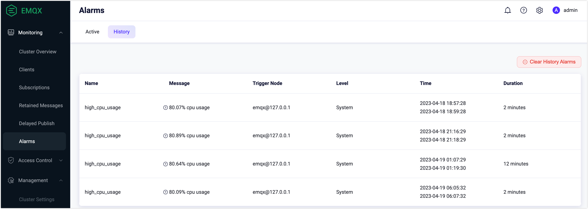
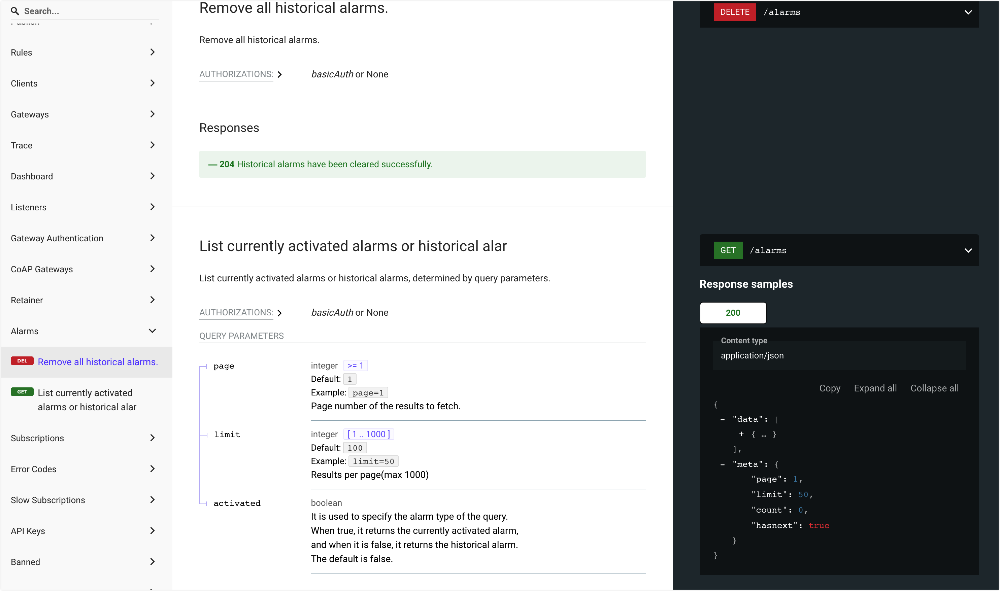
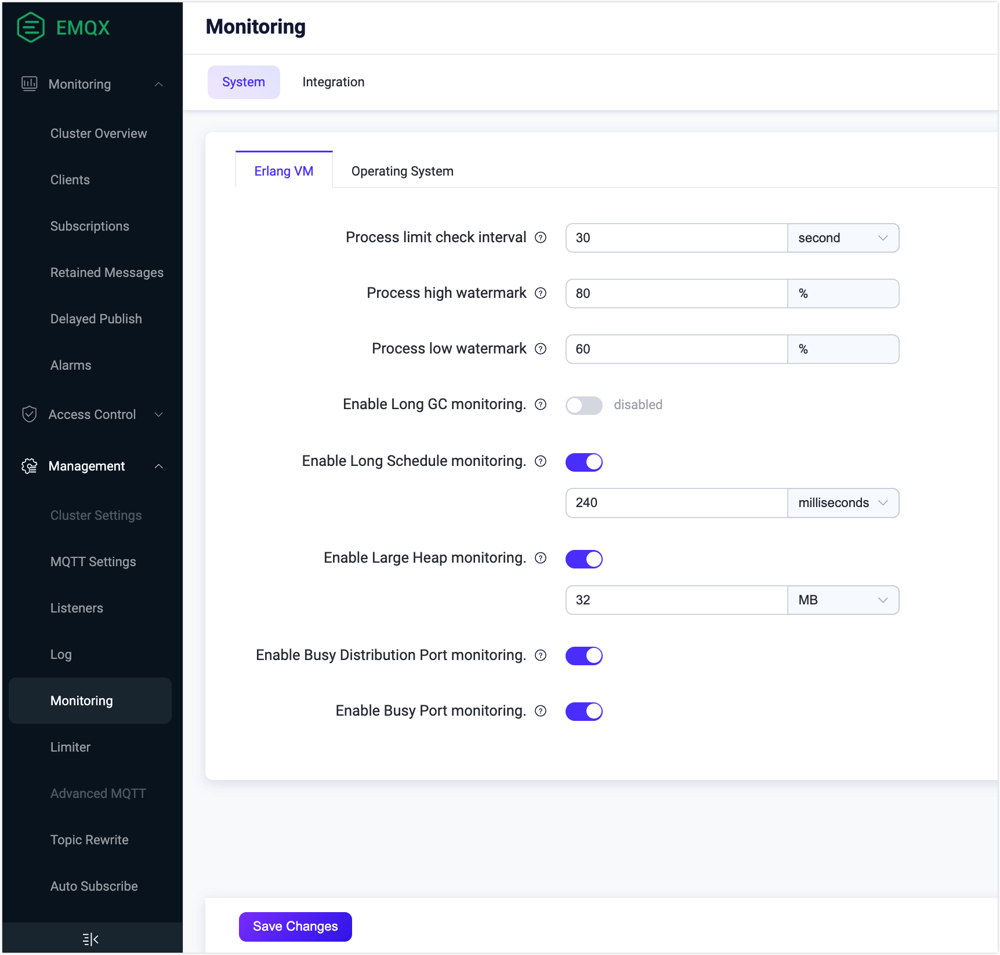
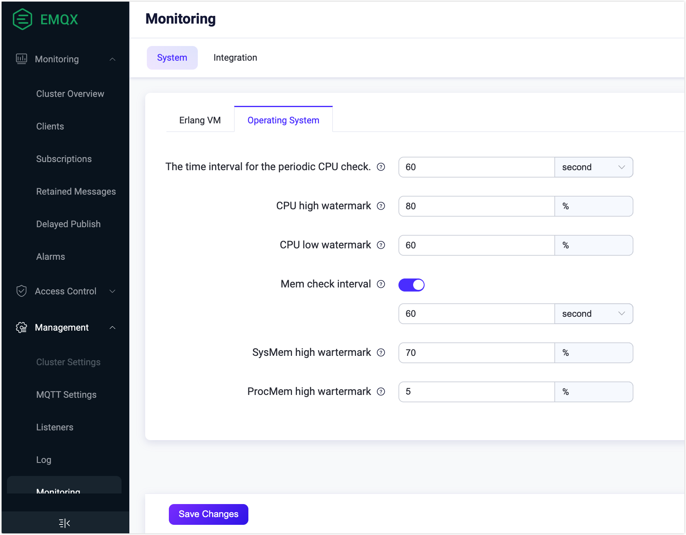

# アラーム

EMQX は、CPU 使用率、システムおよびプロセスのメモリ使用率、プロセス数、ルールエンジンのリソース状態、クラスターのパーティションや修復状況など、内部状態の変化を監視するための組み込みの監視およびアラーム機能を提供しています。これらの変化が閾値を超えたり期待値から逸脱した場合に EMQX がアラームをトリガーして記録し、状態が復旧するとリストから削除します。

本ページでは、EMQX が提供するアラーム情報の内容、詳細なアラーム情報の取得・確認方法、および EMQX におけるアラーム設定と閾値の構成方法について紹介します。監視およびアラーム機能により、運用中の潜在的な問題を通知し続けることが可能です。適切な閾値を設定してアラームを構成することで、EMQX の安全性、安定性、信頼性を確保できます。

## アラーム一覧

以下の表は、システム監視中に潜在的な問題を示すためにトリガーされる可能性のあるアラームを示しています。

::: tip

アラームはシステムへの影響度や重大度に応じて3つのレベルがあります：

- **Error（エラー）**: ユーザー設定によるエラー。クライアントはエラーを認識し再試行可能です。

- **Warning（警告）**: 発生頻度が高い場合は注意が必要な一時的なエラー。

- **Critical（重大）**: クライアントとサーバー間で不可逆的なデータ損失が発生し、通信や業務に支障をきたす状態。

これらのレベルは開発視点で定義されており、あくまで推奨です。ビジネス要件に応じて独自のアラームレベルを定義して構いません。

:::

| **アラーム**                | レベル    | 説明                                                        | **詳細**                                    | **閾値**                                                    |
| :------------------------- | -------- | :---------------------------------------------------------- | :------------------------------------------ | :---------------------------------------------------------- |
| high_system_memory_usage   | Warning  | システムメモリ使用率が高い                                  | システムメモリ使用率が約 ~p% を超えている   | `os_mon.sysmem_high_watermark = 70%`                        |
| high_process_memory_usage  | Warning  | 単一の Erlang プロセスのメモリ使用率が高い（システムメモリ使用率の割合） | プロセスのメモリ使用率が約 ~p% を超えている | `os_mon.procmem_high_watermark = 5%`                        |
| high_cpu_usage             | Warning  | CPU 使用率が高い                                           | 約 ~p% の CPU 使用率                         | `os_mon.cpu_high_watermark = 80%` `os_mon.cpu_low_watermark = 60%` |
| too_many_processes         | Warning  | プロセス数が多すぎる                                       | 約 ~p% のプロセス使用率                      | `vm_mon.process_high_watermark = 80%` `vm_mon.process_low_watermark = 60%` |
| license_quota              | Warning  | ライセンスの接続数が上限を超えている                       | ライセンス：接続数が % を超えている          | `license.connection_high_watermark_alarm = 80%` `license.connection_low_watermark_alarm = 75%` |
| license_expiry             | Critical | ライセンスが期限切れ                                        | ライセンスは % に期限切れとなります          | -                                                           |
| partition                  | Critical | ノードでパーティションが発生                                | ノード ~s でパーティションが発生             | -                                                           |
| resource                   | Critical | リソースが切断されている                                   | リソース ~s(~s) がダウン                      | -                                                           |
| conn_congestion            | Critical | 接続プロセスの輻輳                                        | 接続が輻輳している                            | -                                                           |

## アラームの取得

EMQX では、アラームの取得および詳細情報の確認に複数の方法を提供しています。ひとつは EMQX ダッシュボードを通じて、アクティブなアラームと履歴アラームの両方をユーザーフレンドリーなインターフェースで閲覧する方法です。ここではトリガーされたアラームの概要を簡単に確認できます。

また、MQTT のシステムトピックをサブスクライブしてリアルタイムにシステムアラームの通知を受け取る方法もあります。さらに Webhook 統合を利用して、アラームイベントを外部の HTTP サービスへ送信し処理することも可能です。ログや REST API を通じてアラームを取得することもできます。

### ダッシュボードでアラームを確認する

EMQX ダッシュボードで **Monitoring** -> **Alarms** をクリックし、**Active** タブまたは **History** タブを選択すると、現在アクティブなアラームおよび履歴アラームの一覧を確認できます。

### システムトピック経由でアラームを取得する

アラームがトリガーまたは解除されると、EMQX は MQTT メッセージをシステムトピック `$SYS/brokers/<Node>/alarms/activate` または `$SYS/brokers/<Node>/alarms/deactivate` にパブリッシュします。ユーザーはこれらのトピックをサブスクライブしてアラーム通知を受け取れます。

アラーム通知メッセージのペイロードは JSON 形式で、以下のフィールドを含みます：

| フィールド名        | 型              | 説明                                                         |
| ------------------- | --------------- | ------------------------------------------------------------ |
| `name`              | string          | アラーム名                                                   |
| `details`           | object          | アラームの詳細情報                                           |
| `message`           | string          | 人間が読みやすいアラームの説明                              |
| `activate_at`       | integer         | アラームが発動した時刻をマイクロ秒単位の UNIX タイムスタンプで表現 |
| `deactivate_at`     | integer/string  | アラームが解除された時刻をマイクロ秒単位の UNIX タイムスタンプで表現。アクティブなアラームの場合は `infinity` が入る。 |
| `activated`         | boolean         | アラームが現在発動中かどうか                                |

例えば、システムメモリ使用率が高いアラームの場合、以下のようなアラームメッセージを受け取ります：

同じ種類のアラームは繰り返し報告されません。例えば高 CPU 使用率のアラームが発動中の場合、同じタイプのアラームは新たに生成されません。監視対象の指標が正常に戻ると自動的にアラームは解除されるか、手動で解除することも可能です。

### ログからアラームを取得する

アラームの発動および解除はログ（コンソールまたはファイル）に出力されます。メッセージ送信やイベント処理で障害が発生した場合、詳細情報をログに記録でき、ログ分析を通じてアラートを検知することも可能です。以下はログに出力された詳細なアラーム情報の例です。ログレベルは `warning` で、`msg` フィールドは `alarm_is_activated` および `alarm_is_deactivated` となっています。

### REST API でアラームを取得する

API を通じてアラームの照会や管理が可能です。UI の左ナビゲーションメニューで **Alarms** をクリックすると、この API リクエストが実行されます。EMQX API の利用方法については [REST API](../../develop/api.md) を参照してください。

### Webhook 統合によるアラームイベント送信

EMQX バージョン 5.8.5 以降、ルールエンジンは以下の2つの新しいアラームイベントをサポートしています：

- [$events/sys/alarm_activated](../../develop/data-integration/rule-sql-events-and-fields.md#system-alarm-activated-event-events-sys-alarm-activated)
- [$events/sys/alarm_deactivated](../../develop/data-integration/rule-sql-events-and-fields.md#system-alarm-deactivated-event-events-sys-alarm-deactivated)

これらのイベントにより、Webhook 統合を通じて外部 HTTP サービスへアラームの発動・解除通知を受け取ることが可能です。

Webhook 統合の設定手順：

1. EMQX ダッシュボードで **Monitoring** -> **Alarms** に移動します。  
2. 右上の **Set Up Webhook** ボタンをクリックし、Webhook 統合設定ページを開きます。  
3. Webhook 統合の名前と任意のメモを入力します。**Trigger** フィールドには `Alarm Activated` と `Alarm Deactivated` が事前選択されています。  
4. 通知を送信したい Webhook URL を入力します。  
5. 詳細な設定オプションについては [Create Webhook](../../develop/data-integration/webhook.md) を参照してください。  
6. 設定が完了したら **Save** をクリックします。

## アラーム設定

アラーム設定は、アラームの表示・保存方法を決める「アラーム設定」と、アラームをトリガーする閾値を定める「アラーム閾値」の2つに分かれます。これにより、ビジネス要件に応じてアラームの設定や閾値をカスタマイズできます。

### アラーム設定の構成

アラームの設定は設定ファイル内の設定項目を変更することでのみ構成可能です。以下の表はアラーム設定に関する設定項目の一覧です。

| 設定項目               | 説明                                                        | デフォルト値          | 選択可能な値       |
| ---------------------- | ----------------------------------------------------------- | --------------------- | ------------------ |
| alarm.actions          | アラーム発動・解除時にアラームをログ（コンソールまたはファイル）に書き込み、MQTT メッセージとしてシステムトピック `$SYS/brokers/<node_name>/alarms/activate` および `$SYS/brokers/<node_name>/alarms/deactivate` にパブリッシュするアクション。 | `["log", "publish"]`   | -                  |
| alarm.size_limit       | 履歴として保持する解除済みアラームの最大件数。この制限を超えると最も古い解除済みアラームから削除される。 | `1000`                | `1-3000`           |
| alarm.validity_period  | 解除済みアラームの保持期間。解除直後に削除せず一定期間保持する。 | `24h`                 | -                  |

### ダッシュボードでアラーム閾値を設定する

EMQX ダッシュボードでアラーム閾値を設定できます。アラーム閾値設定用の **Monitoring** ページを開く方法は2通りあります：

1. **Alarms** ページで **Setting** ボタンをクリックすると **Monitoring** ページに遷移します。  
2. 左ナビゲーションメニューから **Management** -> **Monitoring** をクリックします。

**Monitoring** -> **System** タブの中の **Erlang VM** タブでは、Erlang 仮想マシンのシステムパフォーマンスに関する以下の項目を設定できます：

- **Process limit check interval**: プロセス数の定期チェック間隔（秒）。デフォルトは `30` 秒。  
- **Process high watermark**: ローカルノードで同時に存在可能なプロセス数の閾値。指定した割合を超えるとアラームが発動。デフォルトは `80%`。  
- **Process low watermark**: プロセス数が指定した割合まで減少するとアラームが解除される閾値。デフォルトは `60%`。  
- **Enable Long GC monitoring**: デフォルトは無効。Erlang プロセスが長時間ガベージコレクションを行った場合、警告レベルのログ `long_gc` を出力し、システムトピック `$SYS/sysmon/long_gc` に MQTT メッセージをパブリッシュ。  
- **Enable Long Schedule monitoring**: デフォルトは有効。Erlang VM が長時間スケジューリングされたタスクを検知すると警告レベルのログ `long_schedule` を出力。タスクの適切なスケジュール時間をミリ秒単位で設定可能。デフォルトは `240` ミリ秒。  
- **Enable Large Heap monitoring**: デフォルトは有効。Erlang プロセスが大きなヒープ領域を消費した場合、警告レベルのログ `large_heap` を出力し、システムトピック `$SYS/sysmon/large_heap` に MQTT メッセージをパブリッシュ。ヒープサイズの閾値をバイト単位で設定可能。デフォルトは `32` MB。  
- **Enable Busy Distribution Port monitoring**: デフォルトは有効。クラスター内の他ノードと通信するための RPC 接続が過負荷状態になると、警告レベルのログ `busy_dis_port` を出力し、システムトピック `$SYS/sysmon/busy_dist_port` に MQTT メッセージをパブリッシュ。  
- **Enable Busy Port monitoring**: デフォルトは有効。ポートが過負荷状態になると警告レベルのログ `busy_port` を出力し、システムトピック `$SYS/sysmon/busy_port` に MQTT メッセージをパブリッシュ。

設定完了後は **Save Changes** をクリックしてください。

**Operating System** タブでは、システムパフォーマンスに関する以下の項目を設定できます：

- **The time interval of the periodic CPU check**: CPU 使用率の定期チェック間隔（秒）。デフォルトは `60` 秒。  
- **CPU high watermark**: システム CPU 使用率の閾値。指定した割合を超えるとアラームが発動。デフォルトは `80%`。  
- **CPU low watermark**: CPU 使用率が指定した割合まで低下するとアラームが解除される閾値。デフォルトは `60%`。  
- **Mem check interval**: メモリ使用率の定期チェック間隔（秒）。デフォルトは `60` 秒。  
- **SysMem high watermark**: システム全体のメモリ使用率の閾値。指定した割合を超えるとアラームが発動。デフォルトは `70%`。  
- **ProcMem high watermark**: 単一の Erlang プロセスが使用するメモリ使用率の閾値。指定した割合を超えるとアラームが発動。デフォルトは `5%`。

設定完了後は **Save Changes** をクリックしてください。

### 設定項目でアラーム閾値を構成する

設定ファイルのアラーム閾値に関する設定項目を変更して閾値を構成することも可能です。現在変更可能な設定項目は以下の通りです：

| 設定項目                          | 説明                                                        | デフォルト値    |
| -------------------------------- | ----------------------------------------------------------- | -------------- |
| sysmon.os.cpu_check_interval      | CPU 使用率のチェック間隔                                    | `60s`          |
| sysmon.os.cpu_high_watermark      | CPU 使用率の高水位閾値。これを超えるとアラームが発動する。  | `80%`          |
| sysmon.os.cpu_low_watermark       | CPU 使用率の低水位閾値。これを下回るとアラームが解除される。 | `60%`          |
| sysmon.os.mem_check_interval      | メモリ使用率のチェック間隔                                  | `60s`          |
| sysmon.os.sysmem_high_watermark   | システムメモリ使用率の高水位閾値。これを超えるとアラームが発動。 | `70%`          |
| sysmon.os.procmem_high_watermark  | プロセスメモリ使用率の高水位閾値。単一プロセスの使用率がこれを超えるとアラームが発動。 | `5%`           |
| sysmon.vm.process_check_interval  | プロセス数のチェック間隔                                   | `30s`          |
| sysmon.vm.process_high_watermark  | プロセス占有率の高水位閾値。作成済みプロセス数/最大数の割合で測定。これを超えるとアラーム発動。 | `80%`          |
| sysmon.vm.process_low_watermark   | プロセス占有率の低水位閾値。これを下回るとアラーム解除。    | `60%`          |
| sysmon.vm.long_gc                 | Long GC 監視の有効化設定                                   | `disabled`     |
| sysmon.vm.long_schedule           | Long Schedule 監視の有効化設定                             | `disabled`     |
| sysmon.vm.large_heap              | Large Heap 監視の有効化設定                                | `disabled`     |
| sysmon.vm.busy_dist_port          | Busy Distribution Port 監視の有効化設定                    | `true`        |
| sysmon.vm.busy_port               | Busy Port 監視の有効化設定                                 | `true`        |
| sysmon.top.num_items              | 監視グループごとのトッププロセス数                         | `10`           |
| sysmon.top.sample_interval        | トッププロセスのチェック間隔                               | `2s`           |
| sysmon.top.max_procs              | VM 内のプロセス数がこの値を超えるとデータ収集を停止         | `1000000`      |

EMQX Enterprise では、ライセンスの期限が30日未満になるか、接続数が高水位閾値を超えた場合にアラームが発生します。接続数の高/低水位閾値は以下の設定項目を変更して調整可能です。ライセンス設定の詳細は [License](../configuration/license.md) を参照してください。

| 設定項目                              | 説明                                                        | デフォルト値    |
| ----------------------------------- | ----------------------------------------------------------- | -------------- |
| license.connection_high_watermark_alarm | ライセンスがサポートする最大接続数に対する高水位閾値。これを超えるとアラームが発動。アクティブ接続数/最大接続数の割合で測定。 | `80%`          |
| license.connection_low_watermark_alarm  | ライセンスがサポートする最大接続数に対する低水位閾値。これを下回るとアラームが解除。アクティブ接続数/最大接続数の割合で測定。 | `75%`          |
