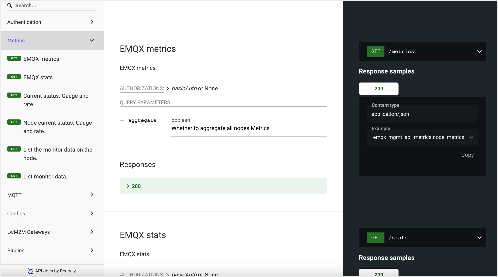

# 統計情報とメトリクス

EMQXはメトリクス監視機能を提供しており、これにより運用・保守担当者は現在のサービス状況を監視し、システムの潜在的な不具合をトラブルシュートできます。

EMQXは監視状態を統計情報（Statistics）とメトリクス（Metrics）に分類しています。

- 統計情報は整数型のゲージで、メトリクスが要求された時点の単一の値を返します。
- メトリクスは整数型のカウンターで、送受信されたバイト数やメッセージ数などの単純な増減を測定します。

EMQXはユーザーに複数の方法で統計情報とメトリクスを閲覧する手段を提供しています。最も直接的にはEMQXダッシュボード上でこれらのデータを確認できます。ダッシュボードへのアクセスが困難な場合は、[REST API](#request-monitoring-status-via-rest-api)や[システムトピック](#get-monitoring-status-via-system-topics)のメッセージを通じてデータを取得可能です。さらに、監視機能を独自の監視システムと簡単に統合する方法については、[Prometheusとの統合](./prometheus.md)をご覧ください。

## ダッシュボードで統計情報を確認する

EMQXダッシュボードの左ナビゲーションメニューから **Monitoring** -> **Cluster Overview** をクリックします。**Cluster Overview** ページで **Nodes** タブをクリックし、ノード名をクリックすると右側に統計情報の詳細が表示されます。

統計情報は現在値と過去の最大値の2つの値を含みます。例えば、現在のサブスクリプション数と過去の最大サブスクリプション数です。以下はEMQXの統計情報一覧です。

| 統計情報                   | 説明                                                         |
| -------------------------- | ------------------------------------------------------------ |
| connections.count          | 現在の接続数                                                 |
| connections.max            | 過去の最大接続数                                             |
| live_connections.count     | 現在アクティブな接続数                                       |
| live_connections.max       | 過去の最大アクティブ接続数                                   |
| channels.count             | `sessions.count` と同じ                                     |
| channels.max               | `sessions.max` と同じ                                       |
| sessions.count             | 現在のセッション数                                           |
| sessions.max               | 過去の最大セッション数                                       |
| topics.count               | 現在のトピック数                                            |
| topics.max                 | 過去の最大トピック数                                        |
| suboptions.count           | `subscriptions.count` と同じ                                |
| suboptions.max             | `subscriptions.max` と同じ                                  |
| subscribers.count          | 現在のサブスクライバー数                                    |
| subscribers.max            | 過去の最大サブスクライバー数                                |
| subscriptions.count        | 現在のサブスクリプション数（共有サブスクリプションを含む） |
| subscriptions.max          | 過去の最大サブスクリプション数                              |
| subscriptions.shared.count | 現在の共有サブスクリプション数                              |
| subscriptions.shared.max   | 過去の最大共有サブスクリプション数                          |
| retained.count             | 現在保持されているメッセージ数                              |
| retained.max               | 過去の最大保持メッセージ数                                  |
| delayed.count              | 現在遅延中のメッセージ数                                    |
| delayed.max                | 過去の最大遅延メッセージ数                                  |

## ダッシュボードでメトリクスを確認する

EMQXダッシュボードの左ナビゲーションメニューから **Monitoring** -> **Cluster Overview** をクリックします。**Cluster Overview** ページで **Metrics** タブをクリックするとメトリクスを確認できます。EMQXのメトリクスは現在、バイト数、パケット数、メッセージ数、イベントの4つの次元をカバーしています。

### 接続とセッションのメトリクス

クラスターまたはノードのイベント関連メトリクスを確認できます。例えば、[クライアント接続](#connections)、[接続セッション](#sessions)、[クライアントアクセス](#access)などです。

#### Connections（接続）

| メトリクス           | 説明                                                         |
| -------------------- | ------------------------------------------------------------ |
| client.connack       | クライアントが受信した接続確認（`CONNACK`）メッセージの数    |
| client.connect       | クライアントからの接続要求数（成功・失敗を含む）              |
| client.connected     | 成功したクライアント接続数                                   |
| client.disconnected  | クライアントの切断数（正常切断・異常切断を含む）              |
| client.subscribe     | 成功したサブスクリプション数                                 |
| client.unsubscribe   | 成功したサブスクリプション解除数                             |

#### Sessions（セッション）

| メトリクス           | 説明                                                         |
| -------------------- | ------------------------------------------------------------ |
| session.created      | 作成されたセッション数                                       |
| session.discarded    | 廃棄されたセッション数                                       |
| session.resumed      | 再開されたセッション数                                       |
| session.takenover    | 引き継がれたセッション数                                     |
| session.terminated   | 終了されたセッション数                                       |

#### Access（アクセス）

| メトリクス                      | 説明                                                         |
| ------------------------------ | ------------------------------------------------------------ |
| authorization.allow            | クライアント認可成功の総数（キャッシュヒットとポリシールールに一致した認可要求の合計） |
| authorization.deny             | クライアント認可失敗の総数（キャッシュヒットとポリシールールに一致しなかった認可要求の合計） |
| authorization.matched.allow    | ルールにより許可されたクライアント認可数                     |
| authorization.matched.deny     | ルールにより拒否されたクライアント認可数                     |
| authorization.nomatch          | どのルールにも一致しなかったクライアント認可要求数           |
| authorization.cache_hit        | キャッシュで認可結果（許可または拒否）を取得したクライアント数 |
| authorization.superuser        | スーパーユーザーとして認可されたクライアント数               |
| client.auth.anonymous          | 匿名でログインしたクライアント数                             |
| client.authenticate            | 認証がトリガーされた回数                                     |
| client.authorize               | 認可がトリガーされた回数                                     |

### メッセージング

**Metrics** ページをスクロールすると、メッセージ関連のメトリクスが表示されます。バイト数([bytes](#bytes))、パケット数([packets](#packets))、メッセージ([message-publish-packet](#message-publish-packet))、配信([delivery](#delivery))が含まれます。

#### Bytes（バイト数）

| メトリクス         | 説明                         |
| ------------------ | ---------------------------- |
| bytes.received     | 受信したバイト数             |
| bytes.sent         | 送信したバイト数             |

#### Packets（パケット数）

| メトリクス                      | 説明                                                         |
| ------------------------------ | ------------------------------------------------------------ |
| packets.received               | 受信したパケット数                                           |
| packets.sent                   | 送信したパケット数                                           |
| packets.connect.received       | 受信したCONNECTパケット数                                    |
| packets.connack.auth_error     | 送信した認証エラー（理由コード0x86および0x87）のCONNACKメッセージ数 |
| packets.connack.error          | 送信した理由コードが0x00以外のCONNACKパケット数（`packets.connack.auth_error`以上の値） |
| packets.connack.sent           | 送信したCONNACKパケット数                                   |
| packets.publish.received       | 受信したPUBLISHパケット数                                   |
| packets.publish.sent           | 送信したPUBLISHパケット数                                   |
| packets.publish.inuse          | パケット識別子が使用中の受信PUBLISHパケット数               |
| packets.publish.auth_error     | ACLチェックに失敗した受信PUBLISHパケット数                   |
| packets.publish.error          | パブリッシュできなかった受信PUBLISHパケット数               |
| packets.puback.received        | 受信したPUBACKパケット数                                    |
| packets.puback.sent            | 送信したPUBACKパケット数                                    |
| packets.puback.inuse           | パケット識別子が使用中の受信PUBACKメッセージ数               |
| packets.puback.missed          | 不明な識別子の受信PUBACKパケット数                           |
| packets.pubrec.received        | 受信したPUBRECパケット数                                    |
| packets.pubrec.sent            | 送信したPUBRECパケット数                                    |
| packets.pubrec.inuse           | パケット識別子が使用中の受信PUBRECメッセージ数               |
| packets.pubrec.missed          | 不明な識別子の受信PUBRECパケット数                           |
| packets.pubrel.received        | 受信したPUBRELパケット数                                    |
| packets.pubrel.sent            | 送信したPUBRELパケット数                                    |
| packets.pubrel.missed          | 不明な識別子の受信PUBRELパケット数                           |
| packets.pubcomp.received       | 受信したPUBCOMPパケット数                                   |
| packets.pubcomp.sent           | 送信したPUBCOMPパケット数                                   |
| packets.pubcomp.inuse          | パケット識別子が使用中の受信PUBCOMPメッセージ数              |
| packets.pubcomp.missed         | 失われたPUBCOMPパケット数                                   |
| packets.subscribe.received     | 受信したSUBSCRIBEパケット数                                 |
| packets.subscribe.error        | 失敗したサブスクリプションを含む受信SUBSCRIBEパケット数     |
| packets.subscribe.auth_error   | ACLチェックに失敗した受信SUBACKパケット数                    |
| packets.suback.sent            | 送信したSUBACKパケット数                                    |
| packets.unsubscribe.received   | 受信したUNSUBSCRIBEパケット数                               |
| packets.unsubscribe.error      | 失敗したサブスクリプション解除を含む受信UNSUBSCRIBEパケット数 |
| packets.unsuback.sent          | 送信したUNSUBACKパケット数                                  |
| packets.pingreq.received       | 受信したPINGREQパケット数                                   |
| packets.pingresp.sent          | 送信したPINGRESPパケット数                                  |
| packets.disconnect.received    | 受信したDISCONNECTパケット数                                |
| packets.disconnect.sent        | 送信したDISCONNECTパケット数                                |
| packets.auth.received          | 受信したAUTHパケット数                                      |
| packets.auth.sent              | 送信したAUTHパケット数                                      |

#### Message (PUBLISHパケット)

| メトリクス                     | 説明                                                         |
| ------------------------------ | ------------------------------------------------------------ |
| messages.acked                 | アックされたメッセージ数                                     |
| messages.delayed               | EMQXにより遅延パブリッシュのため保管されているメッセージ数   |
| messages.delivered             | EMQX内部でサブスクリプション処理に転送されたメッセージ数     |
| messages.dropped               | サブスクリプション処理に転送される前にEMQXが破棄したメッセージ数 |
| messages.dropped.no_subscribers | サブスクライバー不在により破棄されたメッセージ数             |
| messages.dropped.await_pubrel_timeout | PUBREL待機タイムアウトにより破棄されたメッセージ数         |
| messages.dropped.quota_exceeded | クォータ超過（通常は接続数）により破棄されたメッセージ数     |
| messages.dropped.receive_maximum | Receive Maximum到達により破棄されたメッセージ数              |
| messages.forward               | 他ノードに転送されたメッセージ数                             |
| messages.publish               | システムメッセージを除くパブリッシュされたメッセージ数       |
| messages.qos0.received         | クライアントから受信したQoS 0メッセージ数                    |
| messages.qos1.received         | クライアントから受信したQoS 1メッセージ数                    |
| messages.qos2.received         | クライアントから受信したQoS 2メッセージ数                    |
| messages.qos0.sent             | クライアントに送信したQoS 0メッセージ数                      |
| messages.qos1.sent             | クライアントに送信したQoS 1メッセージ数                      |
| messages.qos2.sent             | クライアントに送信したQoS 2メッセージ数                      |
| messages.received              | クライアントから受信したメッセージ数（`messages.qos0.received`、`messages.qos1.received`、`messages.qos2.received`の合計） |
| messages.sent                  | クライアントに送信したメッセージ数（`messages.qos0.sent`、`messages.qos1.sent`、`messages.qos2.sent`の合計） |

#### Delivery（配信）

| メトリクス                     | 説明                                                         |
| ------------------------------ | ------------------------------------------------------------ |
| delivery.dropped              | 配信中に破棄されたメッセージの総数                           |
| delivery.dropped.expired      | メッセージの有効期限切れにより破棄されたメッセージ数         |
| delivery.dropped.no_local     | `No Local`サブスクリプションオプションにより破棄されたメッセージ数 |
| delivery.dropped.qos0_msg     | メッセージキューが満杯のため破棄されたQoS 0メッセージ数      |
| delivery.dropped.queue_full   | メッセージキューが満杯のため破棄されたQoS 0以外のメッセージ数 |
| delivery.dropped.too_large    | 長さ制限超過により破棄されたメッセージ数                     |

## REST APIによる監視状態の取得

APIを通じてメトリクスや統計情報を取得することも可能です。UIの左ナビゲーションメニューで **Metrics** をクリックするとこのAPIリクエストを実行できます。EMQX APIの利用方法については[REST API](../../develop/api.md)をご覧ください。

## システムトピックによる監視状態の取得

EMQXは稼働状況、メッセージ統計、クライアントのオンライン・オフラインイベントに関するメッセージをシステムトピックを通じて定期的にパブリッシュします。クライアントはトピック名の前に `$SYS/` プレフィックスを付けてシステムトピックをサブスクライブできます。システムトピックの種類については[システムトピック](./mqtt-system-topics.md)をご覧ください。

システムトピックの設定はダッシュボードで行えます。左ナビゲーションメニューから **Management** -> **MQTT Settings** をクリックし、**System Topic** タブを選択してください。

- **Messages publish interval**：`$SYS` トピック送信の時間間隔を設定します。
- **Heartbeat interval**：ハートビートメッセージ送信の時間間隔を設定します。
- **Client connected notification**：デフォルトで有効。クライアント接続イベントメッセージがパブリッシュされます。
- **Client disconnected notification**：デフォルトで有効。クライアント切断イベントメッセージがパブリッシュされます。
- **Client subscribed notification**：デフォルトで無効。有効にするとクライアントのトピックサブスクライブイベントメッセージがパブリッシュされます。
- **Client unsubscribed notification**：デフォルトで無効。有効にするとクライアントのトピックサブスクリプション解除イベントメッセージがパブリッシュされます。
