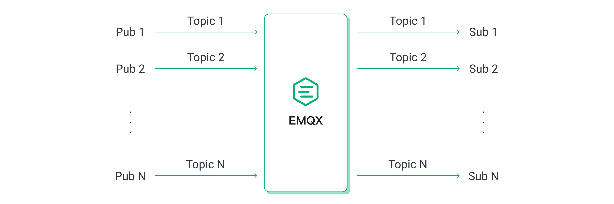
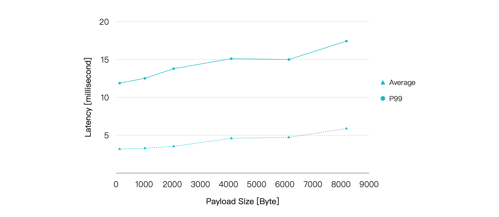
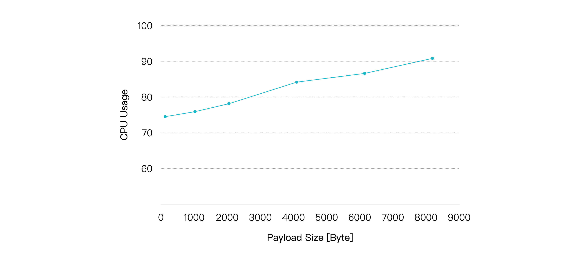
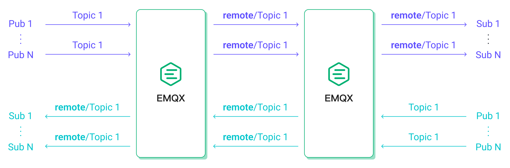
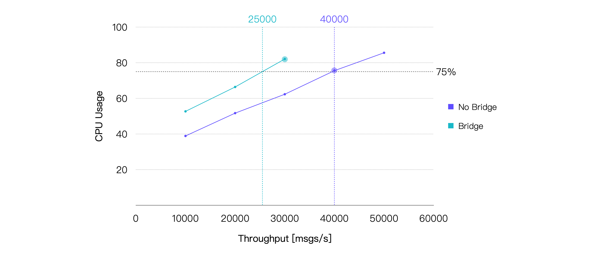

# 参照用テストシナリオと結果

本ページでは、XMeterを用いた性能テストにより、さまざまなシナリオにおけるEMQXのパフォーマンスを詳細に分析します。QoSレベルの違い、ペイロードサイズ、パブリッシュ・サブスクライブモデル、MQTTメッセージブリッジングの影響など、異なる条件下でのEMQXの能力を検証します。厳密なテストと測定を通じて、EMQXの挙動に関する洞察を提供し、IoTアプリケーション向けの最適なデプロイメントに役立てていただくことを目的としています。

## テスト環境

本セクションのすべてのテストは、単一ノードにデプロイされたオープンソース版**EMQX v5.1.6**を対象としています。EMQXとテストサーバー間にはピアリング接続を構築し、外部ネットワークのレイテンシの影響を排除しています。EMQXを実行するサーバーの仕様は以下の通りです。

- **CPU**: 4vCPU（Intel Xeon Platinum 8378A CPU @ 3.00GHz）
- **メモリ**: 8 GiB
- **システムディスク**: General Purpose SSD | 40 GiB
- **最大帯域幅**: 8 Gbit/s
- **最大パケット毎秒**: 800,000 PPS
- **OS**: CentOS 7.9

20クライアントを用いてメッセージの送受信を行うファンインシナリオを除き、他のシナリオではテストクライアント数は10でした。

## テストシナリオと結果

### シナリオ1：異なるQoSにおけるEMQXのパフォーマンス

MQTTパケットのやり取りはQoSレベルが高くなるほど複雑になり、メッセージ配信時のシステムリソース消費も増加します。したがって、各QoSレベルのパフォーマンス影響を理解することは重要です。

本シナリオでは、1,000のパブリッシャーと1,000のサブスクライバーによる1対1通信を行い、128バイトのペイロードメッセージを使用しました。つまり、合計1,000のトピックがあり、それぞれのトピックに1つのパブリッシャーと1つのサブスクライバーが存在します。

メッセージのパブリッシュレートを徐々に増加させて負荷を上げ、各負荷状態でEMQXを5分間稼働させて安定動作を確認しました。異なるQoSレベルおよび負荷条件下でのEMQXのパフォーマンスとリソース消費を、平均メッセージレイテンシ、P99メッセージレイテンシ、平均CPU使用率などを含めて記録しました。

最終的なテスト結果は以下の通りです。

> **レイテンシ**はメッセージがパブリッシュされてから受信されるまでの時間を指します。**スループット**はメッセージの受信スループットと送信スループットで構成されます。

これらの結果から、同等の負荷においてQoSレベルが高いほど平均CPU使用率が増加し、同じシステムリソースではスループットが相対的に低下する傾向があることがわかります。

平均CPU使用率約75%を推奨される日常負荷と仮定すると、今回のハードウェアおよびテストシナリオにおける推奨負荷は、QoS 0で約57K TPS、QoS 1で約40K TPS、QoS 2で約24K TPSとなります。以下はCPU使用率が75%に最も近いテストポイントのパフォーマンスデータです。

| **QoSレベル** | **推奨負荷（TPS、受信＋送信）** | **平均CPU使用率（%）（1 - アイドル）** | **平均メモリ使用率（%）** | **平均レイテンシ（ms）** | **P99レイテンシ（ms）** |
| :------------ | :------------------------------ | :---------------------------------- | :-------------------------- | :---------------------- | :------------------ |
| QoS 0         | 60K                             | 78.13                               | 6.27                        | 2.079                   | 8.327               |
| QoS 1         | 40K                             | 75.56                               | 6.82                        | 2.356                   | 9.485               |
| QoS 2         | 20K                             | 69.06                               | 6.39                        | 2.025                   | 8.702               |

### シナリオ2：異なるペイロードサイズにおけるEMQXのパフォーマンス

大きなメッセージペイロードは、OSがネットワークパケットの受信・送信に必要とするソフト割り込みの回数を増やし、パケットのシリアライズ・デシリアライズにかかる計算リソースも増加させます。多くのMQTTメッセージは通常1KB未満ですが、より大きなメッセージを送信するシナリオも存在します。そこで、ペイロードサイズの違いがパフォーマンスに与える影響を検証しました。

前述の1,000パブリッシャーと1,000サブスクライバーによる1対1通信を継続し、メッセージのQoSは1、パブリッシュレートは20K msg/sに固定しました。ペイロードサイズを増加させて負荷を上げ、各負荷状態でEMQXを5分間稼働させて安定性を確認しました。各負荷条件下でのパフォーマンスとリソース使用率を記録しました。

結果は以下の通りです。

ペイロードが大きくなるにつれてCPU使用率は徐々に上昇し、メッセージのエンドツーエンドレイテンシも比較的緩やかに増加しています。ただし、ペイロードサイズが8KBに達しても、平均レイテンシは10ミリ秒未満、P99レイテンシは20ミリ秒未満を維持できています。

| **ペイロードサイズ（KB）** | **推奨負荷（TPS、受信＋送信）** | **平均CPU使用率（%）（1 - アイドル）** | **平均メモリ使用率（%）** | **平均レイテンシ（ms）** | **P99レイテンシ（ms）** |
| :------------------- | :---------------- | :---------------------------------- | :-------------------------- | :---------------------- | :------------------ |
| 1                    | 40K               | 75.9                                | 6.23                        | 3.282                   | 12.519              |
| 8                    | 40K               | 90.82                               | 9.38                        | 5.884                   | 17.435              |

したがって、QoSレベルに加えてペイロードサイズも重要な考慮事項です。今回のテストよりもはるかに大きなペイロードサイズを扱う場合は、より高いハードウェア構成が必要になる可能性があります。

### シナリオ3：異なるパブリッシュ・サブスクライブモデルにおけるEMQXのパフォーマンス

MQTTのパブリッシュ・サブスクライブ機構は、特定のビジネス要件に応じてモデルを柔軟に調整できます。代表的なシナリオにはファンイン、ファンアウト、シンメトリックモデルがあります。

- ファンインモデルでは、多数のセンサー機器がパブリッシャーとして機能し、少数または単一のバックエンドアプリケーションがサブスクライバーとしてセンサーデータを蓄積・解析します。
- ファンアウトモデルでは、少数のパブリッシャーから多数のサブスクライバーへメッセージをブロードキャストします。
- シンメトリックモデルでは、パブリッシャーとサブスクライバーが1対1で通信します。

異なるパブリッシュ・サブスクライブシナリオにおけるMQTTブローカーのパフォーマンスは若干異なることが多く、以下のテストで確認します。

ファンインシナリオでは、2,000パブリッシャーと100サブスクライバーを設定し、100パブリッシャーのメッセージを5人のサブスクライバーが共有サブスクリプションで消費します。

ファンアウトシナリオでは、10パブリッシャーと2,000サブスクライバーを設定し、各パブリッシャーのメッセージを200人のサブスクライバーが通常のサブスクリプションで受信します。シンメトリックシナリオは前述のテストと同様です。

ファンアウトシナリオの受信メッセージ数は他の2つのシナリオより少ないため、比較のために同等またはほぼ同等の負荷となるよう調整しています。例えば、ファンアウトシナリオで受信100 msg/s、送信20K msg/sは、シンメトリックシナリオの受信10K msg/s、送信10K msg/sに相当します。

メッセージのQoSレベルは1、ペイロードサイズは128バイトに固定し、最終的なテスト結果は以下の通りです。

メッセージレイテンシのみを考慮すると、3つのシナリオのパフォーマンスは非常に近いことがわかります。さらに、同じ負荷条件下ではファンアウトシナリオが一貫してCPU消費が低くなっています。したがって、CPU使用率75%を閾値とすると、ファンアウトシナリオは他の2つのシナリオよりも高いスループットを達成できることが明らかです。

| **シナリオ** | **推奨負荷（TPS、受信＋送信）** | **平均CPU使用率（%）（1 - アイドル）** | **平均メモリ使用率（%）** | **平均レイテンシ（ms）** | **P99レイテンシ（ms）** |
| :-------- | :------------------------------ | :---------------------------------- | :-------------------------- | :---------------------- | :------------------ |
| ファンイン    | 30K                             | 74.96                               | 6.71                        | 1.75                    | 7.651               |
| ファンアウト   | 50K                             | 71.25                               | 6.41                        | 3.493                   | 8.614               |
| シンメトリック | 40K                             | 75.56                               | 6.82                        | 2.356                   | 9.485               |

### シナリオ4：ブリッジングにおけるEMQXのパフォーマンス

MQTTブリッジングは、あるMQTTサーバーから別のMQTTサーバーへメッセージを転送する機能であり、エッジゲートウェイからクラウドサーバーへのメッセージ集約や、2つのMQTTクラスター間のメッセージ連携などのユースケースに利用されます。

本テストシナリオでは、MQTTサーバー1に接続された500パブリッシャーがパブリッシュしたメッセージをMQTTサーバー2にブリッジし、MQTTサーバー2に接続された500サブスクライバーが受信します。同時に、MQTTサーバー2に接続された追加の500パブリッシャーがパブリッシュしたメッセージはMQTTサーバー1に接続された500サブスクライバーが受信します。

この構成により、クライアントのメッセージパブリッシュレートが同一の場合、EMQX内の受信および送信メッセージレートはブリッジングなしのシンメトリックシナリオに近くなり、両シナリオのパフォーマンス比較が可能となっています。

メッセージのQoSレベルは1、ペイロードサイズは128バイトに固定し、最終的なテスト結果は以下の通りです。

ブリッジングはメッセージ配信プロセスに中継を追加するため、エンドツーエンドのメッセージレイテンシが増加します。また、CPU消費も増加します。今回のテスト結果はこれらの傾向を裏付けています。本テストで使用したハードウェア仕様に基づくと、平均CPU使用率が約75%となるブリッジングシナリオの推奨負荷は約25K TPSです。CPU使用率の差が最も小さいデータポイントのテスト結果は以下の通りです。

| **推奨負荷（TPS、受信＋送信）** | **平均CPU使用率（%）（1 - アイドル）** | **平均メモリ使用率（%）** | **平均レイテンシ（ms）** | **P99レイテンシ（ms）** |
| :------------------------- | :---------------------------------- | :-------------------------- | :---------------------- | :------------------ |
| 30K                        | 82.09                               | 5.6                         | 5.547                   | 17.004              |
