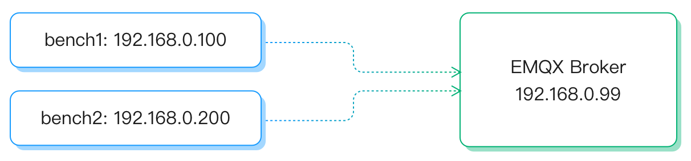

# eMQTT-Benchによるパフォーマンステスト

EMQXをシングルモードまたはクラスターとしてデプロイした後、システムの処理能力や負荷時の挙動を評価するためにパフォーマンステストを実施できます。本節では、パフォーマンステストを行うための[eMQTT-Bench](https://www.emqx.com/en/try?product=emqtt-bench)のインストール方法と使い方について説明します。

eMQTT-BenchはErlangで書かれた軽量かつ強力なMQTTベンチマークツールで、多数のクライアントをシミュレートし、スループットやレイテンシなどの主要なパフォーマンス指標を測定できます。大規模なテストや高度なカスタマイズが必要な場合は、sales@emqx.ioまでお問い合わせください。

## eMQTT-Benchのインストール

eMQTT-Benchのインストール方法は以下の3つのオプションがあります。

- Dockerイメージの実行
- バイナリパッケージのダウンロードとインストール
- ソースコードからのビルド

### Dockerイメージ

[hub.docker.com](https://hub.docker.com/r/emqx/emqtt-bench/tags)に公開されている`emqtt-bench`のDockerイメージを実行してベンチマークツールをインストールできます。`:latest`タグは新しいバージョンごとに更新されます。

```bash
docker run -it emqx/emqtt-bench:latest
Usage: emqtt_bench pub | sub | conn [--help]
```

なお、Dockerイメージ名はハイフン `-` を使用していますが、バイナリスクリプト名はアンダースコア `_` を使用している点にご注意ください。

### バイナリパッケージ

[公式ダウンロードサイト](https://www.emqx.com/en/downloads-and-install/enterprise)からリリース済みのバイナリパッケージをダウンロードし、対応プラットフォームに`emqtt-bench`をインストールできます。

各`emqtt-bench`リリースの詳細は[Releases](https://github.com/emqx/emqtt-bench/releases)をご参照ください。

例として、Ubuntu 20.04に`emqtt-bench`をインストールする手順は以下の通りです。

```bash
mkdir emqtt-bench && cd emqtt-bench
wget https://github.com/emqx/emqtt-bench/releases/download/0.4.12/emqtt-bench-0.4.12-ubuntu20.04-amd64.tar.gz
tar xfz emqtt-bench-0.4.12-ubuntu20.04-amd64.tar.gz
rm emqtt-bench-0.4.12-ubuntu20.04-amd64.tar.gz

./emqtt_bench
Usage: emqtt_bench pub | sub | conn [--help]
```

### ソースコードからのビルド

eMQTT-BenchはErlangで書かれており、ビルドには[Erlang/OTP](https://www.erlang.org/) 22.3以上が必要です。Erlang/OTPのインストール手順は省略しますので、オンラインのインストールチュートリアルをご参照ください。

Erlang環境をインストール後、`emqtt-bench`の最新コードをダウンロードし、コンパイルします。

```bash
git clone https://github.com/emqx/emqtt-bench
cd emqtt-bench

make
```

コンパイル後、カレントディレクトリに`emqtt_bench`という実行可能スクリプトが生成されます。以下のコマンドを実行し、正常に動作することを確認してください。

```bash
./emqtt_bench
Usage: emqtt_bench pub | sub | conn [--help]
```

上記の出力が表示されれば、`emqtt-bench`がホストに正しくインストールされたことを示します。

## eMQTT-Benchの使い方

`emqtt_bench`には以下の3つのサブコマンドがあります。

1. `pub`：多数のクライアントを作成し、メッセージをパブリッシュする操作を行う
2. `sub`：多数のクライアントを作成し、トピックをサブスクライブしてメッセージを受信する
3. `conn`：多数の接続を作成する

### パブリッシュ

`./emqtt_bench pub --help`を実行すると利用可能なパラメータが表示されます。

| パラメータ         | 省略形 | オプション値        | デフォルト値  | 説明                                                        |
| ----------------- | ------ | ------------------- | ------------ | ----------------------------------------------------------- |
| --host            | -h     | -                   | localhost    | 接続するMQTTサーバーのアドレス                              |
| --port            | -p     | -                   | 1883         | MQTTサービスのポート                                        |
| --version         | -V     | 3<br />4<br />5     | 5            | 使用するMQTTプロトコルのバージョン                          |
| --count           | -c     | -                   | 200          | クライアントの総数                                          |
| --startnumber     | -n     | -                   | 0            | クライアントの開始番号                                      |
| --interval        | -i     | -                   | 10           | クライアント作成間隔（単位：ms）                            |
| --interval_of_msg | -I     | -                   | 1000         | メッセージパブリッシュ間隔                                  |
| --username        | -u     | -                   | なし（任意） | クライアントのユーザー名                                    |
| --password        | -P     | -                   | なし（任意） | クライアントのパスワード                                    |
| --topic           | -t     | -                   | なし（必須） | パブリッシュするトピック。プレースホルダー対応：<br />`%c`: ClientId<br />`%u`: Username<br />`%i`: クライアントの連番 |
| --size            | -s     | -                   | 256          | メッセージペイロードのサイズ（バイト単位）                 |
| --qos             | -q     | -                   | 0            | QoSレベル                                                  |
| --retain          | -r     | true<br />false     | false        | メッセージのRetainフラグ設定の有無                          |
| --keepalive       | -k     | -                   | 300          | クライアントのキープアライブ時間                            |
| --clean           | -C     | true<br />false     | true         | セッションをクリアして接続を確立するかどうか               |
| --ssl             | -S     | true<br />false     | false        | SSLを有効にするかどうか                                    |
| --certfile        | -      | -                   | なし         | クライアントのSSL証明書ファイル                             |
| --keyfile         | -      | -                   | なし         | クライアントのSSLキー ファイル                              |
| --ws              | -      | true<br />false     | false        | WebSocket経由で接続を確立するかどうか                      |
| --ifaddr          | -      | -                   | なし         | クライアント接続に使用するローカルネットワークカードを指定 |

例として、10接続を開始し、1秒ごとにトピック`t`にQoS0のメッセージを100件パブリッシュし、各メッセージペイロードのサイズを16バイトに設定する場合は以下の通りです。

```bash
./emqtt_bench pub -t t -h emqx-server -s 16 -q 0 -c 10 -I 10
```

### サブスクライブ

`./emqtt_bench sub --help`を実行すると、このサブコマンドで利用可能なパラメータがすべて表示されます。説明は上記の表に含まれているためここでは省略します。

例として、500接続を開始し、それぞれがトピック`t`をQoS0でサブスクライブする場合は以下の通りです。

```bash
./emqtt_bench sub -t t -h emqx-server -c 500
```

### コネクト

`./emqtt_bench conn --help`を実行すると、このサブコマンドで利用可能なパラメータがすべて表示されます。説明は上記の表に含まれているためここでは省略します。

例として、1000接続を開始する場合は以下の通りです。

```bash
./emqtt_bench conn -h emqx-server -c 1000
```

### SSL接続

`emqtt-bench`はSSLによるセキュアな接続を確立してテストを実施できます。

片方向証明書の場合：

```bash
./emqtt_bench sub -c 100 -i 10 -t bench/%i -p 8883 -S
./emqtt_bench pub -c 100 -I 10 -t bench/%i -p 8883 -s 256 -S
```

双方向証明書の場合：

```bash
./emqtt_bench sub -c 100 -i 10 -t bench/%i -p 8883 --certfile path/to/client-cert.pem --keyfile path/to/client-key.pem
./emqtt_bench pub -c 100 -i 10 -t bench/%i -s 256 -p 8883 --certfile path/to/client-cert.pem --keyfile path/to/client-key.pem
```

## ストレステストの実施

本節では、典型的な2つのシナリオにおけるストレステストの実施方法を説明します：接続数とスループットです。

### 典型的なストレステストシナリオ

以下の2つの代表的なシナリオでツールの利用を検証します。

1. 接続数：`emqtt-bench`を使用してEMQXに数百万の接続を作成する。
2. スループット：`emqtt-bench`を使用してEMQXで`100k/s Qos 0`のメッセージスループットを作成する。

### デバイスおよびデプロイトポロジー

EMQX用に1台、クライアントプレッシャー用に2台の合計3台の8コア16GBメモリのサーバーを準備します。

- **システム**：`CentOS Linux release 7.7.1908 (Core)`
- **CPU**：`Intel Xeon Processor (Skylake)` メイン周波数：`2693.670 MHZ`
- **サーバー**：`emqx-centos7-v4.0.2.zip`
- **プレッシャー**：`emqtt-bench v0.3.1`、各プレッシャーは10枚のネットワークカードを設定し、接続テストで多数のMQTTクライアント接続を確立するために使用

トポロジー構成は以下の通りです。



### チューニング

クライアントプレッシャー側とサーバー側の両方でシステムパラメータのチューニングを行う必要があります。詳細は[Tuning guide](../performance/tune.md)を参照してください。

### 接続テスト

システムチューニング後、EMQXを起動し、`bench1`の各ネットワークカードで5万接続を開始します。合計で50万接続となります。

```bash
./emqtt_bench -h 192.168.0.99 -c 50000 --ifaddr 192.168.0.100
./emqtt_bench -h 192.168.0.99 -c 50000 --ifaddr 192.168.0.101
./emqtt_bench -h 192.168.0.99 -c 50000 --ifaddr 192.168.0.102
./emqtt_bench -h 192.168.0.99 -c 50000 --ifaddr 192.168.0.103
./emqtt_bench -h 192.168.0.99 -c 50000 --ifaddr 192.168.0.104
./emqtt_bench -h 192.168.0.99 -c 50000 --ifaddr 192.168.0.105
./emqtt_bench -h 192.168.0.99 -c 50000 --ifaddr 192.168.0.106
./emqtt_bench -h 192.168.0.99 -c 50000 --ifaddr 192.168.0.107
./emqtt_bench -h 192.168.0.99 -c 50000 --ifaddr 192.168.0.108
./emqtt_bench -h 192.168.0.99 -c 50000 --ifaddr 192.168.0.109
```

同様の操作を`bench2`でも実行します。

すべての接続が確立された後、`./bin/emqx ctl listeners`を実行すると、EMQX内の接続数に関する以下の情報が確認できます。

```bash
listener on mqtt:tcp:0.0.0.0:1883
  acceptors       : 8
  max_conns       : 1024000
  current_conn    : 1000000
  shutdown_count  : []
```

### スループットテスト

同様に、まずEMQXを起動し、`bench1`で500のサブスクライブクライアントを開始します。

```bash
./emqtt_bench sub -t t -h 192.168.0.99 -c 500
```

次に`bench2`で20のパブリッシャーを起動し、1秒あたり10メッセージをパブリッシュします。

```bash
./emqtt_bench pub -t t -h 192.168.0.99 -c 20 -I 100
```

`bench1`のサブスクライブクライアントに戻ると、現在のメッセージ受信レートを確認できます。

```bash
recv(28006): total=2102563, rate=99725(msg/sec)
```
