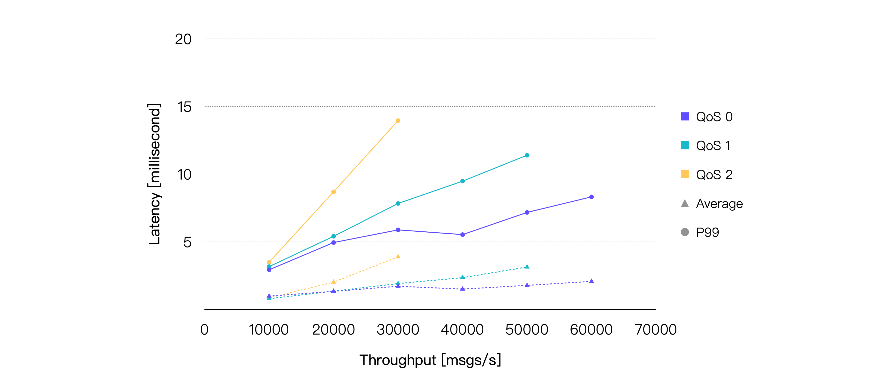
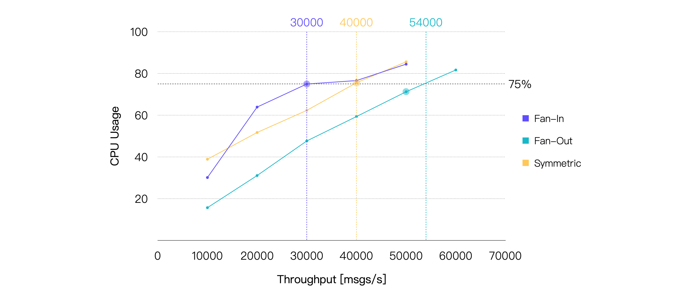
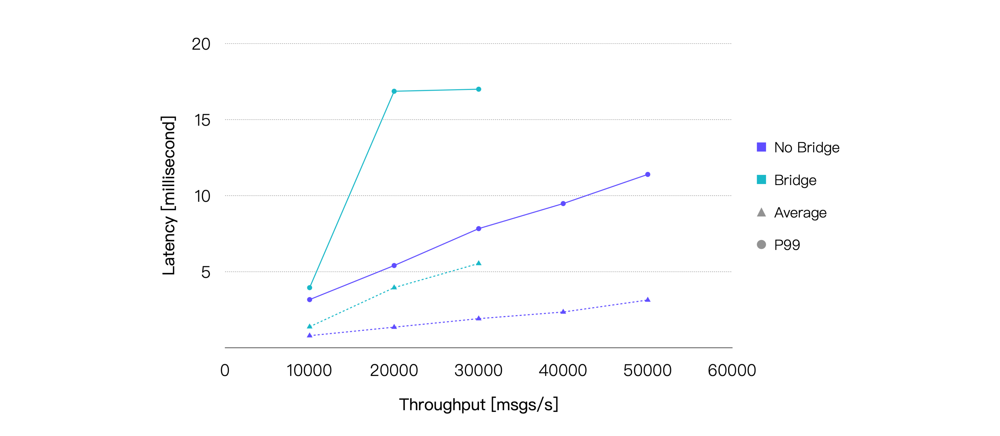

# 参照用テストシナリオと結果

<<<<<<< HEAD
本ページでは、さまざまなシナリオにおいて実施した一連のベンチマークテストに基づくEMQXの詳細なパフォーマンス分析を紹介します。評価では、QoS（サービス品質）レベルの違い、ペイロードサイズ、パブリッシュ・サブスクライブモデル、MQTTメッセージのブリッジングの影響など、さまざまな条件下でのEMQXの挙動と性能を検証しています。

厳密なテストと計測を通じて、これらの結果は実際の環境におけるEMQXのパフォーマンスに関する実用的な知見を提供し、IoTアプリケーション向けのEMQXの最適なデプロイメントに役立つ指針を示しています。

## テスト環境

本セクションのすべてのテストは、単一ノードにデプロイされたオープンソース版の**EMQX v5.1.6**をベースにしています。EMQXとテストサーバー間にはピアリング接続を構築し、外部ネットワークのレイテンシの影響を排除しています。EMQXを稼働させているサーバーの仕様は以下の通りです。
=======
本ページでは、さまざまなシナリオで実施した一連のベンチマークテストに基づくEMQXの詳細なパフォーマンス分析を紹介します。評価では、異なるQoSレベル、ペイロードサイズ、パブリッシュ・サブスクライブモデル、およびMQTTメッセージブリッジングの影響など、多様な条件下でのEMQXの挙動と能力を検証しています。

厳密なテストと測定を通じて、これらの結果は実際の環境におけるEMQXの性能に関する実用的な洞察を提供し、IoTアプリケーション向けのEMQXデプロイメント最適化に役立つ指針を示します。

## テスト環境

本節のすべてのテストは、単一ノードにデプロイされたオープンソース版の**EMQX v5.1.6**をベースにしています。EMQXとテストサーバー間にはピアリング接続を構築し、外部ネットワークレイテンシの影響を排除しています。EMQXを稼働させているサーバーの仕様は以下の通りです。
>>>>>>> origin/release-5.9

- **CPU**: 4vCPU（Intel Xeon Platinum 8378A CPU @ 3.00GHz）
- **メモリ**: 8 GiB
- **システムディスク**: General Purpose SSD | 40 GiB
- **最大帯域幅**: 8 Gbit/s
- **最大パケット毎秒数**: 800,000 PPS
- **OS**: CentOS 7.9

<<<<<<< HEAD
ファンインシナリオを除き、テストクライアント数は各シナリオで10台でした。ファンインシナリオでは20台のテストクライアントを使用してメッセージの送受信を行っています。

## テストシナリオと結果

### シナリオ1: 異なるQoSにおけるEMQXのパフォーマンス
=======
ファンインシナリオを除き、メッセージ送受信に使用するテストクライアント数は10台です。ファンインシナリオでは20台のテストクライアントを使用しています。

## テストシナリオと結果

### シナリオ1：異なるQoSレベルにおけるEMQXのパフォーマンス
>>>>>>> origin/release-5.9

MQTTパケットのやり取りはQoSレベルが高くなるほど複雑になり、メッセージ配信時のシステムリソース消費が増加します。したがって、各QoSレベルのパフォーマンスへの影響を理解することは重要です。

本シナリオでは、1,000台のパブリッシャーと1,000台のサブスクライバーによる1対1通信を行い、128バイトのペイロードメッセージを使用しました。つまり、合計1,000のトピックがあり、各トピックに1つのパブリッシャーと1つのサブスクライバーが存在します。

<<<<<<< HEAD
メッセージのパブリッシュレートを徐々に増加させて負荷を上げ、各負荷条件でEMQXを5分間稼働させて安定動作を確認しました。異なるQoSレベルおよび負荷条件下でのEMQXのパフォーマンスとリソース消費を記録し、平均メッセージレイテンシ、P99メッセージレイテンシ、平均CPU使用率などを含みます。
=======
メッセージパブリッシュレートを段階的に増加させて負荷を上げ、各負荷条件下でEMQXを5分間稼働させて安定動作を確認しました。異なるQoSレベルおよび負荷条件でのEMQXのパフォーマンスとリソース消費を記録し、平均メッセージレイテンシ、P99メッセージレイテンシ、平均CPU使用率などを含みます。
>>>>>>> origin/release-5.9

最終的なテスト結果は以下の通りです。

<<<<<<< HEAD
> **レイテンシ**はメッセージがパブリッシュされてから受信されるまでの時間です。**スループット**はメッセージのインバウンドスループットとアウトバウンドスループットで構成されます。

これらの結果から、同等の負荷条件においてQoSレベルが高くなるほど平均CPU使用率が増加することがわかります。したがって、同じシステムリソースであれば、QoSレベルが高いほどスループットは相対的に低下します。

平均CPU使用率を約75％とした場合の推奨負荷は、提供されたハードウェアおよびテストシナリオに基づき、QoS 0で約57K TPS、QoS 1で約40K TPS、QoS 2で約24K TPSとなります。以下はCPU使用率が約75％に最も近いテストポイントのパフォーマンスデータです。

| **QoSレベル** | **推奨負荷（TPS、イン＋アウト）** | **平均CPU使用率（％、1 - アイドル）** | **平均メモリ使用率（％）** | **平均レイテンシ（ms）** | **P99レイテンシ（ms）** |
=======
> **レイテンシ**とは、メッセージがパブリッシュされてから受信されるまでの時間を指します。**スループット**はメッセージのインバウンドスループットとアウトバウンドスループットで構成されます。

これらの結果から、同等の負荷条件下でQoSレベルが高いほど平均CPU使用率が増加することが分かります。したがって、同じシステムリソースではQoSレベルが高いほどスループットは相対的に低下する傾向にあります。

平均CPU使用率約75%を推奨される日常負荷と仮定すると、提供されたハードウェアおよびテストシナリオにおける推奨負荷は、QoS 0で約57K TPS、QoS 1で約40K TPS、QoS 2で約24K TPSとなります。以下はCPU使用率が約75%に最も近いテストポイントのパフォーマンスデータです。

| **QoSレベル** | **推奨負荷（TPS、イン＋アウト）** | **平均CPU使用率、％（1 - アイドル）** | **平均メモリ使用率、％** | **平均レイテンシ、ms** | **P99レイテンシ、ms** |
>>>>>>> origin/release-5.9
| :------------ | :------------------------------ | :---------------------------------- | :-------------------------- | :---------------------- | :------------------ |
| QoS 0         | 60K                             | 78.13                               | 6.27                        | 2.079                   | 8.327               |
| QoS 1         | 40K                             | 75.56                               | 6.82                        | 2.356                   | 9.485               |
| QoS 2         | 20K                             | 69.06                               | 6.39                        | 2.025                   | 8.702               |

### シナリオ2: 異なるペイロードサイズにおけるEMQXのパフォーマンス

<<<<<<< HEAD
大きなメッセージペイロードは、OSがネットワークパケットを受信・送信するためのソフト割り込みを増加させ、パケットのシリアライズ・デシリアライズに必要な計算リソースも増加させます。多くのMQTTメッセージは通常1KB未満ですが、より大きなメッセージを送信するシナリオも存在します。そこで、ペイロードサイズの違いがパフォーマンスに与える影響を検証しました。

引き続き1,000台のパブリッシャーと1,000台のサブスクライバーによる1対1通信を行い、メッセージのQoSは1、パブリッシュレートは20K msg/sに固定しました。ペイロードサイズを増加させて負荷を上げ、各負荷条件でEMQXを5分間稼働させて安定性を確認しました。各負荷条件でのEMQXのパフォーマンスとリソース使用率を記録しています。
=======
大きなメッセージペイロードは、OSがネットワークパケットを受信・送信するためのソフト割り込みを増加させ、パケットのシリアライズおよびデシリアライズに必要な計算リソースも増加させます。ほとんどのMQTTメッセージは通常1KB未満ですが、より大きなメッセージを送信するシナリオも存在します。そこで、ペイロードサイズの違いによるパフォーマンス影響を検証しました。

引き続き1,000台のパブリッシャーと1,000台のサブスクライバーによる1対1通信を行い、メッセージのQoSは1に固定、パブリッシュレートは20K msg/sに設定しました。ペイロードサイズを増加させて負荷を高め、各負荷条件下でEMQXを5分間稼働させて安定性を確認しました。各負荷条件でのEMQXのパフォーマンスとリソース使用率を記録しています。
>>>>>>> origin/release-5.9

結果は以下の通りです。

<<<<<<< HEAD
ペイロードが大きくなるにつれてCPU使用率は徐々に上昇し、メッセージのエンドツーエンドレイテンシも比較的緩やかに増加しています。ただし、ペイロードサイズが8KBに達しても、平均レイテンシは10ミリ秒未満、P99レイテンシは20ミリ秒未満を維持しています。

| **ペイロードサイズ（KB）** | **推奨負荷（TPS、イン＋アウト）** | **平均CPU使用率（％、1 - アイドル）** | **平均メモリ使用率（％）** | **平均レイテンシ（ms）** | **P99レイテンシ（ms）** |
=======
ペイロードが増加するにつれてCPU使用率は徐々に上昇し、メッセージのエンドツーエンドレイテンシも比較的緩やかに増加しています。しかし、ペイロードサイズが8KBに達しても、平均レイテンシは10ミリ秒未満、P99レイテンシは20ミリ秒未満を維持しています。

| **ペイロードサイズ、KB** | **推奨負荷（TPS、イン＋アウト）** | **平均CPU使用率、％（1 - アイドル）** | **平均メモリ使用率、％** | **平均レイテンシ、ms** | **P99レイテンシ、ms** |
>>>>>>> origin/release-5.9
| :------------------- | :---------------- | :---------------------------------- | :-------------------------- | :---------------------- | :------------------ |
| 1                    | 40K               | 75.9                                | 6.23                        | 3.282                   | 12.519              |
| 8                    | 40K               | 90.82                               | 9.38                        | 5.884                   | 17.435              |

<<<<<<< HEAD
したがって、QoSレベルに加えてペイロードサイズも重要な考慮点です。もし今回のテストよりもはるかに大きなペイロードサイズを扱うユースケースであれば、より高いハードウェア構成が必要になる可能性があります。
=======
したがって、QoSレベルに加え、ペイロードサイズも重要な検討事項です。ここでテストしたよりもはるかに大きなペイロードサイズが想定される場合は、より高いハードウェア構成が必要となる可能性があります。
>>>>>>> origin/release-5.9

### シナリオ3: 異なるパブリッシュ・サブスクライブモデルにおけるEMQXのパフォーマンス

MQTTのパブリッシュ・サブスクライブ機構は、特定のビジネス要件に応じてパブリッシュ・サブスクライブモデルを柔軟に調整できます。代表的なシナリオにはファンイン、ファンアウト、シンメトリックモデルがあります。

- ファンインモデルでは、多数のセンサー機器がパブリッシャーとして動作し、少数または単一のバックエンドアプリケーションがサブスクライバーとしてセンサーデータを蓄積・解析します。
- ファンアウトモデルでは、少数のパブリッシャーから多数のサブスクライバーへメッセージをブロードキャストします。
- シンメトリックモデルでは、パブリッシャーとサブスクライバーが1対1で通信します。

<<<<<<< HEAD
MQTTブローカーのパフォーマンスは、これら異なるパブリッシュ・サブスクライブシナリオで若干異なる傾向を示すことがあります。以下のテストでその違いを見ていきます。
=======
異なるパブリッシュ・サブスクライブシナリオにおけるMQTTブローカーのパフォーマンスは若干異なることが多く、以下のテストでその違いを確認します。
>>>>>>> origin/release-5.9

ファンインシナリオでは、2,000台のパブリッシャーと100台のサブスクライバーを設定し、100台のパブリッシャーのメッセージを5台のサブスクライバーが共有サブスクリプションで消費します。

<<<<<<< HEAD
ファンアウトシナリオでは、10台のパブリッシャーと2,000台のサブスクライバーを設定し、各パブリッシャーのメッセージを200台のサブスクライバーが通常のサブスクリプションで受信します。シンメトリックシナリオは前述のテストと同様です。

ファンアウトシナリオは他の2つのシナリオよりもインバウンドメッセージ数が少ないため、比較を効果的に行うために同等またはほぼ同等の負荷を確保しました。例えば、ファンアウトシナリオのインバウンド100 msg/s、アウトバウンド20K msg/sは、シンメトリックシナリオのインバウンド10K msg/s、アウトバウンド10K msg/sに相当します。

メッセージのQoSは1、ペイロードサイズは128バイトに固定し、最終的なテスト結果は以下の通りです。

メッセージレイテンシのみを考慮すると、3つのシナリオのパフォーマンスは実際には非常に近いことがわかります。さらに、同じ負荷条件下ではファンアウトシナリオのCPU消費が一貫して低くなっています。したがって、CPU使用率75％を閾値とした場合、ファンアウトシナリオが他の2つのシナリオよりも高いスループットを達成できることが明らかです。

| **シナリオ** | **推奨負荷（TPS、イン＋アウト）** | **平均CPU使用率（％、1 - アイドル）** | **平均メモリ使用率（％）** | **平均レイテンシ（ms）** | **P99レイテンシ（ms）** |
=======
ファンアウトシナリオでは、10台のパブリッシャーと2,000台のサブスクライバーを設定し、各パブリッシャーのメッセージは200台のサブスクライバーに通常のサブスクリプションで受信されます。シンメトリックシナリオは前述のテストと同様です。

ファンアウトシナリオのインバウンドメッセージ数は他の2つのシナリオより少ないため、比較を効果的に行うために同等またはほぼ同等の負荷を確保しました。例えば、ファンアウトシナリオのインバウンド100 msg/s、アウトバウンド20K msg/sは、シンメトリックシナリオのインバウンド10K msg/s、アウトバウンド10K msg/sに相当します。

メッセージのQoSレベルを1、ペイロードサイズを128バイトに固定した状態での最終テスト結果は以下の通りです。

メッセージレイテンシのみを考慮すると、3つのシナリオのパフォーマンスは実際には非常に近いことが分かります。さらに、同じ負荷条件下でファンアウトシナリオは常にCPU消費が低くなっています。したがって、CPU使用率75%を閾値とした場合、ファンアウトシナリオは他の2つのシナリオよりも高いスループットを達成できることが明らかです。

| **シナリオ** | **推奨負荷（TPS、イン＋アウト）** | **平均CPU使用率、％（1 - アイドル）** | **平均メモリ使用率、％** | **平均レイテンシ、ms** | **P99レイテンシ、ms** |
>>>>>>> origin/release-5.9
| :-------- | :------------------------------ | :---------------------------------- | :-------------------------- | :---------------------- | :------------------ |
| ファンイン    | 30K                             | 74.96                               | 6.71                        | 1.75                    | 7.651               |
| ファンアウト   | 50K                             | 71.25                               | 6.41                        | 3.493                   | 8.614               |
| シンメトリック | 40K                             | 75.56                               | 6.82                        | 2.356                   | 9.485               |

<<<<<<< HEAD
### シナリオ4: ブリッジング時のEMQXパフォーマンス

MQTTブリッジングは、あるMQTTサーバーから別のMQTTサーバーへメッセージを転送する機能であり、エッジゲートウェイからクラウドサーバーへのメッセージ集約や、2つのMQTTクラスター間のメッセージ連携など、さまざまなユースケースに利用されます。

本テストシナリオでは、MQTTサーバー1に接続された500台のパブリッシャーがパブリッシュしたメッセージをMQTTサーバー2にブリッジし、MQTTサーバー2に接続された500台のサブスクライバーが受信します。同時に、MQTTサーバー2に接続された追加の500台のパブリッシャーがパブリッシュしたメッセージをMQTTサーバー1に接続された500台のサブスクライバーが受信します。

この構成により、クライアントのメッセージパブリッシュレートが同一の場合、EMQX内のインバウンドおよびアウトバウンドメッセージレートはブリッジなしのシンメトリックシナリオに近くなり、両者のパフォーマンス比較が可能となります。

メッセージのQoSは1、ペイロードサイズは128バイトに固定し、最終的なテスト結果は以下の通りです。
=======
### シナリオ4：ブリッジングを用いたEMQXのパフォーマンス

MQTTブリッジングは、あるMQTTサーバーから別のMQTTサーバーへメッセージを転送する機能であり、エッジゲートウェイからクラウドサーバーへのメッセージ集約や、2つのMQTTクラスター間のメッセージ連携など、さまざまなユースケースに対応します。

本テストシナリオでは、MQTTサーバー1に接続された500台のパブリッシャーがパブリッシュしたメッセージをMQTTサーバー2にブリッジし、MQTTサーバー2に接続された500台のサブスクライバーが受信します。同時に、MQTTサーバー2に接続された別の500台のパブリッシャーがパブリッシュしたメッセージはMQTTサーバー1に接続された500台のサブスクライバーが受信します。

この構成により、クライアントのメッセージパブリッシュレートが同一の場合、EMQX内のインバウンドおよびアウトバウンドメッセージレートはブリッジングなしのシンメトリックシナリオに近くなり、両シナリオのパフォーマンス比較が可能となります。

メッセージのQoSレベルを1、ペイロードサイズを128バイトに固定した状態での最終テスト結果は以下の通りです。
>>>>>>> origin/release-5.9

<<<<<<< HEAD
ブリッジングはメッセージ配信の過程に中継を追加するため、エンドツーエンドのメッセージレイテンシが増加します。また、ブリッジングは追加のCPU消費ももたらします。これらの点はテスト結果からも確認できました。本テストで使用したハードウェア仕様に基づき、平均CPU使用率が約75％となるブリッジングシナリオの推奨負荷は約25K TPSです。CPU使用率の差が最も小さいデータポイントのテスト結果は以下の通りです。

| **推奨負荷（TPS、イン＋アウト）** | **平均CPU使用率（％、1 - アイドル）** | **平均メモリ使用率（％）** | **平均レイテンシ（ms）** | **P99レイテンシ（ms）** |
=======
ブリッジングはメッセージ配信過程に追加の中継を導入するため、エンドツーエンドのメッセージレイテンシが増加します。加えて、ブリッジングはCPU消費も増加させます。テスト結果はこれらの観察を裏付けています。本テストで使用したハードウェア仕様に基づき、平均CPU使用率が約75%となるブリッジングシナリオの推奨負荷は約25K TPSです。CPU使用率の差が最も小さいデータポイントのテスト結果は以下の通りです。

| **推奨負荷（TPS、イン＋アウト）** | **平均CPU使用率、％（1 - アイドル）** | **平均メモリ使用率、％** | **平均レイテンシ、ms** | **P99レイテンシ、ms** |
>>>>>>> origin/release-5.9
| :------------------------- | :---------------------------------- | :-------------------------- | :---------------------- | :------------------ |
| 30K                        | 82.09                               | 5.6                         | 5.547                   | 17.004              |
