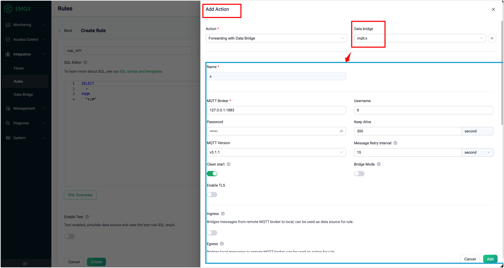
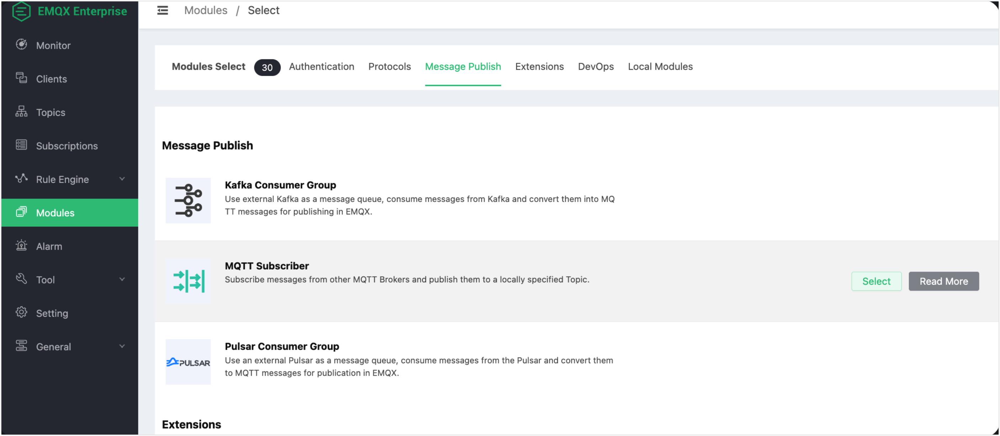
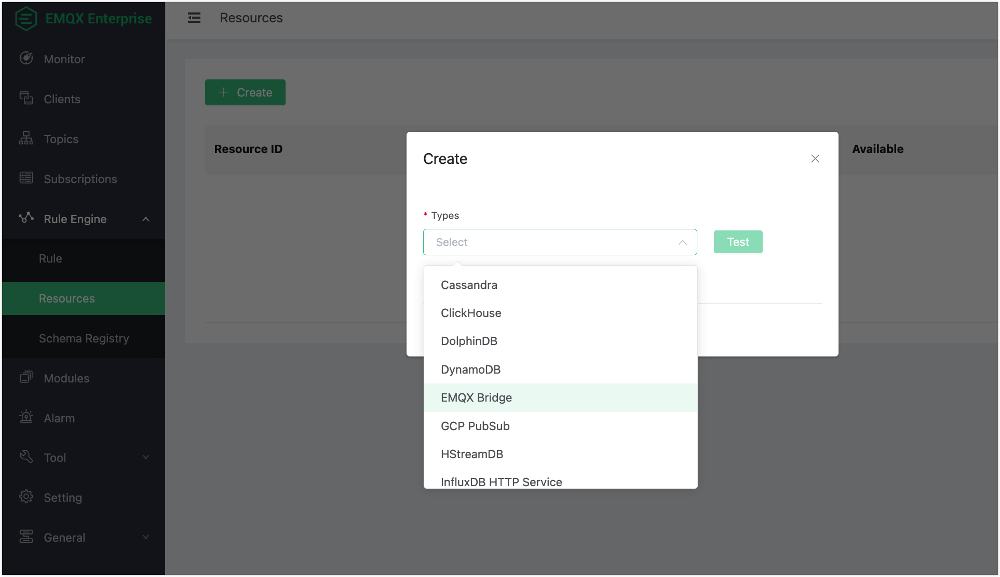

# EMQX 5.1 と EMQX 4.4 間のデータ統合の非互換性

データ統合の概念は EMQX 5.1 で大幅にアップグレードされました。

- 以前の **Rule** -> **Action** -> **Resources** のプロセスは **Rules** -> **Data Bridge** に変更されました。

  EMQX 4.4 では Action のための設定エンティティがありましたが、EMQX 5.1 では特定のルールにアクションを追加する際、まずデータブリッジを作成し、そのブリッジの SQL テンプレートを修正してルールの出力に適応させる必要があります。

  

- **Modules** -> **Message Publish** は **Data Bridge** に移動しました。

  EMQX 4.4 のメッセージパブリッシュモジュール:

  

- EMQX 4.4 の [オフラインメッセージ保存](https://docs.emqx.com/en/enterprise/v4.4/rule/offline_msg_to_redis.html) 機能は削除されました。

- EMQX 4.4 の [サブスクリプション取得](https://docs.emqx.com/en/enterprise/v4.4/rule/get_subs_from_redis.html) 機能は削除されました。

- DolphinDB、Lindorm、SAP Event Mesh のデータブリッジはサポートされていませんが、SAP Event Mesh は製品ロードマップに含まれています。

- リソースタイプとしての `EMQX Bridge` はサポートされなくなりました。

  

## 共通の非互換変更点

- すべての SSL 関連設定オプション（`ssl`、`cafile`、`keyfile`、`certfile`、`verify`）は統一された構造と名称に変更されました。例：`ssl.cacertfile`、`ssl.certfile`、`ssl.keyfile`、`ssl.verify` など。
- クライアントがトピックをサブスクライブした際に外部データベースに保存されたオフラインメッセージを取得する機能（`$events/session_subscribed` イベントとブリッジルールアクションによるもの）は EMQX 5.1 には存在しません。

## 機能および設定項目の非互換性

以下は各データブリッジごとの機能および設定項目の変更点一覧です。

### Cassandra

設定名 `nodes` が `servers` に変更されました。

### Kafka Producer

- 変更された設定項目:
  - `servers` → `bootstrap_hosts`
  - `authentication_mechanism` → `authentication`
  - `sync_timeout` → `sync_query_timeout`
  - `send_buffer` → `socket_opts.sndbuf`
  - `tcp_keepalive` → `socket.tcp_keepalive`
  - `strategy` → `partition_strategy`
  - `cache_mode` → `kafka.buffer.mode`
  - バッファモードの列挙型 `memory+disk` → `hybrid`
  - `highmem_drop` → `kafka.buffer.memory_overload_protection`
- EMQX 5.1 に相当機能なし:
  - `query_api_versions`
  - `kafka_ext_headers`
- `kafka` キーの下にネストされた `replayq` 関連オプション（例：`max_batch_bytes`）
- メッセージキーがテンプレート化可能に。以前は限られたオプションのみ。

### Kafka Consumer

- 変更された設定項目:
  - `servers` → `bootstrap_hosts`
  - `max_bytes` → `kafka.max_batch_bytes`
  - `offset_reset_policy` の列挙型 `{reset_to_latest, reset_by_subscriber}` → `{latest, earliest}`
- EMQX 5.1 には `pool_size` がなく、トピックのパーティション数に応じてライブラリがワーカー数を自動設定します。
- EMQX 4.4 は認証にプレーン SASL のみ対応。EMQX 5.1 は Kafka Producer と同様の認証メカニズムをサポート。

### Pulsar Consumer

EMQX 5.1.0 には Pulsar Consumer は存在しません。

### Pulsar Producer

- EMQX 5.1 ではドライバーの非同期 API のみを使用してメッセージを生成し、同期 API のオプションはありません。
- メッセージキーにテンプレートが使用可能に。以前は限られたオプションのみ。
- 変更された設定項目:
  - バッファモードの列挙型 `memory+disk` → `hybrid`
  - `max_total_bytes` → `buffer.per_partition_limit`
  - `segment_bytes` → `buffer.segment_bytes`

### Redis

設定項目 `cmd` が `command_template` に変更されました（3つの Redis モード共通）。

「Cluster」モードの変更点:

- EMQX 5.1 には `database` フィールドがありません。
- EMQX 4.4 のオフラインメッセージ用 `ttl` に相当するものは EMQX 5.1 にありません。

### Postgres

- コネクターに差異はありません。
- バッチ処理設定は Action 設定の `resource_opts.*` に移動しました。
  - `enable_batch = true`（EMQX 4.4）→ `resource_opts.batch_size > 1`（EMQX 5.1）
  - `batch_time` は非表示でデフォルト `0`（EMQX 5.1）
  - `sql` → `prepare_statement`

### MySQL

- `user` が `username` に変更されました。
- バッチ処理設定は Action 設定の `resource_opts.*` に移動しました。
  - `enable_batch = true`（EMQX 4.4）→ `resource_opts.batch_size > 1`（EMQX 5.1）
  - `batch_time` は非表示でデフォルト `0`（EMQX 5.1）
  - `sql` → `prepare_statement`

### MQTT

- 変更された設定項目:
  - `address` → `server`
  - `pool_size` → `{egress,ingress}.pool_size`
  - `reconnect_interval` → `resource_opts.health_check_interval`
- EMQX 5.1 に相当機能なし:
  - `append`
  - `mountpoint`
- EMQX 4.4 の `disk_cache = on` は、EMQX 5.1 の `resource_opts.buffer_mode = volatile_offload` にやや相当しますが、後者は非表示設定でデフォルトは `memory_only` です。
- EMQX 5.1 には RPC MQTT ブリッジの相当機能はありません。
- Action 設定の変更項目:
  - `forward_topic` → `egress.remote.topic`
  - `payload_tmpl` → `payload`

### InfluxDB

API v1 と API v2 の両方に共通の変更点:

- ブリッジ設定の変更項目:
  - `host` と `port` → `server`
  - `https_enabled` および `tls_version` などの SSL オプション → `ssl`
- Action 設定の変更:
  - EMQX 5.1 には `int_suffix` の相当機能がなく、型は直接 `write_syntax` で指定します。
  - `measurement`、`timestamp`、`fields`、`tags` → `write_syntax`

### DolphinDB、Lindorm、SAP Event Mesh

EMQX 5.1 には相当するデータブリッジはありません。

### Clickhouse

変更された設定項目:
- `server` → `url`
- `user` → `username`
- `key` → `password`

### Dynamo

- EMQX 5.1 には `region` の相当機能がありません。
- `payload_template` が追加されました。

### HStreamDB

- 設定項目 `server` が `url` に変更されました。
- EMQX 5.1 に相当するものがない項目:
  - `grpc_timeout`
  - `partition_key`
  - `grpc_flush_timeout`

### IoTDB

変更された設定項目:
- `host`、`rest_port` → `base_url`
- `request_timeout` → `resource_opts.request_ttl`

### MongoDB

変更された設定項目:
- `login` → `username`
- `connectTimeoutMS` → `connect_timeout_ms`
- `rs_set_name` → `replica_set_name`
- `payload_tmpl` → `payload_template`

### OpenTSDB

`sync` が `resource_opts.query_mode = sync` に変更されました。

### Oracle

`user` が `username` に変更されました。

### TDengine

変更された設定項目:
- `host`、`port` → `server`
- `dbname` → `database`

### GCP PubSub Producer

非推奨の設定項目:
- `flush_mode`
- `flush_period_ms`

### RabbitMQ Producer

- 変更された設定項目:
  - `server` → `host` と `port`
  - `payload_tmpl` → `payload_template`
  - `durable` → `delivery_mode`
- `exchange_type` は EMQX 5.1 に相当機能なし。

### RocketMQ

- EMQX 5.1 に相当機能がない設定項目:
  - `namespace`
  - `strategy`
  - `key`
- 変更された設定項目:
  - `type` → `resource_opts.query_mode`
  - `payload_tmpl` → `payload_template`
