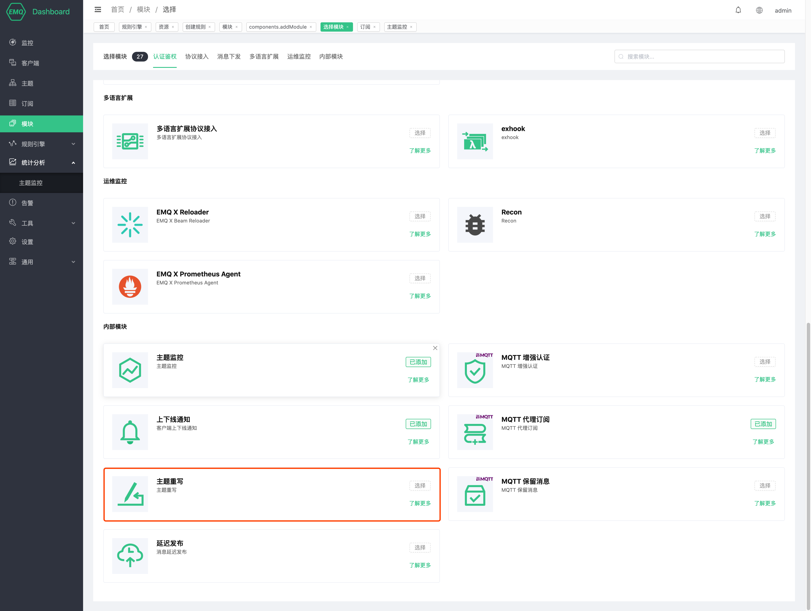
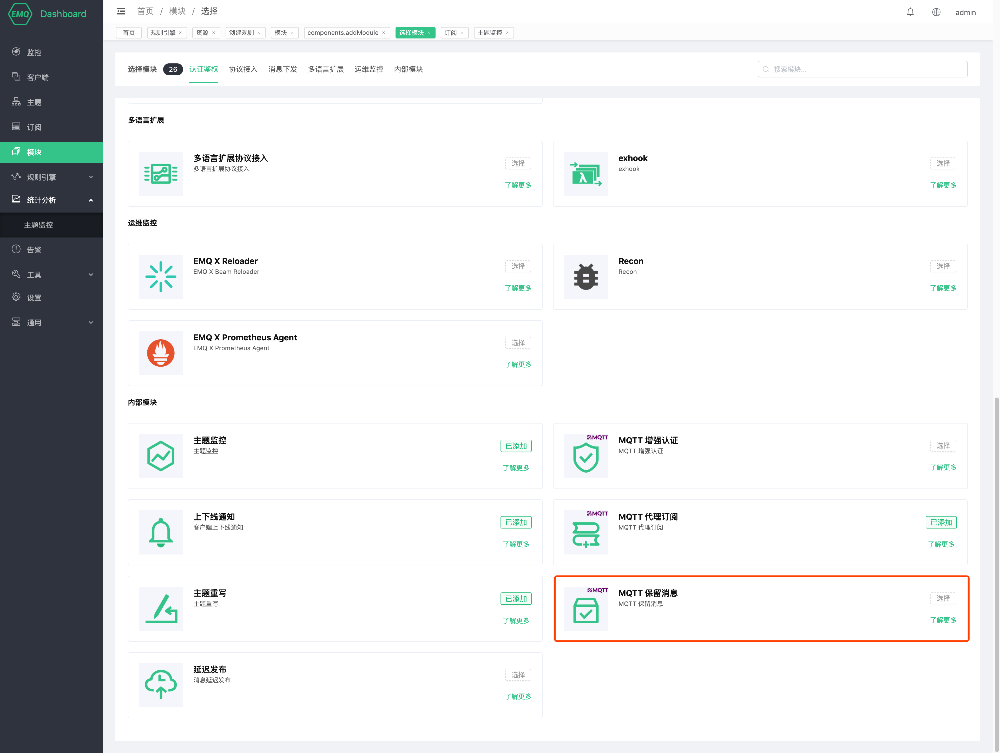
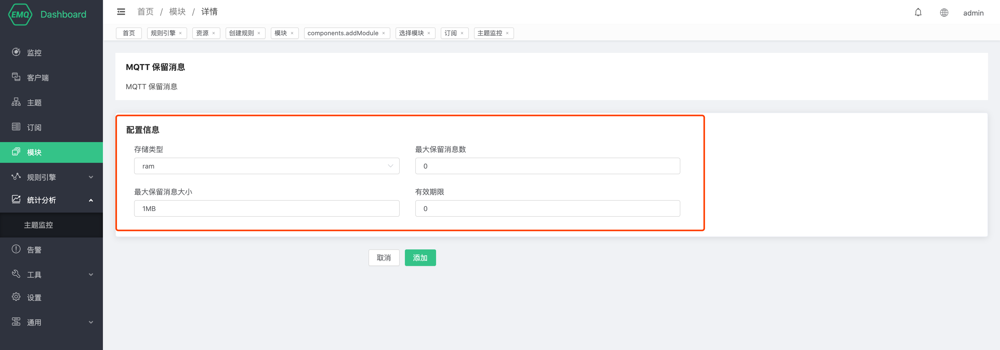
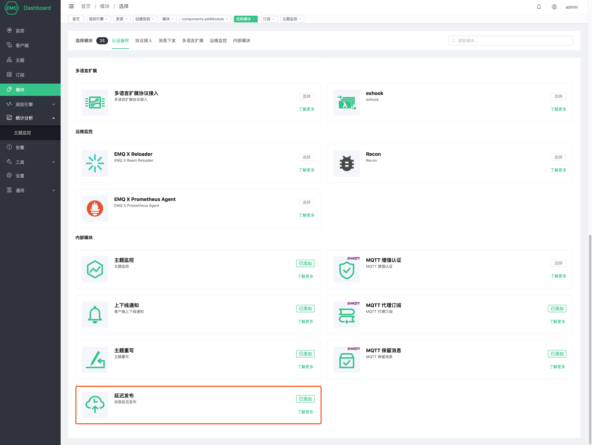

# 主题监控

# MQTT 增强认证

# 上下线通知
EMQ X 的上下线系统消息通知功能在客户端连接成功或者客户端断开连接，自动发送一条系统主题的消息, EMQ X 默认开启上下线通知模块。

## 上下线消息通知
通过 dashboard 页面可以开启 上下线通知 控制模块

打开 [EMQ X Dashboard](http://127.0.0.1:18083/)，并登陆，点击左侧的 “模块” 选项卡，选择添加


选择 上下线通知 模块


上下线通知不需要配置任何参数，直接点击添加后，模块添加完成


## 上下线消息通知格式

`$SYS` 主题前缀: `$SYS/brokers/${node}/clients/`

| 主题 (Topic)              | 说明                                     |
| ------------------------ | ---------------------------------------- |
| ${clientid}/connected    | 上线事件。当任意客户端上线时，EMQ X 就会发布该主题的消息 |
| ${clientid}/disconnected | 下线事件。当任意客户端下线时，EMQ X 就会发布该主题的消息 |

`connected` 事件消息的 Payload 解析成 JSON 格式如下:

```bash
{
    "username":"undefined",
    "ts":1582687922392,
    "sockport":1883,
    "proto_ver":5,
    "proto_name":"MQTT",
    "keepalive":300,
    "ipaddress":"127.0.0.1",
    "expiry_interval":0,
    "connected_at":1582687922392,
    "connack":0,
    "clientid":"emqtt-8348fe27a87976ad4db3",
    "clean_start":true
}
```

`disconnected` 事件消息的 Payload 解析成 JSON 格式如下:

```bash
{
    "username":"undefined",
    "ts":1582688032203,
    "reason":"tcp_closed",
    "disconnected_at":1582687922392,
    "clientid":"emqtt-8348fe27a87976ad4db3"
}
```

# MQTT 代理订阅

EMQ X 的代理订阅功能使得客户端在连接建立时，不需要发送额外的 SUBSCRIBE 报文，便能自动建立用户预设的订阅关系。

## 开启代理订阅功能

通过 dashboard 页面可以开启 MQTT 代理订阅 控制模块

打开 [EMQ X Dashboard](http://127.0.0.1:18083/)，并登陆，点击左侧的 “模块” 选项卡，选择添加


选择 MQTT 代理订阅模块


配置相关参数


点击添加后，模块添加完成


## 代理订阅规则

在配置代理订阅的主题时，EMQ X 提供了 `%c` 和 `%u` 两个占位符供用户使用，EMQ X 会在执行代理订阅时将配置中的 `%c` 和 `%u` 分别替换为客户端的 `Client ID` 和 `Username`，需要注意的是，`%c` 和 `%u` 必须占用一整个主题层级。

例如，添加上文图中的规则后：配置 A、B 两个客户端，客户端 A 的 `Client ID` 为 `testclientA`，`Username` 为 `testerA`，客户端 B 的 `Client ID` 为 `testclientB`，`Username` 为 `testerB`。

A 客户端使用 MQTT V3.1.1 协议连接 EMQ X，根据上文的配置规则，代理订阅功能会主动帮客户端订阅 QoS 为 1 的 `client/testclientA` 和 QoS 为 2 的 `user/testerA` 这两个主题，因为连接协议为 MQTT V3.1.1，所以配置中的 No Local、Retain As Published、Retain Handling 不生效。

B 客户端使用 MQTT V5 协议连接 EMQ X，根据上文的配置规则，代理订阅功能会主动帮客户端订阅 `client/testclientB` 和 `user/testerB` 这两个主题，其中 `client/testclientB` 的订阅选项为 Qos = 1，No Local、Retain As Published、Retain Handling 均为 0；`user/testerB` 的订阅选项为 Qos = 2、No Local = 1、Retain As Published = 1 、Retain Handling = 1。


# 主题重写

EMQ X 的主题重写功能支持根据用户配置的规则在客户端订阅主题、发布消息、取消订阅的时候将 A 主题重写为 B 主题。

## 开启主题重写功能

通过 dashboard 页面可以开启 MQTT 主题重写控制模块

打开 [EMQ X Dashboard](http://127.0.0.1:18083/)，并登陆，点击左侧的 “模块” 选项卡，选择添加


选择 MQTT 主题重写模块



配置相关参数


点击添加后，模块添加完成


## 主题重写规则

重写规则分为 Pub 规则和 Sub 规则，Pub 规则匹配 PUSHLISH 报文携带的主题，Sub 规则匹配 SUBSCRIBE、UNSUBSCRIBE 报文携带的主题。

每条重写规则都由主题过滤器、正则表达式、目标表达式三部分组成。在主题重写功能开启的前提下，EMQ X 在收到诸如 PUBLISH 报文等带有主题的 MQTT 报文时，将使用报文中的主题去依次匹配配置文件中规则的主题过滤器部分，一旦成功匹配，则使用正则表达式提取主题中的信息，然后替换至目标表达式以构成新的主题。

目标表达式中可以使用 `$N` 这种格式的变量匹配正则表达中提取出来的元素，`$N` 的值为正则表达式中提取出来的第 N 个元素，比如 `$1` 即为正则表达式提取的第一个元素。

需要注意的是，EMQ X 使用倒序读取配置文件中的重写规则，当一条主题可以同时匹配多条主题重写规则的主题过滤器时，EMQ X 仅会使用它匹配到的第一条规则进行重写，如果该条规则中的正则表达式与 MQTT 报文主题不匹配，则重写失败，不会再尝试使用其他的规则进行重写。因此用户在使用时需要谨慎的设计 MQTT 报文主题以及主题重写规则。

## 主题重写示例

添加上图中的主题重写规则并分别订阅 `y/a/z/b`、`y/def`、`x/1/2`、`x/y/2`、`x/y/z` 五个主题：

+ 当客户端订阅 `y/def` 主题时，`y/def` 不匹配任何一个主题过滤器，因此不执行主题重写，直接订阅 `y/def` 主题。

+ 当客户端订阅 `y/a/z/b` 主题时，`y/a/z/b` 匹配 `y/+/z/#` 主题过滤器，EMQ X 执行 `module.rewrite.sub.rule.1` 规则，通过正则正则表达式匹配出元素 `[a、b]` ，将匹配出来的第二个元素带入 `y/z/$2`，实际订阅了 `y/z/b` 主题。

+ 当客户端向 `x/1/2` 主题发送消息时，`x/1/2` 匹配 `x/#` 主题过滤器，EMQ X 执行 `module.rewrite.pub.rule.1` 规则，通过正则表达式未匹配到元素，不执行主题重写，因此直接向 `x/1/2` 主题发送消息。

+ 当客户端向 `x/y/2` 主题发送消息时，`x/y/2` 同时匹配 `x/#` 和 `x/y/+` 两个主题过滤器，EMQ X 通过倒序读取配置，所以优先匹配 `module.rewrite.pub.rule.2`，通过正则替换，实际向 `z/y/2` 主题发送消息。

+ 当客户端向 `x/y/z` 主题发送消息时，`x/y/z` 同时匹配 `x/#` 和 `x/y/+` 两个主题过滤器，EMQ X 通过倒序读取配置，所以优先匹配 `module.rewrite.pub.rule.2，通过正则表达式未匹配到元素，不执行主题重写，直接向 `x/y/z` 主题发送消息。需要注意的是，即使 `module.rewrite.pub.rule.2` 的正则表达式匹配失败，也不会再次去匹配 `module.rewrite.pub.rule.1` 的规则。

# MQTT 保留消息

## 简介

服务端收到 Retain 标志为 1 的 PUBLISH 报文时，会将该报文视为保留消息，除了被正常转发以外，保留消息会被存储在服务端，每个主题下只能存在一份保留消息，因此如果已经存在相同主题的保留消息，则该保留消息被替换。

当客户端建立订阅时，如果服务端存在主题匹配的保留消息，则这些保留消息将被立即发送给该客户端。借助保留消息，新的订阅者能够立即获取最近的状态，而不需要等待无法预期的时间，这在很多场景下非常重要的。

## 开启保留消息功能

通过 dashboard 页面可以开启保留消息模块

打开 [EMQ X Dashboard](http://127.0.0.1:18083/)，并登陆，点击左侧的 “模块” 选项卡，选择添加


选择保留消息模块



配置相关参数



点击添加后，模块添加完成


## 保留消息配置简介

| 配置项                         | 类型     | 可取值                   | 默认值 | 说明                                                         |
| ------------------------------ | -------- | ------------------------ | ------ | ------------------------------------------------------------ |
| 存储类型               | enum     | `ram`, `disc`, `disc_only` | ram |ram：仅储存在内存中；<br />disc：储存在内存和硬盘中；<br />disc_only：仅储存在硬盘中。|
| 最大保留消息数        | integer  | \>= 0                    | 0      | 保留消息的最大数量，0 表示没有限制。保留消息数量超出最大值限制后，可以替换已存在的保留消息，但不能为新的主题储存保留消息。 |
| 最大保留消息大小      | bytesize |                          | 1MB    | 保留消息的最大 Payload 值。Payload 大小超出最大值后 EMQ Ｘ 消息服务器会把收到的保留消息作为普通消息处理。 |
| 有效期限            | duration |                          | ０     | 保留消息的过期时间，0 表示永不过期。如果 PUBLISH 报文中设置了消息过期间隔，那么以 PUBLISH 报文中的消息过期间隔为准。 |

# 延迟发布

## 开启延迟发布功能

通过 dashboard 页面可以开启保留消息模块

打开 [EMQ X Dashboard](http://127.0.0.1:18083/)，并登陆，点击左侧的 “模块” 选项卡，选择添加


选择延迟发布模块，无需配置参数，直接开启



## 延迟发布简介
EMQ X 的延迟发布功能可以实现按照用户配置的时间间隔延迟发布 PUBLISH 报文的功能。当客户端使用特殊主题前缀 `$delayed/{DelayInteval}` 发布消息到 EMQ X 时，将触发延迟发布功能。

延迟发布主题的具体格式如下：

```bash
$delayed/{DelayInterval}/{TopicName}
```

- `$delayed`: 使用 `$delay` 作为主题前缀的消息都将被视为需要延迟发布的消息。延迟间隔由下一主题层级中的内容决定。
- `{DelayInterval}`: 指定该 MQTT 消息延迟发布的时间间隔，单位是秒，允许的最大间隔是 4294967 秒。如果 `{DelayInterval}` 无法被解析为一个整型数字，EMQ X 将丢弃该消息，客户端不会收到任何信息。
- `{TopicName}`: MQTT 消息的主题名称。

例如:

- `$delayed/15/x/y`: 15 秒后将 MQTT 消息发布到主题 `x/y`。
- `$delayed/60/a/b`: 1 分钟后将 MQTT 消息发布到 `a/b`。
- `$delayed/3600/$SYS/topic`: 1 小时后将 MQTT 消息发布到 `$SYS/topic`。