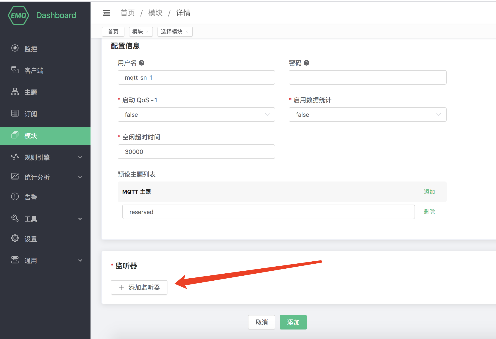
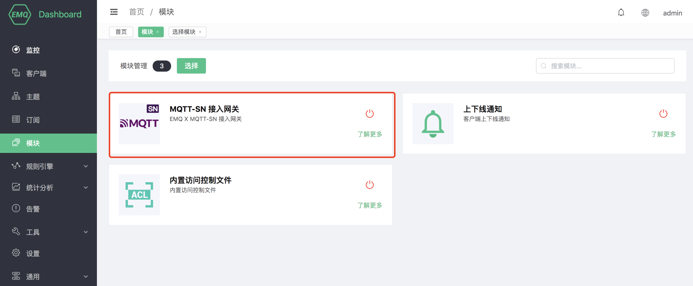

# MQTT-SN 协议网关

## 协议介绍

MQTT-SN 的信令和 MQTT 大部分都相同，比如都有 Will, 都有 Connect/Subscribe/Publish 命令.

MQTT-SN 最大的不同是，Topic 使用 TopicId 来代替，而 TopicId 是一个16比特的数字。每一个数字对应一个
Topic, 设备和云端需要使用 REGISTER 命令映射 TopicId 和 Topic 的对应关系。

MQTT-SN 可以随时更改 Will 的内容, 甚至可以取消. 而 MQTT 只允许在 CONNECT 时设定 Will 的内容,
而且不允许更改.

MQTT-SN 的网络中有网关这种设备，它负责把 MQTT-SN 转换成 MQTT，和云端的 MQTT Broker 通信. MQTT-SN
的协议支持自动发现网关的功能。

MQTT-SN 还支持设备的睡眠功能，如果设备进入睡眠状态，无法接收 UDP 数据，网关将把下行的 PUBLISH
消息缓存起来，直到设备苏醒后再传送。

EMQX-SN 是 EMQ X 的一个网关接入模块，实现了 MQTT-SN 的大部分功能，它相当于一个在云端的 MQTT-SN 网关，直接和 EMQ
X Broker 相连。

## 创建模块

打开 [EMQ X Dashboard](http://127.0.0.1:18083/#/modules)，点击左侧的 “模块” 选项卡，选择添加：

选择 MQTT-SN 接入网关模块:

配置相关基础参数:

添加监听端口:

配置监听参数:

点击确认到配置参数页面:

点击添加后，模块添加完成:

### 配置参数

| 配置项                      |       说明                           |
| --------------------------- | ---------------------------------- |
| 用户名            | 可选的参数，指定所有 MQTT-SN 连接的用户名，用于 EMQ X 鉴权模块 |
| 密码            | 可选的参数，和 username 一起使用于 EMQ X 鉴权模块           |

### MQTT-SN 客户端库

1.  <https://github.com/eclipse/paho.mqtt-sn.embedded-c/>
2.  <https://github.com/ty4tw/MQTT-SN>
3.  <https://github.com/njh/mqtt-sn-tools>
4.  <https://github.com/arobenko/mqtt-sn>
