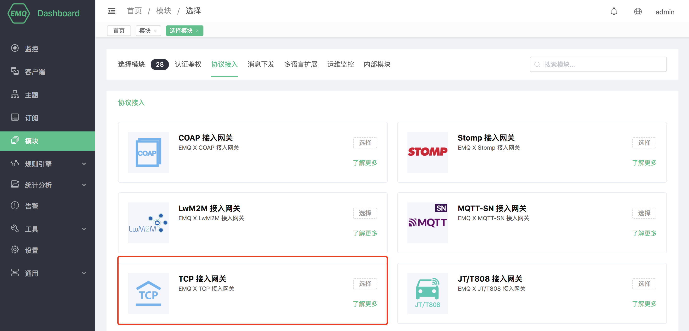
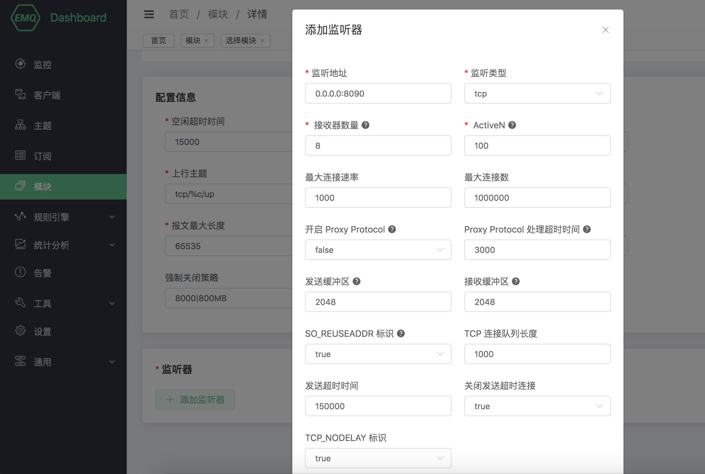
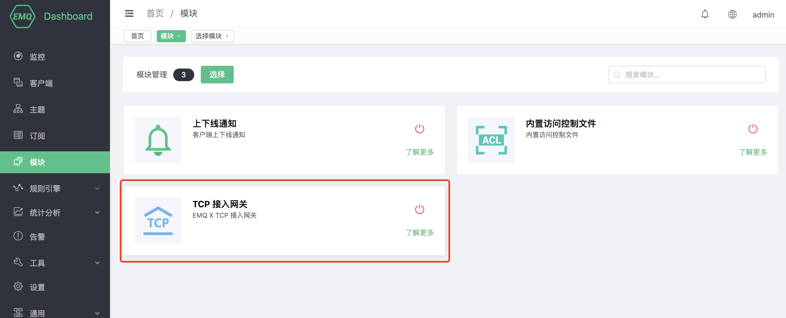
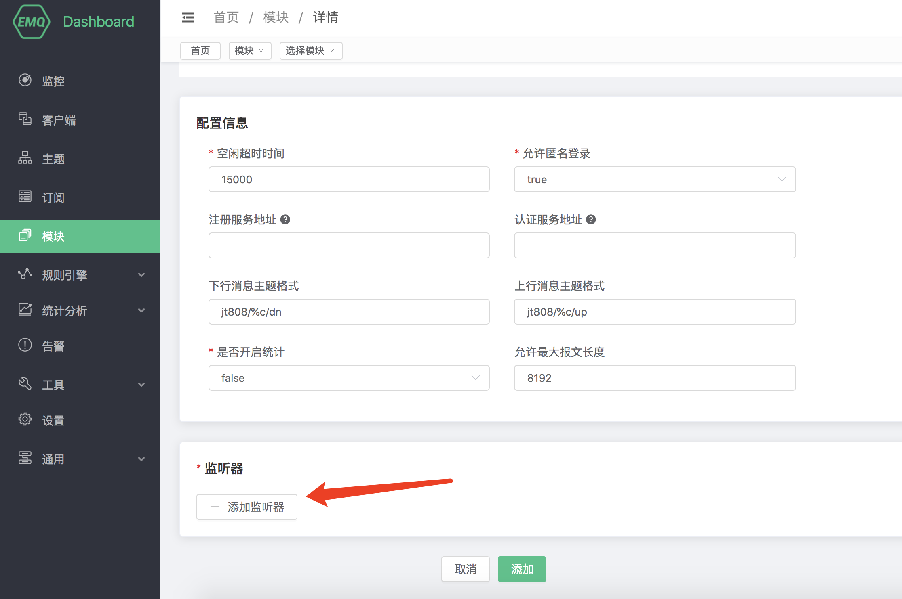
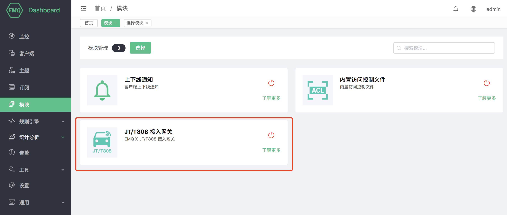

# COAP 协议网关

# Stomp 协议网关

# LwM2M 协议网关

## 协议介绍

LwM2M 全称是 Lightweight Machine-To-Machine，是由 Open Mobile Alliance(OMA)
定义的一套适用于物联网的轻量级协议，它提供了设备管理和通讯的功能，尤其适用于资源有限的终端设备。协议可以在
[这里](http://www.openmobilealliance.org/wp/) 下载。

LwM2M 基于 REST 架构，使用 CoAP 作为底层的传输协议，承载在 UDP 或者 SMS
上，因而报文结构简单小巧，并且在网络资源有限及无法确保设备始终在线的环境里同样适用。

LwM2M 最主要的实体包括 LwM2M Server 和 LwM2M Client。

LwM2M Server 作为服务器，部署在 M2M 服务供应商处或网络服务供应商处。LwM2M 定义了两种服务器

  - 一种是 LwM2M BOOTSTRAP SERVER，emqx-lwm2m 插件并未实现该服务器的功能。
  - 一种是 LwM2M SERVER，emqx-lwm2m 实现该服务器在 UDP 上的功能，SMS 并没有实现。

LwM2M Client 作为客户端，部署在各个 LwM2M 设备上。

在 LwM2M Server 和 LwM2M Client 之间，LwM2M 协议定义了4个接口。

1.  引导接口 Bootstrap：向 LwM2M 客户端提供注册到 LwM2M
    服务器的必要信息，例如服务器访问信息、客户端支持的资源信息等。
2.  客户端注册接口 Client Registration：使 LwM2M 客户端与 LwM2M 服务器互联，将 LwM2M
    客户端的相关信息存储在 LwM2M 服务器上。只有完成注册后，LwM2M
    客户端与服务器端之间的通信与管理才成为可能。
3.  设备管理与服务实现接口 Device Management and Service Enablement：该接口的主控方为 LwM2M
    服务器，服务器向客户端发送指令，客户端对指令做出回应并将回应消息发送给服务器。
4.  信息上报接口 Information Reporting：允许 LwM2M
    服务器端向客户端订阅资源信息，客户端接收订阅后按照约定的模式向服务器端报告自己的资源变化情况。

LwM2M 把设备上的服务抽象为 Object 和 Resource, 在 XML 文件中定义各种 Object 的属性和功能。可以在
[这里](http://www.openmobilealliance.org/wp/OMNA/LwM2M/LwM2MRegistry.html)
找到 XML 的各种定义。

LwM2M 协议预定义了8种 Object 来满足基本的需求，分别是：

  - Security 安全对象
  - Server 服务器对象
  - Access Control 访问控制对象
  - Device 设备对象
  - Connectivity Monitoring 连通性监控对象
  - Firmware 固件对象
  - Location 位置对象
  - Connectivity Statistics 连通性统计对象

## LwM2M 接入网关启动方式

通过dashboard页面可以开启 LwM2M 协议接入网关

打开 [EMQ X Dashboard](http://127.0.0.1:18083/#/rules)，点击左侧的 “模块” 选项卡，选择添加


选择 LwM2M 协议接入网关:


配置相关基础参数:


添加监听端口:


配置监听参数:


点击确认到配置参数页面:


点击添加后，模块添加完成:


EMQX-LWM2M 是 EMQ X 服务器的一个网关模块，实现了 LwM2M 的大部分功能。MQTT 客户端可以通过 EMQX-LWM2M
访问支持 LwM2M 的设备。设备也可以往 EMQX-LWM2M 上报 notification，为 EMQ X后端的服务采集数据。

### 配置参数


|   配置项    |         说明                                      |
| -----------| ------------------------------------------------ |
| 最小心跳时间 | 注册/更新允许设置的最小lifetime，以秒为单位 |
| 最大心跳时间 | 注册/更新允许设置的最大lifetime，以秒为单位 |
| QMode 窗口  | QMode时间窗口，指示发送到客户机的下行命令经过多长时间后将被缓存，以秒为单位 |
| 自动 Observe | 注册成功后，是否自动Observe 上报的objectlist |
| 挂载点       | 主题前缀|
| 下行命令主题  | 下行命令主题 %e表示取值endport name|
| 上行应答主题  | 上行应答主题 %e表示取值endport name|
| 注册消息主题  | 注册消息主题 %e表示取值endport name|
| 上行通知主题  | 上行通知主题 %e表示取值endport name|
| 更新消息主题  | 更新消息主题 %e表示取值endport name|
| XML 文件路径 | 存放 XML 文件的目录，这些 XML 用来定义 LwM2M Object            |

### MQTT 和 LwM2M 的转换

从 MQTT 客户端可以发送 Command 给 LwM2M 设备。MQTT 到 LwM2M 的命令使用如下的 topic

```bash
"lwm2m/{?device_end_point_name}/command".
```

其中 MQTT Payload 是一个 json 格式的字符串，指定要发送的命令，更多的细节请参见 emqx-lwm2m 的文档。

LwM2M 设备的回复用如下 topic 传送

```bash
"lwm2m/{?device_end_point_name}/response".
```

MQTT Payload 也是一个 json 格式的字符串，更多的细节请参见 emqx-lwm2m 的文档。


# MQTT-SN 协议网关

## 协议介绍

MQTT-SN 的信令和 MQTT 大部分都相同，比如都有 Will, 都有 Connect/Subscribe/Publish 命令.

MQTT-SN 最大的不同是，Topic 使用 TopicId 来代替，而 TopicId 是一个16比特的数字。每一个数字对应一个
Topic, 设备和云端需要使用 REGISTER 命令映射 TopicId 和 Topic 的对应关系。

MQTT-SN 可以随时更改 Will 的内容, 甚至可以取消. 而 MQTT 只允许在 CONNECT 时设定 Will 的内容,
而且不允许更改.

MQTT-SN 的网络中有网关这种设备，它负责把 MQTT-SN 转换成 MQTT，和云端的 MQTT Broker 通信. MQTT-SN
的协议支持自动发现网关的功能。

MQTT-SN 还支持设备的睡眠功能，如果设备进入睡眠状态，无法接收 UDP 数据，网关将把下行的 PUBLISH
消息缓存起来，直到设备苏醒后再传送。

EMQX-SN 是 EMQ X 的一个网关接入模块，实现了 MQTT-SN 的大部分功能，它相当于一个在云端的 MQTT-SN 网关，直接和 EMQ
X Broker 相连。

## EMQX-SN 接入网关启动方式

通过dashboard页面可以开启 MQTT-SN 接入网关模块

打开 [EMQ X Dashboard](http://127.0.0.1:18083/#/rules)，点击左侧的 “模块” 选项卡，选择添加


选择 MQTT-SN 接入网关模块:


配置相关基础参数:


添加监听端口:


配置监听参数:


点击确认到配置参数页面:


点击添加后，模块添加完成:


### 配置参数

| 配置项                      |       说明                           |
| --------------------------- | ---------------------------------- |
| 用户名            | 可选的参数，指定所有 MQTT-SN 连接的用户名，用于 EMQ X 鉴权模块 |
| 密码            | 可选的参数，和 username 一起使用于 EMQ X 鉴权模块           |


### MQTT-SN 客户端库

1.  <https://github.com/eclipse/paho.mqtt-sn.embedded-c/>
2.  <https://github.com/ty4tw/MQTT-SN>
3.  <https://github.com/njh/mqtt-sn-tools>
4.  <https://github.com/arobenko/mqtt-sn>


# TCP 协议网关

## 协议介绍

EMQ X 提供 **emqx-tcp** 模块作为一个靠近端侧的一个接入模块，按照其功能逻辑和整个系统的关系，将整个消息交换的过程可以分成三个部分：终端侧，平台侧和其它侧：

```bash
|<-- Terminal -->|<--------- Broker Side --------->|<---  Others  --->|
|<-    Sid e   ->|                                 |<--    Side    -->|

+---+                                                PUB  +-----------+
| D |  INCOMING  +----------+    PUB     +---------+   -->| subscriber|
| E |----------->|          |----------->|         |--/   +-----------+
| V |            | emqx-tcp |            |  EMQ X  |
| I |<-----------|          |<-----------|         |<--   +-----------+
| C |  OUTGOING  +----------+    PUB     +---------+   \--| publisher |
| E |                                                PUB  +-----------+
+---+
```

1. 终端侧，通过本模块定义的 TCP 私有协议进行接入，然后实现数据的上报，或者接收下行的消息。
2. 平台侧，主体是 emqx-tcp 模块和  EMQ X 系统。emqx-tcp 负责报文的编解码，代理订阅下行主题。实现将上行消息转为 EMQ X 系统中的 MQTT 消息 PUBLISH 到整个系统中；将下行的 MQTT 消息转化为 TCP 私有协议的报文结构，下发到终端。
3. 其它侧，可以对 2 中出现的上行的 PUBLISH 消息的主题进行订阅，以接收上行消息。或对发布消息到具体的下行的主题，以发送数据到终端侧。

## TCP 私有协议接入网关启动方式

通过dashboard页面可以开启 TCP 私有协议接入网关

打开 [EMQ X Dashboard](http://127.0.0.1:18083/#/rules)，点击左侧的 “模块” 选项卡，选择添加


选择 TCP 私有协议接入网关:



配置相关基础参数:


添加监听端口:


配置监听参数:



点击确认到配置参数页面:


点击添加后，模块添加完成:


### 配置参数

| 配置项                      |       说明                           |
| --------------------------- | ---------------------------------- |
| 空闲超时时间            | 闲置时间。超过该时间未收到 CONNECT 帧, 将直接关闭该 TCP 连接 |
| 上行主题            | 上行主题。上行消息到 EMQ 系统中的消息主题%c: 接入客户端的 ClientId,%u: 接入客户端的 Username|
| 下行主题            | 下行主题。上行消息到 EMQ 系统中的消息主题%c: 接入客户端的 ClientId,%u: 接入客户端的 Username|
| 报文最大长度            | 最大处理的单个 TCP 私有协议报文大小           |
| 强制 GC 策略            | 强制 GC, 当进程已处理 1000 消息或发送数据超过 1M           |
| 强制关闭策略            | 强制关闭连接, 当进程堆积 8000 消息或堆栈内存超过 800M           |

# JT/T808 协议网关

## 协议介绍

**emqx-jt808** 做为 emqx 的接入网关，按照其功能逻辑和整个系统的关系，将整个消息交换的过程可以分成三个部分：终端侧，平台侧和其它侧：

```
|<-- Terminal -->|<---------- Broker Side ---------->|<---  Others  --->|
|<-    Side    ->|                                   |<--    Side    -->|

+---+                                                  PUB  +-----------+
| D |  INCOMING  +------------+    PUB     +---------+   -->| subscriber|
| E |----------->|            |----------->|         |--/   +-----------+
| V |            | emqx-jt808 |            |  EMQ X  |
| I |<-----------|            |<-----------|         |<--   +-----------+
| C |  OUTGOING  +------------+    PUB     +---------+   \--| publisher |
| E |                                                  PUB  +-----------+
+---+
```

1. 终端侧：通过 JT/T 808 协议进行交换数据，实现不同类型的数据的上报，或者发送下行的消息到终端。
2. 平台侧：emqx-jt808 将报文解码后执行 注册/鉴权、或将数据报文 PUBLISH 到特定的主题上；代理订阅下行主题，将下行的 PUBLISH 消息转化为 JT/T 808 协议的报文结构，下发到终端。
3. 其它侧，可以对 2 中出现的上行的 PUBLISH 消息的主题进行订阅，以接收上行消息。或对发布消息到具体的下行的主题，以发送数据到终端侧。

## JT/T808 协议接入网关启动方式

通过dashboard页面可以开启 JT/T808 协议接入网关

打开 [EMQ X Dashboard](http://127.0.0.1:18083/#/rules)，点击左侧的 “模块” 选项卡，选择添加:


选择 JT/T808 协议接入网关:


配置相关基础参数:


添加监听端口:



配置监听参数:


点击确认到配置参数页面:


点击添加后，模块添加完成:


**emqx-jt808 实现规定：**

- 系统内以手机号作为一个连接的唯一标识，即 ClientId


### 配置参数

emqx-jt808 的实现支持匿名的方式接入认证：
| 配置项                      |       说明                           |
| --------------------------- | ---------------------------------- |
| 允许匿名登录            | 是否允许匿名用户登录 
| 注册服务地址            | JT/T808 终端注册的 HTTP 接口地址           |
| 认证服务地址            | JT/T808 终端接入鉴权的 HTTP 接口地址           |
| 下行消息主题格式         | 上行主题。上行消息到 EMQ X 系统中的消息主题%c: 接入客户端的 ClientId,%p: 接入客户端的 Phone|
| 上行消息主题格式         | 下行主题。上行消息到 EMQ X 系统中的消息主题%c: 接入客户端的 ClientId,%p: 接入客户端的 Phone|
| 允许最大报文长度         | 最大处理的单个JT/T808协议报文大小|

### 注册及鉴权

注册请求详细格式如下：

**注册请求：**
```
    URL: http://127.0.0.1:8991/jt808/registry
    Method: POST
    Body:
       { "province": 58,
         "city": 59,
         "manufacturer": "Infinity",
         "model": "Q2",
         "license_number": "ZA334455",
         "dev_id": "xx11344",
         "color": 3,
         "phone", "00123456789"
       }
```

**注册应答：**
```
{
  "code": 0,
  "authcode": "132456789"
}

或:

{
  "code": 1
}

其中返回码可以为：

0: 成功
1: 车辆已被注册
2: 数据库中无该车辆
3: 终端已被注册
4: 数据库中无该终端
```

**鉴权请求：**

```properties
    URL: http://127.0.0.1:8991/jt808/auth
    Method: POST
    Body:
       { "code": "authcode",
         "phone", "00123456789"
       }
```

**鉴权应答：**
```
HTTP 状态码 200: 鉴权成功
其他: 鉴权失败
```

注：鉴权请求只会在系统未保存鉴权码时调用（即终端直接发送鉴权报文进行登录系统）

### 数据上下行

emqx-jt808 中通过配置上下行主题来收发终端消息：

#### 上行

例如：**制造商Id** 为 `abcde` 和 **终端Id** 为 `1234567` 的设备。

首先先使用 MQTT 客户端订阅主题 `jt808/abcde1234567/up`：

```properties
$ mosquitto_sub -t jt808/abcde1234567/up
```

例如终端在上报 `数据上行透传(0x0900)` 类型的消息后，订阅端会收到：

```js
{ "body":
    { "data":"MTIzNDU2",
      "type":240
    },
  "header":
     { "encrypt":0,
       "len":7,
       "msg_id":2304,
       "msg_sn":4,
       "phone":"011111111111"
     }
}
```

注：透明传输类，data 域的内容会 base64 编码一次在上报出来

#### 数据下行

同样，以上行的ID为例；在终端鉴权成功后，使用 MQTT 客户端向该终端下发一个 '数据下行透传(0x8900)' 类型的消息：
```
$ mosquitto_pub -t jt808/abcde1234567/dn -m '{"body":{"data":"MTIzNDU2","type":240},"header":{"msg_id":35072}}'
```

注：下行 JSON 中，header 中的内容只需要带 msg_id 即可；body 中的内容根据不同的 msg_id 有不同的结构