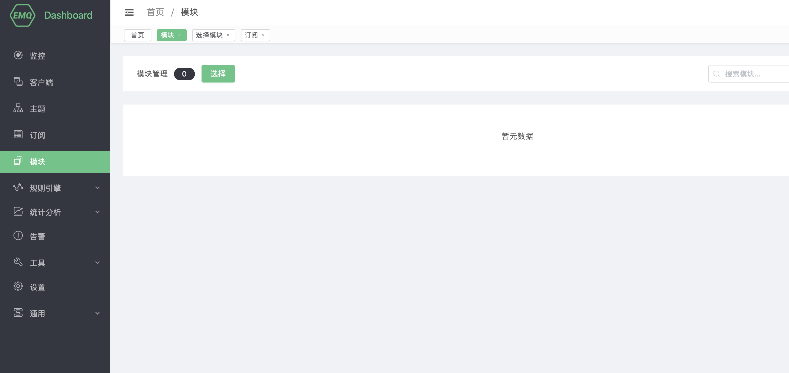

# Pulsar 消费组

Pulsar 消费组使用外部 Pulsar 作为消息队列，可以从 Pulsar 中消费消息转换成为 MQTT 消息发布在 emqx 中。

搭建 Pulsar 环境，以 MacOS X 为例:

```bash
$ wget http://apache.mirrors.hoobly.com/pulsar/pulsar-2.3.2/apache-pulsar-2.3.2-bin.tar.gz

$ tar xvfz apache-pulsar-2.3.2-bin.tar.gz

$ cd apache-pulsar-2.3.2

# 启动 Pulsar
$ ./bin/pulsar standalone
```

创建 Pulsar 的主题:
```bash
$ ./bin/pulsar-admin topics create-partitioned-topic -p 5 testTopic
```
## 创建模块

打开 [EMQ X Dashboard](http://127.0.0.1:18083/#/modules)，点击左侧的 “模块” 选项卡，选择添加：



选择 Pulsar 消费组模块:


填写相关参数:


1). Pulsar 服务器地址

2). Pulsar consumer 进程数量

3). Pulsar 的订阅主题

4). MQTT 的消息主题

5). MQTT 的主题服务质量

6). Pulsar 流控阈值 (Pulsar 流控阈值，配置 Pulsar 向消费者发送多少条消息后阻塞 Pulsar Consumer)

7). EMQ X 重置流控阈值百分比 (Pulsar 流控阈值重置百分比。此配置让消费者处理完成一定数量的消息之后，提前重置 `Pulsar 流控阈值`。 比如，`Pulsar 流控阈值` 为 1000，`阈值重置百分比` 为 80%，则重置)


点击添加后，模块添加完成:


资源已经创建完成，现在用Dashboard的websocket工具订阅MQTT的主题 "TestTopic":


使用pulsar-cli 生产一条消息:

```bash
./bin/pulsar-client produce TestTopic --messages "hello-pulsar"
```


Dashboard的websocket工具接收到了pulsar 生产的消息"hello-pulsar":


