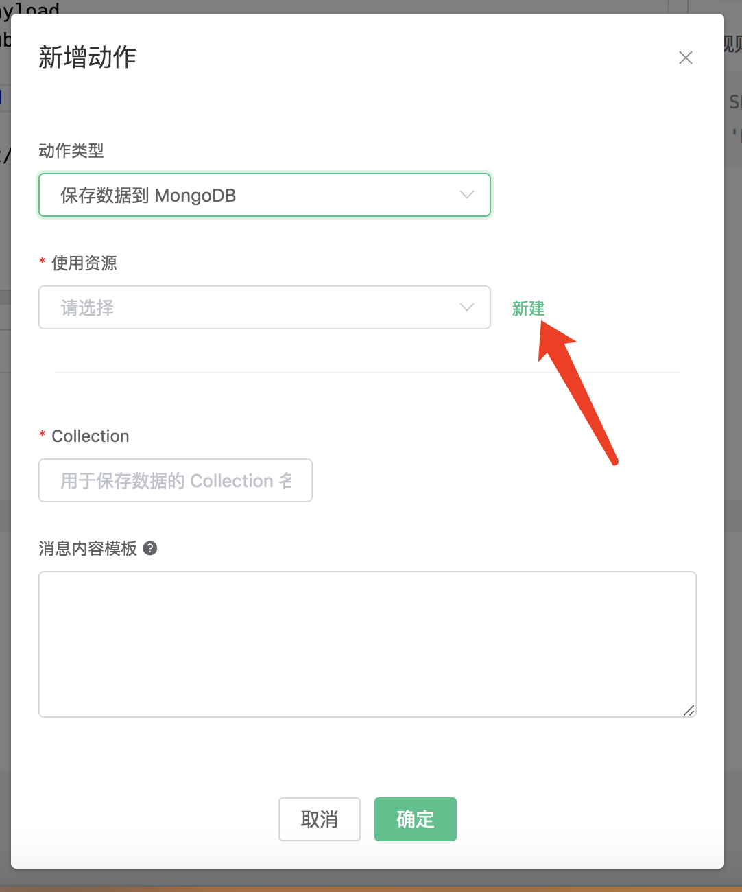
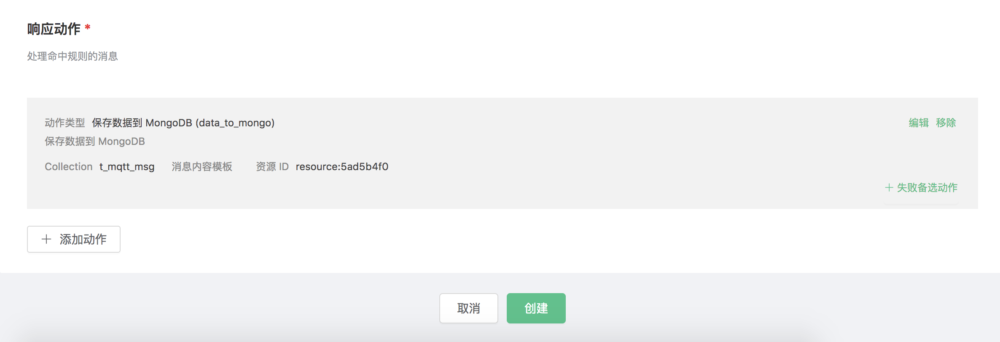
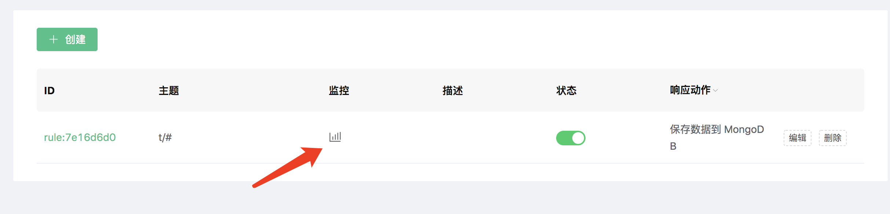
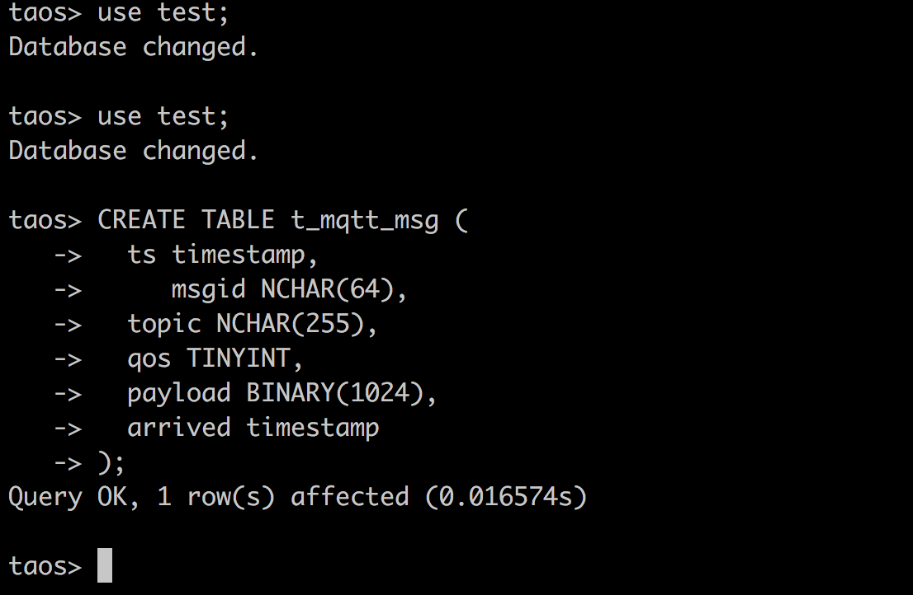
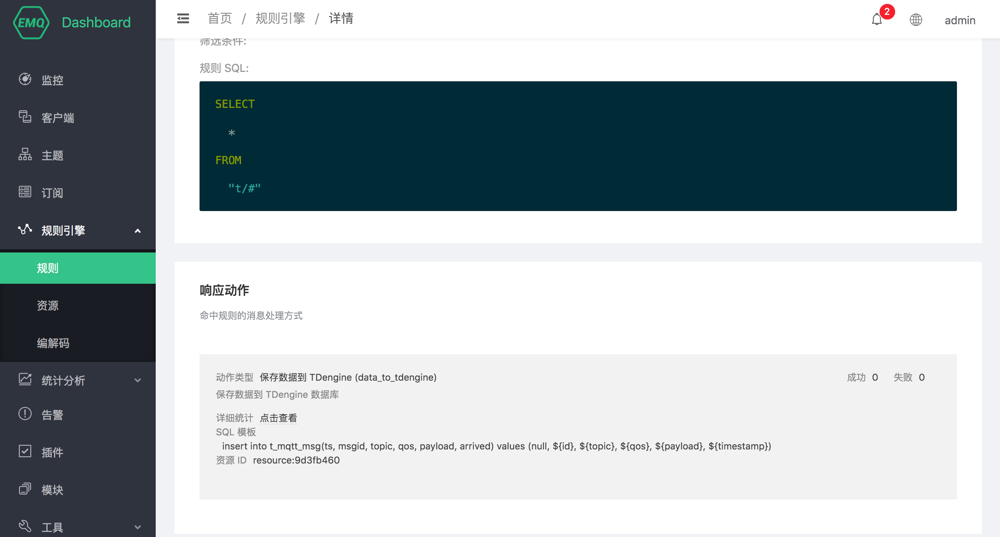
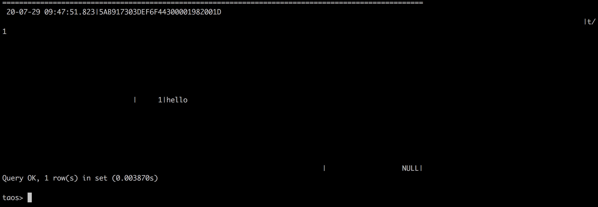

## 保存数据到 MySQL

搭建 MySQL 数据库，并设置用户名密码为 root/public，以 MacOS X 为例:

```bash
$ brew install mysql

$ brew services start mysql

$ mysql -u root -h localhost -p

ALTER USER 'root'@'localhost' IDENTIFIED BY 'public';
```

初始化 MySQL 表:

```bash
$ mysql -u root -h localhost -ppublic
```

创建 “test” 数据库:
```bash
CREATE DATABASE test;
```
创建 t_mqtt_msg 表:

```sql
USE test;
CREATE TABLE `t_mqtt_msg` (
`id` int(11) unsigned NOT NULL AUTO_INCREMENT,
`msgid` varchar(64) DEFAULT NULL,
`topic` varchar(255) NOT NULL,
`qos` tinyint(1) NOT NULL DEFAULT '0',
`payload` blob,
`arrived` datetime NOT NULL,
PRIMARY KEY (`id`),
INDEX topic_index(`id`, `topic`)
) ENGINE=InnoDB DEFAULT CHARSET=utf8MB4;
```


创建规则:

打开 [EMQ X Dashboard](http://127.0.0.1:18083/#/rules)，选择左侧的 “规则” 选项卡。

填写规则 SQL:

```sql
SELECT * FROM "t/#"
```


关联动作:

在 “响应动作” 界面选择 “添加”，然后在 “动作” 下拉框里选择 “保存数据到 MySQL”。


填写动作参数:

“保存数据到 MySQL” 动作需要两个参数：

1). SQL 模板。这个例子里我们向 MySQL 插入一条数据，SQL
​    模板为:

```sql
insert into t_mqtt_msg(msgid, topic, qos, payload, arrived) values ('${id}', '${topic}', '${qos}', '${payload}', FROM_UNIXTIME(${timestamp}/1000))
```


2). 关联资源的 ID。现在资源下拉框为空，可以点击右上角的 “新建资源” 来创建一个 MySQL 资源:

填写资源配置:

数据库名填写 “mqtt”，用户名填写 “root”，密码填写 “123456”


点击 “新建” 按钮。

返回响应动作界面，点击 “确认”。


返回规则创建界面，点击 “创建”。


在规则列表里，点击 “查看” 按钮或规则 ID 连接，可以预览刚才创建的规则:


规则已经创建完成，现在发一条数据:

```bash
Topic: "t/a"
QoS: 1
Payload: "hello"
```

然后检查 MySQL 表，新的 record 是否添加成功:


## 保存数据到 PostgreSQL

搭建 PostgreSQL 数据库，以 MacOS X 为例:

```bash
$ brew install postgresql
$ brew services start postgresql
```

```bash
## 使用用户名 root 创建名为 'mqtt' 的数据库
$ createdb -U root mqtt

$ psql -U root mqtt

mqtt=> \dn;
List of schemas
Name  | Owner
--------+-------
public | shawn
(1 row)
```

初始化 PgSQL 表:

```bash
$ psql -U root mqtt
```

创建 `t_mqtt_msg` 表:

```sql
CREATE TABLE t_mqtt_msg (
    id SERIAL primary key,
    msgid character varying(64),
    sender character varying(64),
    topic character varying(255),
    qos integer,
    payload text,
    arrived timestamp without time zone
);
```

创建规则:

打开 [EMQ X Dashboard](http://127.0.0.1:18083/#/rules)，选择左侧的 “规则” 选项卡。

填写规则 SQL:

```bash
SELECT * FROM "t/#"
```


关联动作:

在 “响应动作” 界面选择 “添加”，然后在 “动作” 下拉框里选择 “保存数据到 PostgreSQL”。


填写动作参数:

“保存数据到 PostgreSQL” 动作需要两个参数：

1). 关联资源的 ID。现在资源下拉框为空，可以点击右上角的 “新建资源” 来创建一个 PostgreSQL 资源:


选择 “PostgreSQL 资源”。

填写资源配置:

数据库名填写 “mqtt”，用户名填写 “root”，其他配置保持默认值，然后点击 “测试连接” 按钮，确保连接测试成功。

最后点击 “新建” 按钮。


返回响应动作界面，点击 “确认”。

2).SQL 模板。这个例子里我们向 PostgreSQL 插入一条数据，SQL
​    模板为:

```bash
insert into t_mqtt_msg(msgid, topic, qos, payload, arrived) values ('${id}', '${topic}', ${qos}, '${payload}', to_timestamp(${timestamp}::double precision /1000))
```

插入数据之前，SQL 模板里的 ${key} 占位符会被替换为相应的值。


返回规则创建界面，点击 “创建”。


规则已经创建完成，现在发一条数据:

```bash
Topic: "t/1"
QoS: 0
Payload: "hello1"
```

然后检查 PostgreSQL 表，新的 record 是否添加成功:


在规则列表里，可以看到刚才创建的规则的命中次数已经增加了 1:


## 保存数据到 MongoDB

搭建 MongoDB 数据库，并设置用户名密码为 root/public，以 MacOS X 为例:

```bash
$ brew install mongodb
$ brew services start mongodb

## 新增 root/public 用户
$ use mqtt;
$ db.createUser({user: "root", pwd: "public", roles: [{role: "readWrite", db: "mqtt"}]});

## 修改配置，关闭匿名认证
$ vim /usr/local/etc/mongod.conf

    security:
    authorization: enabled

$ brew services restart mongodb
```

初始化 MongoDB 表:

```bash
$ mongo 127.0.0.1/mqtt -uroot -ppublic
db.createCollection("t_mqtt_msg");
```

创建规则:

打开 [EMQ X Dashboard](http://127.0.0.1:18083/#/rules)，选择左侧的 “规则” 选项卡。

填写规则 SQL:

```bash
SELECT id as msgid, topic, qos, payload, publish_received_at as arrived FROM "t/#"
```


关联动作:

在 “响应动作” 界面选择 “添加”，然后在 “动作” 下拉框里选择 “保存数据到 MongoDB”。


填写动作参数:

“保存数据到 MongoDB” 动作需要三个参数：

1). 关联资源的 ID。初始状况下，资源下拉框为空，现点击右上角的 “新建资源” 来创建一个 MongoDB 单节点 资源。



填写资源配置:

数据库名称 填写 “mqtt”，用户名填写 “root”，密码填写 “public”，连接认证源填写 “mqtt”
其他配置保持默认值，然后点击 “测试连接” 按钮，确保连接测试成功。


点击 “新建” 按钮，完成资源的创建。

2). Collection 名称。这个例子我们向刚刚新建的 collection 插入数据，填 “t_mqtt\_msg”

3). Payload Tmpl 模板。这个例子里我们向 MongoDB 插入一条数据，模板为空, 插入的数据是上面SQL语句select出来的结果用json格式写入到MongoDB中


在点击 “新建” 完成规则创建



现在发送一条数据，测试该规则:

```bash
Topic: "t/mongo"
QoS: 1
Payload: "hello"
```

然后检查 MongoDB 表，可以看到该消息已成功保存:


在规则列表里，可以看到刚才创建的规则的命中次数已经增加了 1:



## 保存数据到 Redis

搭建 Redis 环境，以 MacOS X 为例:

```bash
 $ wget http://download.redis.io/releases/redis-4.0.14.tar.gz
$ tar xzf redis-4.0.14.tar.gz
$ cd redis-4.0.14
$ make && make install

# 启动 redis
$ redis-server
```

创建规则:

打开 [EMQ X Dashboard](http://127.0.0.1:18083/#/rules)，选择左侧的 “规则” 选项卡。

填写规则 SQL:

```bash
SELECT * FROM "t/#"
```


关联动作:

在 “响应动作” 界面选择 “添加”，然后在 “动作” 下拉框里选择 “保存数据到 Redis”。


填写动作参数:

“保存数据到 Redis 动作需要两个参数：

1). 关联资源。现在资源下拉框为空，可以点击右上角的 “新建资源” 来创建一个 Redis 资源:


选择 Redis 单节点模式资源”。

填写资源配置:

   填写真实的 Redis 服务器地址，其他配置保持默认值，然后点击 “测试连接” 按钮，确保连接测试成功。

最后点击 “新建” 按钮。


返回响应动作界面，点击 “确认”。

2). Redis 的命令:

```bash
HMSET mqtt:msg:${id} id ${id} from ${client_id} qos ${qos} topic ${topic} payload ${payload} ts ${timestamp}
```


返回规则创建界面，点击 “新建”。


规则已经创建完成，现在发一条数据:

```bash
Topic: "t/1"

QoS: 0

Payload: "hello"
```

然后通过 Redis 命令去查看消息是否生产成功:

```bash
$ redis-cli

KEYS mqtt:msg\*

hgetall Key
```


在规则列表里，可以看到刚才创建的规则的命中次数已经增加了 1:


## 保存数据到 Cassandra

搭建 Cassandra 数据库，并设置用户名密码为 root/public，以 MacOS X 为例:

```bash
$ brew install cassandra
## 修改配置，关闭匿名认证
$  vim /usr/local/etc/cassandra/cassandra.yaml

    authenticator: PasswordAuthenticator
    authorizer: CassandraAuthorizer

$ brew services start cassandra

## 创建 root 用户
$ cqlsh -ucassandra -pcassandra

create user root with password 'public' superuser;
```

初始化 Cassandra 表:

```bash
$ cqlsh -uroot -ppublic
```

创建 "test" 表空间:

```bash
CREATE KEYSPACE test WITH replication = {'class': 'SimpleStrategy', 'replication_factor': '1'}  AND durable_writes = true;
```

创建 “t_mqtt_msg” 表:

```sql
USE test;
CREATE TABLE t_mqtt_msg (
    msgid text,
    topic text,
    qos int,
    payload text,
    arrived timestamp,
    PRIMARY KEY (msgid, topic)
);
```

创建规则:

打开 [EMQ X Dashboard](http://127.0.0.1:18083/#/rules)，选择左侧的 “规则” 选项卡。

填写规则 SQL:
```bash
SELECT * FROM "t/#"
```


关联动作:

在 “响应动作” 界面选择 “添加”，然后在 “动作” 下拉框里选择 “保存数据到 Cassandra”。


填写动作参数:

“保存数据到 Cassandra” 动作需要两个参数：

1). 关联资源的 ID。初始状况下，资源下拉框为空，现点击右上角的 “新建资源” 来创建一个 Cassandra 资源。


填写资源配置:

Keysapce 填写 “test”，用户名填写 “root”，密码填写 “public” 其他配置保持默认值，然后点击 “测试连接”
按钮，确保连接测试成功。


点击 “新建” 按钮，完成资源的创建。

2). SQL 模板。这个例子里我们向 Cassandra 插入一条数据，SQL
​    模板为:

```sql
insert into t_mqtt_msg(msgid, topic, qos, payload, arrived) values ('${id}', '${topic}', ${qos}, '${payload}', ${timestamp})
```

插入数据之前，SQL 模板里的 ${key} 占位符会被替换为相应的值。


在点击 “新建” 完成规则创建


现在发送一条数据，测试该规则:

```bash
Topic: "t/cass"
QoS: 1
Payload: "hello"
```

然后检查 Cassandra 表，可以看到该消息已成功保存:


在规则列表里，可以看到刚才创建的规则的命中次数已经增加了 1:


## 保存数据到 DynamoDB

搭建 DynamoDB 数据库，以 MacOS X 为例:

```bash
$ brew install dynamodb-local
$ dynamodb-local
```

创建 DynamoDB 表定义文件 mqtt\_msg.json :

<!-- end list -->

```json
{
   "TableName": "mqtt_msg",
   "KeySchema": [
       { "AttributeName": "msgid", "KeyType": "HASH" }
   ],
   "AttributeDefinitions": [
       { "AttributeName": "msgid", "AttributeType": "S" }
   ],
   "ProvisionedThroughput": {
       "ReadCapacityUnits": 5,
       "WriteCapacityUnits": 5
   }
}
```

初始化 DynamoDB 表:

```bash
$ aws dynamodb create-table --cli-input-json file://mqtt_msg.json --endpoint-url http://localhost:8000
```

创建规则:

打开 [EMQ X Dashboard](http://127.0.0.1:18083/#/rules)，选择左侧的 “规则” 选项卡。

填写规则 SQL:

```sql
SELECT id, topic, payload FROM "#"
```


关联动作:

在 “响应动作” 界面选择 “添加”，然后在 “动作” 下拉框里选择 “保存数据到 DynamoDB”。


填写动作参数:

“保存数据到 DynamoDB” 动作需要两个参数：

1). DynamoDB 表名。这个例子里我们设置的表名为 "mqtt\_msg"

2). DynamoDB Hash Key。这个例子里我们设置的 Hash Key 要与表定义的一致

3). DynamoDB Range Key。由于我们表定义里没有设置 Range Key。这个例子里我们把 Range Key 设置为空。


4). 关联资源的 ID。现在资源下拉框为空，可以点击右上角的 “新建资源” 来创建一个 DynamoDB 资源:

填写资源配置:


点击 “新建” 按钮。

返回响应动作界面，点击 “确认”。


返回规则创建界面，点击 “新建”。


规则已经创建完成，现在发一条数据:

```bash
Topic: "t/a"
QoS: 1
Payload: "hello"
```

然后检查 DynamoDB 的 mqtt\_msg 表，新的 record 是否添加成功:


在规则列表里，可以看到刚才创建的规则的命中次数已经增加了 1:


## 保存数据到 ClickHouse

搭建 ClickHouse 数据库，并设置用户名密码为 default/public，以 CentOS 为例:

```bash
## 安装依赖
sudo yum install -y epel-release

## 下载并运行packagecloud.io提供的安装shell脚本
curl -s https://packagecloud.io/install/repositories/altinity/clickhouse/script.rpm.sh | sudo bash

## 安装ClickHouse服务器和客户端
sudo yum install -y clickhouse-server clickhouse-client

## 启动ClickHouse服务器
clickhouse-server

## 启动ClickHouse客户端程序
clickhouse-client
```

创建 “test” 数据库:
```bash
create database test;
```
创建 t_mqtt_msg 表:

```sql
use test;
create table t_mqtt_msg (msgid Nullable(String), topic Nullable(String), clientid Nullable(String), payload Nullable(String)) engine = Log;
```


创建规则:

打开 [EMQ X Dashboard](http://127.0.0.1:18083/#/rules)，选择左侧的 “规则” 选项卡。

填写规则 SQL:

```sql
SELECT * FROM "#"
```


关联动作:

在 “响应动作” 界面选择 “添加”，然后在 “动作” 下拉框里选择 “保存数据到 ClickHouse”。


填写动作参数:

“保存数据到 ClickHouse” 动作需要两个参数：

1). 关联资源的 ID。现在资源下拉框为空，可以点击右上角的 “新建资源” 来创建一个 ClickHouse 资源:


选择 “ClickHouse 资源”。

填写资源配置:


点击 “新建” 按钮。

2). SQL 模板。这个例子里我们向 ClickHouse 插入一条数据，SQL
​    模板为:

```sql
insert into test.t_mqtt_msg(msgid, clientid, topic, payload) values ('${id}', '${clientid}', '${topic}', '${payload}')
```


返回响应动作界面，点击 “确认”。


在规则列表里，点击 “查看” 按钮或规则 ID 连接，可以预览刚才创建的规则:


规则已经创建完成，现在发一条数据:

```bash
Topic: "t/a"
QoS: 1
Payload: "hello"
```

然后检查 ClickHouse 表，新的 record 是否添加成功:


## 保存数据到 OpenTSDB

搭建 OpenTSDB 数据库环境，以 MacOS X 为例:

```bash
$ docker pull petergrace/opentsdb-docker

$ docker run -d --name opentsdb -p 4242:4242 petergrace/opentsdb-docker
```

创建规则:

打开 [EMQ X Dashboard](http://127.0.0.1:18083/#/rules)，选择左侧的 “规则” 选项卡。

填写规则 SQL:

```sql
SELECT
    payload as p,
    p.metric as metric, p.tags as tags, p.value as value
FROM
    "#"
```


关联动作:

在 “响应动作” 界面选择 “添加”，然后在 “动作” 下拉框里选择 “保存数据到 OpenTSDB”。


填写动作参数:

“保存数据到 OpenTSDB” 动作需要六个参数:

1). 详细信息。是否需要 OpenTSDB Server 返回存储失败的 data point 及其原因的列表，默认为 false。

2). 摘要信息。是否需要 OpenTSDB Server 返回 data point 存储成功与失败的数量，默认为 true。

3). 最大批处理数量。消息请求频繁时允许 OpenTSDB 驱动将多少个 Data Points 合并为一次请求，默认为 20。

4). 是否同步调用。指定 OpenTSDB Server 是否等待所有数据都被写入后才返回结果，默认为 false。

5). 同步调用超时时间。同步调用最大等待时间，默认为 0。

6). 关联资源。现在资源下拉框为空，可以点击右上角的 “新建资源” 来创建一个 OpenTSDB 资源:


选择 “OpenTSDB 资源”:

填写资源配置:

本示例中所有配置保持默认值即可，点击 “测试连接” 按钮，确保连接测试成功。

最后点击 “新建” 按钮。


返回响应动作界面，点击 “确认”。


返回规则创建界面，点击 “新建”。


规则已经创建完成，现在发一条消息:

```bash
Topic: "t/1"

QoS: 0

Payload: "{"metric":"cpu","tags":{"host":"serverA"},"value":12}"
```

我们通过 Postman 或者 curl 命令，向 OpenTSDB Server 发送以下请求:

```bash
POST /api/query HTTP/1.1
Host: 127.0.0.1:4242
Content-Type: application/json
cache-control: no-cache
Postman-Token: 69af0565-27f8-41e5-b0cd-d7c7f5b7a037
{
    "start": 1560409825000,
    "queries": [
        {
            "aggregator": "last",
            "metric": "cpu",
            "tags": {
                "host": "*"
            }
        }
    ],
    "showTSUIDs": "true",
    "showQuery": "true",
    "delete": "false"
}
------WebKitFormBoundary7MA4YWxkTrZu0gW--
```

如果 data point 存储成功，将会得到以下应答:

```json
[
  {
      "metric": "cpu",
      "tags": {
          "host": "serverA"
      },
      "aggregateTags": [],
      "query": {
          "aggregator": "last",
          "metric": "cpu",
          "tsuids": null,
          "downsample": null,
          "rate": false,
          "filters": [
              {
                  "tagk": "host",
                  "filter": "*",
                  "group_by": true,
                  "type": "wildcard"
              }
          ],
          "index": 0,
          "tags": {
              "host": "wildcard(*)"
          },
          "rateOptions": null,
          "filterTagKs": [
              "AAAC"
          ],
          "explicitTags": false
      },
      "tsuids": [
          "000002000002000007"
      ],
      "dps": {
          "1561532453": 12
      }
  }
]
```

在规则列表里，可以看到刚才创建的规则的命中次数已经增加了 1:


## 保存数据到 InfluxDB

搭建 InfluxDB 数据库环境，以 macOS X 为例:

```bash
$ docker pull influxdb

$ docker run --name=influxdb --rm -d -p 8086:8086 -p 8089:8089/udp -v ${PWD}/files/influxdb.conf:/etc/influxdb/influxdb.conf influxdb:latest

```

EMQ X 仅支持通过 UDP 协议连接 InfluxDB，需要修改 InfluxDB 配置文件：

```bash
[[udp]]
  enabled = true
  bind-address = ":8089"
  # 消息保存的数据库
  database = "emqx"

  # InfluxDB precision for timestamps on received points ("" or "n", "u", "ms", "s", "m", "h")
  # EMQ X 默认时间戳是毫秒
  precision = "ms"

  # 其他配置根据需要自行修改
  #   batch-size = 1000
  #   batch-pending = 5
  #   batch-timeout = "5s"
  #   read-buffer = 1024
```

创建规则:

打开 [EMQ X Dashboard](http://127.0.0.1:18083/#/rules)，选择左侧的 “规则” 选项卡。

填写规则 SQL:


```bash
SELECT
    payload as p,
    p.host as host,
    p.location as location,
    p.internal as internal,
    p.external as external
FROM
    "#"
```


关联动作:

在 “响应动作” 界面选择 “添加”，然后在 “动作” 下拉框里选择 “保存数据到 InfluxDB”。


填写动作参数:

“保存数据到 InfluxDB” 动作需要六个参数：

1). Measurement。指定写入到 InfluxDB 的 data point 的 measurement。

2). Field Keys。指定写入到 InfluxDB 的 data point 的 fields 的值从哪里获取。

3). Tags Keys。指定写入到 InfluxDB 的 data point 的 tags 的值从哪里获取。

4). Timestamp Key。指定写入到 InfluxDB 的 data point 的 timestamp 的值从哪里获取。

5). 设置时间戳。未指定 Timestamp Key 时是否自动生成。

6). 关联资源。现在资源下拉框为空，可以点击右上角的 “新建资源” 来创建一个 InfluxDB 资源:


选择 “InfluxDB 资源”:


填写资源配置:

本示例中所有配置保持默认值即可，点击 “测试连接” 按钮，确保连接测试成功。

最后点击 “新建” 按钮。


返回响应动作界面，点击 “确认”。
返回规则创建界面，点击 “新建”。


规则已经创建完成，现在发一条消息:

```bash
Topic: "t/1"

QoS: 0

Payload:
"{"host":"serverA","location":"roomA","internal":25,"external":37}"
```

然后检查 InfluxDB，新的 data point 是否添加成功:

```bash
$ docker exec -it influxdb influx

use db
Using database db
select * from "temperature"
name: temperature
time                external host    internal location
----                -------- ----    -------- --------
1561535778444457348 35       serverA 25       roomA
```

在规则列表里，可以看到刚才创建的规则的命中次数已经增加了 1:


## 保存数据到 TimescaleDB

搭建 TimescaleDB 数据库环境，以 MacOS X 为例:

```bash
$ docker pull timescale/timescaledb

$ docker run -d --name timescaledb -p 5432:5432 -e POSTGRES_PASSWORD=password timescale/timescaledb:latest-pg11

$ docker exec -it timescaledb psql -U postgres

## 创建并连接 tutorial 数据库
CREATE database tutorial;

\c tutorial

CREATE EXTENSION IF NOT EXISTS timescaledb CASCADE;
```

初始化 TimescaleDB 表:

```bash
$ docker exec -it timescaledb psql -U postgres -d tutorial
```

创建 `conditions` 表:

```sql
CREATE TABLE conditions (
    time        TIMESTAMPTZ       NOT NULL,
    location    TEXT              NOT NULL,
    temperature DOUBLE PRECISION  NULL,
    humidity    DOUBLE PRECISION  NULL
);

SELECT create_hypertable('conditions', 'time');
```

创建规则:

打开 [EMQ X Dashboard](http://127.0.0.1:18083/#/rules)，选择左侧的 “规则” 选项卡。

填写规则 SQL:

```sql
SELECT
    payload as p,
    p.temp as temp,
    p.humidity as humidity,
    p.location as location
FROM
    "#"
```


关联动作:

在 “响应动作” 界面选择 “添加”，然后在 “动作” 下拉框里选择 “保存数据到 TimescaleDB”。


填写动作参数:

“保存数据到 TimescaleDB” 动作需要两个参数：

1). SQL 模板。这个例子里我们向 TimescaleDB 插入一条数据，SQL
​    模板为:

```sql
insert into conditions(time, location, temperature, humidity) values (NOW(), ${location}, ${temp}, ${humidity})
```

插入数据之前，SQL 模板里的 ${key} 占位符会被替换为相应的值。

2). 关联资源。现在资源下拉框为空，可以点击右上角的 “新建资源” 来创建一个 TimescaleDB 资源:


选择 “TimescaleDB 资源”。

填写资源配置:

数据库名填写 “tutorial”，用户名填写 “postgres”，密码填写 “password”，其他配置保持默认值，然后点击
“测试连接” 按钮，确保连接测试成功。

最后点击 “新建” 按钮。


返回响应动作界面，点击 “确认”。


返回规则创建界面，点击 “新建”。


规则已经创建完成，现在发一条数据:

```bash
Topic: "t/1"

QoS: 0

Payload: "{"temp":24,"humidity":30,"location":"hangzhou"}"
```

然后检查 TimescaleDB 表，新的 record 是否添加成功:

```bash
tutorial=# SELECT * FROM conditions LIMIT 100;
            time              | location | temperature | humidity
-------------------------------+----------+-------------+----------
2019-06-27 01:41:08.752103+00 | hangzhou |          24 |       30
```

在规则列表里，可以看到刚才创建的规则的命中次数已经增加了 1:


## 保存数据到 TDengine

[TDengine](https://github.com/taosdata/TDengine) 是[涛思数据](https://www.taosdata.com/cn/)推出的一款开源的专为物联网、车联网、工业互联网、IT 运维等设计和优化的大数据平台。除核心的快 10 倍以上的时序数据库功能外，还提供缓存、数据订阅、流式计算等功能，最大程度减少研发和运维的复杂度。

EMQ X 支持通过 **发送到 Web 服务** 的方式保存数据到 TDengine，也在企业版上提供原生的 TDengine 驱动实现直接保存。

使用 Docker 安装 TDengine 或在 [Cloud](https://marketplace.huaweicloud.com/product/OFFI454488918838128640) 上部署：

```bash
docker run --name TDengine -d -p 6030:6030 -p 6035:6035 -p 6041:6041 -p 6030-6040:6030-6040/udp TDengine/TDengine 
```

进入 Docker 容器：

```bash
docker exec -it TDengine bash
taos
```

创建 “test” 数据库:
```bash
create database test;
```
创建 t_mqtt_msg 表，关于 TDengine 数据结构以及 SQL 命令参见 [TAOS SQL](https://www.taosdata.com/cn/documentation/taos-sql/#表管理)：

```sql
use test;
CREATE TABLE t_mqtt_msg (
  ts timestamp,
 	msgid NCHAR(64),
  topic NCHAR(255),
  qos TINYINT,
  payload BINARY(1024),
  arrived timestamp
);
```




创建规则:

打开 [EMQ X Dashboard](http://127.0.0.1:18083/#/rules)，选择左侧的 “规则” 选项卡。

填写规则 SQL:

```sql
SELECT * FROM "t/#"
```


后续动作创建操作可以根据你的 EMQ X 版本灵活选择。

### 原生方式（企业版）

关联动作:

在 “响应动作” 界面选择 “添加”，然后在 “动作” 下拉框里选择 “保存数据到 TDengine”。

> 仅限企业版 4.1.1 及以后版本。

填写动作参数:

“保存数据到 TDengine” 动作需要两个参数：

1). SQL 模板。这个例子里我们向 TDengine 插入一条数据，注意我们应当在 SQL 中指定数据库名，字符类型也要用单引号括起来，SQL 模板为：

```sql
insert into test.t_mqtt_msg(ts, msgid, topic, qos, payload) values (now, '${id}', '${topic}', ${qos}, '${payload}')
```


2). 关联资源的 ID。现在资源下拉框为空，可以点击右上角的 “新建资源” 来创建一个 TDengine资源:

填写资源配置:

用户名填写 “root”，密码填写缺省密码 “taosdata”，**TDengine 不在资源中配置数据库名，请在 SQL 中自行配置。**


点击 “新建” 按钮。

返回响应动作界面，点击 “确认”。


返回规则创建界面，点击 “创建”。


### 通过发送数据到 Web 服务写入

为支持各种不同类型平台的开发，TDengine 提供符合 REST 设计标准的 API。通过 [RESTful Connector](https://www.taosdata.com/cn/documentation/connector/#RESTful-Connector) 提供了最简单的连接方式，即使用 HTTP 请求携带认证信息与要执行的 SQL 操作 TDengine。

EMQ X 规则引擎中有功能强大的**发送数据到 Web 服务功能**，可以实现无缝实现上述操作。


关联动作:

在 “响应动作” 界面选择 “添加”，然后在 “动作” 下拉框里选择 “保存数据到 Web 服务“。

EMQ X 规则引擎中有功能强大的***\*发送数据到 Web 服务功能\****，可以实现无缝实现上述操作。

填写动作参数:

“保存数据到 Web 服务” 动作需要两个参数：

1). 消息内容模板，即 HTTP 请求体。这个例子里我们向 TDengine 插入一条数据，应当在请求体内拼接携带 INSERT SQL。注意我们应当在 SQL 中指定数据库名，字符类型也要用单引号括起来， 消息内容模板为：

```sql
insert into test.t_mqtt_msg(ts, msgid, topic, qos, payload) values (now, '${id}', '${topic}', ${qos}, '${payload}')
```

2). 关联资源的 ID。现在资源下拉框为空，可以点击旁边的 “新建” 来创建一个 Web 服务资源:

填写资源配置:

请求 URL 填写 http://127.0.0.1:6041/rest/sql ，请求方法选择 POST;
**还需添加 Authorization 请求头作为认证信息**，请求头的值为 Basic + TDengine {username}:{password} 经过Base64 编码之后的字符串, 例如默认的 root:taosdata 编码后为 `cm9vdDp0YW9zZGF0YQ==`，
填入的值为 `Basic cm9vdDp0YW9zZGF0YQ==`。


点击 “新建” 按钮。

返回响应动作界面，点击 “确认”。


返回规则创建界面，点击 “创建”。


### 测试

在规则列表里，点击 “查看” 按钮或规则 ID 连接，可以预览刚才创建的规则:



规则已经创建完成，现在发一条数据:

```bash
Topic: "t/a"
QoS: 1
Payload: "hello"
```

然后检查 TDengine 表，新的 record 是否添加成功:

```sql
select * from t_mqtt_msg;
```



