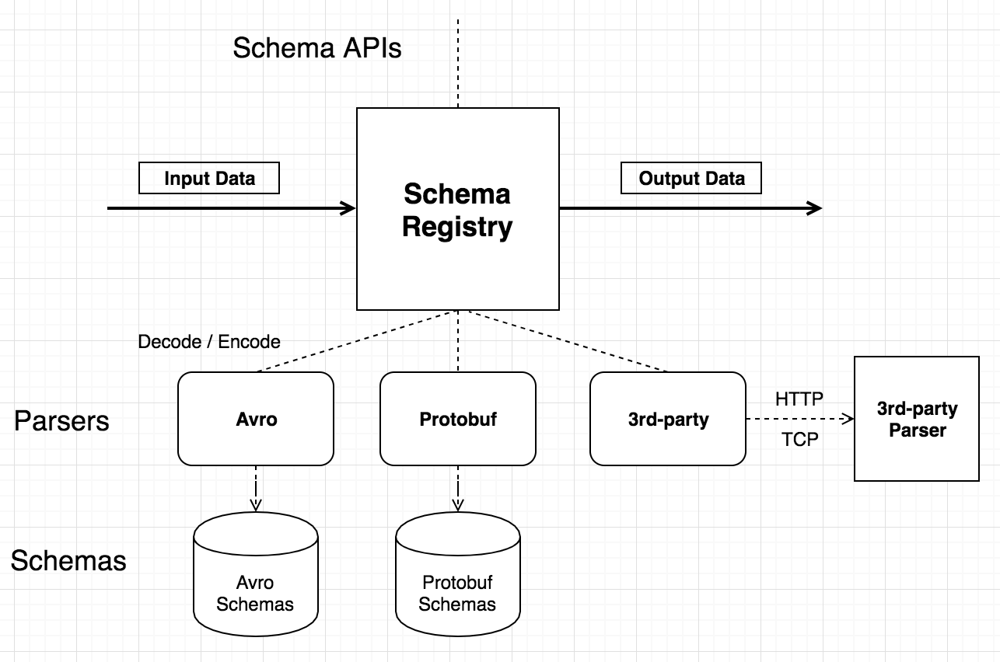

# 编解码

## 编解码（Schema Registry）介绍


物联网设备终端种类繁杂，各厂商使用的编码格式各异，所以在接入物联网平台的时候就产生了统一数据格式的需求，以便平台之上的应用进行设备管理。

Schema Registry 管理编解码使用的 Schema、处理编码或解码请求并返回结果。Schema Registry 配合规则引擎，可适配各种场景的设备接入和规则设计。

EMQ X Schema Registry 目前可支持三种格式的编解码：[Avro](https://avro.apache.org)，[Protobuf](https://developers.google.com/protocol-buffers/)，以及自定义编码。其中 
Avro 和 Protobuf 是依赖 Schema 的数据格式，编码后的数据为二进制，解码后为 Map 格式。解码后的数据可直接被规则引擎和其他插件使用。用户自定义的 (3rd-party)编解码服务通过 HTTP 或 TCP 回调的方式，进行更加贴近业务需求的编解码。


Schema Registry 为 Avro 和 Protobuf 等内置编码格式维护 Schema 文本，但对于自定义编解码
(3rd-party) 格式，如需要，Schema 文本需由编解码服务自己维护



## 数据格式

下图展示了 Schema Registry 的一个应用案例。多个设备上报不同格式的数据，经过 Schema Registry 解码之后，变为统一的内部格式，然后转发给后台应用。


### 二进制格式支持

Schema Registry 数据格式包括 [Avro](https://avro.apache.org) 和 [Protobuf](https://developers.google.com/protocol-buffers/)。Avro 和 Protobuf 是依赖 Schema 的数据格式，编码后的数据为二进制，使用 Schema Registry 解码后的内部数据格式(Map，稍后讲解) 可直接被规则引擎和其他插件使用。此外 Schema Registry 支持用户自定义的 (3rd-party) 编解码服务，通过 HTTP 或 TCP 回调的方式，进行更加贴近业务需求的编解码。

## 架构设计

Schema Registry 为 Avro 和 Protobuf 等内置编码格式维护 Schema 文本，但对于自定义编解码 (3rd-party) 格式，如需要 Schema，Schema 文本需由编解码服务自己维护。Schema API 提供了通过 Schema Name 的添加、查询和删除操作。

Schema Registry 既可以解码，也可以编码。编码和解码时需要指定 Schema Name。




编码调用示例：参数为 Schema

```c
schema_encode(SchemaName, Data) -> RawData
```

解码调用示例：

```c
schema_decode(SchemaName, RawData) -> Data
```

常见的使用案例是，使用规则引擎来调用 Schema Registry 提供的编码和解码接口，然后将编码或解码后的数据作为后续动作的输入。


## 编解码 + 规则引擎

EMQ X 的消息处理层面可分为消息路由(Messaging)、规则引擎(Rule Engine)、数据格式转换(Data Conversion) 三个部分。

EMQ X 的 PUB/SUB 系统将消息路由到指定的主题。规则引擎可以灵活地配置数据的业务规则，按规则匹配消息，然后指定相应动作。数据格式转换发生在规则匹配的过程之前，先将数据转换为可参与规则匹配的 Map 格式，然后进行匹配。


### 规则引擎内部数据格式(Map)

规则引擎内部使用的数据格式为 Erlang Map，所以如果原数据内容为二进制或者其他格式，必须使用编解码函数(比如上面提到的 schema_decode 和 json_decode 函数) 将其转换为 Map。

Map 是一个 Key-Value 形式的数据结构，形如 #{key => value}。例如，`user = #{id => 1, name => "Steve"} ` 定义了一个 `id` 为 `1`，`name` 为 `"Steve"` 的 `user` Map。

SQL 语句提供了 "." 操作符嵌套地提取和添加 Map 字段。下面是使用 SQL 语句对这个 Map 操作的示例:

```sql
SELECT user.id AS my_id
```

SQL 语句的筛选结果为 `#{my_id => 1}`。

### JSON 编解码

规则引擎的 SQL 语句提供了对 JSON 格式字符串的编解码支持，将 JSON 字符串和 Map 格式相互转换的 SQL 函数为 json_decode() 和 json_encode():

```sql
SELECT json_decode(payload) AS p FROM "message.publish" WHERE p.x = p.y, topic =~ "t/#"
```

上面这个 SQL 语句将会匹配到 payload 内容为 JSON 字符串： `{"x" = 1, "y" = 1}` , 并且 topic 为 `t/a` 的 MQTT 消息。

`json_decode(payload) as p` 将 JSON 字符串解码为下面的 Map 数据结构，从而可以在 `WHERE` 子句中使用 p.x 和 p.y 使用 Map 中的字段：

```erlang
#{
  p => #{
    x => 1,
    y => 1
  }
}
```

**注意:** `AS` 子句是必须的，将解码之后的数据赋值给某个Key，后面才能对其进行后续操作。

## 编解码实战

### Protobuf 数据解析举例

#### 规则需求

设备发布一个使用 Protobuf 编码的二进制消息，需要通过规则引擎匹配过后，将消息重新发布到与 "name" 字段相关的主题上。主题的格式为 "person/${name}"。

比如，将 "name" 字段为 "Shawn" 的消息重新发布到主题 "person/Shawn"。

#### 创建 Schema

在 EMQ X 的 [Dashboard](http://127.0.0.1:18083/#/schemas/0?oper=create) 界面，使用下面的参数创建一个 Protobuf Schema:

1. 名称：protobuf_person

2. 编解码类型：protobuf

3. Schema：下面的 protobuf schema 定义了一个 Person 消息。

```protobuf
message Person {
  required string name = 1;
  required int32 id = 2;
  optional string email = 3;
}
```

#### 创建规则

**使用刚才创建好的 Schema 来编写规则 SQL 语句：**

```sql
SELECT
  schema_decode('protobuf_person', payload, 'Person') as person, payload
FROM
  "message.publish"
WHERE
  topic =~ 't/#' and person.name = 'Shawn'
```

这里的关键点在于 `schema_decode('protobuf_person', payload, 'Person')`:

- `schema_decode` 函数将 payload 字段的内容按照 'protobuf_person' 这个 Schema 来做解码;
- `as person` 将解码后的值保存到变量 "person" 里;
- 最后一个参数 `Person` 指明了 payload 中的消息的类型是 protobuf schema 里定义的 'Person' 类型。

**然后使用以下参数添加动作：**

- 动作类型：消息重新发布
- 目的主题：person/${person.name}
- 消息内容模板：${person}

这个动作将解码之后的 "person" 以 JSON 的格式发送到 `person/${person.name}` 这个主题。其中`${person.name}` 是个变量占位符，将在运行时被替换为消息内容中 "name" 字段的值。

#### 设备端代码

规则创建好之后，就可以模拟数据进行测试了。

下面的代码使用 Python 语言填充了一个 Person 消息并编码为二进制数据，然后将其发送到 "t/1" 主题。详见 [完整代码](https://github.com/terry-xiaoyu/schema-registry-examples/blob/master/protobuf/pb2_mqtt.py)。

```python
def publish_msg(client):
    p = person_pb2.Person()
    p.id = 1
    p.name = "Shawn"
    p.email = "liuxy@emqx.io"
    message = p.SerializeToString()
    topic = "t/1"
    print("publish to topic: t/1, payload:", message)
    client.publish(topic, payload=message, qos=0, retain=False)
```

#### 检查规则执行结果

1) 在 Dashboard 的 [Websocket](http://127.0.0.1:18083/#/websocket) 工具里，登录一个 MQTT Client 并订阅 "person/#"。

2) 安装 python 依赖，并执行设备端代码:

```shell
$ pip3 install protobuf
$ pip3 install paho-mqtt

$ python3 ./pb2_mqtt.py
Connected with result code 0
publish to topic: t/1, payload: b'\n\x05Shawn\x10\x01\x1a\rliuxy@emqx.io'
t/1 b'\n\x05Shawn\x10\x01\x1a\rliuxy@emqx.io'
```

3) 检查 Websocket 端收到主题为 `person/Shawn` 的消息:

```bash
{"email":"liuxy@emqx.io","id":1,"name":"Shawn"}
```


### Avro 数据解析举例

#### 规则需求

设备发布一个使用 Avro 编码的二进制消息，需要通过规则引擎匹配过后，将消息重新发布到与 "name" 字段相关的主题上。主题的格式为 "avro_user/${name}"。

比如，将 "name" 字段为 "Shawn" 的消息重新发布到主题 "avro_user/Shawn"。

#### 创建 Schema

在 EMQ X 的 [Dashboard](http://127.0.0.1:18083/#/schemas/0?oper=create) 界面，使用下面的参数创建一个 Avro Schema:

1. 名称：avro_user

2. 编解码类型：avro

3. Schema:

```protobuf
{
"type":"record",
"fields":[
    {"name":"name", "type":"string"},
    {"name":"favorite_number", "type":["int", "null"]},
    {"name":"favorite_color", "type":["string", "null"]}
]
}
```

#### 创建规则

**使用刚才创建好的 Schema 来编写规则 SQL 语句：**

```sql
SELECT
  schema_decode('avro_user', payload) as avro_user, payload
FROM
  "message.publish"
WHERE
  topic =~ 't/#' and avro_user.name = 'Shawn'
```

这里的关键点在于 `schema_decode('avro_user', payload)`:

- `schema_decode` 函数将 payload 字段的内容按照 'avro_user' 这个 Schema 来做解码;
- `as avro_user` 将解码后的值保存到变量 "avro_user" 里。

**然后使用以下参数添加动作：**

- 动作类型：消息重新发布
- 目的主题：avro_user/${avro_user.name}
- 消息内容模板：${avro_user}

这个动作将解码之后的 "user" 以 JSON 的格式发送到 `avro_user/${avro_user.name}` 这个主题。其中`${avro_user.name}` 是个变量占位符，将在运行时被替换为消息内容中 "name" 字段的值。

#### 设备端代码

规则创建好之后，就可以模拟数据进行测试了。

下面的代码使用 Python 语言填充了一个 User 消息并编码为二进制数据，然后将其发送到 "t/1" 主题。详见 [完整代码](https://github.com/terry-xiaoyu/schema-registry-examples/blob/master/avro/avro_mqtt.py)。

```python
def publish_msg(client):
    datum_w = avro.io.DatumWriter(SCHEMA)
    buf = io.BytesIO()
    encoder = avro.io.BinaryEncoder(buf)
    datum_w.write({"name": "Shawn", "favorite_number": 666, "favorite_color": "red"}, encoder)
    message = buf.getvalue()
    topic = "t/1"
    print("publish to topic: t/1, payload:", message)
    client.publish(topic, payload=message, qos=0, retain=False)
```

#### 检查规则执行结果

1) 在 Dashboard 的 [Websocket](http://127.0.0.1:18083/#/websocket) 工具里，登录一个 MQTT Client 并订阅 "avro_user/#"。

2) 安装 python 依赖，并执行设备端代码:

```shell
$ pip3 install protobuf
$ pip3 install paho-mqtt

$ python3 avro_mqtt.py
Connected with result code 0
publish to topic: t/1, payload: b'\nShawn\x00\xb4\n\x00\x06red'
```

3) 检查 Websocket 端收到主题为 `avro_user/Shawn` 的消息:

```
{"favorite_color":"red","favorite_number":666,"name":"Shawn"}
```

### 自定义编解码举例

#### 规则需求

设备发布一个任意的消息，验证自部署的编解码服务能正常工作。

#### 创建 Schema

在 EMQ X 的 [Dashboard](http://127.0.0.1:18083/#/schemas/0?oper=create) 界面，使用下面的参数创建一个 3rd-Party Schema:

1. 名称：my_parser
2. 编解码类型：3rd-party
3. 第三方类型: HTTP
4. URL: http://127.0.0.1:9003/parser
5. 编解码配置: xor

其他配置保持默认。

上面第 5 项编解码配置是个可选项，是个字符串，内容跟编解码服务的业务相关。

#### 创建规则

**使用刚才创建好的 Schema 来编写规则 SQL 语句：**

```sql
SELECT
  schema_encode('my_parser', payload) as encoded_data,
  schema_decode('my_parser', encoded_data) as decoded_data
FROM
  "message.publish"
WHERE
  topic =~ 't/#'
```

这个 SQL 语句首先对数据做了 Encode，然后又做了 Decode，目的在于验证编解码过程是否正确:

- `schema_encode` 函数将 payload 字段的内容按照 'my_parser' 这个 Schema 来做编码，结果存储到 `encoded_data` 这个变量里;
- `schema_decode` 函数将 payload 字段的内容按照 'my_parser' 这个 Schema 来做解码，结果存储到 `decoded_data` 这个变量里;

最终这个 SQL 语句的筛选结果是 `encoded_data` 和 `decoded_data` 这两个变量。

**然后使用以下参数添加动作：**

- 动作类型：检查(调试)

这个检查动作会把 SQL 语句筛选的结果打印到 emqx 控制台 (erlang shell) 里。

如果是使用 emqx console 启动的服务，打印会直接显示在控制台里；如果是使用 emqx start 启动的服务，打印会输出到日志目录下的 erlang.log.N 文件里，这里 "N" 为整数，比如 "erlang.log.1", "erlang.log.2"。

#### 编解码服务端代码

规则创建好之后，就可以模拟数据进行测试了。所以首先需要编写一个自己的编解码服务。

下面的代码使用 Python 语言实现了一个 HTTP 编解码服务，为简单起见，这个服务提供两种简单的方式来进行编解码(加解密)，详见 [完整代码](https://github.com/terry-xiaoyu/schema-registry-examples/blob/master/3rd_party/http_parser_server.py):

- 按位异或
- 字符替换

```python
def xor(data):
  """
  >>> xor(xor(b'abc'))
  b'abc'
  >>> xor(xor(b'!}~*'))
  b'!}~*'
  """
  length = len(data)
  bdata = bytearray(data)
  bsecret = bytearray(secret * length)
  result = bytearray(length)
  for i in range(length):
    result[i] = bdata[i] ^ bsecret[i]
  return bytes(result)

def subst(dtype, data, n):
  """
  >>> subst('decode', b'abc', 3)
  b'def'
  >>> subst('decode', b'ab~', 1)
  b'bc!'
  >>> subst('encode', b'def', 3)
  b'abc'
  >>> subst('encode', b'bc!', 1)
  b'ab~'
  """
  adata = array.array('B', data)
  for i in range(len(adata)):
    if dtype == 'decode':
      adata[i] = shift(adata[i], n)
    elif dtype == 'encode':
      adata[i] = shift(adata[i], -n)
  return bytes(adata)
```

将这个服务运行起来:

```shell
$ pip3 install flask
$ python3 http_parser_server.py
 * Serving Flask app "http_parser_server" (lazy loading)
 * Environment: production
   WARNING: This is a development server. Do not use it in a production deployment.
   Use a production WSGI server instead.
 * Debug mode: off
 * Running on http://127.0.0.1:9003/ (Press CTRL+C to quit)
```

#### 检查规则执行结果

由于本示例比较简单，我们直接使用 MQTT Websocket 客户端来模拟设备端发一条消息。

1) 在 Dashboard 的 [Websocket](http://127.0.0.1:18083/#/websocket) 工具里，登录一个 MQTT Client 并发布一条消息到 "t/1"，内容为 "hello"。

2) 检查 emqx 控制台 (erlang shell) 里的打印:

```bash
(emqx@127.0.0.1)1> [inspect]
        Selected Data: #{decoded_data => <<"hello">>,
                         encoded_data => <<9,4,13,13,14>>}
        Envs: #{event => 'message.publish',
                flags => #{dup => false,retain => false},
                from => <<"mqttjs_76e5a35b">>,
                headers =>
                    #{allow_publish => true,
                      peername => {{127,0,0,1},54753},
                      username => <<>>},
                id => <<0,5,146,30,146,38,123,81,244,66,0,0,62,117,0,1>>,
                node => 'emqx@127.0.0.1',payload => <<"hello">>,qos => 0,
                timestamp => {1568,34882,222929},
                topic => <<"t/1">>}
        Action Init Params: #{}
```

Select Data 是经过 SQL 语句筛选之后的数据，Envs 是规则引擎内部可用的环境变量，Action Init Params 是动作的初始化参数。这三个数据均为 `Map` 格式。

Selected Data 里面的两个字段 `decoded_data` 和 `encoded_data` 对应 SELECT 语句里面的两个 AS。因为 `decoded_data` 是编码然后再解码之后的结果，所以它又被还原为了我们发送的内容 "hello"，表明编解码插件工作正常。