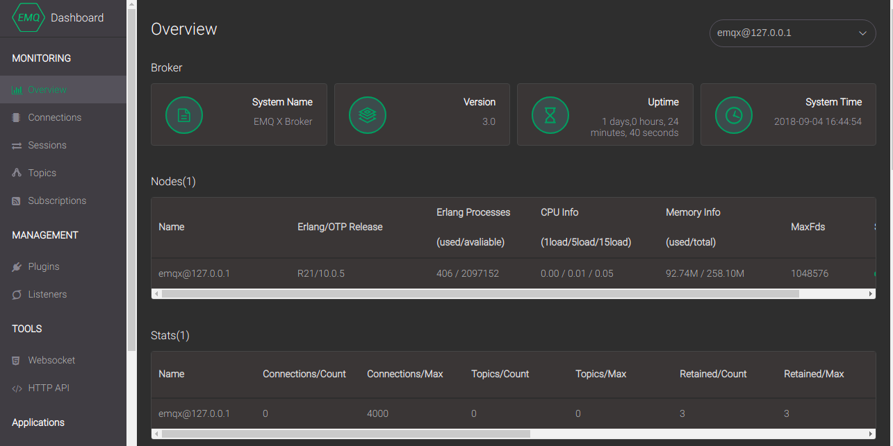

.. _getstarted:

====================
开始使用(GetStarted)
====================

--------------------
emqttd消息服务器简介
--------------------

emqttd(Erlang MQTT Broker)是采用Erlang语言开发的开源MQTT消息服务器。Erlang/OTP是出色的软实时(Soft-Realtime)、低延时(Low-Latency)、分布式(Distributed)的语言平台。MQTT是轻量的(Lightweight)、发布订阅模式(PubSub)的物联网消息协议。

emqttd设计目标是承载移动终端或物联网终端大量的MQTT连接，并实现在大量终端间快速低延时(Low-Latency)消息路由:

1. 稳定承载大规模的MQTT客户端连接，单服务器节点支持50万到100万连接。

2. 分布式节点集群，快速低延时的消息路由，单集群支持1000万规模的路由。

3. 消息服务器内扩展，支持定制多种认证方式、高效存储消息到后端数据库。

4. 完整支持MQTT V3.1.1协议，扩展支持WebSocket、CoAP或私有TCP等多协议。

--------------------
MQTT发布订阅模式简述
--------------------

MQTT是发布订阅(Publish/Subscribe)模式的消息协议，与HTTP协议请求响应(Request/Response)模式不同。

MQTT发布者与订阅者之间通过"主题"(Topic)进行消息路由，主题(Topic)格式类似Unix文件路径，例如::

    sensor/1/temperature

    chat/room/subject

    presence/user/feng

    sensor/1/#

    sensor/+/temperature

    uber/drivers/joe/inbox

MQTT主题(Topic)支持'+', '#'的通配符，'+'通配一个层级，'#'通配多个层级(必须在末尾)。

MQTT消息发布者(Publisher)只能向特定'名称主题'(不支持通配符)发布消息，订阅者(Subscriber)通过订阅'过滤主题'(支持通配符)来匹配消息。

.. NOTE::

    初接触MQTT协议的用户，通常会向通配符的'过滤主题'发布广播消息，MQTT协议不支持这种模式，需从订阅侧设计广播主题(Topic)。
    例如Android推送，向所有广州用户，推送某类本地消息，客户端获得GIS位置后，可订阅'news/city/guangzhou'主题。

--------------------------
五分钟下载启动emqttd
--------------------------

emqttd消息服务器每个版本，会发布Ubuntu、CentOS、FreeBSD、Mac OS X、Windows平台的程序包。

下载地址: http://emqtt.com/downloads

程序包下载后，可直接解压启动运行，例如Mac平台:

.. code-block:: bash

    unzip emqttd-macosx-1.1-beta-20160601.zip && cd emqttd

    # 启动emqttd
    ./bin/emqttd start

    # 检查运行状态
    ./bin/emqttd_ctl status

    # 停止emqttd
    ./bin/emqttd stop

emqttd消息服务默认采用匿名认证，启动后MQTT客户端可连接1883端口，启动运行日志输出在log/目录。

---------------
源码编译emqttd
---------------

.. code-block:: bash

    git clone https://github.com/emqtt/emqttd.git

    cd emqttd && make && make dist

--------------------------
Web管理控制台(Dashboard)
--------------------------

emqttd消息服务器启动后，会默认加载Dashboard插件，启动Web管理控制台。用户可通过Web控制台，
查看服务器运行状态、统计数据、客户端(Client)、会话(Session)、主题(Topic)、订阅(Subscription)。

控制台地址: http://127.0.0.1:18083，默认用户: admin，密码：public

------------------------
emqttd消息服务器功能列表
------------------------

* 完整的MQTT V3.1/V3.1.1协议规范支持
* QoS0, QoS1, QoS2消息支持
* 持久会话与离线消息支持
* Retained消息支持
* Last Will消息支持
* TCP/SSL连接支持
* MQTT/WebSocket(SSL)支持
* HTTP消息发布接口支持
* $SYS/#系统主题支持
* 客户端在线状态查询与订阅支持
* 客户端ID或IP地址认证支持
* 用户名密码认证支持
* LDAP认证
* Redis、MySQL、PostgreSQL、HTTP认证集成
* 浏览器Cookie认证
* 基于客户端ID、IP地址、用户名的访问控制(ACL)
* 多服务器节点集群(Cluster)
* 多服务器节点桥接(Bridge)
* mosquitto桥接支持
* Stomp协议支持
* Stomp/SockJS支持
* 通过Paho兼容性测试

------------------------
emqttd扩展模块与插件列表
------------------------

扩展模块(Module)
----------------

+-------------------------+-----------------------------------+
| emqttd_auth_clientid    | ClientId认证                      |
+-------------------------+-----------------------------------+
| emqttd_auth_username    | 用户名密码认证                    |
+-------------------------+-----------------------------------+
| emqttd_auth_ldap        | LDAP认证                          |
+-------------------------+-----------------------------------+
| emqttd_mod_presence     | 客户端上下线状态消息发布          |
+-------------------------+-----------------------------------+
| emqttd_mod_subscription | 客户端上线自动主题订阅            |
+-------------------------+-----------------------------------+
| emqttd_mod_rewrite      | 重写客户端订阅主题(Topic)         |
+-------------------------+-----------------------------------+

扩展模块通过'etc/emqttd.config'配置文件的auth, modules段落启用。

例如启用用户名密码认证::

    {access, [
        %% Authetication. Anonymous Default
        {auth, [
            %% Authentication with username, password
            {username, []},

            ...

启用客户端状态发布模块::

    {modules, [
        %% Client presence management module.
        %% Publish messages when client connected or disconnected
        {presence, [{qos, 0}]}

扩展插件(Plugin)
----------------

+----------------------------+-----------------------------------+
| `emqttd_plugin_template`_  | 插件模版与演示代码                |
+----------------------------+-----------------------------------+
| `emqttd_dashboard`_        | Web管理控制台，默认加载           |
+----------------------------+-----------------------------------+
| `emqttd_auth_http`_        | HTTP认证插件                      |
+----------------------------+-----------------------------------+
| `emqttd_plugin_mysql`_     | MySQL认证插件                     |
+----------------------------+-----------------------------------+
| `emqttd_plugin_pgsql`_     | PostgreSQL认证插件                |
+----------------------------+-----------------------------------+
| `emqttd_plugin_redis`_     | Redis认证插件                     |
+----------------------------+-----------------------------------+
| `emqttd_plugin_mongo`_     | MongoDB认证插件                   |
+----------------------------+-----------------------------------+
| `emqttd_stomp`_            | Stomp协议插件                     |
+----------------------------+-----------------------------------+
| `emqttd_sockjs`_           | SockJS插件                        |
+----------------------------+-----------------------------------+
| `emqttd_recon`_            | Recon优化调测插件                 |
+----------------------------+-----------------------------------+

扩展插件通过'bin/emqttd_ctl'管理命令行，加载启动运行。

例如启用PostgreSQL认证插件::

    ./bin/emqttd_ctl plugins load emqttd_plugin_pgsql

--------------------
100万线连接测试说明
--------------------

.. NOTE::

    emqttd消息服务器默认设置，允许最大客户端连接是512，因为大部分操作系统'ulimit -n'限制为1024。

emqttd消息服务器当前版本，连接压力测试到130万线，8核心/32G内存的CentOS云服务器。

操作系统内核参数、TCP协议栈参数、Erlang虚拟机参数、emqttd最大允许连接数设置简述如下：

Linux操作系统参数
-----------------

# 2M - 系统所有进程可打开的文件数量::

    sysctl -w fs.file-max=2097152
    sysctl -w fs.nr_open=2097152

# 1M - 系统允许当前进程打开的文件数量::

    ulimit -n 1048576

TCP协议栈参数
-------------

# backlog - Socket监听队列长度::

    sysctl -w net.core.somaxconn=65536

Erlang虚拟机参数
-----------------

emqttd/etc/vm.args::

    ## max process numbers
    +P 2097152

    ## Sets the maximum number of simultaneously existing ports for this system
    +Q 1048576

    ## Increase number of concurrent ports/sockets
    -env ERL_MAX_PORTS 1048576

    -env ERTS_MAX_PORTS 1048576

emqttd最大允许连接数
---------------------

emqttd/etc/emqttd.config::

        {mqtt, 1883, [
            %% Size of acceptor pool
            {acceptors, 64},

            %% Maximum number of concurrent clients
            {max_clients, 1000000},

            %% Socket Access Control
            {access, [{allow, all}]},

            %% Connection Options
            {connopts, [
                %% Rate Limit. Format is 'burst, rate', Unit is KB/Sec
                %% {rate_limit, "100,10"} %% 100K burst, 10K rate
            ]},
            ...

测试客户端设置
--------------

测试客户端在一个接口上，最多只能创建65000连接::

    sysctl -w net.ipv4.ip_local_port_range="500 65535"
    echo 1000000 > /proc/sys/fs/nr_open

按应用场景测试
--------------

MQTT是一个设计得非常出色的传输层协议，在移动消息、物联网、车联网、智能硬件甚至能源勘探等领域有着广泛的应用。1个字节报头、2个字节心跳、消息QoS支持等设计，非常适合在低带宽、不可靠网络、嵌入式设备上应用。

不同的应用有不同的系统要求，用户使用emqttd消息服务器前，可以按自己的应用场景进行测试，而不是简单的连接压力测试:

1. Android消息推送: 推送消息广播测试。

2. 移动即时消息应用: 消息收发确认测试。

3. 智能硬件应用: 消息的往返时延测试。

4. 物联网数据采集: 并发连接与吞吐测试。

-----------------------
emqtt开源MQTT客户端项目
-----------------------

GitHub: https://github.com/emqtt

+--------------------+----------------------+
| `emqttc`_          | Erlang MQTT客户端库  |
+--------------------+----------------------+
| `emqtt_benchmark`_ | MQTT连接测试工具     |
+--------------------+----------------------+
| `CocoaMQTT`_       | Swift语言MQTT客户端库|
+--------------------+----------------------+
| `QMQTT`_           | QT框架MQTT客户端库   |
+--------------------+----------------------+

.. _emqttc: https://github.com/emqtt/emqttc
.. _emqtt_benchmark: https://github.com/emqtt/emqtt_benchmark
.. _CocoaMQTT: https://github.com/emqtt/CocoaMQTT
.. _QMQTT: https://github.com/emqtt/qmqtt

.. _emqttd_plugin_template: https://github.com/emqtt/emqttd_plugin_template
.. _emqttd_dashboard:       https://github.com/emqtt/emqttd_dashboard
.. _emqttd_auth_http:       https://github.com/emqtt/emqttd_auth_http
.. _emqttd_plugin_mysql:    https://github.com/emqtt/emqttd_plugin_mysql
.. _emqttd_plugin_pgsql:    https://github.com/emqtt/emqttd_plugin_pgsql
.. _emqttd_plugin_redis:    https://github.com/emqtt/emqttd_plugin_redis
.. _emqttd_plugin_mongo:    https://github.com/emqtt/emqttd_plugin_mongo
.. _emqttd_stomp:           https://github.com/emqtt/emqttd_stomp
.. _emqttd_sockjs:          https://github.com/emqtt/emqttd_sockjs
.. _emqttd_recon:           https://github.com/emqtt/emqttd_recon
