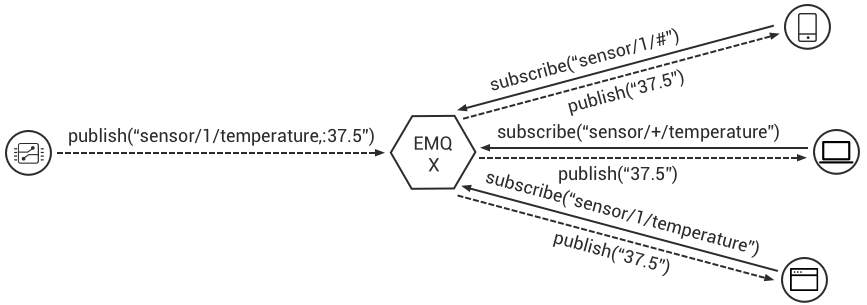
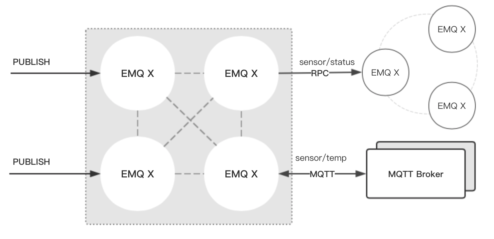

.. _guide:

用户指南 (User Guide)
^^^^^^^^^^^^^^^^^^^^^^

.. _start:

程序启动
---------

下载地址: https://www.emqx.io/downloads/broker?osType=Linux

程序包下载后，可直接解压启动运行，例如 macOS 平台:

.. code-block:: bash

    unzip emqx-macosx-v4.0.0.zip && cd emqx

    # 启动emqx
    ./bin/emqx start

    # 检查运行状态
    ./bin/emqx_ctl status

*EMQ X* 消息服务器默认占用的 TCP 端口包括:

+-----------+-----------------------------------+
| 1883      | MQTT 协议端口                     |
+-----------+-----------------------------------+
| 8883      | MQTT/SSL 端口                     |
+-----------+-----------------------------------+
| 8083      | MQTT/WebSocket 端口               |
+-----------+-----------------------------------+
| 8081      | HTTP API 端口                     |
+-----------+-----------------------------------+
| 18083     | Dashboard 管理控制台端口          |
+-----------+-----------------------------------+

.. _pubsub:

MQTT 发布订阅
-------------

MQTT 是为移动互联网、物联网设计的轻量发布订阅模式的消息服务器，目前支持 MQTT `v3.1.1 <http://docs.oasis-open.org/mqtt/mqtt/v3.1.1/mqtt-v3.1.1.html>`_ 和 `v5.0 <http://docs.oasis-open.org/mqtt/mqtt/v5.0/mqtt-v5.0.html>`_:

*EMQ X* 启动后，任何设备或终端可通过 MQTT 协议连接到服务器，通过 **发布(Publish)/订阅(Subscribe)** 进行交换消息。

MQTT 客户端库: https://github.com/mqtt/mqtt.github.io/wiki/libraries

例如，mosquitto_sub/pub 命令行发布订阅消息::

    mosquitto_sub -h 127.0.0.1 -p 1883 -t topic -q 2
    mosquitto_pub -h 127.0.0.1 -p 1883 -t topic -q 1 -m "Hello, MQTT!"

.. _authentication:

认证/访问控制
-------------

**EMQ X** 消息服务器 *连接认证* 和 *访问控制* 由一系列的认证插件(Plugins)提供，他们的命名都符合 ``emqx_auth_<name>`` 的规则。

在 EMQ X 中，这两个功能分别是指：

1. **连接认证**: *EMQ X* 校验每个连接上的客户端是否具有接入系统的权限，若没有则会断开该连接
2. **访问控制**: *EMQ X* 校验客户端每个 *发布(Publish)/订阅(Subscribe)* 的权限，以 *允许/拒绝* 相应操作

认证(Authentication)
>>>>>>>>>>>>>>>>>>>>>

*EMQ X* 消息服务器认证由一系列认证插件(Plugins)提供，系统支持按用户名密码、ClientID 或匿名认证。

系统默认开启匿名认证(Anonymous)，通过加载认证插件可开启的多个认证模块组成认证链:

.. image:: _static/images/guide_2.png

**开启匿名认证**

etc/emqx.conf 配置启用匿名认证:

.. code:: properties

    允许匿名访问
    ## Value: true | false
    allow_anonymous = true

.. _acl:

访问控制(ACL)
>>>>>>>>>>>>>

*EMQ X* 消息服务器通过 ACL(Access Control List) 实现 MQTT 客户端访问控制。

ACL 访问控制规则定义::

    允许(Allow)|拒绝(Deny) 谁(Who) 订阅(Subscribe)|发布(Publish) 主题列表(Topics)

MQTT 客户端发起订阅/发布请求时，EMQ X 消息服务器的访问控制模块会逐条匹配 ACL 规则，直到匹配成功为止:

.. image:: _static/images/guide_3.png

**默认访问控制设置**

*EMQ X* 消息服务器默认访问控制，在 etc/emqx.conf 中设置:

.. code:: properties

    ## 设置所有 ACL 规则都不能匹配时是否允许访问
    ## Value: allow | deny
    acl_nomatch = allow

    ## 设置存储 ACL 规则的默认文件
    ## Value: File Name
    acl_file = etc/acl.conf

ACL 规则定义在 etc/acl.conf，EMQ X 启动时加载到内存:

.. code:: erlang

    %% 允许 'dashboard' 用户订阅 '$SYS/#'
    {allow, {user, "dashboard"}, subscribe, ["$SYS/#"]}.

    %% 允许本机用户发布订阅全部主题
    {allow, {ipaddr, "127.0.0.1"}, pubsub, ["$SYS/#", "#"]}.

    %% 拒绝除本机用户以外的其他用户订阅 '$SYS/#' 与 '#' 主题
    {deny, all, subscribe, ["$SYS/#", {eq, "#"}]}.

    %% 允许上述规则以外的任何情形
    {allow, all}.

EMQ X 提供的认证插件包括:

+----------------------------+---------------------------+
| 插件                       | 说明                      |
+============================+===========================+
| `emqx_auth_clientid`_      | ClientId 认证/鉴权插件    |
+----------------------------+---------------------------+
| `emqx_auth_username`_      | 用户名密码认证/鉴权插件   |
+----------------------------+---------------------------+
| `emqx_auth_jwt`_           | JWT 认证/鉴权插件         |
+----------------------------+---------------------------+
| `emqx_auth_ldap`_          | LDAP 认证/鉴权插件        |
+----------------------------+---------------------------+
| `emqx_auth_http`_          | HTTP 认证/鉴权插件        |
+----------------------------+---------------------------+
| `emqx_auth_mysql`_         | MySQ L认证/鉴权插件       |
+----------------------------+---------------------------+
| `emqx_auth_pgsql`_         | Postgre 认证/鉴权插件     |
+----------------------------+---------------------------+
| `emqx_auth_redis`_         | Redis 认证/鉴权插件       |
+----------------------------+---------------------------+
| `emqx_auth_mongo`_         | MongoDB 认证/鉴权插件     |
+----------------------------+---------------------------+

其中，关于每个认证插件的配置及用法，可参考 `扩展插件 (Plugins) <https://docs.emqx.io/broker/v3/cn/plugins.html>`_ 关于认证部分。

.. note:: auth 插件可以同时启动多个。每次检查的时候，按照优先级从高到低依次检查，同一优先级的，先启动的插件先检查。

此外 *EMQ X* 还支持使用 **PSK (Pre-shared Key)** 的方式来控制客户端的接入，但它并不是使用的上述的 *连接认证* 链的方式，而是在 SSL 握手期间进行验证。详情参考 `Pre-shared Key <https://en.wikipedia.org/wiki/Pre-shared_key>`_ 和 `emqx_psk_file`_

.. _shared_sub:

共享订阅 (Shared Subscription)
-------------------------------

*EMQ X* R3.0 版本开始支持集群级别的共享订阅功能。共享订阅(Shared Subscription)支持多种消息派发策略:

.. image:: ./_static/images/guide_4.png

共享订阅支持两种使用方式:

+-----------------+-------------------------------------------+
|  订阅前缀       | 使用示例                                  |
+-----------------+-------------------------------------------+
| $queue/         | mosquitto_sub -t '$queue/topic'           |
+-----------------+-------------------------------------------+
| $share/<group>/ | mosquitto_sub -t '$share/group/topic'     |
+-----------------+-------------------------------------------+

示例::

    mosquitto_sub -t '$share/group/topic'

    mosquitto_pub -t 'topic' -m msg -q 2

*EMQ X* 通过 `etc/emqx.conf` 中的 `broker.shared_subscription_strategy` 字段配置共享消息的派发策略。

目前支持按以下几种策略派发消息：

+---------------------------+-------------------------+
| 策略                      | 说明                    |
+===========================+=========================+
| random                    | 在所有共享订阅者中随机  |
+---------------------------+-------------------------+
| round_robin               | 按订阅顺序              |
+---------------------------+-------------------------+
| sticky                    | 使用上次派发的订阅者    |
+---------------------------+-------------------------+
| hash                      | 根据发送者的 ClientId   |
+---------------------------+-------------------------+

.. note:: 当所有的订阅者都不在线时，仍会挑选一个订阅者，并存至其 Session 的消息队列中

.. _guide_bridge:

节点桥接 (Bridge)
------------------

EMQ X 节点间桥接
>>>>>>>>>>>>>>>>>

**桥接** 的概念是 EMQ X 支持将自身某类主题的消息通过某种方式转发到另一个 MQTT Broker。

**桥接** 与 **集群** 的不同在于：桥接不会复制主题树与路由表，只根据桥接规则转发 MQTT 消息。

目前 EMQ X 支持的桥接方式有:

- RPC 桥接：RPC 桥接只能在 EMQ X Broker 间使用，且不支持订阅远程节点的主题去同步数据
- MQTT 桥接：MQTT 桥接同时支持转发和通过订阅主题来实现数据同步两种方式

其概念如下图所示:

此外 *EMQ X* 消息服务器支持多节点桥接模式互联:

在 EMQ X 中，通过修改 ``etc/plugins/emqx_bridge_mqtt.conf`` 来配置 bridge。EMQ X 根据不同的 name 来区分不同的 bridge。例如::

    ## Bridge address: node name for local bridge, host:port for remote.
    bridge.mqtt.aws.address = 127.0.0.1:1883

该项配置声明了一个名为 ``aws`` 的 bridge 并指定以 MQTT 的方式桥接到 ``127.0.0.1:1883`` 这台 MQTT 服务器

在需要创建多个 bridge 时，可以先复制其全部的配置项，在通过使用不同的 name 来标示（比如 bridge.mqtt.$name.address 其中 $name 指代的为 bridge 的名称）

接下来两个小节，表述了如何创建 RPC/MQTT 方式的桥接，并创建一条转发传感器(sensor)主题消息的转发规则。假设在两台主机上启动了两个 EMQ X 节点：

+---------+---------------------+-----------+
| 名称    | 节点                | MQTT 端口 |
+---------+---------------------+-----------+
| emqx1   | emqx1@192.168.1.1   | 1883      |
+---------+---------------------+-----------+
| emqx2   | emqx2@192.168.1.2   | 1883      |
+---------+---------------------+-----------+

EMQ X 节点 RPC 桥接配置
>>>>>>>>>>>>>>>>>>>>>>>

以下是 RPC 桥接的基本配置，最简单的 RPC 桥接只需要配置以下三项就可以了::

    ## 桥接地址： 使用节点名（nodename@host）则用于 RPC 桥接，使用 host:port 用于 MQTT 连接
    bridge.mqtt.emqx2.address = emqx2@192.168.1.2

    ## 转发消息的主题
    bridge.mqtt.emqx2.forwards = sensor1/#,sensor2/#

    ## 桥接的 mountpoint(挂载点)
    bridge.mqtt.emqx2.mountpoint = bridge/emqx2/${node}/

forwards 用于指定桥接的主题。所有发到 forwards 指定主题上的消息都会被转发到远程节点上。

mountpoint 用于在转发消息时加上主题前缀。例如，以上配置中，主题为 `sensor1/hello` 的消息，EMQ X 将其转发到对端节点时，会将主题变为 `bridge/emqx2/emqx1@192.168.1.1/sensor1/hello`。

RPC 桥接的特点：

1. RPC 桥接只能将本地的消息转发到远程桥接节点上，无法将远程桥接节点的消息同步到本地节点上；

2. RPC 桥接只能将两个 EMQ X 桥接在一起，无法桥接 EMQ X 到其他的 MQTT Broker 上；

3. RPC 桥接不涉及 MQTT 协议编解码，效率高于 MQTT 桥接。

EMQ X 节点 MQTT 桥接配置
>>>>>>>>>>>>>>>>>>>>>>>>>

EMQ X 可以通过 MQTT Bridge 去订阅远程 MQTT Broker 的主题，再将远程 MQTT Broker 的消息同步到本地。

EMQ X 的 MQTT Bridge 原理: 作为 MQTT 客户端连接到远程的 MQTT Broker，因此在 MQTT Bridge 的配置中，需要设置 MQTT 客户端连接时所需要的字段：

::

    ## 桥接地址
    bridge.mqtt.emqx2.address = 192.168.1.2:1883

    ## 桥接的协议版本
    ## 枚举值: mqttv3 | mqttv4 | mqttv5
    bridge.mqtt.emqx2.proto_ver = mqttv4

    ## 客户端的 clientid
    bridge.mqtt.emqx2.clientid = bridge_emq

    ## 客户端的 clean_start 字段
    ## 注: 有些 MQTT Broker 需要将 clean_start 值设成 `true`
    bridge.mqtt.emqx2.clean_start = true

    ## 客户端的 username 字段
    bridge.mqtt.emqx2.username = user

    ## 客户端的 password 字段
    bridge.mqtt.emqx2.password = passwd

    ## 客户端是否使用 ssl 来连接远程服务器
    bridge.mqtt.emqx2.ssl = off

    ## 客户端 SSL 连接的 CA 证书 (PEM格式)
    bridge.mqtt.emqx2.cacertfile = etc/certs/cacert.pem

    ## 客户端 SSL 连接的 SSL 证书
    bridge.mqtt.emqx2.certfile = etc/certs/client-cert.pem

    ## 客户端 SSL 连接的密钥文件
    bridge.mqtt.emqx2.keyfile = etc/certs/client-key.pem

    ## SSL 加密方式
    bridge.mqtt.emqx2.ciphers = ECDHE-ECDSA-AES256-GCM-SHA384,ECDHE-RSA-AES256-GCM-SHA384

    ## TLS PSK 的加密套件
    ## 注意 'listener.ssl.external.ciphers' 和 'listener.ssl.external.psk_ciphers' 不能同时配置
    ##
    ## See 'https://tools.ietf.org/html/rfc4279#section-2'.
    ## bridge.mqtt.emqx2.psk_ciphers = PSK-AES128-CBC-SHA,PSK-AES256-CBC-SHA,PSK-3DES-EDE-CBC-SHA,PSK-RC4-SHA

    ## 客户端的心跳间隔
    bridge.mqtt.emqx2.keepalive = 60s

    ## 支持的 TLS 版本
    bridge.mqtt.emqx2.tls_versions = tlsv1.2,tlsv1.1,tlsv1

    ## 需要被转发的消息的主题
    bridge.mqtt.emqx2.forwards = sensor1/#,sensor2/#

    ## 挂载点(mountpoint)
    bridge.mqtt.emqx2.mountpoint = bridge/emqx2/${node}/

    ## 订阅对端的主题
    bridge.mqtt.emqx2.subscription.1.topic = cmd/topic1

    ## 订阅对端主题的 QoS
    bridge.mqtt.emqx2.subscription.1.qos = 1

    ## 桥接的重连间隔
    ## 默认: 30秒
    bridge.mqtt.emqx2.reconnect_interval = 30s

    ## QoS1/QoS2 消息的重传间隔
    bridge.mqtt.emqx2.retry_interval = 20s

    ## Inflight 大小.
    bridge.mqtt.emqx2.max_inflight_batches = 32

EMQ X 桥接缓存配置
>>>>>>>>>>>>>>>>>>

EMQ X 的 Bridge 拥有消息缓存机制，缓存机制同时适用于 RPC 桥接和 MQTT 桥接，当 Bridge 断开（如网络连接不稳定的情况）时，可将 forwards 主题的消息缓存到本地的消息队列上。等到桥接恢复时，再把消息重新转发到远程节点上。关于缓存队列的配置如下：

::

    ## emqx_bridge 内部用于 batch 的消息数量
    bridge.mqtt.emqx2.queue.batch_count_limit = 32

    ## emqx_bridge 内部用于 batch 的消息字节数
    bridge.mqtt.emqx2.queue.batch_bytes_limit = 1000MB

    ## 放置 replayq 队列的路径，如果没有在配置中指定该项，那么 replayq
    ## 将会以 `mem-only` 的模式运行，消息不会缓存到磁盘上。
    bridge.mqtt.emqx2.queue.replayq_dir = data/emqx_emqx2_bridge/

    ## Replayq 数据段大小
    bridge.mqtt.emqx2.queue.replayq_seg_bytes = 10MB

``bridge.mqtt.emqx2.queue.replayq_dir`` 是用于指定 bridge 存储队列的路径的配置参数。

``bridge.mqtt.emqx2.queue.replayq_seg_bytes`` 是用于指定缓存在磁盘上的消息队列的最大单个文件的大小，如果消息队列大小超出指定值的话，会创建新的文件来存储消息队列。

EMQ X 桥接的命令行使用
>>>>>>>>>>>>>>>>>>>>>>

启动 emqx_bridge_mqtt 插件:

.. code-block:: bash

    $ cd emqx1/ && ./bin/emqx_ctl plugins load emqx_bridge_mqtt
    ok

桥接 CLI 命令：

.. code-block:: bash

    $ cd emqx1/ && ./bin/emqx_ctl bridges
    bridges list                                    # List bridges
    bridges start <Name>                            # Start a bridge
    bridges stop <Name>                             # Stop a bridge
    bridges forwards <Name>                         # Show a bridge forward topic
    bridges add-forward <Name> <Topic>              # Add bridge forward topic
    bridges del-forward <Name> <Topic>              # Delete bridge forward topic
    bridges subscriptions <Name>                    # Show a bridge subscriptions topic
    bridges add-subscription <Name> <Topic> <Qos>   # Add bridge subscriptions topic

列出全部 bridge 状态

.. code-block:: bash

    $ ./bin/emqx_ctl bridges list
    name: emqx     status: Stopped

启动指定 bridge

.. code-block:: bash

    $ ./bin/emqx_ctl bridges start emqx
    Start bridge successfully.

停止指定 bridge

.. code-block:: bash

    $ ./bin/emqx_ctl bridges stop emqx
    Stop bridge successfully.

列出指定 bridge 的转发主题

.. code-block:: bash

    $ ./bin/emqx_ctl bridges forwards emqx
    topic:   topic1/#
    topic:   topic2/#

添加指定 bridge 的转发主题

.. code-block:: bash

    $ ./bin/emqx_ctl bridges add-forwards emqx 'topic3/#'
    Add-forward topic successfully.

删除指定 bridge 的转发主题

.. code-block:: bash

    $ ./bin/emqx_ctl bridges del-forwards emqx 'topic3/#'
    Del-forward topic successfully.

列出指定 bridge 的订阅

.. code-block:: bash

    $ ./bin/emqx_ctl bridges subscriptions emqx
    topic: cmd/topic1, qos: 1
    topic: cmd/topic2, qos: 1

添加指定 bridge 的订阅主题

.. code-block:: bash

    $ ./bin/emqx_ctl bridges add-subscription emqx 'cmd/topic3' 1
    Add-subscription topic successfully.

删除指定 bridge 的订阅主题

.. code-block:: bash

    $ ./bin/emqx_ctl bridges del-subscription emqx 'cmd/topic3'
    Del-subscription topic successfully.

注: 如果有创建多个 Bridge 的需求，需要复制默认的 Bridge 配置，再拷贝到 emqx_bridge_mqtt.conf 中，根据需求重命名 bridge.mqtt.${name}.config 中的 name 即可。

.. _http_publish:

HTTP 发布接口
-------------

*EMQ X* 消息服务器提供了一个 HTTP 发布接口，应用服务器或 Web 服务器可通过该接口发布 MQTT 消息::

    HTTP POST http://host:8080/api/v3/mqtt/publish

Web 服务器例如 PHP/Java/Python/NodeJS 或 Ruby on Rails，可通过 HTTP POST 请求发布 MQTT 消息:

.. code:: bash

    curl -v --basic -u user:passwd -H "Content-Type: application/json" -d \
    '{"qos":1, "retain": false, "topic":"world", "payload":"test" , "clientid": "C_1492145414740"}' \-k http://localhost:8080/api/v3/mqtt/publish

HTTP 接口参数:

+----------+----------------------+
| 参数     | 说明                 |
+==========+======================+
| clientid | MQTT 客户端 ID       |
+----------+----------------------+
| qos      | QoS: 0 | 1 | 2       |
+----------+----------------------+
| retain   | Retain: true | false |
+----------+----------------------+
| topic    | 主题(Topic)          |
+----------+----------------------+
| payload  | 消息载荷             |
+----------+----------------------+

.. NOTE::

    HTTP 发布接口采用 `Basic <https://en.wikipedia.org/wiki/Basic_access_authentication>`_ 认证。上例中的 ``user`` 和 ``password`` 是来自于 Dashboard 下的 Applications 内的 AppId 和密码

MQTT WebSocket 连接
-------------------

*EMQ X* 还支持 WebSocket 连接，Web 浏览器可直接通过 WebSocket 连接至服务器:

+-------------------------+----------------------------+
| WebSocket URI:          | ws(s)://host:8083/mqtt     |
+-------------------------+----------------------------+
| Sec-WebSocket-Protocol: | 'mqttv3.1' or 'mqttv3.1.1' |
+-------------------------+----------------------------+

Dashboard 插件提供了一个 MQTT WebSocket 连接的测试页面::

    http://127.0.0.1:18083/#/websocket

.. _sys_topic:

$SYS-系统主题
-------------

*EMQ X* 消息服务器周期性发布自身运行状态、消息统计、客户端上下线事件到 以 ``$SYS/`` 开头系统主题。

$SYS 主题路径以 ``$SYS/brokers/{node}/`` 开头。 ``{node}`` 是指产生该 事件/消息 所在的节点名称，例如::

    $SYS/brokers/emqx@127.0.0.1/version

    $SYS/brokers/emqx@127.0.0.1/uptime

.. NOTE:: 默认只允许 localhost 的 MQTT 客户端订阅 $SYS 主题，可通过 etc/acl.config 修改访问控制规则。

$SYS 系统消息发布周期，通过 etc/emqx.conf 配置:

.. code:: properties

    ## System interval of publishing $SYS messages.
    ##
    ## Value: Duration
    ## Default: 1m, 1 minute
    broker.sys_interval = 1m

.. _sys_brokers:

集群状态信息
>>>>>>>>>>>>

+--------------------------------+-----------------------+
| 主题                           | 说明                  |
+================================+=======================+
| $SYS/brokers                   | 集群节点列表          |
+--------------------------------+-----------------------+
| $SYS/brokers/${node}/version   | EMQ X 服务器版本      |
+--------------------------------+-----------------------+
| $SYS/brokers/${node}/uptime    | EMQ X 服务器启动时间  |
+--------------------------------+-----------------------+
| $SYS/brokers/${node}/datetime  | EMQ X 服务器时间      |
+--------------------------------+-----------------------+
| $SYS/brokers/${node}/sysdescr  | EMQ X 服务器描述      |
+--------------------------------+-----------------------+

.. _sys_clients:

客户端上下线事件
>>>>>>>>>>>>>>>>

$SYS 主题前缀: $SYS/brokers/${node}/clients/

+--------------------------+------------------------------------------+
| 主题(Topic)              | 说明                                     |
+==========================+==========================================+
| ${clientid}/connected    | 上线事件。当某客户端上线时，会发布该消息 |
+--------------------------+------------------------------------------+
| ${clientid}/disconnected | 下线事件。当某客户端离线时，会发布该消息 |
+--------------------------+------------------------------------------+

'connected' 事件消息的 Payload 可解析成 JSON 格式:

.. code:: json

    {
        "clientid":"id1",
        "username":"u",
        "ipaddress":"127.0.0.1",
        "connack":0,
        "ts":1554047291,
        "proto_ver":3,
        "proto_name":"MQIsdp",
        "clean_start":true,
        "keepalive":60
    }

'disconnected' 事件消息的 Payload 可解析成 JSON 格式:

.. code:: json

    {
        "clientid":"id1",
        "username":"u",
        "reason":"normal",
        "ts":1554047291
    }

.. _sys_stats:

系统统计(Statistics)
>>>>>>>>>>>>>>>>>>>>

系统主题前缀: $SYS/brokers/${node}/stats/

客户端统计
::::::::::

+---------------------+---------------------------------------------+
| 主题(Topic)         | 说明                                        |
+---------------------+---------------------------------------------+
| connections/count   | 当前客户端总数                              |
+---------------------+---------------------------------------------+
| connections/max     | 最大客户端数量                              |
+---------------------+---------------------------------------------+

会话统计
::::::::

+-----------------------------+---------------------------------------------+
| 主题(Topic)                 | 说明                                        |
+-----------------------------+---------------------------------------------+
| sessions/count              | 当前会话总数                                |
+-----------------------------+---------------------------------------------+
| sessions/max                | 最大会话数量                                |
+-----------------------------+---------------------------------------------+

订阅统计
::::::::

+---------------------------------+---------------------------------------------+
| 主题(Topic)                     | 说明                                        |
+---------------------------------+---------------------------------------------+
| suboptions/count                | 当前订阅选项个数                            |
+---------------------------------+---------------------------------------------+
| suboptions/max                  | 最大订阅选项总数                            |
+---------------------------------+---------------------------------------------+
| subscribers/max                 | 最大订阅者总数                              |
+---------------------------------+---------------------------------------------+
| subscribers/count               | 当前订阅者数量                              |
+---------------------------------+---------------------------------------------+
| subscriptions/max               | 最大订阅数量                                |
+---------------------------------+---------------------------------------------+
| subscriptions/count             | 当前订阅总数                                |
+---------------------------------+---------------------------------------------+
| subscriptions/shared/count      | 当前共享订阅个数                            |
+---------------------------------+---------------------------------------------+
| subscriptions/shared/max        | 当前共享订阅总数                            |
+---------------------------------+---------------------------------------------+

主题统计
::::::::

+---------------------+---------------------------------------------+
| 主题(Topic)         | 说明                                        |
+---------------------+---------------------------------------------+
| topics/count        | 当前 Topic 总数                             |
+---------------------+---------------------------------------------+
| topics/max          | 最大 Topic 数量                             |
+---------------------+---------------------------------------------+

路由统计
::::::::

+---------------------+---------------------------------------------+
| 主题(Topic)         | 说明                                        |
+---------------------+---------------------------------------------+
| routes/count        | 当前 Routes 总数                            |
+---------------------+---------------------------------------------+
| routes/max          | 最大 Routes 数量                            |
+---------------------+---------------------------------------------+

.. note:: ``topics/count`` 和 ``topics/max`` 与 ``routes/count`` 和 ``routes/max`` 数值上是相等的。

收发流量/报文/消息统计
>>>>>>>>>>>>>>>>>>>>>>

系统主题(Topic)前缀: $SYS/brokers/${node}/metrics/

收发流量统计
::::::::::::

+---------------------+---------------------------------------------+
| 主题(Topic)         | 说明                                        |
+---------------------+---------------------------------------------+
| bytes/received      | 累计接收字节数                              |
+---------------------+---------------------------------------------+
| bytes/sent          | 累计发送字节数                              |
+---------------------+---------------------------------------------+

MQTT报文收发统计
::::::::::::::::

+-----------------------------+---------------------------------------------+
| 主题(Topic)                 | 说明                                        |
+-----------------------------+---------------------------------------------+
| packets/received            | 累计接收 MQTT 报文                          |
+-----------------------------+---------------------------------------------+
| packets/sent                | 累计发送 MQTT 报文                          |
+-----------------------------+---------------------------------------------+
| packets/connect/received    | 累计接收 CONNECT 报文                       |
+-----------------------------+---------------------------------------------+
| packets/connack/sent        | 累计发送 CONNACK 报文                       |
+-----------------------------+---------------------------------------------+
| packets/publish/received    | 累计接收 PUBLISH 报文                       |
+-----------------------------+---------------------------------------------+
| packets/publish/sent        | 累计发送 PUBLISH 报文                       |
+-----------------------------+---------------------------------------------+
| packets/publish/error       | 累计处理 PUBLISH 错误                       |
+-----------------------------+---------------------------------------------+
| packets/publish/auth_error  | 累计拒绝 PUBLISH 报文                       |
+-----------------------------+---------------------------------------------+
| packets/publish/dropped     | 累计丢弃 PUBLISH 报文                       |
+-----------------------------+---------------------------------------------+
| packets/puback/received     | 累计接收 PUBACK 报文                        |
+-----------------------------+---------------------------------------------+
| packets/puback/sent         | 累计发送 PUBACK 报文                        |
+-----------------------------+---------------------------------------------+
| packets/puback/inuse        | 累计丢弃 PUBACK 报文 (ID 已被使用)          |
+-----------------------------+---------------------------------------------+
| packets/puback/missed       | 累计丢弃 PUBACK 报文                        |
+-----------------------------+---------------------------------------------+
| packets/pubrec/received     | 累计接收 PUBREC 报文                        |
+-----------------------------+---------------------------------------------+
| packets/pubrec/sent         | 累计发送 PUBREC 报文                        |
+-----------------------------+---------------------------------------------+
| packets/pubrec/inuse        | 累计丢弃 PUBREC 报文 (ID 已被使用)          |
+-----------------------------+---------------------------------------------+
| packets/pubrec/missed       | 累计丢失 PUBREC 报文                        |
+-----------------------------+---------------------------------------------+
| packets/pubrel/received     | 累计接收 PUBREL 报文                        |
+-----------------------------+---------------------------------------------+
| packets/pubrel/sent         | 累计发送 PUBREL 报文                        |
+-----------------------------+---------------------------------------------+
| packets/pubrel/missed       | 累计丢失 PUBREL 报文                        |
+-----------------------------+---------------------------------------------+
| packets/pubcomp/received    | 累计接收 PUBCOMP 报文                       |
+-----------------------------+---------------------------------------------+
| packets/pubcomp/sent        | 累计发送 PUBCOMP 报文                       |
+-----------------------------+---------------------------------------------+
| packets/pubcomp/missed      | 累计丢失 PUBCOMP 报文                       |
+-----------------------------+---------------------------------------------+
| packets/subscribe/received  | 累计接收 SUBSCRIBE 报文                     |
+-----------------------------+---------------------------------------------+
| packets/subscribe/error     | 累计处理 SUBSCRIBE 失败                     |
+-----------------------------+---------------------------------------------+
| packets/subscribe/auth_error| 累计拒绝 SUBSCRIBE 报文                     |
+-----------------------------+---------------------------------------------+
| packets/suback/sent         | 累计发送 SUBACK 报文                        |
+-----------------------------+---------------------------------------------+
| packets/unsubscribe/received| 累计接收 UNSUBSCRIBE 报文                   |
+-----------------------------+---------------------------------------------+
| packets/unsubscribe/error   | 累计接收 UNSUBSCRIBE 报文                   |
+-----------------------------+---------------------------------------------+
| packets/unsuback/sent       | 累计发送 UNSUBACK 报文                      |
+-----------------------------+---------------------------------------------+
| packets/pingreq/received    | 累计接收 PINGREQ 报文                       |
+-----------------------------+---------------------------------------------+
| packets/pingresp/sent       | 累计发送 PINGRESP 报文                      |
+-----------------------------+---------------------------------------------+
| packets/disconnect/received | 累计接收 DISCONNECT 报文                    |
+-----------------------------+---------------------------------------------+
| packets/disconnect/sent     | 累计接收 DISCONNECT 报文                    |
+-----------------------------+---------------------------------------------+
| packets/auth/received       | 累计接收 AUTH 报文                          |
+-----------------------------+---------------------------------------------+
| packets/auth/sent           | 累计发送 AUTH 报文                          |
+-----------------------------+---------------------------------------------+

MQTT 消息收发统计
:::::::::::::::::

+--------------------------------+---------------------------------------------+
| 主题(Topic)                    | 说明                                        |
+--------------------------------+---------------------------------------------+
| messages/received              | 累计接收消息                                |
+--------------------------------+---------------------------------------------+
| messages/sent                  | 累计发送消息                                |
+--------------------------------+---------------------------------------------+
| messages/qos0/received         | 累计接受 QoS0 消息                          |
+--------------------------------+---------------------------------------------+
| messages/qos0/sent             | 累计发送 QoS0 消息                          |
+--------------------------------+---------------------------------------------+
| messages/qos1/received         | 累计接受 QoS1 消息                          |
+--------------------------------+---------------------------------------------+
| messages/qos1/sent             | 累计发送 QoS1 消息                          |
+--------------------------------+---------------------------------------------+
| messages/qos2/received         | 累计接受 QoS2 消息                          |
+--------------------------------+---------------------------------------------+
| messages/qos2/sent             | 累计发送 QoS2 消息                          |
+--------------------------------+---------------------------------------------+
| messages/publish               | 累计发送 PUBLUSH 消息                       |
+--------------------------------+---------------------------------------------+
| messages/dropped               | 丢弃消息总数                                |
+--------------------------------+---------------------------------------------+
| messages/dropped/expired       | 丢弃消息总数 (过期消息)                     |
+--------------------------------+---------------------------------------------+
| messages/dropped/no_subscriber | 丢弃消息总数 (无订阅者)                     |
+--------------------------------+---------------------------------------------+
| messages/forward               | 节点转发消息总数                            |
+--------------------------------+---------------------------------------------+
| messages/retained              | 存储的 Retained 消息总数                    |
+--------------------------------+---------------------------------------------+
| messages/delayed               | 存储的 Delayed 消息总数                     |
+--------------------------------+---------------------------------------------+
| messages/delivered             | 已投递消息总数                              |
+--------------------------------+---------------------------------------------+
| messages/acked                 | 累计消息确认成功总数                        |
+--------------------------------+---------------------------------------------+

.. _sys_alarms:

Alarms - 系统告警
>>>>>>>>>>>>>>>>>

系统主题(Topic)前缀: $SYS/brokers/${node}/alarms/

+-------------+------------------+
| 主题(Topic) | 说明             |
+-------------+------------------+
| alert       | 新产生的告警     |
+-------------+------------------+
| clear       | 被清除的告警     |
+-------------+------------------+

.. _sys_sysmon:

Sysmon - 系统监控
>>>>>>>>>>>>>>>>>

系统主题(Topic)前缀: $SYS/brokers/${node}/sysmon/

+------------------+--------------------+
| 主题(Topic)      | 说明               |
+------------------+--------------------+
| long_gc          | GC 时间过长警告    |
+------------------+--------------------+
| long_schedule    | 调度时间过长警告   |
+------------------+--------------------+
| large_heap       | Heap 内存占用警告  |
+------------------+--------------------+
| busy_port        | Port 忙警告        |
+------------------+--------------------+
| busy_dist_port   | Dist Port 忙警告   |
+------------------+--------------------+

.. _trace:

追踪
----

EMQ X 消息服务器支持追踪来自某个客户端(Client)，或者发布到某个主题(Topic)的全部消息。

追踪来自客户端(Client)的消息:

.. code:: bash

    $ ./bin/emqx_ctl log primary-level debug

    $ ./bin/emqx_ctl trace start client "clientid" "trace_clientid.log" debug

追踪发布到主题(Topic)的消息:

.. code:: bash

    $ ./bin/emqx_ctl log primary-level debug

    $ ./bin/emqx_ctl trace start topic "t/#" "trace_topic.log" debug

查询追踪:

.. code:: bash

    $ ./bin/emqx_ctl trace list

停止追踪:

.. code:: bash

    $ ./bin/emqx_ctl trace stop client "clientid"

    $ ./bin/emqx_ctl trace stop topic "topic"

.. _emqx_auth_clientid: https://github.com/emqx/emqx-auth-clientid
.. _emqx_auth_username: https://github.com/emqx/emqx-auth-username
.. _emqx_auth_ldap:     https://github.com/emqx/emqx-auth-ldap
.. _emqx_auth_http:     https://github.com/emqx/emqx-auth-http
.. _emqx_auth_mysql:    https://github.com/emqx/emqx-auth-mysql
.. _emqx_auth_pgsql:    https://github.com/emqx/emqx-auth-pgsql
.. _emqx_auth_redis:    https://github.com/emqx/emqx-auth-redis
.. _emqx_auth_mongo:    https://github.com/emqx/emqx-auth-mongo
.. _emqx_auth_jwt:      https://github.com/emqx/emqx-auth-jwt
.. _emqx_psk_file:      https://github.com/emqx/emqx-psk-file
