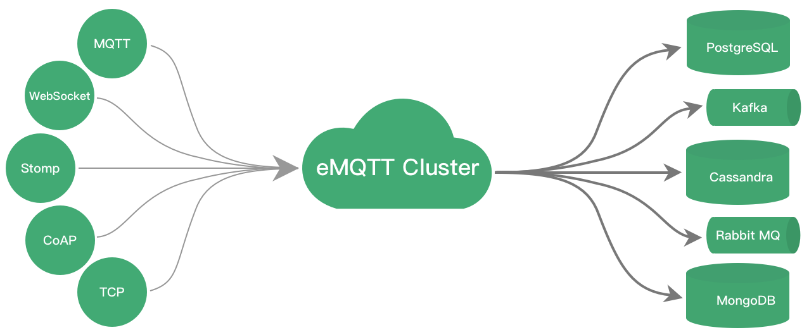

.. eMQTT documentation master file, created by
   sphinx-quickstart on Fri Jan 15 13:58:10 2016.
   You can adapt this file completely to your liking, but it should at least
   contain the root `toctree` directive.

===========================
emqttd - 开源MQTT消息服务器
===========================

emqttd(Erlang MQTT Broker)是基于Erlang/OTP语言平台开发，支持大规模连接和分布式集群， 发布订阅模式的开源MQTT消息服务器。

emqttd完整支持MQTT V3.1/V3.1.1版本协议规范，并扩展支持WebSocket、Stomp、CoAP、MQTT-SN或私有TCP协议。emqttd消息服务器支持单节点100万连接与多节点分布式集群:

emqttd项目为大规模客户端连接(C1000K+)的移动推送、移动消息、物联网、车联网、智能硬件等应用，提供一个完全开放源码、安装部署简便、企业级稳定可靠、容易扩展定制的MQTT消息服务器。

.. NOTE:: MQTT-SN，CoAP协议计划在1.x版本支持。

emqttd项目文档目录:

.. toctree::
   :maxdepth: 2

   getstarted
   install
   config
   cluster
   bridge
   guide
   design
   commands
   plugins
   tune
   changes
   upgrade
   mqtt

emqttd项目支持与联系:

+------------+--------------------------------+
| 官网:      | http://emqtt.com                |
+------------+--------------------------------+
| 项目:      | https://github.com/emqtt       |
+------------+--------------------------------+
| 微信:      | emqttd                         |
+------------+--------------------------------+
| 微博:      | http://weibo.com/emqtt         |
+------------+--------------------------------+
| Twitter:   | @emqtt                         |
+------------+--------------------------------+
| 作者:      | 李枫 <feng@emqtt.io>           |
+------------+--------------------------------+

