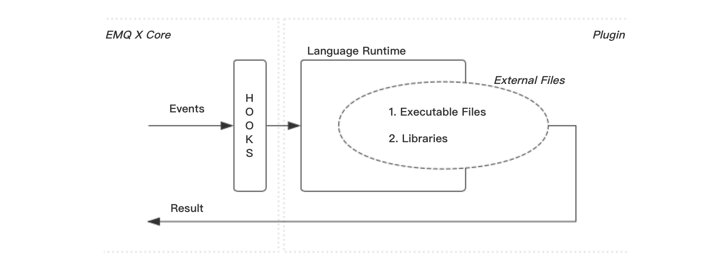

---
# 标题
title: 多语言支持
# 编写日期
date: 2020-02-21 09:28:26
# 作者 Github 名称
author: hjianbo
# 关键字
keywords:
# 描述
description:
# 分类
category: 
# 引用
ref: undefined
---

# 多语言支持

EMQ X Broker 发行包中，提供了一些用于多语言支持的 [插件](plugins.md)。它允许你使用其它编程语言来扩展 EMQ X Broker 的行为。其在系统中的架构为：

- 多语言支持是作为一个插件出现的，它基于 [emqx](https://github.com/emqx/emqx) 核心所提供的 [钩子(Hooks)](hooks.md) 拿到 EMQ X Broker 的事件/消息。
- 不同的语言环境，有着不同的语言支持插件。
- 该支持插件内嵌了该语言运行所需的所有环境。
- 用户仅需要编写该语言的脚本或库文件，供该支持插件调用。

这是实现多语言支持基本逻辑。在使用这类插件时，请保证对 [钩子(Hooks)](hooks.md) 和 [插件(Plugins)](plugins.md) 都有一定的了解。

## Lua {#lua}

Lua 的支持由 [emqx_lua_hook](https://github.com/emqx/emqx-lua-hook) 实现。

