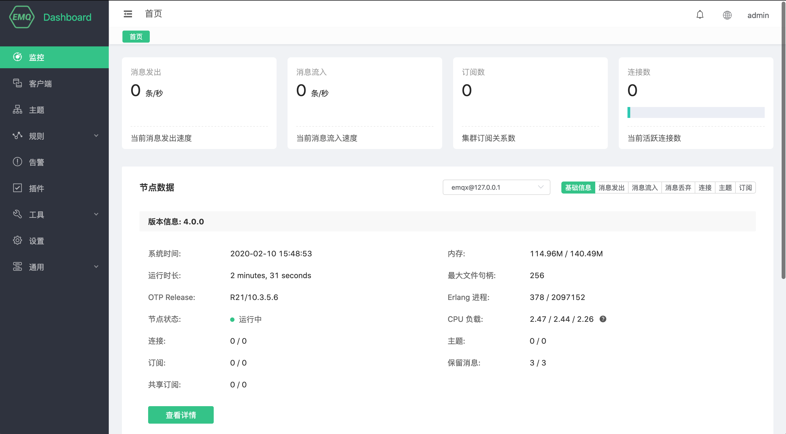
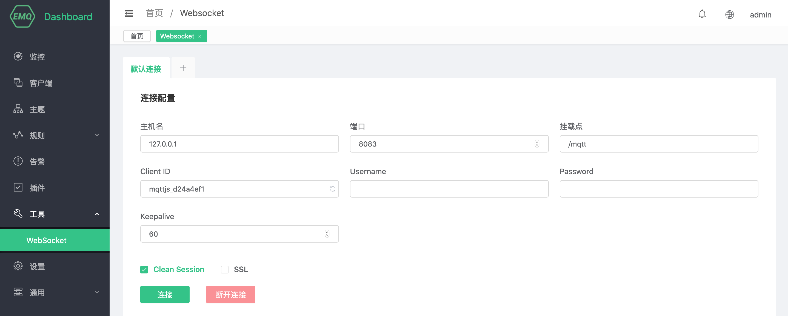
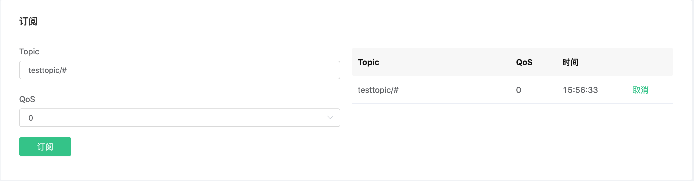
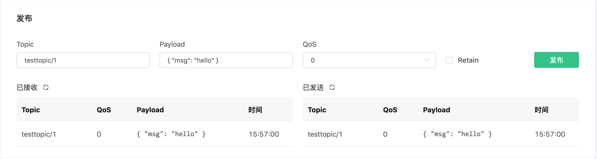

---
# 标题
title: 启动 EMQ X Enterprise
# 编写日期
date: 2020-02-07 17:15:26
# 作者 Github 名称
author: wivwiv
# 关键字
keywords:
# 描述
description:
# 分类
category: 
# 引用
ref: undefined
---

# 启动 EMQ X Enterprise

#### 获取试用的 License 文件

访问 `https://emqx.io`,  在 EMQ X Enterprise 下载页面, 点击 **Get FREE Trial License**


注册登陆并申请 License 文件试用, 下载 License 文件, 并根据说明保存到指定的位置


#### 直接启动 EMQ X Enterprise

```
$ emqx start
EMQ X Enterprise v4.0.0 is started successfully!

$ emqx_ctl status
Node 'emqx@127.0.0.1' is started
emqx 4.0.0 is running
```

#### 使用控制台启动 EMQ X Enterprise

```
$ emqx console
Starting emqx on node emqx@127.0.0.1
Start http:management listener on 8081 successfully.
Start http:dashboard listener on 18083 successfully.
Start mqtt:tcp listener on 127.0.0.1:11883 successfully.
Start mqtt:tcp listener on 0.0.0.0:1883 successfully.
Start mqtt:ws listener on 0.0.0.0:8083 successfully.
Start mqtt:ssl listener on 0.0.0.0:8883 successfully.
Start mqtt:wss listener on 0.0.0.0:8084 successfully.
EMQ X Enterprise 4.0.0 is running now!
Eshell V10.3.5.6  (abort with ^G)
(emqx@127.0.0.1)1>
```

#### 登陆dashboard

浏览器访问 `http://127.0.0.1:18083`, 输入默认的用户名:`admin` 密码: `public`



#### 使用 Websocket 订阅和发布消息

在右侧菜单栏中依次选择 **工具** -> **Websocket**,  在 Websocket 界面点击 **连接** .



Websocket 界面往下拉, 点击 **订阅** 订阅 `testtopic/#` 主题



在 **消息** 界面点击 **发送** 按钮, 向 `testtopic` 主题发送一条内容为 `{ "msg": "Hello, World!" }` 的消息, 发送之后可以在 **发布消息列表** 和 **订阅消息列表** 看到这条消息



#### 关闭EMQ X

在命令行执行 `emqx stop` 以关闭 EMQ X

```
$ emqx stop
ok
```

