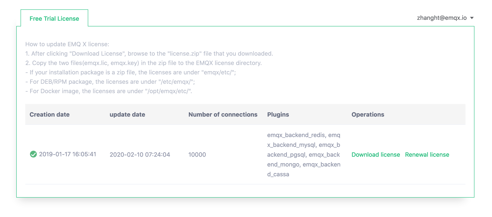

---
# 标题
title: 启动 EMQ X
# 编写日期
date: 2020-02-07 17:15:26
# 作者 Github 名称
author: wivwiv
# 关键字
keywords:
# 描述
description:
# 分类
category: 
# 引用
ref: undefined
---

# 启动 EMQ X Broker

## 申请 License

EMQ X Enterprise 需要 License 文件才能正常启动，EMQ X Broker 可以跳过这一步。

1. 访问 `https://emqx.io`， 在 EMQ X Enterprise 下载页面，点击 **Get FREE Trial License**

    

2. 注册登陆并申请 License 文件试用，下载 License 文件，并根据说明保存到指定的位置

    

3. 如果是正在运行的 EMQ X Enterprise 需要更新 License 文件，那么可以使用 `emqx_ctl license reload [license 文件所在路径]` 命令直接更新 License 文件，无需重启 EMQ X Enterprise。

## 启动 EMQ X Broker

+ 后台启动 EMQ X Broker

    ```
    $ emqx start
    EMQ X Broker v4.0.0 is started successfully!
    ```

+ systemctl 启动

    ```
    $ sudo systemctl start emqx
    EMQ X Broker v4.0.0 is started successfully!
    ```

+ service 启动

    ```
    $ sudo service emqx start
    EMQ X Broker v4.0.0 is started successfully!
    ```

通过 ZIP 压缩包安装的 EMQ X Broker 不支持通过 systemctl 和 service 启动

## 使用 `emqx_ctl` 查看 EMQ X Broker 的状态

EMQ X Broker 正常启动: 
```
$ emqx_ctl status
Node 'emqx@127.0.0.1' is started
emqx 4.0.0 is running
```

EMQ X Broker 未能正常启动:
```
$ emqx_ctl status
Node 'emqx@127.0.0.1' not responding to pings。
```

如果 EMQ X Broker 未能正常启动，可以通过 [目录结构](using-emqx/directory.md) 查看 `logs` 目录下的日志文件，并参考我们的 [FAQ]([FAQ](faq/index.md#)) 进行排错。