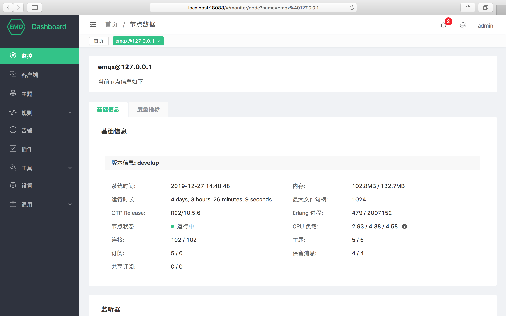
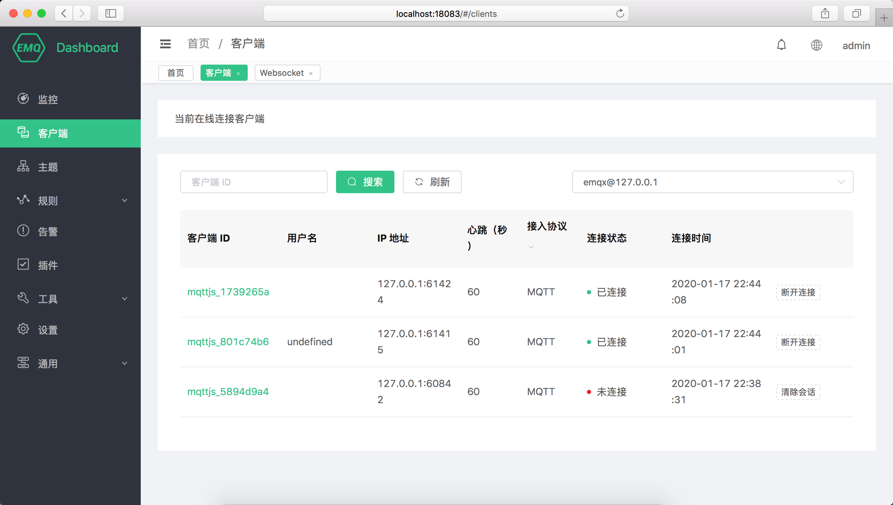
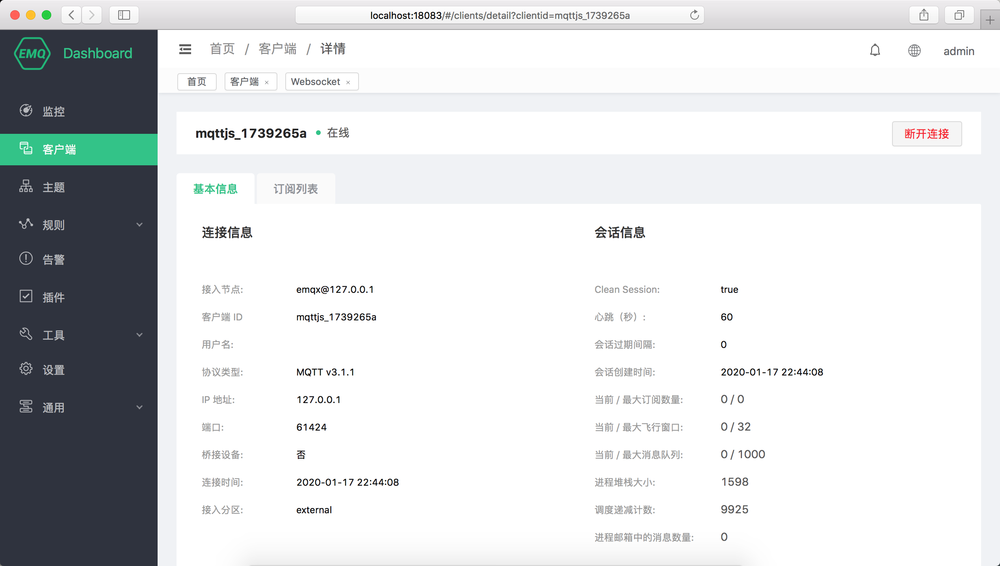
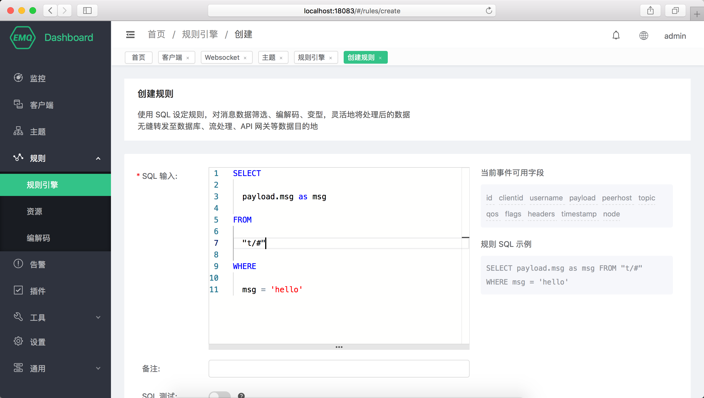
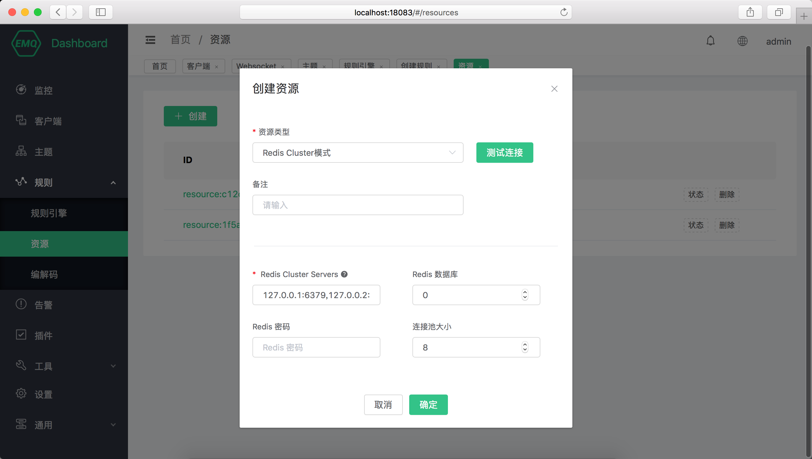
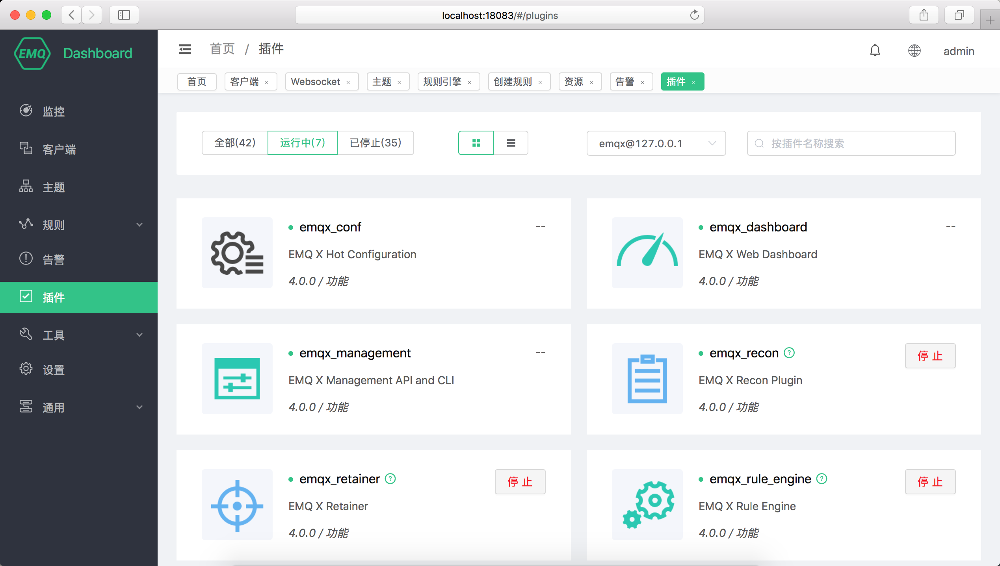

---
# 标题
title: Dashboard
# 编写日期
date: 2020-02-25 17:15:26
# 作者 Github 名称
author: tigercl
# 关键字
keywords:
# 描述
description:
# 分类
category: 
# 引用
ref: undefined
---


# Dashboard

EMQ X Dashboard（EMQ X 管理控制台，以下简称 Dashboard) 是 EMQ X 提供的一个后端 Web控制台，用户可通过 Web
控制台查看服务器节点和集群的运行状态、统计指标，客户端的在线情况和订阅关系等信息，并进行插件配置与停启，HTTP API 密钥管理，EMQ X 集群的热配置管理和 MQTT 连接测试等操作。

## 基本使用

如果 EMQ X 安装在本机，则使用浏览器打开地址 <http://127.0.0.1:18083> ，如需登录输入默认用户名 `admin`
与默认密码 `public` ，登录进入
Dashboard。如果忘记管理用户账号信息，点击登录页面**忘记密码**按钮按指引操作或使用管理命令重置或新建管理账号。

Dashboard 界面如下图所示，包含左侧导航栏、顶部控制栏和中间内容区，顶部控制栏（红框区域）四个功能分别是：

  - 告警信息：EMQ X 告警信息，由资源使用过高、EMQ X 内部错误触发显示告警数量，点击可查看告警列表；
  - 用户信息：当前登录 Dashboard 用户名，可进行登出、修改密码等操作；
  - 多语言切换：Dashboard 根据用户浏览器语言默认显示中/英文，点击可进行语言切换；
  - 最近页面导航：最近打开的页面将以 Tab
形式显示，点击可以快速进行页面切换。


## 监控

**监控**页面可查看 EMQ X 当前集群的运行指标，界面从上到下功能区如下：

### 集群运行指标

页面顶部四个指标卡片，包含**集群**的消息发出、消息流入速率，订阅数和当前连接数。

### 节点数据

点击节点下拉列表可以切换查看节点的基本信息包括 EMQ X 版本信息、运行时间、资源占用、连接和订阅等数据。 部分信息释义如下：

  - 内存： Erlang 虚拟机使用的当前内存/最大内存，其中**最大内存由 EMQ X 视资源使用情况自动向系统申请**，并非 EMQ X
    所在节点服务器物理内存用户无需干预；
  - 最大文件句柄：允许当前会话/进程打开文件句柄数，**该值过小会限制 EMQ X 并发性能**，在远小于 License
    授权最大连接数时，请参照测试调优或联系 EMQ 技术人员进行修改；
  - Erlang 进程、连接、主题、订阅、保留消息、共享订阅：该四个值通过 `/`
分割为两组，分别是当前值与最大值。


### 历史数据

点击**节点数据**区域右侧按钮组可以切换查看近期集群运行数据图表，图表数值均为抽样周期内实际数值：


### 节点详细信息

点击节点数据下方 **查看详情** 按钮可以跳转至节点详情，查看当前节点的**基础信息**、**监听器**及连接情况，**度量指标**等信息。

#### 监听器

监听器为当前 EMQ X 监听网络端口列表，字段信息如下：

  - 监听协议：监听的网络/应用协议，包含协议与功能信息：
      - mqtt:ssl： MQTT TCP TLS 加密协议，默认最大连接数 102400
      - mqtt:tcp： MQTT TCP 协议，默认最大连接数 1024000
      - <http:dashboard：Dashboard> 使用的 HTTP 协议，默认最大连接数 512
      - <http:management：EMQ> X REST API 使用的 HTTP 协议，默认最大连接数 512
      - mqtt:ws：MQTT WebSocket 协议，默认最大连接数 102400
      - mqtt:wss：MQTT WebSocket TLS 加密协议，默认最大连接数 102400
  - 监听地址：监听绑定的网络地址与端口，默认监听全部 IP 地址；
  - Acceptors：监听处理器线程池，可通过各自协议 `*.acceptors`
    字段配置；
  - 连接：包含一组**当前值/最大值**，当前值为实际建立连接数量，最大值为配置文件配置的最大连接数量，**每个监听器超出最大值后将无法建立新连接。**

#### 最大连接数说明

实际可用连接最大由 License 规格与配置文件共同决定：

1.  节点内每个监听协议连接数不能超过配置文件最大连接数；
2.  集群内 mqtt 协议的连接总数不能超过 License 规格上限。

系统调优与当前资源使用情况也可能会影响最大连接数，此处请参照
[测试调优](https://docs.emqx.io/broker/v3/cn/tune.html) 或联系 EMQ
技术人员进行确认。




### License 信息

监控页面底部为 License 信息卡片，可以查看当前集群内 License 信息：

  - 签发对象：同商务合同客户公司或部门名称；
  - License 使用情况：License 规格与当前使用量；
  - 签发邮箱：同商务合同客户联系邮箱；
  - License 类型：右下角标识 License 信息，为试用版或正式版。

证书到期后您需要续签商务合同获取新的 License 证书并按照 License 更新方式或联系 EMQ 技术人员更新 License
证书，证书到期前 EMQ
将通过邮件通知签发邮箱，请留意信息接收以免错过续期时间对业务造成影响。


## 客户端

### 客户端列表

客户端列表页面显示当前连接客户端列表，列表中几个重要信息如下：

  - 客户端 ID、用户名：分别是 MQTT Client ID 与 MQTT Username，点击绿色**客户端
    ID**可以查看客户端详情与订阅列表信息；
  - IP 地址：客户端 IP + 端口信息；
  - 连接状态：客户端在线状态，如果客户端已断开连接，但启用了**保留会话（Clean
    Session**）且会话未过期，此处将显示显示为**未连接**；
  - 断开连接/清除会话：对于在线的客户端，将断开其连接并清除会话，如果客户端不在线，点击清除会话将清除客户端订阅关系等会话信息。



### 基本信息

点击绿色**客户端
ID**可以查看客户端详情与订阅列表信息，**基本信息**包含所选客户端连接信息与会话信息，包含消息流量、消息统计等关键业务信息。



### 订阅列表

**订阅列表**包含所选客户端订阅信息。

  - 取消订阅：点击取消按钮将删除设备与主题的订阅关系，对于设备该操作是无感的；
  - 添加订阅：为所选客户端代理订阅指定主题。


## 主题

主题页面包含**集群**内全部主题（Topic）信息。


## 规则引擎

### 规则列表

规则引擎使用 SQL 设定规则，对消息数据进行筛选、编解码、变型，灵活地将处理后的数据无缝转发至数据库、流处理、API 网关等数据目的地。

规则引擎不仅提供了清晰、灵活的"配置式"的业务集成方案，简化了业务开发流程，提升用户易用性，降低业务系统与 EMQ X
的耦合度；也为用户私有功能定制提供了一个更优秀的基础架构。

规则引擎列表数据如下：

  - ID：规则集群内唯一 ID，可用在管理命令和 REST API
操作中；
  - 主题：规则对应的消息主题或事件主题；
  - 监控：点击将弹出所选规则执行情况统计，包括规则命中次数与执行次数，动作触发成功/失败次数统计；
  - 响应动作：一个或多个规则的响应动作。


### 创建规则

EMQ X 在消息发布、事件触发时将触发规则引擎，满足触发条件的规则将执行各自的 SQL 语句筛选并处理消息和事件的上下文信息。

规则引擎借助响应动作可将特定主题的消息处理结果存储到数据库，发送到 HTTP Server，转发到消息队列 Kafka 或
RabbitMQ，重新发布到新的主题甚至是另一个 Broker 集群中，每个规则可以配置多个响应动作。

1.  选择发布到 t/\# 主题的消息，并筛选出全部字段：

<!-- end list -->

```sql
SELECT * FROM "t/#"
```

2.  选择发布到 t/a 主题的消息，并从 JSON 格式的消息内容中筛选出 "x" 字段：

<!-- end list -->

```sql
SELECT payload.x as x FROM "t/a"
```

规则引擎使用 **$events/** 开头的虚拟主题（**事件主题**）处理 EMQ X
内置事件，内置事件提供更精细的消息控制和客户端动作处理能力，可用在
QoS 1 QoS 2 的消息抵达记录、设备上下线记录等业务中。

1.  选择客户端连接事件，筛选 Username 为 'emqx'
的设备并获取连接信息：

<!-- end list -->

```sql
SELECT clientid, connected_at FROM "$events/client_connected" WHERE username = 'emqx'
```

规则引擎数据和 SQL
语句格式，事件主题列表详细教程参见该文档规则引擎部分。



## 资源

资源保存了规则引擎动作所需的资源实例(如数据库连接实例，Web Server 的连接信息)，创建规则前需要创建相关动作所需资源并保证资源可用。

### 资源列表

资源列表数据如下：

  - ID：资源集群内唯一 ID，可用在管理命令和 REST API
操作中；
  - 状态：资源创建后，集群中的每个节点都将与资源建立连接，点击展开节点上资源状态；
  - 删除：规则引擎正在使用中的资源无法删除，请先删除依赖所选资源的规则再进行删除操作。


### 创建资源

点击**新建**按钮打开资源创建弹出框，选择资源类型、输入对应的连接信息即可创建资源，点击**测试连接**可在创建前进行资源连通性检查。



## 编解码

编解码（Schema Registry） 用于管理编解码使用的 Schema、处理编码或解码请求并返回结果。编解码配合规则引擎，可进行
Protobuf、Avro 以及私有协议上/下行消息解析处理，实现如消息加密、消息压缩、任意二进制-JSON 消息互转等复杂操作。

## 告警

用于展示 EMQ X 基础的告警信息，包含当前告警与历史告警信息。更高级的告警与日志与监控管理由 EMQ X Control Center
提供，如有需要请联系 EMQ
技术人员获取。


## 插件

插件页面用于查看 EMQ X 内置插件列表、进行插件的启动、停止管理操作。

不同于命令行插件管理，Dashboard
上插件的启动、停止操作是集群同步的，如果插件启动失败，请检查集群内每个节点的配置是否正确，任意集群启动失败都无法成功启动插件。



## 工具

提供 WebSocket MQTT 客户端测试工具，可同时实现多个 MQTT 连接的发布、订阅测试。

## 设置

设置页面提供 EMQ X 集群的基础参数配置（热配置）与集群配置。

### 基础设置

基础在设置开放了 `emqx.conf` 中可以进行热更新的部分配置项，您无需重启 EMQ X 即可完成大部分关键信息如是否开启匿名认证、ACL
缓存事件、ACL 缓存开关等配置。

基础设置是以 Zone 来组织的，默认情况下 external Zone 关联了 1883
端口所在监听器。


### 集群设置

集群设置无法更改集群方式，但可用于手工集群邀请节点加入集群，更改静态集群、DNS 集群等集群方式的参数信息。

## 通用

### 应用

应用为调用 REST API 认证凭证，通过 REST API 查询、调整 EMQ X 集群信息，对客户端连接、插件、EMQ X
集群进行管理操作。

应用创建成功后，点击应用列表 **App ID** 列中的应用 ID 可以查看应用 ID
与应用密钥，您可以编辑应用状态与到期时间，新建或删除应用。

### 用户

Dashboard 登录用户管理，您可以创建、编辑、删除用户，如果忘记用户密码，可通过管理命令进行密码重置。

### 黑名单

黑名单用于禁止客户端建立连接，该功能适用于管理少量客户端，黑名单在有效时间到期后将失效。

黑名单支持以下三种方式禁止客户端连接：

  - clientid：通过客户端 ID（Client ID） 进行封禁；
  - username：通过用户名（Username）进行封禁；
  - peerhost：通过对等主机（如 IP
地址）进行封禁。


