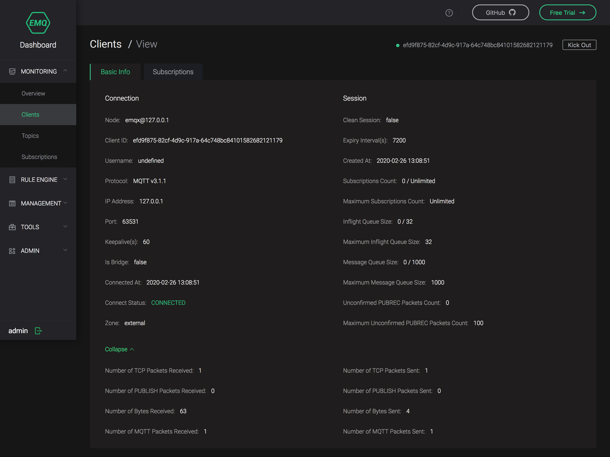

---
# 标题
title: Dashboard
# 编写日期
date: 2020-02-25 17:15:26
# 作者 Github 名称
author: tigercl
# 关键字
keywords:
# 描述
description:
# 分类
category: 
# 引用
ref: undefined
---

# Dashboard

## 简介

EMQ X 提供了 Dashboard 以方便用户管理设备与监控相关指标。通过 Dashboard，你可以查看服务器基本信息、负载情况和统计数据，可以查看某个客户端的连接状态等信息甚至断开其连接，也可以动态加载和卸载指定插件。除此之外，EMQ X Dashboard 还提供了规则引擎的可视化操作界面，同时集成了一个简易的 MQTT 客户端工具供用户测试使用。

## 启用 Dashboard

EMQ X Dashboard 功能由 [emqx-dashboard](https://github.com/emqx/emqx-dashboard) 插件实现，该插件默认处于启用状态，它将在 EMQ X 启动时自动加载。如果你希望禁用 Dashboard 功能，你可以将 `data/loaded_plugins`（请参见 [插件](../advanced/plugins.md#)）中的 `{emqx_dashboard, true}` 修改为 `{emqx_dashboard, false}`。

```bash
{emqx_dashboard, true}.
```

## 查看 Dashboard

EMQ X Dashboard 是一个 Web 应用程序，你可以直接通过浏览器来访问它，无需安装任何其他软件。

当 EMQ X 成功运行在你的本地计算机上且 EMQ X Dashboard 被默认启用时，你可以访问 http://localhost:18083 来查看你的 Dashboard，默认用户名是 `admin`，密码是 `public`。

## 配置 Dashboard

您可以在 `etc/plugins/emqx_dashboard.conf` 中查看或修改 EMQ X Dashboard 的配置，注意此处的 `etc` 并非指系统目录，请参见 [目录结构](directory.md#)。

EMQ X Dashboard 配置项可以分为**默认用户**与**监听器**两个部分：

**默认用户**

EMQ X Dashboard 可以配置多个用户，但在配置文件中仅支持配置默认用户。

需要注意的是，一旦您通过 Dashboard 修改了默认用户的密码，则默认用户的相关信息将以您在 Dashboard 上的最新改动为准，配置文件中的默认用户配置将被忽略。

**监听器**

EMQ X Dashboard 支持 HTTP 和 HTTPS 两种 Listener，但默认只启用了监听端口为 18083 的 HTTP Listener，关于 Listener 的介绍请参见 [配置说明](config.md#)。

关于 Dashboard 的详细配置项说明，请参见 [配置项](../configuration/index.md#)。

## Dashboard 界面

为了使用户在操作和浏览中可以快速地定位和切换当前位置，EMQ X Dashboard 采用了侧边导航的模式，默认情况下 Dashboard 包含以下一级导航项目：  

| 导航项目    | 说明                                              |
| ----------- | ------------------------------------------------- |
| MONITORING  | 提供了服务端与客户端监控信息的展示页面            |
| RULE ENGINE | 提供了规则引擎的可视化操作页面                    |
| MANAGEMENT  | 提供了扩展插件与应用的管理页面                    |
| TOOLS       | 提供了 WebSocket 客户端工具以及 HTTP API 速查页面 |
| ADMIN       | 提供了 Dashboard 用户管理和显示设置等页面         |

### MONITORING

EMQ X Dashboard 提供了非常丰富的数据监控项目，完整地覆盖了服务端与客户端，这些信息都将在 `MONITORING` 下的页面中被合理地展示给用户。

#### Overview

`Overview` 作为 Dashboard 的默认展示页面，提供了 EMQ X 当前节点的详细信息和集群其他节点的关键信息，以帮助用户快速掌握每个节点的状态。


#### Clients

`Clients` 页面提供了连接到指定节点的客户端列表，同时支持通过 `Client ID` 直接搜索客户端。除了查看客户端的基本信息，您还可以点击每条记录右侧的 `Kick Out` 按钮踢掉该客户端，注意此操作将断开客户端连接并终结其会话。

`Clients` 页面使用快照的方式来展示客户端列表，因此当客户端状态发生变化时页面并不会自动刷新，需要您手动刷新浏览器来获取最新客户端数据。


如果你无法在客户端列表获取到你需要的信息，你可以单击 `Client ID` 来查看客户端的详细信息。



我们将客户端详情中的各个字段分为了 **连接**，**会话** 和 **指标** 三类，以下为各字段的说明：

**连接**

| 字段名            | 说明                                                       |
| ----------------- | ---------------------------------------------------------- |
| Node              | 客户端连接的节点名称                                       |
| Client ID         | 客户端标识符                                               |
| Username          | 客户端连接时使用的用户名，出于安全性考虑，密码将不会被展示 |
| Protocol          | 客户端使用的协议名称及其版本                               |
| IP Address        | 客户端的网络 IP 地址，地址可以是 IPv4 或 IPv6              |
| Port              | 客户端源端口                                               |
| Is Bridge         | 指示客户端是否通过桥接方式连接                             |
| Connected At      | 客户端连接时间                                             |
| Disconnected At   | 客户端离线时间                                             |
| Connection Status | 客户端连接状态                                             |
| Zone              | 指示客户端所使用的配置组                                   |
| Keepalive         | 保持连接时间，单位：秒                                     |

**会话**

| 字段名                             | 说明                                             |
| ---------------------------------- | ------------------------------------------------ |
| Clean Session                      | 指示客户端是否使用了全新的会话                   |
| Expiry Interval                    | 会话过期间隔，单位：秒                           |
| Created At                         | 会话创建时间                                     |
| Subscriptions Count                | 当前订阅数量                                     |
| Maximum Subscriptions Count        | 允许建立的最大订阅数量                           |
| Inflight Window Size                | 当前飞行窗口大小，请参见 [飞行窗口与消息队列](../advanced/inflight-window-and-message-queue.md#) |
| Maximum Inflight Window Size        | 飞行窗口最大大小                                 |
| Message Queue Size                 | 当前消息队列大小，请参见 [飞行窗口与消息队列](../advanced/inflight-window-and-message-queue.md#) |
| Maximum Message Queue Size         | 消息队列最大大小                                 |
| Uncomfirmed PUBREC Packets         | 未确认的 PUBREC 报文数量                         |
| Maximum Uncomfirmed PUBREC Packets | 允许存在未确认的 PUBREC 报文的最大数量           |

**指标**

| 字段名                             | 说明                                   |
| ---------------------------------- | -------------------------------------- |
| Number of Bytes Received           | EMQ X Broker（下同）接收的字节数量 |
| Number of TCP Packets Received     | 接收的 TCP 报文数量                    |
| Number of MQTT Packets Received    | 接收的 MQTT 报文数量                   |
| Number of PUBLISH Packets Received | 接收的 PUBLISH 报文数量                |
| Number of Bytes Sent               | 发送的字节数量                         |
| Number of TCP Packets Sent         | 发送的 TCP 报文数量                    |
| Number of MQTT Packets Sent        | 发送的 MQTT 报文数量                   |
| Number of PUBLISH Packets Sent     | 发送的 PUBLISH 报文数量                |

在客户端详情的 `Subscriptions` 标签页中，您可以查看当前客户端的订阅信息，以及新建或取消订阅：


#### Subscriptions

`Subscriptions` 页面提供了指定节点下的所有订阅信息，并且支持用户通过 `Client ID` 查询指定客户端的所有订阅。


### RULE ENGINE

使用 EMQ X 的规则引擎可以灵活地处理消息和事件，例如将消息转换成指定格式后存入数据库表或者重新发送到消息队列等等。为了方便用户更好地使用规则引擎，EMQ X Dashboard 提供了相应的可视化操作页面，您可以点击 `RULE ENGINE` 导航项目来访问这些页面。

鉴于规则引擎的相关概念比较复杂， 涉及到的操作可能会占据相当大的篇幅，考虑到您的阅读体验，我们将通过额外的文档来介绍规则引擎，请参见 [规则引擎](../advanced/rule-engine.md#)。

### MANAGEMENT

目前 EMQ X Dashboard 的 `MANAGEMENT` 导航项目下主要包括扩展插件（请参见 [插件](../advanced/plugins.md#)）的监控管理页面和用于 HTTP API 认证的 AppID 与 AppSerect（请参见 [HTTP API](../advanced/http-api.md#)）的管理页面。

#### Plugins

`Plugins` 页面列举了 EMQ X 能够发现的所有插件，包括 EMQ X 官方插件与您遵循 EMQ X 官方标准自行开发的插件，您可以在此页面查看插件当前的运行状态以及随时启停插件。


您可以看到，除了 [emqx-dashboard](https://github.com/emqx/emqx-dashboard) 以外，EMQ X 还将默认启动 [emqx-rule-engine](https://github.com/emqx/emqx-rule-engine) 等 4 个插件：


#### Applications

`Applications` 页面列举了当前已创建的应用，您可以在此页面进行诸如创建应用、临时禁用或启动某个应用的访问权限等操作。EMQ X 会创建一个 AppID 为 `admin`，AppSecret 为 `publish` 的默认应用方便用户首次访问：


您可以点击 `Application` 页面右上角的 `New App` 按钮来创建一个新的应用，其中 AppID 与 AppSecret 是必选项。创建完成后您可以点击 `View` 按钮来查看应用详情，AppSecret 也会在详情中显示。以下是相关字段的说明：

| 字段名       | 说明                                                         |
| ------------ | ------------------------------------------------------------ |
| AppID        | 应用标识符，用于区分不同的应用，因此不可重复，在创建应用时 Dashboard 将自动为你生成一个随机的建议应用标识符 |
| AppName      | 应用名称，可以重复，但为了方便您自己使用，我们不建议使用重复的应用名称 |
| AppSecret    | 由 EMQ X 分配的应用密钥，可以在应用详情中查看                |
| Expired date | 应用的过期时间，默认为永不过期                               |
| Remark       | 您对应用的描述，方便后期管理                                 |
| Status       | 应用状态，只有 Allowed 与 Denied 两种，Denied 状态下 EMQ X 将拒绝使用该 AppID 与 App Secret 的 HTTP API 的访问请求 |

### TOOLS

目前 EMQ X Dashboard 的 `TOOLS` 导航项目下主要包括 WebSocket 客户端工具页面以及 HTTP API 速查页面。

#### Websocket

`Websocket` 页面为您提供了一个简易但有效的 WebSocket 客户端工具，它包含了连接、订阅和发布功能，同时还能查看自己发送和接收的报文数据，我们期望它可以帮助您快速地完成某些场景或功能的测试验证：


#### HTTP API

`HTTP API` 页面列举了 EMQ X 目前支持的所有 HTTP API 及其说明：


### ADMIN

#### Users

您可以在 `Users` 页面查看和管理能够访问和操作 Dashboard 的用户：


#### Settings

目前 EMQ X Dashboard 仅支持修改主题和语言两种设置：


#### Help

如果您在使用 EMQ X 的过程中遇到了任何问题，我们在 `Help` 页面为您提供了 FAQ 等文档的链接。如果我们现有的文档依然无法解决您的问题，您可以前往我们在 Github 的开源社区咨询我们的技术人员。


