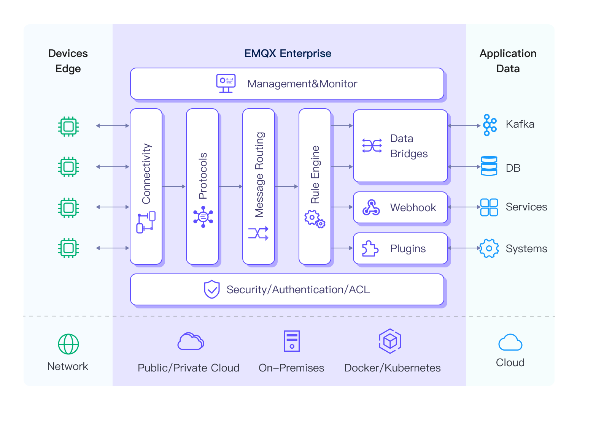

# 产品概览



[EMQX](https://www.emqx.io) 是一款大规模可弹性伸缩的云原生分布式物联网 [MQTT](https://mqtt.org/) 消息服务器。

作为全球最具扩展性的 MQTT 消息服务器，EMQX 提供了高效可靠海量物联网设备连接，能够高性能实时移动与处理消息和事件流数据，帮助您快速构建关键业务的物联网平台与应用。





[EMQX 企业版](https://www.emqx.com/zh/products/emqx)是一个「无限连接，任意集成，随处运行」大规模分布式物联网接入平台。

EMQX 企业版提供一体化的分布式 MQTT 消息服务和强大的 IoT 规则引擎，为高可靠、高性能的物联网实时数据移动、处理和集成提供动力，助力企业快速构建关键业务的 IoT 平台与应用。



## 产品优势



- **[开放源码](https://github.com/emqx/emqx)**：基于 Apache 2.0 许可证完全开源，自 2013 年起 200+ 开源版本迭代。
- **[MQTT 5.0](https://www.emqx.com/zh/blog/introduction-to-mqtt-5)**：100% 支持 MQTT 5.0 和 3.x 协议标准，更好的伸缩性、安全性和可靠性。
- **[海量连接](https://www.emqx.com/zh/blog/reaching-100m-mqtt-connections-with-emqx-5-0)**：单节点支持 500 万 MQTT 设备连接，集群可扩展至 1 亿并发 MQTT 连接。
- **高性能**：单节点支持每秒实时接收、移动、处理与分发数百万条的 MQTT 消息。
- **低时延**：基于 Erlang/OTP 软实时的运行时系统设计，消息分发与投递时延低于 1 毫秒。
- **[高可用](./deploy/cluster/mria-introduction)**：采用 Masterless 的大规模分布式集群架构，实现系统高可用和水平扩展。





- **[海量连接](https://www.emqx.com/zh/blog/reaching-100m-mqtt-connections-with-emqx-5-0)**：单节点支持 500 万 MQTT 设备连接，集群可水平扩展至支持 1 亿并发的 MQTT 连接。

- **高可靠**：弹性伸缩，无单点故障。内置 RocksDB 可靠地持久化 MQTT 消息，确保无数据损失。

- **数据安全**：端到端数据加密（支持国密），细粒度访问控制，保障数据安全，满足企业合规需求。

- **[多协议](https://www.emqx.com/zh/blog/iot-protocols-mqtt-coap-lwm2m)**：支持 MQTT、HTTP、QUIC、WebSocket、LwM2M/CoAP 或专有协议连接任何设备。

- **高性能**：单节点支持每秒实时接收、处理与分发数百万条的 MQTT 消息。毫秒级消息交付时延。

- **易运维**：图形化配置、操作与管理，实时监测运行状态。支持 MQTT 跟踪进行端到端问题分析。



## 功能列表

以下是 EMQX 开源版与企业版功能列表：



| **项目**                 | **EMQX 开源版**                                             | **EMQX 企业版**                                             |
| :----------------------- | :---------------------------------------------------------- | :---------------------------------------------------------- |
| **产品定位**             | 全球领先的开源 MQTT Broker                                  | 高可靠、可扩展的企业级 MQTT 物联网接入平台                  |
| **伸缩性**               | 单集群 < 100 万 MQTT 连接                                   | 单集群至多 1 亿 MQTT 连接                                   |
| **性能**                 | < 10 万 MQTT 消息每秒                                       | > 500 万 MQTT 消息每秒                                      |
| **可靠性**               | 内存数据存储                                                | RocksDB 数据存储                                            |
| **延迟**                 | 1~5 毫秒                                                    | 1~5 毫秒                                                    |
| **SLA**                  | 99.99%                                                      | 至多 99.999%                                                |
| **数据集成（开箱即用）** | 3                                                           | 40+                                                         |
| **License**              | Apache Version 2.0                                          | Commercial license (Business source license)                |
| **技术支持**             | 开源社区                                                    | 7x24 全球支持                                               |
| **MQTT 5.0**             |  |  |
| **MQTT over QUIC**       |  |  |
| **MQTT 扩展**            |  |  |
| **多协议网关**           |  |  |
| **多租户**               |   |  |
| **跨地域复制**           |   |  |
| **数据持久化**           |   |  |
| **Schema Registry**      |   |  |
| **消息编解码**           |   |  |
| **规则引擎**             |  |  |
| **Flow Editor**          |   |  |
| **文件传输**             |   |  |
| **Kafka 集成**           |   |  |
| **企业系统集成**         |   |  |
| **故障排查**             |  |  |
| **云原生 & K8s**         |  |  |
| **边缘计算**             |   |  |





| **项目**                 | **EMQX 企业版**                                             | **EMQX 开源版**                                             |
| ------------------------ | ----------------------------------------------------------- | ----------------------------------------------------------- |
| **产品定位**             | 高可靠、可扩展的企业级 MQTT 物联网接入平台                  | 全球领先的开源 MQTT Broker                                  |
| **伸缩性**               | 单集群至多 1 亿 MQTT 连接                                   | 单集群 < 100 万 MQTT 连接                                   |
| **性能**                 | > 500 万 MQTT 消息每秒                                      | < 10 万 MQTT 消息每秒                                       |
| **可靠性**               | RocksDB 数据存储                                            | 内存数据存储                                                |
| **延迟**                 | 1~5 毫秒                                                    | 1~5 毫秒                                                    |
| **SLA**                  | 至多 99.999%                                                | 99.99%                                                      |
| **数据集成（开箱即用）** | 40+                                                         | 3                                                           |
| **License**              | Commercial License (Business source license)                | Apache Version 2.0                                          |
| **技术支持**             | 7x24 全球支持                                               | 开源社区                                                    |
| **MQTT 5.0**             |  |  |
| **MQTT over QUIC**       |  |  |
| **MQTT 扩展**            |  |  |
| **多协议网关**           |  |  |
| **多租户**               |  |   |
| **跨地域复制**           |  |   |
| **数据持久化**           |  |   |
| **Schema Registry**      |  |   |
| **消息编解码**           |  |   |
| **规则引擎**             |  |  |
| **Flow Editor**          |  |   |
| **文件传输**             |  |   |
| **Kafka 集成**           |  |   |
| **企业系统集成**         |  |   |
| **故障排查**             |  |  |
| **云原生 & K8s**         |  |  |
| **边缘计算**             |   |  |


