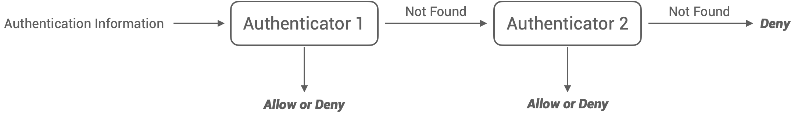
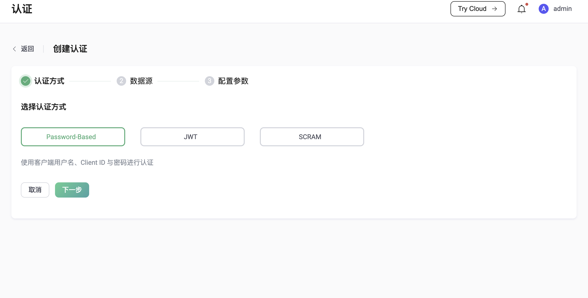
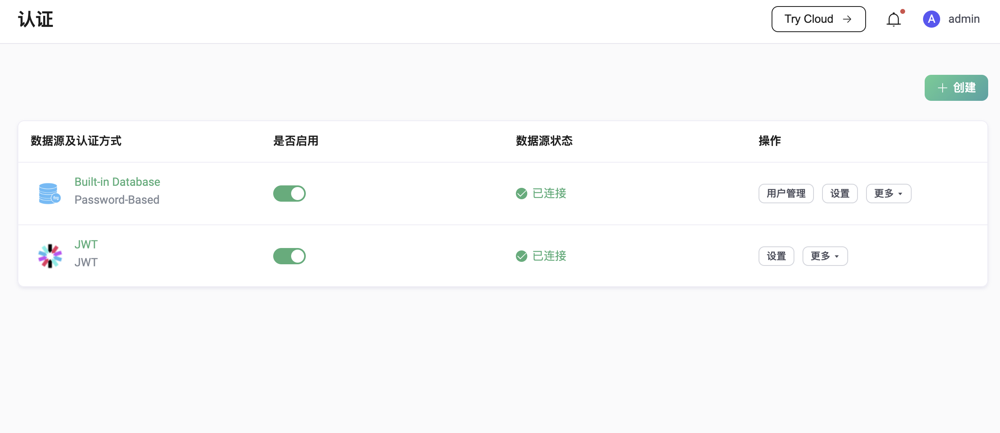

# 介绍

身份验证是大多数应用程序的重要组成部分。MQTT 协议支持用户名/密码认证以及增强认证，例如 SASL/SCRAM 身份验证。启用认证可以有效防止非法客户端连接。

EMQX 支持最简单也是最流行的密码认证，这种认证方式要求客户端提供能够表明身份的凭据，例如用户名、密码或者客户端标识符。在某些场景下，用户可能会选择将 TLS 证书中的一些字段（例如证书通用名称）作为客户端的身份凭据使用。但不管怎样，这些身份凭据都会提前存储到数据库中，其中密码通常都会以加盐后散列的形式存储（这也是我们强烈建议的方式）。

密码认证在 EMQX 中的基本运作原理为：在客户端连接时，EMQX 将使用您指定的查询语句在数据库中查询与该客户端提供的身份凭据对应的密码散列值，然后与客户端的连接密码的散列值进行匹配，一旦匹配成功，EMQX 将允许该客户端登录。

EMQX 提供了与多种后端数据库的集成支持，包括 MySQL、PostgreSQL、MongoDB 和 Redis。同时 EMQX 也支持用户将身份凭据存储到内置数据库（Mnesia）中。与使用外部数据库相比，这种方式提供了非常简单的配置流程和用户管理接口。例如，您可以从仪表板 UI 管理用户，或从 CSV 或 JSON 文件批量导入用户。内置数据库也是性能最高的认证数据源，因为 EMQX 运行时会将这些用于认证的数据会从磁盘加载到内存中。

除了由 EMQX 完成认证，EMQX 还可以配置为将认证工作委托给其他外部服务。例如用户自己开发部署的 HTTP Server。只要 HTTP Server 返回的认证响应符合规范，EMQX 就能根据该响应允许或拒绝客户端的登录。由于能够发送给 HTTP Server 的客户端信息远远多于用户名密码这一简单组合，因此这将允许用户开发出适用于自己的复杂认证服务。

EMQX 也支持客户端直接向用户自行部署的认证服务发起认证请求，该认证服务验证客户端的合法性并签发 JWT，然后客户端使用 JWT 登录到 EMQX，此时 EMQX 仅验证 JWT 的合法性和 JWT 声明中的信息与当前客户端是否匹配。

除此之外，EMQX 还支持增强认证，它是 MQTT 5.0 对密码认证的扩展，它更像是一种认证框架，允许使用各种更安全的认证机制，例如 SCRAM 认证、Kerberos 认证等。目前 EMQX 已支持 SCRAM 认证，并且通过内置数据库提供了对 SCRAM 用户管理的支持。

在传输层方面，EMQX 支持 TLS 的双向认证，这在某种程度上能满足客户端和服务端之间的身份验证要求。当然 EMQX 也支持基于 PSK 的 TLS/DTLS 认证。

本章节将主要介绍 EMQX 中认证的各项基本概念和使用方式。

## 认证器

默认情况下，EMQX 将允许任何客户端连接，直到用户创建了认证器。认证器将根据客户端提供的认证信息对其进行身份验证，只有认证通过，客户端才能成功连接。

EMQX 中的认证器目前支持了 3 种认证机制，分别为：Passsword-Based、JWT 和 SCRAM，其中 Password-Based 机制还提供了多种数据库类型以供选择，这些数据库中存储的数据将被用于验证客户端的身份。

如果按照使用的认证机制和 Backend 来划分，目前 EMQX 存在 8 种不同类型的认证器。

| Mechanism       | Backend           | Description                                                  |
| --------------- | ----------------- | ------------------------------------------------------------ |
| Passsword-Based | Built-in Database | [Authentication with Mnesia database as credential storage](./mnesia.md) |
| Passsword-Based | Mysql             | [Authentication with MySQL database as credential storage](mysql.md) |
| Passsword-Based | PostgreSQL        | [Authentication with PostgreSQL database as credential storage](postgresql.md) |
| Passsword-Based | MongoDB           | [Authentication with MongoDB database as credential storage](./mongodb.md) |
| Passsword-Based | Redis             | [Authentication with Redis database as credential storage](./redis.md) |
| Passsword-Based | HTTP Server       | [Authentication using external HTTP API for credential verification](./http.md) |
| JWT             |                   | [Authentication using JWT](./jwt.md)                         |
| SCRAM           | Built-in Database | [Authentication using SCRAM](./scram.md)                     |

## 认证链

EMQX 允许创建多个认证器，这些认证器将按照在认证链中的位置顺序运行，如果在当前认证器中未检索到匹配的认证信息，将会切换至链上的下一个认证器继续认证过程。以 Password-Based 认证为例，通常这会产生以下 3 种情况：

1. 某个认证器运行时检索到了可能匹配的认证信息，例如用户名一致，且剩余认证信息完全匹配，那么客户端将被允许连接。
2. 某个认证器运行时检索到了可能匹配的认证信息，例如用户名一致，但剩余认证信息无法匹配，例如密码不一致，那么客户端将被拒绝连接。
3. 链上所有的认证器都未检索到任何可能匹配的身份信息，那么这个客户端将被拒绝连接。



对于客户端数量多、连接速率高的用户来说，他们可能会将使用 Redis 作为数据源的认证器（后文将统一简称为 xxx 认证器）与 MySQL 或者 PostgreSQL 认证器搭配使用，也就是将 Redis 作为缓存层以提高查询性能。

目前，只有 MQTT 客户端的认证支持使用多个顺序运行的认证器组成认证链，通过网关接入的客户端仅支持使用单个认证器。

需要注意的是，认证链中不允许出现多个相同类型的认证器。

## 监听器认证

EMQX 支持同一协议下的所有监听器共用一套认证配置（我们称之为全局认证配置，每种接入协议都可以拥有自己的全局认证配置），也支持某个监听器使用独立的认证配置。监听器的认证配置，优先级高于全局的认证配置。只有当监听器移除了本身的认证器配置并开启了认证时，该监听器才会切换至使用全局认证配置。

这一特性主要用于满足部分用户相对复杂的认证需求，例如用户可能并不期望在已经启用了 TLS 双向认证的监听器上继续使用密码认证，又或者用户的设备来自多个不同的供应商，可能存在设备使用的 Username 重复的情况，此时就需要对认证信息进行分开管理。

同样，目前只有 MQTT 监听器支持使用多个认证器，网关监听器仅支持使用单个认证器。

## 超级用户

通常情况下，认证只是验证了客户端的身份是否合法，而该客户端是否具备发布、订阅某些主题的权限，还需要由授权系统来判断。但 EMQX 也允许用户为某些特殊的客户端设置超级用户权限，从而跳过后续所有的权限检查。超级用户的判定发生在认证阶段，由数据库查询结果、HTTP 响应或者 JWT 声明中的 `is_superuser` 字段来指示。

## 使用方式

EMQX 提供了 3 种使用认证的方式，分别为：配置文件、HTTP API 和 Dashboard。

### 配置文件

以下示例主要展示了配置文件中全局认证和监听器认证的配置方式，前文已经提过，我们可以为 MQTT 客户端配置多个认证器以组成认证链，配置项 `authentication` 的数组格式也表明了这一点。认证器在数组中的顺序便是它的运行顺序。

```
# emqx.conf

# Specific global authentication chain for all MQTT listeners 
authentication = [
  ...
]

listeners.tcp.default {
  ...
  # Specific authentication chain for the specified MQTT listener
  authentication = [
    ...
  ]
}

gateway.stomp {
  ...
  # Specific global authenticator for all STOMP listeners
  authentication = {
    ...
  }

  listeners.tcp.default {
    ...
    # Specific authenticator for the specified STOMP listener
    authentication = {
      ...
    }
  }
}
```

不同类型的认证器有着不同的配置项要求。以 Redis 认证器为例，我们通常会有以下配置：

```
authentication = {
  mechanism = password_based
  backend = redis
  enable = true

  server = "127.0.0.1:6379"
  redis_type = single
  database = 1
  password = public
  
  cmd = "HMGET mqtt_user:${username} password_hash salt is_superuser"
  password_hash_algorithm {
    name = plain
    salt_position = suffix
  }
}
```

> `authentication = {...}` 等价于 `authentication = [{...}]`。

其中，`mechanism` 和 `backend` 限定了认证器的类型。`server` 等配置项告诉 EMQX 应当如何连接 Redis 资源。配置项 `cmd` 告诉 EMQX 如何根据身份凭据查询密码散列、盐值等数据。配置项 `password_hash_algorithm` 告诉 EMQX 数据库中密码散列和加盐的方式。

相比之下，内置数据库的密码认证器的配置会更加简单：

```
authentication = {
  mechanism = password_based
  backend = built_in_database
  enable = false
  
  user_id_type = username
  password_hash_algorithm {
    name = sha256
    salt_position = suffix
  }
}
```

为了帮助用户更好地配置自己需要的认证器，我们提供了配置说明文档，里面包含了每种认证器的所有配置字段的详细说明。

### HTTP API

与配置文件相比，HTTP API 使用起来更加方便，并且支持运行时更新，能够自动将配置改动同步至整个集群。

认证的 API 允许对认证链和认证器进行管理，例如为全局认证创建一个认证器，以及更新指定认证器的配置。

用于管理 MQTT 全局认证的 API 端点为 `/api/v5/authentication`。

用于管理 MQTT 监听器认证的 API 端点为 `/api/v5/listeners/{listener_id}/authentication`。

用于管理其他接入协议的全局认证的 API 端点为 `/api/v5/gateway/{protocol}/authentication`。

用于管理其他接入协议的监听器认证的 API 端点为 `/api/v5/gateway/{protocol}/listeners/{listener_id}/authentication`。

如果想要对指定认证器进行操作，则需要在上面这些端点后面追加一个认证器 ID，例如 `/api/v5/authentication/{id}`。为了便于维护，这里的 ID 并不是 EMQX 自动生成然后由 API 返回的，而是遵循了一套预先定义的规范：

```
<mechanism>:<backend>
```

或者仅仅只有：

```
<mechanism>
```

例如：

1. `password_based:built_in_database`
2. `jwt`
3. `scram:built_in_database`

同样，对于监听器 ID，我们也有一套类似的约定，MQTT 监听器 ID 的格式为：

```
<transport_protocol>:<name>
```

网关监听器 ID 的格式为：

```
<protocol>:<transport_protocol>:<name>
```

我们可以把 MQTT 监听器 ID 看作是默认省略了最前面的协议名。

注意，不管是认证器 ID，还是监听器 ID，当它们在 URL 中使用时，都需要遵循 URL 编码规范。最直接的，我们需要将 `:` 替换为 `%3A`，示例：

```
PUT /api/v5/authentication/password_based%3Abuilt_in_database
```

### Dashboard

虽然 Dashboard 底层也是调用了 HTTP API，但是提供了相对更加易用的可视化操作页面，不需要投入太多的学习成本。





## 密码散列

为了满足用户不同的安全性要求，具有数据库后端的密码认证器支持了多种密码散列算法。

使用外部数据库（MySQL、Redis 等）的密码认证器的密码散列算法配置仅用于让 EMQX 了解密码在该外部数据库中的存储方式，以便认证时使用。

而使用内置数据库的密码认证器中的密码散列算法配置还会用于存储新添加的用户数据时对密码的加盐和散列。

密码散列算法配置在认证时的作用如下：

1. Authenticator 使用配置的查询语句从数据库中查询符合条件的散列密码和盐值。
2. 根据配置的散列算法和查询到的盐值对客户端连接时提供的密码进行散列。
3. 将第 1 步从数据库查询到的散列密码和第 2 步计算出的散列值进行比较，一致则说明客户端的身份合法。

以下为 EMQX 目前支持的散列算法：

```
# simple algorithms
password_hash_algorithm {
  name = sha256             # plain, md5, sha, sha512
  salt_position = suffix    # prefix, disable
}

# bcrypt
password_hash_algorithm {
  name = bcrypt
}

# pbkdf2
password_hash_algorithm {
  name = pbkdf2
  mac_fun = sha256          # md4, md5, ripemd160, sha, sha224, sha384, sha512
  iterations = 4096
  dk_length = 256           # optional
}
```

尽管 EMQX 允许用户配置为没有散列也没有加盐的密码存储方式，但这种方式存在明显的安全隐患，并不被我们所建议。

## 认证占位符

绝大部分认证器都需要搭配占位符使用，并且通常用于查询语句（数据库后端）、HTTP 请求（HTTP Server 后端）等。

占位符会在认证执行时被替换为真实的客户端信息，以构造出与当前客户端匹配的查询语句或 HTTP 请求。

目前 EMQX 支持以下占位符：

- `${clientid}` - 将在运行时被替换为客户端标识符。客户端标识符一般由客户端在 `CONNECT` 报文中显式指定。如果启用了 `use_username_as_clientid` 或 `peer_cert_as_clientid`，则会在连接时被用户名、证书中的字段或证书内容所覆盖。由 EMQX 自动为客户端分配的客户端标识符一般不适用于认证。

- `${username}` - 将在运行时被替换为用户名。用户名来自 `CONNECT` 报文中的 `Username` 字段。如果启用了 `peer_cert_as_username`，则会在连接时被证书中的字段或证书内容所覆盖。

- `${password}` - 将在运行时被替换为密码。密码来自 `CONNECT` 报文中的 `Password` 字段。

- `${peerhost}` - 将在运行时被替换为客户端的 IP 地址。EMQX 支持 [Proxy Protocol](http://www.haproxy.org/download/1.8/doc/proxy-protocol.txt)，因此即使 EMQX 部署在某些 TCP 代理或负载均衡器之后，用户也可以使用此占位符。

- `${cert_subject}` - 将在运行时被替换为客户端 TLS 证书的主题（Subject），仅适用于 TLS 连接。

- `${cert_common_name}` - 将在运行时被替换为客户端 TLS 证书的通用名称（Common Name），仅适用于 TLS 连接。

以 Redis 密码认证器为例：

```
{
  mechanism = password_based
  backend = redis

  ... other parameters ...

  cmd = "HMGET users:${clientid} password_hash salt is_superuser"
}
```

当客户端 ID 为 `id2718` 的客户端尝试连接时，Redis 查询 `HMGET users:id2718 password_hash salt is_superuser` 将被执行以搜索凭据。

::: warning
如果该占位符的值不存在时，它最终会被替换为一个空字符串。例如，当客户端未提供用户名时：

`HMGET users:${username} password_hash salt is_superuser` 会被替换为 `HMGET users: password_hash salt is_superuser`
:::
