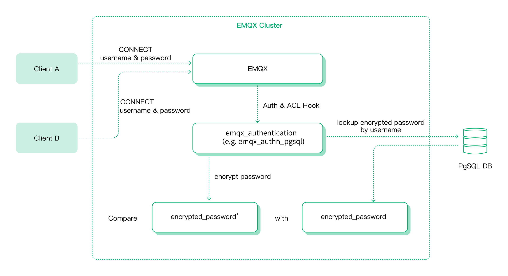

# 介绍

身份验证是物联网应用的重要组成部分，启用身份认证能有效阻止非法客户端的连接。

MQTT 协议允许客户端携带用户名/密码用于身份认证，在此基础上 EMQX 扩展允许客户端在密码中携带 Token 实现 JWT 认证。
同时，EMQX 实现了 MQTT 5.0 增强认证功能，能够通过质询/响应风格方式实现对客户端和服务器的双向认证，实现更强的安全性保障。

在传输层方面，EMQX 支持 TLS 的双向认证(X.509 证书认证)，以及基于 PSK 的 TLS/DTLS 认证，这在某种程度上能满足客户端和服务端之间的身份验证要求。

本章节将主要介绍 EMQX 认证的基本概念和使用方式。

## 认证方式

### 密码认证

EMQX 支持最简单也是使用最多的认证方式，密码认证要求客户端提供能够表明身份的凭据，例如用户名、客户端 ID 以及对应的密码。在某些场景下，用户可能会选择将 TLS 证书中的一些字段（例如证书公用名称）作为客户端的身份凭据使用。

但不论使用何种身份凭据进行认证，这些身份凭据都会提前存储到特定数据源（数据库）中，其中密码通常都会以加盐后散列的形式存储，这也是我们强烈建议的方式。

密码认证在 EMQX 中的基本运作原理为：在客户端连接时，EMQX 将使用用户指定的查询语句在数据库中查询与该客户端提供的身份凭据对应的密码散列值，然后与客户端当前连接密码的散列值进行匹配，一旦匹配成功，EMQX 将允许该客户端登录。



EMQX 认证功能提供了与多种后端数据库的集成支持，包括 MySQL、PostgreSQL、MongoDB 和 Redis。同时 EMQX 也支持用户将身份凭证存储到内置数据库（基于 Mnesia）中，这种方式提供了非常简单的配置流程和用户管理接口。用户可以通过 REST API 或 Dashboard 管理认证数据，或从 CSV 或 JSON 文件批量导入用户。

除此之外，EMQX 还可以通过 HTTP 方式对接用户自己开发的服务，借此实现更复杂的认证逻辑。

### JWT 认证

[JWT](https://jwt.io/) 是一种基于 Token 的认证机制，它不需要服务器来保留客户端的认证信息或会话信息。客户端可以在密码或用户名中携带 Token，EMQX 则使用预先配置的密钥或公钥对 JWT 签名进行验证。

如果用户配置了 JWKs 服务器，则 JWT 认证器将使用从 JWKs 服务器查询到的公钥列表对 JWT 签名进行验证。在持有密钥的情况下用户可以为客户端批量签发认证信息，是最简便的认证方式。

### MQTT 5.0 增强认证

[MQTT 5.0 增强认证](https://www.emqx.com/zh/blog/mqtt5-enhanced-authentication)是对密码认证的扩展，它更像是一种认证框架，允许使用各种更安全的认证机制，例如 SCRAM 认证、Kerberos 认证等。目前 EMQX 已支持 SCRAM 认证，并且通过内置数据库提供了对 SCRAM 用户管理的支持。

## 认证器

没有**创建**并**启用**任何认证器的情况下，EMQX 允许任何客户端连接。

创建并启用认证器之后，EMQX 将根据客户端提供的认证信息对其进行身份验证，认证通过的客户端才能成功连接。

按照认证方式和数据源来划分，EMQX 支持以下 8 种不同类型的认证器。

| 认证方式 | 数据源      | 说明                                              |
| -------- | ----------- | ------------------------------------------------- |
| 密码认证 | 内置数据库  | [使用内置数据库（Mnesia）的密码认证](./mnesia.md) |
| 密码认证 | MySQL       | [使用 MySQL 的密码认证](mysql.md)                 |
| 密码认证 | PostgreSQL  | [使用 PostgreSQL 的密码认证](postgresql.md)       |
| 密码认证 | MongoDB     | [使用 MongoDB 的密码认证](./mongodb.md)           |
| 密码认证 | Redis       | [使用 Redis 的密码认证](./redis.md)               |
| 密码认证 | HTTP Server | [使用 HTTP 的密码认证](./http.md)                 |
| JWT      | --          | [JWT 认证](./jwt.md)                              |
| 增强认证 | 内置数据库  | [增强认证(SCRAM 认证)](./scram.md)                |

## 认证链

EMQX 允许创建多个认证器构成一条认证链，认证器将按照在链中的位置顺序执行，如果在当前认证器中未检索到身份凭证，将会切换至链上的下一个启用的认证器继续认证。以密码认证为例，通常这会产生以下 3 种情况：

1. 当前认证器执行时检索到了匹配的认证信息，例如用户名一致：
   1. 密码完全匹配，则客户端认证通过，允许连接。
   2. 密码无法匹配，则客户端认证失败，拒绝连接。
2. 当前认证器执行时没有检索到匹配的认证信息，例如数据源中没有查找到数据：
   1. 当前认证器之后还有认证器：忽略认证，交由下一认证器继续认证。
   2. 当前认证器已经是链中最后一个认证器：客户端认证失败，拒绝连接。


用户可以创建多个认证器实现链式认证，某些场景下这是有益的，比如客户端数量多、连接速率很高的场景下，用户可能使用 Redis 作为链中的第一个认证器，与 HTTP Server 认证器搭配使用，借助 Redis 高性能优势提供缓存层以实现更高性能的认证能力。

需要注意的是，认证链中不允许出现多个相同类型的认证器。同时，只有 MQTT 协议支持认证链，网关仅支持使用单个认证器。

## 监听器认证

默认情况下 EMQX 所有监听器接入的客户端都使用同一种认证方式，从同一个认证数据源中读取数据。

但在同时接入多个服务的 EMQX 集群中，用户可能需要根据业务不同为每种接入方式配置不同的认证方式，比如：

- 通过 MQTT over WebSocket 接入的客户端不会颁发永久的用户名密码凭证，而是使用具有时效性的 JWT 进行认证以确保业务安全；
- 通过 MQTT TCP 接入的硬件设备会在初始化时烧录用户名密码或客户端证书，该认证凭证在整个生命周期中不会变化，可以使用密码认证；
- 用于后端服务连接的监听器不需要认证检查，此监听器通常监听于内网地址有足够的安全性。

EMQX 允许为指定监听器设置另外一种认证方式，或者关闭某个监听器的认证检查，以便灵活的适应各类认证需求。

全局共用一个认证方式能够满足绝大多数场景的客户端认证需求，对于大多数用户监听级别的认证设置是无感的，有需要的用户只需在监听器中配置即可。

同样，目前只有 MQTT 监听器支持使用认证链，网关监听器仅支持使用单个认证器。

## 超级用户与权限

通常情况下，认证只是验证了客户端的身份是否合法，而该客户端是否具备发布、订阅某些主题的权限，还需要由授权系统来判断。

EMQX 允许在认证阶段为客户端设置**超级用户**角色以及预设**权限**，用于后续的发布订阅权限检查。

超级用户的判定发生在认证阶段，由数据库查询结果、HTTP 响应或者 JWT 声明中的 `is_superuser` 字段来指示。

权限预设目前仅 JWT 认证支持，允许通过 JWT Payload 携带当前客户端拥有的发布订阅权限列表，并在认证成功后预设到客户端。

## 密码散列

EMQX 支持多种密码散列算法以满足不同用户的安全性要求，用户可以在外部数据源中存储加盐、散列后的密码。

我们建议用户使用加盐与密码散列的方式存储认证数据，明文密码会降低连接安全性应当禁止使用。因为一旦遭遇拖库，这些密码将完全暴露在攻击者面前。

同时我们建议生成一个随机的盐，数据库中存储盐与对密码加盐后散列得到的值（password_hash）。这样即便攻击者窃取到了数据库中的数据，他既不能拿着这个散列值来进行登录，也很难根据散列值反推出真正的密码。

密码散列算法配置在认证时的原理如下：

1. 认证器使用配置的查询语句从数据库中查询符合条件的身份凭证，包括散列密码和盐值；
2. 根据认证器配置的散列算法和查询到的盐值，对客户端连接时提供的密码进行散列；
3. 将第 1 步从数据库查询到的散列密码和第 2 步计算出的散列值进行比较，一致则说明客户端的身份合法。

以下为 EMQX 目前支持的散列算法：

```hocon
# simple algorithms
password_hash_algorithm {
  name = sha256             # plain, md5, sha, sha512
  salt_position = suffix    # prefix, disable
}

# bcrypt
password_hash_algorithm {
  name = bcrypt
}

# pbkdf2
password_hash_algorithm {
  name = pbkdf2
  mac_fun = sha256          # md4, md5, ripemd160, sha, sha224, sha384, sha512
  iterations = 4096
  dk_length = 256           # optional
}
```

## 认证占位符

EMQX 允许使用占位符动态构造认证数据查询语句、HTTP 请求，占位符会在认证器执行时替换为真实的客户端信息，以构造出与当前客户端匹配的查询语句或 HTTP 请求。

以 MySQL 认证器为例，默认的查询 SQL 中使用了 `${username}` 占位符：

```sql
SELECT password_hash, salt FROM mqtt_user where username = ${username} LIMIT 1
```

当用户名为 `emqx_u` 的客户端连接认证时，实际执行认证数据查询 SQL 将被替换为：

```sql
SELECT password_hash, salt FROM mqtt_user where username = 'emqx_u' LIMIT 1
```

目前 EMQX 支持以下占位符：

- `${clientid}`: 将在运行时被替换为客户端 ID。客户端 ID 一般由客户端在 `CONNECT` 报文中显式指定，如果启用了 `use_username_as_clientid` 或 `peer_cert_as_clientid`，则会在连接时被用户名、证书中的字段或证书内容所覆盖。

- `${username}`: 将在运行时被替换为用户名。用户名来自 `CONNECT` 报文中的 `Username` 字段。如果启用了 `peer_cert_as_username`，则会在连接时被证书中的字段或证书内容所覆盖。

- `${password}`: 将在运行时被替换为密码。密码来自 `CONNECT` 报文中的 `Password` 字段。

- `${peerhost}`: 将在运行时被替换为客户端的 IP 地址。EMQX 支持 [Proxy Protocol](http://www.haproxy.org/download/1.8/doc/proxy-protocol.txt)，即使 EMQX 部署在某些 TCP 代理或负载均衡器之后，用户也可以使用此占位符获得真实 IP 地址。

- `${cert_subject}`: 将在运行时被替换为客户端 TLS 证书的主题（Subject），仅适用于 TLS 连接。

- `${cert_common_name}`: 将在运行时被替换为客户端 TLS 证书的通用名称（Common Name），仅适用于 TLS 连接。

## 配置方式

EMQX 提供了 3 种使用认证的配置方式，分别为：配置文件、HTTP API 和 Dashboard。

### 配置文件

以下示例展示了配置文件中全局认证和监听器认证的配置方式，前文已经提过，我们可以为 MQTT 客户端配置多个认证器以组成认证链，配置项 `authentication` 的数组格式也表明了这一点。认证器在数组中的顺序便是在认证链中执行的顺序。

```hocon
# emqx.conf

# Specific global authentication chain for all MQTT listeners 
authentication = [
  ...
]

listeners.tcp.default {
  ...
  enable_authn = true
  # Specific authentication chain for the specified MQTT listener
  authentication = [
    ...
  ]
}

gateway.stomp {
  ...
  enable_authn = true
  # Specific global authenticator for all STOMP listeners
  authentication = {
    ...
  }

  listeners.tcp.default {
    ...
    enable_authn = true
    # Specific authenticator for the specified STOMP listener
    authentication = {
      ...
    }
  }
}
```

不同类型的认证器有着不同的配置项要求。以 Redis 认证器为例，我们通常会有以下配置：

```hocon
authentication = {
  mechanism = password_based
  backend = redis
  enable = true

  server = "127.0.0.1:6379"
  redis_type = single
  database = 1
  password = public
  
  cmd = "HMGET mqtt_user:${username} password_hash salt is_superuser"
  password_hash_algorithm {
    name = plain
    salt_position = suffix
  }
}
```

其中，`mechanism` 和 `backend` 限定了认证器的类型。`server` 等配置项告诉 EMQX 应当如何连接 Redis 资源。配置项 `cmd` 告诉 EMQX 如何根据身份凭据查询密码散列、盐值等数据。配置项 `password_hash_algorithm` 告诉 EMQX 数据库中密码散列和加盐的方式。

相比之下，内置数据库的密码认证器的配置会更加简单：

```hocon
authentication = {
  mechanism = password_based
  backend = built_in_database
  enable = false
  
  user_id_type = username
  password_hash_algorithm {
    name = sha256
    salt_position = suffix
  }
}
```

为了帮助用户更好地配置自己需要的认证器，我们提供了配置说明文档，里面包含了每种认证器的所有配置字段的详细说明。

### HTTP API

与配置文件相比，HTTP API 支持运行时更新，能够自动将配置改动同步至整个集群，使用起来更加方便。

EMQX 提供的认证 API 允许对认证链和认证器进行管理，例如为全局认证创建一个认证器，以及更新指定认证器的配置。

- `/api/v5/authentication`: 管理 MQTT 全局认证

- `/api/v5/listeners/{listener_id}/authentication`: 管理 MQTT 监听器认证

- `/api/v5/gateway/{protocol}/authentication`: 管理网关的全局认证

- `/api/v5/gateway/{protocol}/listeners/{listener_id}/authentication`: 管理网关监听器认证

如果想要对指定认证器进行操作，则需要在上面这些端点后面追加一个认证器 ID，例如 `/api/v5/authentication/{id}`。为了便于维护，这里的 ID 并不是 EMQX 自动生成然后由 API 返回的，而是遵循了一套预先定义的规范：

```bash
<mechanism>:<backend>
```

或者仅仅只有：

```bash
<mechanism>
```

例如：

1. `password_based:built_in_database`
2. `jwt`
3. `scram:built_in_database`

同样，对于监听器 ID，我们也有一套类似的约定，MQTT 监听器 ID 的格式为：

```bash
<transport_protocol>:<name>
```

网关监听器 ID 的格式为：

```bash
<protocol>:<transport_protocol>:<name>
```

我们可以把 MQTT 监听器 ID 看作是默认省略了最前面的协议名。

注意，不管是认证器 ID，还是监听器 ID，当它们在 URL 中使用时，都需要遵循 URL 编码规范。最直接的，我们需要将 `:` 替换为 `%3A`，示例：

```bash
PUT /api/v5/authentication/password_based%3Abuilt_in_database
```

详细的请求方式与参数请参考 [HTTP API](../../admin/api.md)。

### Dashboard

Dashboard 底层调用了 HTTP API，提供了相对更加易用的可视化操作页面。在 Dashboard 中可以方便的查看认证器状态、调整认证器在认证链中的位置。


