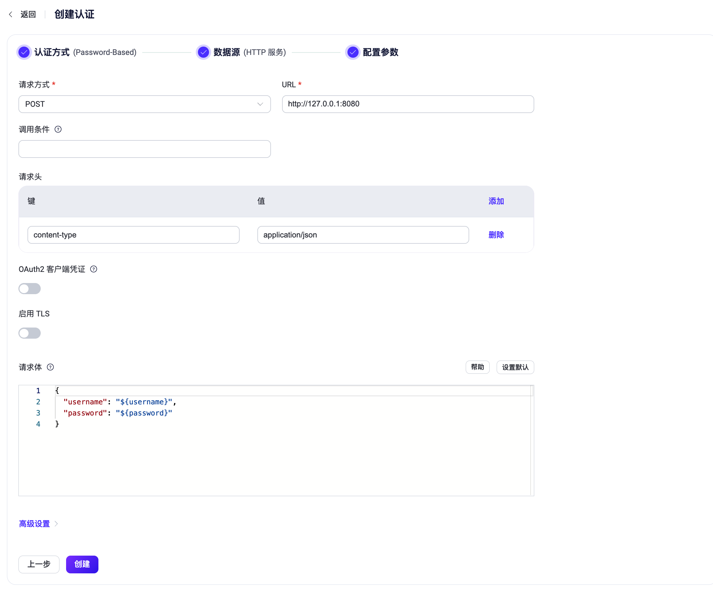

# 使用 HTTP 服务进行密码认证

EMQX 支持通过外部 HTTP 服务进行密码认证。客户端连接时，EMQX 将使用客户端信息构造 HTTP 请求，并根据请求返回的内容判断认证结果，从而实现复杂的认证鉴权逻辑。

::: tip 前置准备

熟悉 [EMQX 认证基本概念](../authn/authn.md)
:::

## 请求格式与返回结果

认证过程类似一个 HTTP API 调用，EMQX 作为请求客户端需要按照 "API" 要求的格式构造并向 HTTP 服务发起请求，而 HTTP 服务需要按照 "客户端" 的要求返回结果：

- 响应编码格式 `content-type` 必须是 `application/json`。
- 认证结果通过 body 中的 `result` 标示，可选 `allow`、`deny`、`ignore`。
- 超级用户通过 body 中的 `is_superuser` 标示，可选 `true`、`false`。
- 从 EMQX v5.7.0 版本开始，您可以使用可选的 `client_attrs` 字段设置[客户端属性](../../client-attributes/client-attributes.md)。请注意，键和值都必须是字符串类型。
- 从 EMQX v5.8.0 版本开始，您可以在响应体中设置一个可选的 `acl` 字段，用于指定客户端的权限。有关更多信息，请参阅[权限列表（ACL）](./acl.md)。
- 从 EMQX v5.8.0 版本开始，您可以在响应体中设置一个可选的 `expire_at` 字段，用于指定客户端的认证到期时间，并强制客户端断开连接以便重新认证。该值为 Unix 时间戳（秒）。
- HTTP 响应状态码 `Status Code` 应当为 `200` 或 `204`，返回 `4xx/5xx` 状态码时将忽略 body 并判定结果为 `ignore`，继续执行认证链。

响应示例：

```js
HTTP/1.1 200 OK
Headers: Content-Type: application/json
...
Body:
{
    "result": "allow", // "allow" | "deny" | "ignore"
    "is_superuser": false, // true | false，该项为空时默认为 false
    "client_attrs": { // 可选 (自 v5.7.0 起)
        "role": "admin",
        "sn": "10c61f1a1f47"
    }
    "expire_at": 1654254601, // 可选 (自 v5.8.0 起)
    "acl": // 可选 (自 v5.8.0 起)
    [
        {
            "permission": "allow",
            "action": "subscribe",
            "topic": "eq t/1/#",
            "qos": [1]
        },
        {
            "permission": "deny",
            "action": "all",
            "topic": "t/3"
        }
    ]
}
```

::: tip EMQX 4.x 兼容性说明
在 4.x 中，EMQX 仅用到了 HTTP API 返回的状态码，而内容则被丢弃。例如 `200` 表示 `allow`，`403` 表示 `deny`。因为缺乏丰富的表达能力，在 5.0 中对这一机制进行了不兼容的调整。
:::

## 通过 Dashboard 配置

1. 在 [EMQX Dashboard](http://127.0.0.1:18083/#/authentication) 页面，点击左侧导航栏的**访问控制** -> **认证**。

2. 在**认证**页面，点击**创建**。

3. 依次选择**认证方式**为 `Password-Based`，**数据源**为 `HTTP Server`，进入**配置参数**步骤：

   

4. 根据如下说明完成相关配置：

   - **请求方式**：选择 HTTP 请求方式，可选值： `get`、`post`。

     :::tip
     推荐使用 `POST` 方法。 使用 `GET` 方法时，一些敏感信息（如纯文本密码）可能通过 HTTP 服务器日志记录暴露。此外，对于不受信任的环境，请使用 HTTPS。
     :::

   - **URL**：输入 HTTP 服务的 URL 地址。

   - **调用条件**：一个 Variform 表达式，用于控制是否将此 HTTP 服务认证证器应用于客户端连接。该表达式会根据客户端的属性（例如 `username`、`clientid`、`listener` 等）进行评估。如果表达式的结果为字符串 `"true"`，则会触发认证器。否则，认证器将被跳过。有关调用条件的更多信息，请参见[认证器调用条件](./authn.md#认证器调用条件)。

   - **请求头**（可选）：HTTP 请求头配置。可以添加多个请求头。键和值可以使用[占位符](./authn.md#认证占位符)。

   - **OAuth2 客户端凭证**：开启后，EMQX 将获取 Access Token，并将其以 Bearer Token 的形式添加到发往外部 HTTP 认证服务的请求中。有关配置详情，参见[配置 OAuth2 客户端凭证认证](#配置-oauth2-客户端凭证认证)。

   - **启用 TLS**：开启后，对外部 HTTP 认证服务的连接启用 TLS。此开关独立于 OAuth2 客户端凭证配置中的**启用 TLS**开关。

   - **请求体**：请求模板，对于 `POST` 请求，它以 JSON 形式在请求体中发送。对于 `GET` 请求，它被编码为 URL 中的查询参数（Query String）。映射键和值可以使用[占位符](./authn.md#认证占位符)。

   - **高级设置**：在此部分进行并发连接、连接超时等待时间、最大 HTTP 请求数以及请求超时时间。

     - **连接池大小**（可选）：整数，指定从 EMQX 节点到外部 HTTP Server 的并发连接数。默认值：`8`。
     - **连接超时**（可选）：填入连接超时等待时长。默认值：`15` 秒。
     - **最大空闲时间**：HTTP 驱动在无任何活动时，尝试重连前的最大等待时间。默认值：`10` 秒。
     - **HTTP 管道**（可选）：正整数，指定无需等待响应可发出的最大 HTTP 请求数。默认值：`100`。
     - **请求超时**（可选）：填入连接超时等待时长。默认值：`5` 秒。

5. 最后点击**创建**完成相关配置。

### 配置 OAuth2 客户端凭证认证

从 EMQX 6.0.4 开始，HTTP 认证器支持 OAuth 2.0 客户端凭证模式（Client Credentials Grant）。启用 OAuth2 后，EMQX 从配置的 Token 端点（Token Endpoint）获取、缓存并自动刷新 Access Token。EMQX 调用外部 HTTP 认证服务时，会通过 `Authorization: Bearer <access_token>` 请求头携带该 Token，由外部服务验证 EMQX 的身份。

开启 **OAuth2 客户端凭证**，然后配置以下设置：

| Dashboard 配置项 | 说明 |
| --- | --- |
| **Token 端点** | 必填。用于请求 Access Token 的 OAuth2 授权服务器端点。URL 必须使用 HTTP 或 HTTPS，且不能包含用户信息。 |
| **客户端 ID** | 必填。请求 Access Token 时使用的 OAuth2 客户端 ID。 |
| **客户端密钥** | 必填。请求 Access Token 时使用的 OAuth2 客户端密钥。 |
| **授权范围** | 可选。请求 Access Token 时使用的 OAuth2 授权范围。 |
| **Token 请求超时** | 向 Token 端点发送 HTTP 请求的超时时间。默认值为 `5` 秒。 |
| **启用 TLS** | 开启后，对 Token 端点启用 TLS。此开关独立于 OAuth2 配置面板外用于外部 HTTP 认证服务的**启用 TLS**开关。 |

EMQX 使用 `POST` 方法向 Token Endpoint 发送 `application/x-www-form-urlencoded` 请求。请求体包含 `grant_type`、`client_id`、`client_secret` 和可选的 `scope`。Token Endpoint 必须返回状态码 `200`，JSON 响应体中必须包含 `access_token`，还可以包含 `token_type` 和 `expires_in`。如果返回 `token_type`，其值必须为 `Bearer`；如果返回 `expires_in`，其值必须为正整数。例如：

```json
{
  "access_token": "eyJhbGciOi...",
  "token_type": "Bearer",
  "expires_in": 3600
}
```

::: warning 重要提示

- 启用 OAuth2 后，不要为 HTTP 认证器配置 `Authorization` 请求头。此请求头与 EMQX 自动生成的 Bearer 认证请求头冲突，EMQX 会拒绝该配置。
- Token Endpoint 必须从请求体的表单字段中接收 Client ID 和 Client Secret。不支持通过 HTTP Basic `Authorization` 请求头向 Token Endpoint 发送客户端凭证。

:::

## 通过配置文件设置

此外，您可以通过配置项完成相关配置。<!-- 具体可参考：[authn-http:post](../../configuration/configuration-manual.html#authn-http:post) 与 [authn-http:get](../../configuration/configuration-manual.html#authn-http:get)。-->

以下为使用 `POST` 和 `GET` 请求配置的 HTTP 请求示例：

<!--这里的内容需要更新-->

:::: tabs type:card

::: tab POST 请求示例

```hcl
{
    mechanism = password_based
    backend = http

    method = post
    url = "http://127.0.0.1:8080/auth?clientid=${clientid}"
    body {
        username = "${username}"
        password = "${password}"
    }
    headers {
        "Content-Type" = "application/json"
        "X-Request-Source" = "EMQX"
    }
}
```

:::

::: tab GET 请求示例

注意： body 将被转换为查询字符串。

```hcl
{
    mechanism = password_based
    backend = http

    method = get
    url = "http://127.0.0.1:32333/auth"
    body {
        username = "${username}"
        password = "${password}"
    }
    headers {
        "X-Request-Source" = "EMQX"
    }
}
```

:::

::::

### OAuth2 客户端凭证配置

从 EMQX 6.0.4 开始，可以在 HTTP 认证器配置对象中添加 `oauth2` 配置块以启用 OAuth2 客户端凭证认证。该配置块与 `method`、`url`、`body` 和 `headers` 同级：

```hocon
oauth2 {
    enable = true
    grant_type = client_credentials
    token_endpoint = "https://auth.example.com/oauth/token"
    client_id = "emqx-client"
    client_secret = "emqx-client-secret"
    scope = "device.read device.write"
    timeout = 5s
    ssl {
        enable = true
    }
}
```

如果授权服务器不要求 `scope`，可以省略该配置项。有关请求格式和限制，参见[配置 OAuth2 客户端凭证认证](#配置-oauth2-客户端凭证认证)。
