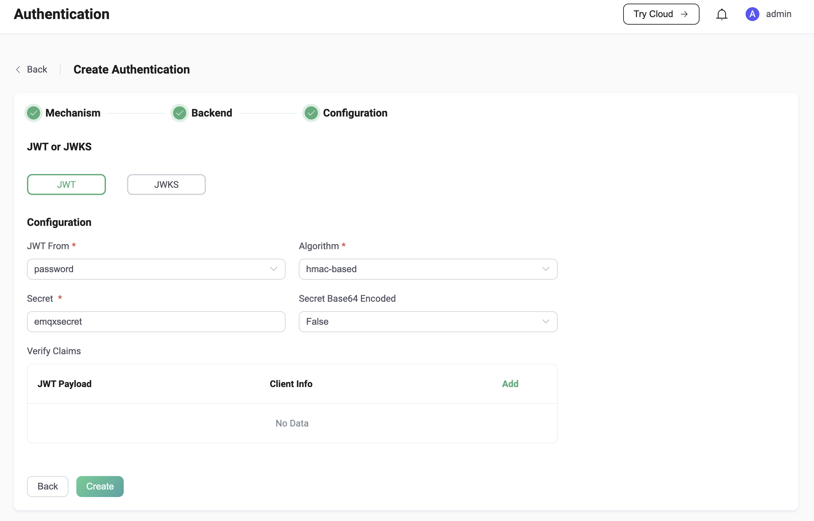

# JWT 认证

[JSON Web Token （JWT）](https://jwt.io/) 是一种基于 Token 的认证机制。它不需要服务器来保留客户端的认证信息或会话信息。EMQX 支持基于 JWT 进行用户认证，满足用户个性化安全设置的需求。

::: tip 前置准备：

- 熟悉 [EMQX 认证基本概念](../authn/authn.md)
:::

## 认证原理

客户端在连接请求中携带 JWT， 将使用预先配置的密钥或公钥对 JWT 签名进行验证。如果用户配置了 JWKS 端点，EMQX 将通过从 JWKS 端点查询到的公钥列表对 JWT 签名进行验证。

如果签名验证成功，EMQX 会继续检查 Claims。如果存在 `iat`、`nbf` 或 `exp` 等 Claims，EMQX 会主动根据这些 Claims 检查 JWT 的合法性。之外，EMQX 也支持用户自定义的 Claims 检查。签名验证和 Claims 检查均通过后，EMQX 才会接受客户端的连接请求。

## 推荐用法

由于 EMQX JWT 认证器只会检查 JWT 的签名，无法对客户端身份的合法性提供担保，因此推荐用户部署一个独立的认证服务器用来为客户端颁发 JWT。

此时，客户端将首先访问该认证服务器，由该认证服务器验证客户端的身份，并为合法的客户端签发 JWT，之后客户端将使用签发的 JWT 来连接 EMQX。

:::tip
由于 JWT 中的 Payload 仅仅进行了 Base64 编码，因此不建议用户在 JWT 的 Payload 中存放敏感数据。

为了减少 JWT 泄漏和被盗的可能，除设置合理的有效期外，还建议结合 TLS 加密来保证客户端连接的安全性。
:::

## 权限列表

这是一个可选的功能，允许用户在 JWT 中携带发布订阅的权限列表，以设置客户端登录后的权限。

::: tip
通过 JWT 认证设置的权限列表，将优先于所有授权检查器被检查，参考 [授权检查优先级](../authz/authz.md#授权检查优先级)。
:::

JWT 权限列表定义了 `pub`、`sub` 和 `all` 3 个可选字段，分别用于指定发布、订阅以及发布订阅的主题白名单列表。主题条目中允许使用主题通配符和占位符（目前仅支持 `${clientid}` 与 `${username}`）。由于可能存在主题内容与占位符语法冲突的情况，我们也提供了 `eq` 语法来取消占位符插值。示例：

```json
{
  "exp": 1654254601,
  "username": "emqx_u",
  "acl": {
    "pub": [
      "testpub1/${username}",
      "eq testpub2/${username}"
    ],
    "sub": [
      "testsub1/${username}",
      "testsub2/${clientid}"
      "testsub2/#"
    ],
    "all": [
      "testall1/${username}",
      "testall2/${clientid}",
      "testall3/#"
    ]
  }
}
```

其中，`testpub1/${username}` 会在运行时被替换为 `testpub1/emqx_u`，而 `eq testpub2/${username}` 在运行时仍会按照 `testpub2/${username}` 处理。

## 通过 Dashboard 配置

在 [EMQX Dashboard](http://127.0.0.1:18083/#/authentication) 页面，点击左侧导航栏的**访问控制** -> **认证**，在随即打开的**认证**页面，单击**创建**，选择**认证方式**为 `JWT`，跳过**数据源**设置部分，进入**配置参数**页签：



您可根据如下说明完成相关配置：

如**验证方式**选择 **JWT** 时：

- **JWT 来自于**：指定客户端连接请求中 JWT 的位置；可选值： **password**、 **username**（分别对应于 MQTT 客户端 `CONNECT` 报文中的 `Password` 和 `Username` 字段）

- **加密方式**：指定 JWT 的加密方式，可选值： **hmac-based**、**public-key**；

  - 如选择  **hmac-based**，即 JWT 使用对称密钥生成签名和校验签名（支持 HS256、HS384 和 HS512 算法），还应配置：
    - **Secret**：用于校验签名的密钥，与生成签名时使用的密钥相同。
    - **Secret Base64 Encode**：配置 EMQX 在使用 `Secret` 校验签名时是否需要先对其进行 Base64 解密；可选值：**True**、**False**，默认值：**False**。

  - 如选择 **public-key**，即 JWT 使用私钥生成签名，同时需要使用公钥校验签名（支持 RS256、RS384、RS512、ES256、ES384 和 ES512 算法），还应配置：
    - **Public Key**：指定用于校验签名的 PEM 格式的公钥。

- **Payload**：添加自定义的 Claims 检查；用户需要在 **Claim** 和 **Expected Value** 分别添加键和对应的值，支持使用 `${clientid}` 和  `${username}` 占位符。其中键用于查找  JWT 中对应的 Claim，值则用于与 Claim 的实际值进行比较。<!--需要示例补充-->

如**验证方式**选择 **JWTS**：

除上述配置外，还应配置：

- **JWKS Endpoint**：指定 EMQX 查询 JWKS 的服务器端点地址，该端点需要支持 GET 请求，并且返回符合规范的 JWKS。
- **JWKS 刷新间隔**：指定 JWKS 的刷新间隔，也就是 EMQX 查询 JWKS 的间隔。<!--需要补充 可选值-->默认值：300 单位为秒（s）。

点击**创建**完成相关配置。

## 通过配置文件配置

您可以通过配置项完成相关配置，具体可参考： [authn-jwt:*](../../configuration/configuration-manual.md#authn-jwt:hmac-based)。
