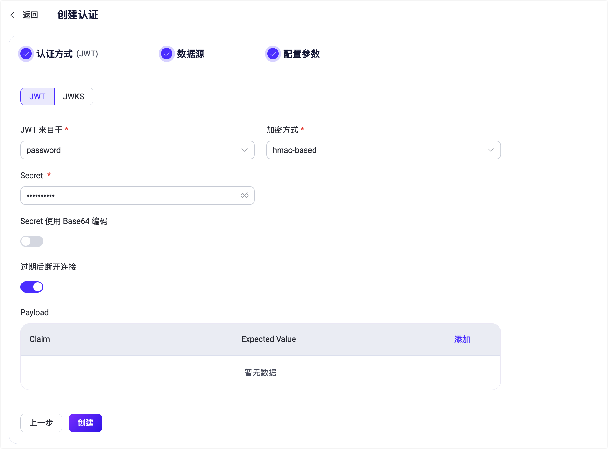
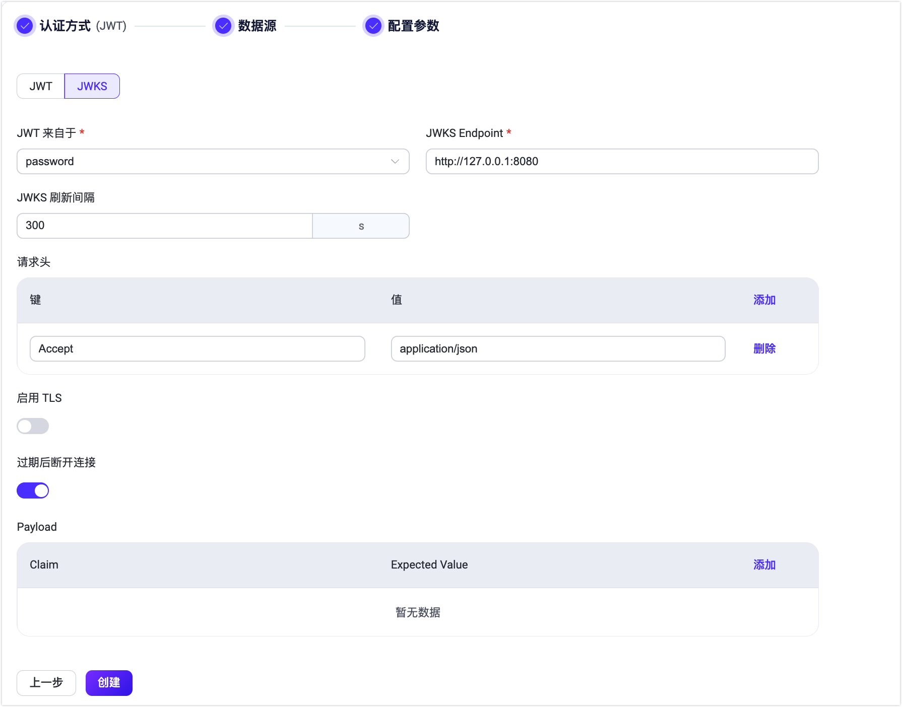

# JWT 认证

[JSON Web Token （JWT）](https://jwt.io/) 是一种基于 Token 的认证机制。它不需要服务器来保留客户端的认证信息或会话信息。EMQX 支持基于 JWT 进行用户认证，满足用户个性化安全设置的需求。

::: tip 前置准备

熟悉 [EMQX 认证基本概念](../authn/authn.md)。
:::

## 认证原理

客户端在连接请求中携带 JWT，将使用预先配置的密钥或公钥对 JWT 签名进行验证。如果用户配置了 JWKS 端点，EMQX 将通过从 JWKS 端点查询到的公钥列表对 JWT 签名进行验证。

如果签名验证成功，JWT 认证器将继续检查声明。JWT 认证器会根据这些声明如 `iat`（签发时间）、`nbf`（不早于）和 `exp`（过期时间）来主动检查 JWT 的有效性。还可以指定额外的自定义声明进行认证。只有当签名和声明的认证都成功时，客户端才被授权访问。

从 EMQX 版本 5.7.0 开始，JWT 认证包括一个在 JWT 过期后断开客户端连接的选项。配置参数 `disconnect_after_expire` 默认设置为 `true`。如果您希望客户端在 JWT 过期后仍然保持连接，可以将此参数设置为 `false`。

## 推荐用法

由于 EMQX JWT 认证器只会检查 JWT 的签名，无法对客户端身份的合法性提供担保，因此推荐用户部署一个独立的认证服务器用来为客户端颁发 JWT。

此时，客户端将首先访问该认证服务器，由该认证服务器验证客户端的身份，并为合法的客户端签发 JWT，之后客户端将使用签发的 JWT 来连接 EMQX。

:::tip
由于 JWT 中的 Payload 仅仅进行了 Base64 编码，因此不建议用户在 JWT 的 Payload 中存放敏感数据。

为了减少 JWT 泄漏和被盗的可能，除设置合理的有效期外，还建议结合 TLS 加密来保证客户端连接的安全性。
:::

## 权限列表

如果 JWT 中包含 `acl` 字段，EMQX 将根据该字段指定的权限对客户端进行访问控制。
详情请参考 [权限列表（ACL）](./acl.md)。

## 客户端属性

从 EMQX v5.7.0 版本开始，您可以在 JWT Payload 中使用可选的 `client_attrs` 字段设置[客户端属性](../../client-attributes/client-attributes.md)。请注意，键和值都必须是字符串类型。

示例：

```json
{
  "exp": 1654254601,
  "username": "emqx_u",
  "client_attrs": {
      "role": "admin",
      "sn": "10c61f1a1f47"
  }
}
```

## 通过 Dashboard 配置 JWT 认证

1. 在 EMQX Dashboard 中点击左侧导航栏的**访问控制** -> **认证**。

2. 在随即打开的**认证**页面，点击**创建**，选择**认证方式**为 **JWT**，跳过**数据源**设置部分，进入**配置参数**页签。

   

3. 根据以下说明完成相关配置：

   - **JWT 来自于**：指定客户端连接请求中 JWT 的位置；可选值： `password`、 `username`（分别对应于 MQTT 客户端 `CONNECT` 报文中的 `Password` 和 `Username` 字段）。

   - **加密方式**：指定 JWT 的加密方式，可选值： `hmac-based`、`public-key`：

     - 如选择  `hmac-based`，即 JWT 使用对称密钥生成签名和校验签名（支持 HS256、HS384 和 HS512 算法），还应配置：
       - **Secret**：用于校验签名的密钥，与生成签名时使用的密钥相同。
       - **Secret Base64 Encode**：配置 EMQX 在使用 `Secret` 校验签名时是否需要先对其进行 Base64 解密；可选值：`True`、`False`，默认值：`False`。

     - 如选择 `public-key`，即 JWT 使用私钥生成签名，同时需要使用公钥校验签名（支持 RS256、RS384、RS512、ES256、ES384 和 ES512 算法），还应配置：
       - **Public Key**：指定用于校验签名的 PEM 格式的公钥。

   - **过期后断开连接**：配置是否在 JWT 过期后断开客户端连接，默认启用。
   - **Payload**：添加自定义的 Claims 检查；用户需要在 **Claim** 和 **Expected Value** 分别添加键和对应的值，支持使用 `${clientid}` 和  `${username}` 占位符。其中键用于查找  JWT 中对应的 Claim，值则用于与 Claim 的实际值进行比较。<!--需要示例补充-->

4. 点击**创建**完成相关配置。

EMQX 还支持定期从 JWKS 端点获取最新的 JWKS，这本质上是一组公钥，用于验证授权服务器签发并使用 RSA 或 ECDSA 算法签名的任何 JWT。如果您想使用此功能，需要切换到 **JWKS** 配置页面。



除与 JWT 页面相同的配置外，还应配置：

- **JWKS Endpoint**：指定 EMQX 查询 JWKS 的服务器端点地址，该端点需要支持 GET 请求，并且返回符合规范的 JWKS。
- **JWKS 刷新间隔**：指定 JWKS 的刷新间隔，也就是 EMQX 查询 JWKS 的间隔。<!--需要补充 可选值-->默认值：300 单位为秒（s）。

点击**创建**完成相关配置。

<!--## 通过配置文件配置-->

<!--您可以通过配置项完成相关配置，具体可参考： [authn-jwt:*](../../configuration/configuration-manual.html#authn-jwt:hmac-based)。-->
