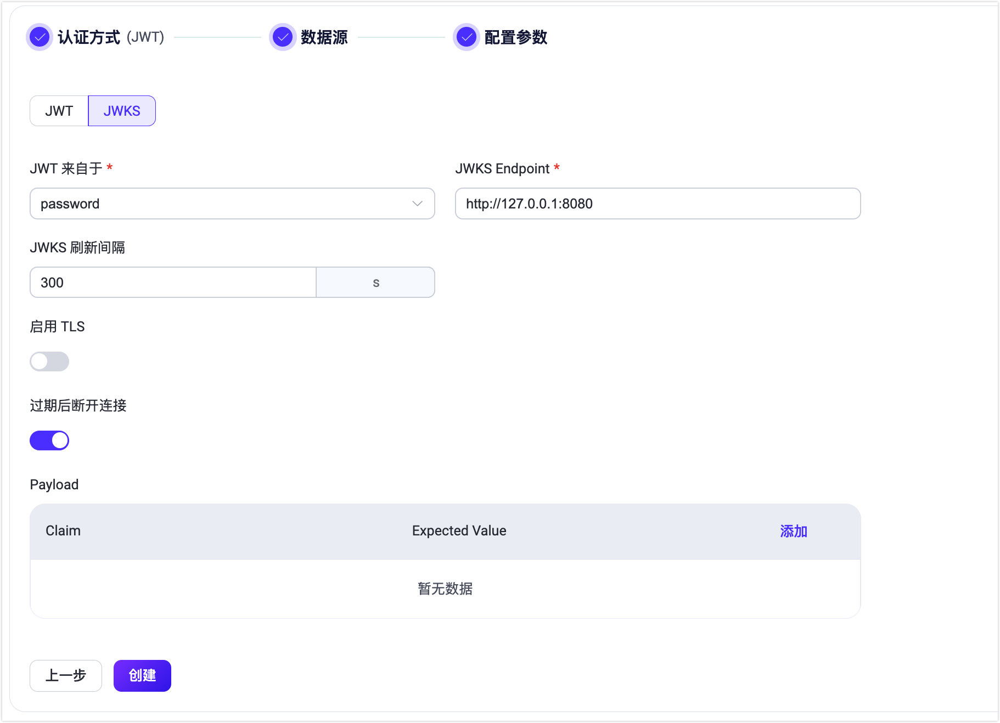

# JWT 认证

[JSON Web Token （JWT）](https://jwt.io/) 是一种基于 Token 的认证机制。它不需要服务器来保留客户端的认证信息或会话信息。EMQX 支持基于 JWT 进行用户认证，满足用户个性化安全设置的需求。

::: tip 前置准备：

熟悉 [EMQX 认证基本概念](../authn/authn.md)。
:::

## 认证原理

客户端在连接请求中携带 JWT，将使用预先配置的密钥或公钥对 JWT 签名进行验证。如果用户配置了 JWKS 端点，EMQX 将通过从 JWKS 端点查询到的公钥列表对 JWT 签名进行验证。

如果签名验证成功，JWT 认证器将继续检查声明。JWT 认证器会根据这些声明如 `iat`（签发时间）、`nbf`（不早于）和 `exp`（过期时间）来主动检查 JWT 的有效性。还可以指定额外的自定义声明进行认证。只有当签名和声明的认证都成功时，客户端才被授权访问。

从 EMQX 版本 5.7.0 开始，JWT 认证包括一个在 JWT 过期后断开客户端连接的选项。配置参数 `disconnect_after_expire` 默认设置为 `true`。如果您希望客户端在 JWT 过期后仍然保持连接，可以将此参数设置为 `false`。

## 推荐用法

由于 EMQX JWT 认证器只会检查 JWT 的签名，无法对客户端身份的合法性提供担保，因此推荐用户部署一个独立的认证服务器用来为客户端颁发 JWT。

此时，客户端将首先访问该认证服务器，由该认证服务器验证客户端的身份，并为合法的客户端签发 JWT，之后客户端将使用签发的 JWT 来连接 EMQX。

:::tip
由于 JWT 中的 Payload 仅仅进行了 Base64 编码，因此不建议用户在 JWT 的 Payload 中存放敏感数据。

为了减少 JWT 泄漏和被盗的可能，除设置合理的有效期外，还建议结合 TLS 加密来保证客户端连接的安全性。
:::

## 权限列表

这是一个可选的功能，允许用户在 JWT 中携带发布订阅的权限列表，以设置客户端连接后的权限。目前支持 2 种格式的权限列表。

::: tip
通过 JWT 认证设置的权限列表，将优先于所有授权检查器被检查，参考 [授权检查优先级](../authz/authz.md#授权检查优先级)。
:::

:::: tabs type:board-card

::: tab 新版格式

新版格式从 v5.5.0 开始支持，使用了权限列表来指定多条权限，更接近 ACL 规则的语义且使用更加灵活。

不同于旧版格式，使用新版格式时，当客户端操作未匹配到任何规则时，EMQX 将继续执行授权检查器的检查。旧版格式仍然是兼容的，但建议使用新版格式。

权限列表包含以下字段：

| 字段 | 必选 | 含义 |
| --- |  --- |  --- |
| permission | 是 | 是否允许当前客户端的操作请求；可选值：`allow`、`deny` |
| action | 是 | 规则对应的操作；可选值: `publish`、`subscribe`、 `all` |
| topic | 是 | 规则对应的主题，支持[主题占位符](../authz/authz.md#主题占位符) |
| qos | 否 | 数组，指定规则适用的消息 QoS，如 `[0, 1]`、`[1, 2]`，默认为全部 QoS |
| retain | 否 | 布尔值，仅用于发布操作，指定当前规则是否支持发布保留消息，可选值有 `true`、`false`，默认允许保留消息。 |

示例：

```json
{
  "exp": 1706844358,
  "username": "emqx_u",
  "acl": [
    {
      // 允许客户端发布 t/${clientid} 主题的消息，例如 t/emqx_c
      "permission": "allow",
      "action": "publish",
      "topic": "t/${clientid}"
    },
    {
      "permission": "allow",
      "action": "subscribe",
      // `eq` 前缀意味着该规则仅适用于主题过滤器 t/1/#，但不适用于 t/1/x 或 t/1/y 等
      "topic": "eq t/1/#",
      // 该规则只匹配 QoS 1 但不匹配 QoS 0 或 2
      "qos": [1]
    },
    {
      // 禁止客户端发布 t/2 主题的保留消息，消息为非保留消息则是允许的
      "permission": "deny",
      "action": "publish",
      "topic": "t/2",
      "retain": true
    },
    {
      // 禁止客户端发布或订阅 t/3 主题，包括所有 QoS 级别和保留消息
      "permission": "deny",
      "action": "all",
      "topic": "t/3"
    }
  ]
}
```

:::

::: tab 旧版格式

JWT 权限列表定义了 `pub`、`sub` 和 `all` 3 个可选字段，分别用于指定发布、订阅以及发布订阅的主题白名单列表。主题中允许使用主题通配符和占位符（目前仅支持 `${clientid}` 与 `${username}`）。由于可能存在主题内容与占位符语法冲突的情况，我们也提供了 `eq` 语法来取消占位符插值。示例：

```json
{
  "exp": 1654254601,
  "username": "emqx_u",
  "acl": {
    "pub": [
      "testpub1/${username}",
      "eq testpub2/${username}"
    ],
    "sub": [
      "testsub1/${username}",
      "testsub2/${clientid}"
      "testsub2/#"
    ],
    "all": [
      "testall1/${username}",
      "testall2/${clientid}",
      "testall3/#"
    ]
  }
}
```

其中，`testpub1/${username}` 会在运行时被替换为 `testpub1/emqx_u`，而 `eq testpub2/${username}` 在运行时仍会按照 `testpub2/${username}` 处理。

:::

::::

## 客户端属性

从 EMQX v5.7.0 版本开始，您可以在 JWT Payload 中使用可选的 `client_attrs` 字段设置[客户端属性](../../client-attributes/client-attributes.md)。请注意，键和值都必须是字符串类型。

示例：

```json
{
  "exp": 1654254601,
  "username": "emqx_u",
  "client_attrs": {
      "role": "admin",
      "sn": "10c61f1a1f47"
  }
}
```

## 通过 Dashboard 配置 JWT 认证

1. 在 EMQX Dashboard 中点击左侧导航栏的**访问控制** -> **认证**。

2. 在随即打开的**认证**页面，点击**创建**，选择**认证方式**为 **JWT**，跳过**数据源**设置部分，进入**配置参数**页签。

   

3. 根据以下说明完成相关配置：

   - **JWT 来自于**：指定客户端连接请求中 JWT 的位置；可选值： `password`、 `username`（分别对应于 MQTT 客户端 `CONNECT` 报文中的 `Password` 和 `Username` 字段）。

   - **加密方式**：指定 JWT 的加密方式，可选值： `hmac-based`、`public-key`：

     - 如选择  `hmac-based`，即 JWT 使用对称密钥生成签名和校验签名（支持 HS256、HS384 和 HS512 算法），还应配置：
       - **Secret**：用于校验签名的密钥，与生成签名时使用的密钥相同。
       - **Secret Base64 Encode**：配置 EMQX 在使用 `Secret` 校验签名时是否需要先对其进行 Base64 解密；可选值：`True`、`False`，默认值：`False`。

     - 如选择 `public-key`，即 JWT 使用私钥生成签名，同时需要使用公钥校验签名（支持 RS256、RS384、RS512、ES256、ES384 和 ES512 算法），还应配置：
       - **Public Key**：指定用于校验签名的 PEM 格式的公钥。

   - **过期后断开连接**：配置是否在 JWT 过期后断开客户端连接，默认启用。
   - **Payload**：添加自定义的 Claims 检查；用户需要在 **Claim** 和 **Expected Value** 分别添加键和对应的值，支持使用 `${clientid}` 和  `${username}` 占位符。其中键用于查找  JWT 中对应的 Claim，值则用于与 Claim 的实际值进行比较。<!--需要示例补充-->

4. 点击**创建**完成相关配置。

EMQX 还支持定期从 JWKS 端点获取最新的 JWKS，这本质上是一组公钥，用于验证授权服务器签发并使用 RSA 或 ECDSA 算法签名的任何 JWT。如果您想使用此功能，需要切换到 **JWKS** 配置页面。



除与 JWT 页面相同的配置外，还应配置：

- **JWKS Endpoint**：指定 EMQX 查询 JWKS 的服务器端点地址，该端点需要支持 GET 请求，并且返回符合规范的 JWKS。
- **JWKS 刷新间隔**：指定 JWKS 的刷新间隔，也就是 EMQX 查询 JWKS 的间隔。<!--需要补充 可选值-->默认值：300 单位为秒（s）。
- **请求头**：指定必须包含在对 JWKS 服务器请求中的任何其他 HTTP 头。添加这些 HTTP 头可以确保对 JWKS 服务器的请求根据服务器的要求进行正确格式化。此配置允许用户添加键值对，例如：
  - **键**：`Accept`
  - **值**：`application/json`

点击**创建**完成相关配置。

<!--## 通过配置文件配置-->

<!--您可以通过配置项完成相关配置，具体可参考： [authn-jwt:*](../../configuration/configuration-manual.html#authn-jwt:hmac-based)。-->
