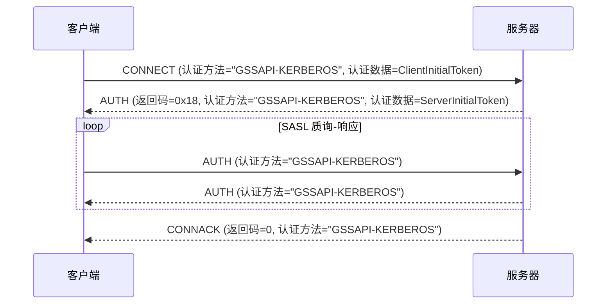

# MQTT 5.0 增强认证 - Kerberos

Kerberos 是一种网络身份验证协议，它使用“票据”使节点能够在不安全的网络上安全地证明彼此的身份，通过密钥加密为客户端/服务器应用程序提供强身份验证。

EMQX 中的 Kerberos 认证集成遵循 RFC 4422 的 SASL/GSSAPI 机制。通用安全服务应用程序编程接口（GSSAPI）提供了一个标准化的 API，简化了 Kerberos 协议的细节，使得 MQTT 客户端与服务器之间能够进行安全通信，而无需应用程序管理 Kerberos 认证过程的具体细节。

本页面介绍如何在 EMQX 中配置 Kerberos 认证器。

::: tip

MQTT 的增强认证仅在协议版本 5 及以上版本中支持。

由于没有机制协商，客户端必须明确指定 `GSSAPI-KERBEROS` 作为认证机制。

:::

## 配置前的准备工作

在 EMQX 中配置 Kerberos 认证器之前，请确保您的环境符合要求，包括安装必要的库和正确设置 Kerberos 系统。

### 安装 Kerberos 库

在配置 Kerberos 认证器之前，您必须在 EMQX 节点上安装 MIT Kerberos 库。

- 在 Debian/Ubuntu 上，所需的软件包是 `libsasl2-2` 和 `libsasl2-modules-gssapi-mit`。
- 在 Redhat 上，所需的软件包是 `krb5-libs` 和 `cyrus-sasl-gssapi`。

### 配置 Kerberos 库

Kerberos 库的配置文件是 `/etc/krb5.conf`。该文件包含 Kerberos 库的配置信息，包括领域（realms）和密钥分发中心（KDCs）。Kerberos 库使用该文件来定位 KDCs 和 realms。

以下是一个 `krb5.conf` 文件的示例：

```ini
[libdefaults]
    default_realm = EXAMPLE.COM
    default_keytab_name = /var/lib/emqx/emqx.keytab

[realms]
   EXAMPLE.COM = {
      kdc = kdc.example.com
      admin_server = kdc.example.com
   }
```

### 密钥表（Keytab）文件

要配置 Kerberos 认证器，您需要一个运行中的 KDC（密钥分发中心）服务器以及服务器和客户端的有效密钥表文件。该文件存储与服务器主体关联的加密密钥。此文件使服务器能够在无需手动输入密码的情况下向 Kerberos KDC 进行身份验证。

EMQX 只能支持默认位置的密钥表文件。您可以使用环境变量 `KRB5_KTNAME` 或通过在 `/etc/krb5.conf` 中设置 `default_keytab_name` 来配置系统默认值。

## 通过 Dashboard 配置

在 EMQX Dashboard 中，导航到左侧菜单中的**访问控制** -> **认证**，进入**认证**页面。点击右上角的**创建**，然后选择 **GSSAPI** 作为**认证方式**，选择 **Kerberos** 作为**数据源**，点击**下一步**进入**配置参数**步骤。

1. 配置以下字段：

   - **主体**：设置服务器的 Kerberos 主体，用于定义服务器在 Kerberos 身份验证系统中的身份。例如，`mqtt/cluster1.example.com@EXAMPLE.COM`。

     注意：使用的领域必须在 EMQX 节点上的 `/etc/krb5.conf` 中配置。


   - **密钥表文件**：指定 Kerberos 密钥表文件的路径。

     注意：密钥表文件必须位于 EMQX 节点上，并且运行 EMQX 服务的用户必须对该文件具有读取权限。


2. 点击**创建**完成配置。

## 通过配置项进行配置

示例配置：

```
 {
    mechanism = gssapi
    backend = kerberos
    principal = "mqtt/cluster1.example.com@EXAMPLE.COM"
  }
```

`principal` 是服务器的主体，必须存在于系统的默认密钥表文件中。

## 认证流程

下图显示了认证过程的工作原理。



## 常见问题

以下是一些配置 EMQX 中 Kerberos 身份验证时可能遇到的常见问题的解决指南：

### `Keytab contains no suitable keys for mqtt/cluster1.example.com@EXAMPLE.COM`

**原因：** 密钥表文件不包含所需主体的密钥。

**解决方案：**

- 确保正确配置了默认密钥表文件。

- 使用 `klist -k` 命令检查密钥表文件。例如：`klist -kte /etc/krb5.keytab`。

  注意，EMQX 目前仅支持默认位置的密钥表文件。如果出现此错误，系统将在错误消息中返回当前默认密钥表文件的路径。

- 尝试通过使用环境变量 `KRB5_KTNAME` 或在 `/etc/krb5.conf` 中设置 `default_keytab_name` 来配置系统默认密钥表文件路径。

### `invalid_server_principal_string`

**原因：** Kerberos 主体字符串格式错误。

**解决方案：** 确保 Kerberos 主体字符串格式正确：`service/SERVER-FQDN@REALM.NAME`。

### `Cannot find KDC for realm "EXAMPLE.COM"`

**原因：** 指定的 Kerberos 领域（`EXAMPLE.COM`）未在 `/etc/krb5.conf` 文件的 `realms` 部分中列出。

**解决方案：** 将缺少的领域信息添加到 `/etc/krb5.conf` 文件的 `realms` 部分。

### `Cannot contact any KDC for realm "EXAMPLE.COM"`

**原因：** 指定领域的 KDC 服务未运行或无法访问。

**解决方案：** 验证 KDC 服务是否正在运行并且可访问。检查网络连接，并确保 KDC 服务器配置正确。

### `Resource temporarily unavailable`

**原因：** 在 `/etc/krb5.conf` 中配置的 KDC 服务未运行或无法访问。

**解决方案：** 确保 KDC 服务正常运行，并且 EMQX 节点能够与其通信。

### `Preauthentication failed`

**原因：** 服务器票据无效，可能是由于密钥表文件过期。

**解决方案：** 验证密钥表文件是否最新，并包含正确的凭证。