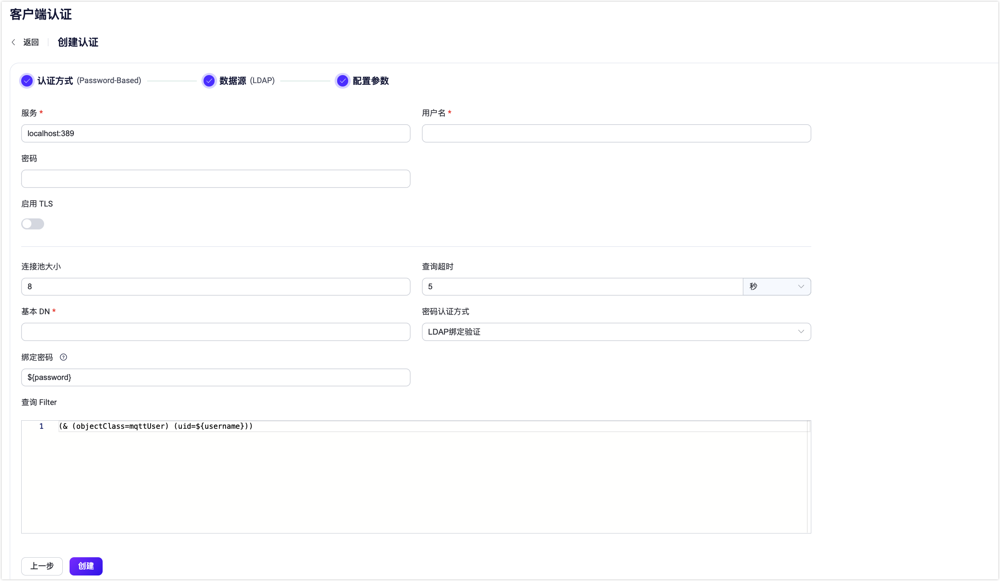

# 使用 LDAP 进行密码认证

[轻量级目录访问协议（LDAP）](https://ldap.com/) 是一种用于访问和管理目录信息的协议。EMQX 支持与 LDAP 服务器集成，用于密码认证。这种集成使用户能够使用其 LDAP 认证信息在 EMQX 中进行身份验证。

::: tip 前置准备

- 熟悉 [EMQX 认证基本概念](../authn/authn.md)。

:::

## 数据结构与查询

LDAP 数据结构定义了在 LDAP 目录中组织和存储认证数据的结构和规则。LDAP 认证器支持几乎所任何 LDAP 数据结构。 以下是用于 [OpenLDAP](https://www.openldap.org/) 的数据结构示例：

```sql

attributetype ( 1.3.6.1.4.1.11.2.53.2.2.3.1.2.3.1.4 NAME 'isSuperuser'
	EQUALITY booleanMatch
	SYNTAX 1.3.6.1.4.1.1466.115.121.1.7
	SINGLE-VALUE
	USAGE userApplications )

objectclass ( 1.3.6.1.4.1.11.2.53.2.2.3.1.2.3.4 NAME 'mqttUser'
    SUP top
	STRUCTURAL
	MAY ( isSuperuser )
    MUST ( userPassword ) )

```

此数据结构定义了一个名为 `isSuperuser` 的属性，用于指示用户是否为超级用户，还定义了一个对象类 `mqttUser`，用于表示用户，并且对像类必须包括 `userPassword` 属性。

要创建 LDAP 认证数据，用户需要定义一些必要的属性名称，基本对象 (object) 的专有名称 (Distinguished Name, DN) 以及 LDAP 查询筛选器 (filter)。以下是根据提供的 OpenLDAP 数据结构使用 LDAP 数据交换格式 (LDIF) 创建的一些示例 LDAP 认证数据：

```sql
## create organization: emqx.io
dn:dc=emqx,dc=io
objectclass: top
objectclass: dcobject
objectclass: organization
dc:emqx
o:emqx,Inc.

## create organization unit: testdevice.emqx.io
dn:ou=testdevice,dc=emqx,dc=io
objectClass: top
objectclass:organizationalUnit
ou:testdevice

## create user=mqttuser0001,
#         password=mqttuser0001,
#         passhash={SHA}mlb3fat40MKBTXUVZwCKmL73R/0=
#         base64passhash=e1NIQX1tbGIzZmF0NDBNS0JUWFVWWndDS21MNzNSLzA9
dn:uid=mqttuser0001,ou=testdevice,dc=emqx,dc=io
objectClass: top
objectClass: mqttUser
uid: mqttuser0001
mqttAccountName: user1
userPassword:: e1NIQX1tbGIzZmF0NDBNS0JUWFVWWndDS21MNzNSLzA9

## create user=mqttuser0002
#         password=mqttuser0002,
#         passhash={SSHA}n9XdtoG4Q/TQ3TQF4Y+khJbMBH4qXj4M
#         base64passhash=e1NTSEF9bjlYZHRvRzRRL1RRM1RRRjRZK2toSmJNQkg0cVhqNE0=
dn:uid=mqttuser0002,ou=testdevice,dc=emqx,dc=io
objectClass: top
objectClass: mqttUser
uid: mqttuser0002
mqttAccountName: user2
userPassword:: e1NTSEF9bjlYZHRvRzRRL1RRM1RRRjRZK2toSmJNQkg0cVhqNE0=

## create a superuser mqttuser0003
#         password=mqttuser0003,
#         passhash={MD5}ybsPGoaK3nDyiQvveiCOIw==
#         base64passhash=e01ENX15YnNQR29hSzNuRHlpUXZ2ZWlDT0l3PT0=
dn:uid=mqttuser0003,ou=testdevice,dc=emqx,dc=io
objectClass: top
objectClass: mqttUser
uid: mqttuser0003
isSuperuser: TRUE
userPassword:: e01ENX15YnNQR29hSzNuRHlpUXZ2ZWlDT0l3PT0=
```

编辑 LDAP 配置文件 `sladp.conf`，使其包含数据结构和 LDIF 文件。在启动 LDAP 服务器时将引用数据结构。下面是一个示例`sladp.conf` 文件：

::: tip

您可以根据您的业务需求决定如何存储和访问认证信息。

:::

```sh
include         /usr/local/etc/openldap/schema/core.schema
include         /usr/local/etc/openldap/schema/cosine.schema
include         /usr/local/etc/openldap/schema/inetorgperson.schema
include         /usr/local/etc/openldap/schema/ppolicy.schema
include         /usr/local/etc/openldap/schema/emqx.schema

TLSCACertificateFile  /usr/local/etc/openldap/cacert.pem
TLSCertificateFile    /usr/local/etc/openldap/cert.pem
TLSCertificateKeyFile /usr/local/etc/openldap/key.pem

database bdb
suffix "dc=emqx,dc=io"
rootdn "cn=root,dc=emqx,dc=io"
rootpw {SSHA}eoF7NhNrejVYYyGHqnt+MdKNBh4r1w3W

directory       /usr/local/etc/openldap/data
```

## 通过 Dashboard 配置

您可以使用 EMQX Dashboard 配置如何使用 LDAP 进行密码认证。

在 EMQX Dashboard 页面上点击左侧导航栏的**访问控制** -> **客户端认证**，在随即打开的**客户端认证**页面，单击**+ 创建**，依次选择**认证方式**为 `Password-Based`，**数据源**为 `LDAP`，点击**下一步**进入**配置参数**页签：



按照以下说明进行配置：

**连接设置**：填写连接到 LDAP 服务器所需的信息。

- **服务器**：指定 EMQX 要连接的服务器地址（`主机：端口`）。
- **用户名**：指定 LDAP 根用户名称。
- **密码**：指定 LDAP 根用户密码。

**TLS 配置**：如果要启用TLS，请打开切换按钮。有关启用TLS的更多信息，请参见[网络和TLS](../../network/overview.md)。

**连接配置**：设置并发连接数和连接超时前的等待时间。

- **连接池大小**（可选）：输入一个整数值来定义EMQX节点到LDAP的并发连接数。默认值：`8`。
- **查询超时**（可选）：指定EMQX在查询超时之前的等待时间。支持的单位包括毫秒、秒、分钟和小时。

**认证配置**：填写与认证相关的设置：

- **基本 DN**：相对于要执行搜索的基本对象条目（或可能是根）的名称。有关更多信息，请参见 [RFC 4511搜索请求](https://datatracker.ietf.org/doc/html/rfc4511#section-4.5.1)，支持使用占位符。

  ::: 提示

  DN 指的是专有名称。这是每个条目的唯一标识符，它还描述了条目在信息树中的位置。

  :::

- **查询 Filter**：LDAP 查询筛选器，定义搜索匹配给定条目必须满足的条件。 过滤器的语法遵循 [RFC 4515](https://www.rfc-editor.org/rfc/rfc4515)，也支持占位符。

- **密码属性名**：指示用于表示客户端密码的属性。此属性的值应遵循 [RFC 3112](https://datatracker.ietf.org/doc/html/rfc3112)，支持的算法有 `md5` `sha` `sha256` `sha384` `sha512`和`ssha`。

- **超级用户属性名**：指示客户端超级用户角色的 LDAP 属性名称。此属性的值应为布尔值，如果缺失则等于 `false`。

在完成设置后，点击**创建**。

## 通过配置文件配置

您也可通过配置文件配置 LDAP 认证器。

LDAP 认证通过 `mechanism = password_based` 和 `backend = ldap` 进行标识。

配置示例：

```bash
{
  backend = "ldap"
  mechanism = "password_based"
  server = "127.0.0.1:389"
  password_attribute = "userPassword"
  is_superuser_attribute = "isSuperuser"
  query_timeout = "5s"
  username = "root"
  password = "root password"
  pool_size = 8
  base_dn = "uid=${username},ou=testdevice,dc=emqx,dc=io"
  filter = "(objectClass=mqttUser)"
}
```
