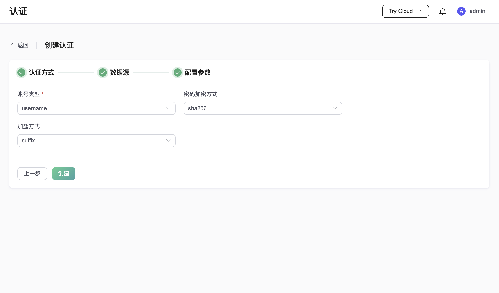

# 使用内置数据库（Mnesia）的密码认证

::: tip
先决条件：

- 了解 [EMQX 认证基本概念](../authn/authn.md)
:::

EMQX 提供了内置数据库（基于 Mnesia）作为客户端身份凭据的数据源，并通过 REST API 与 Dashboard 进行数管理，无需用户额外部署其他数据库，能够低成本、开箱即用的启用认证。

## 配置项

详细配置请参考 [authn-builtin_db:authentication](../../admin/cfg.md#authn-builtin_db:authentication)。

示例配置：

```hocon
{
   backend = "built_in_database"
   mechanism = "password_based"
   password_hash_algorithm {
      name = "sha256",
      salt_position = "suffix"
   }
   user_id_type = "username"
}
```

## 通过 Dashboard 配置

您可以使用 EMQX Dashboard 来创建使用内置数据库的密码认证。

在 [Dashboard > 访问控制 > 认证](http://127.0.0.1:18083/#/authentication) 页面单击**创建**，选择**认证方式**为 `Password-Based`，**数据源**为 `Built-in Database`，然后就会进入具体的配置页面：



**账号类型**用于指定 EMQX 应当使用哪个字段作为客户端的身份 ID 进行认证，可选值有 `username` 和 `clientid`。对于 MQTT 客户端来说，分别对应 CONNECT 报文中的 Username 和 Client Identifier 字段。

**密码加密方式**用于指定存储密码时使用的散列算法，支持 md5、sha、bcrypt、pbkdf2 等。对于不同的散列算法，内置数据库密码认证器会有不同的配置要求：

1. 配置为 md5、sha 等散列算法时，对应将有以下配置：

   - **加盐方式**，用于指定盐和密码的组合方式：在密码尾部加盐还是在密码头部加盐。只有在用户需要将凭据从外部存储迁移到 EMQX 内置数据库中时，才可能需要更改这一选项。

2. 配置为 bcrypt 算法时，对应将有以下配置：

   - **Salt Rounds**，又称成本因子，用于指定散列需要的计算次数（2^Salt Rounds）。每加一，散列需要的时间就会翻倍，需要的时间越长，暴力破解的难度就越高，但相应的验证用户需要花费的时间也就越长，因此需要按照您的实际情况进行取舍。

3. 配置为 pkbdf2 算法时，对应将有以下配置：

   - **伪随机函数**，用于指定生成密钥使用的散列函数。
   - **迭代次数**，用于指定散列次数。
   - **密钥长度**，指定希望得到的密钥长度。如果未指定，则表示由 **伪随机函数** 决定输出的密钥长度。

## 迁移到内置数据库

如果你已经在其他数据库中存储了认证凭据，并希望迁移到 EMQX 的内置数据库中，我们提供了从 csv 或 json 格式文件批量导入凭据的功能。要了解更多信息，请阅读 [导入用户](./user_management.md#导入用户)。
