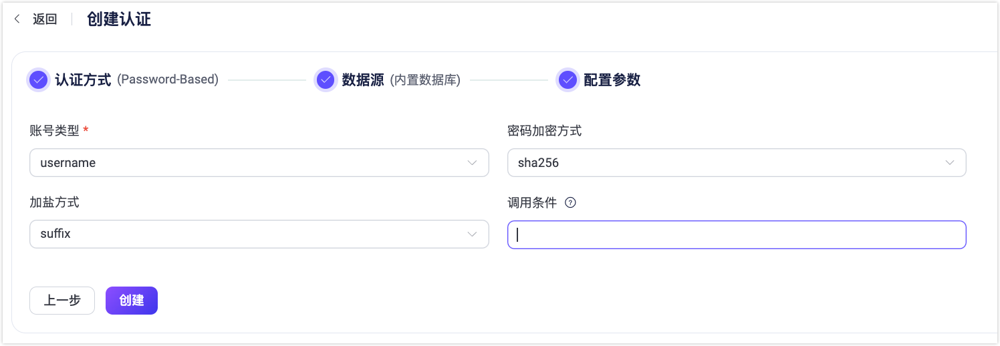

# 使用内置数据库进行密码认证

EMQX 通过内置数据库为用户提供了一种低成本、开箱即用的密码认证方式。启用后，EMQX 会将内置的 Mnesia 数据库存储客户端身份凭据，并通过 REST API 与 Dashboard 进行数据管理，本节将向您介绍如何通过 Dashboard 或配置项进行相关配置。

::: tip 前置准备

熟悉 [EMQX 认证基本概念](../authn/authn.md)
:::

## 通过 Dashboard 配置

您可以使用 Dashboard 来创建通过内置数据库进行密码认证。

在 [EMQX Dashboard](http://127.0.0.1:18083/#/authentication) 页面，点击左侧导航栏的**访问控制** -> **认证**，在随即打开的**认证**页面，单击**创建**，依次选择**认证方式**为 `Password-Based`，**数据源**为 `Built-in Database`，进入**配置参数**页签：



**账号类型**：指定用于客户端身份 ID 认证的字段，可选值： `username`、 `clientid`（分别对应于 MQTT 客户端 `CONNECT` 报文中的 `Username` 和 `Client Identifier` 字段）。

**密码加密方式**：选择应用于明文密码的哈希算法，用于在将结果存储到数据库之前对密码进行加密。可用选项包括 `plain`、`md5`、`sha`、`sha256`、`sha512`、`bcrypt` 和 `pbkdf2`。具体配置取决于所选择的算法：

- 选择  `md5`、`sha`、`sha256` 或 `sha512` 算法，需配置：
   - **加盐方式**：用于指定盐和密码的组合方式，除需将访问凭据从外部存储迁移到 EMQX 内置数据库中外，一般不需要更改此选项；可选值：`suffix`（在密码尾部加盐）、`prefix`（在密码头部加盐）、`disable`（不启用）。如果无需从外部存储迁移客户端身份凭据到 EMQX 内置数据库，可以保持默认值。
   - 生成的哈希以十六进制字符串形式表示，并与存储的凭据进行不区分大小写的比对。
- 选择 `plain`：
   - **加盐方式**：应设置为 `disable`。
- 选择 `bcrypt` 算法，需配置：
   - **Salt Rounds**：指定散列需要的计算次数（2^Salt Rounds），也称成本因子。默认值：`10`，可选值：`5` 到 `10`；数值越高，加密的安全性越高，因此建议采用较大的值，但相应的用户验证的耗时也会增加，您可根据业务需求进行配置。
- 选择 `pbkdf2` 算法，需配置：

   - **伪随机函数**：指定生成密钥使用的散列函数，如 `sha256` 等。
   - **迭代次数**：指定散列次数，默认值：`4096`。<!--后续补充取值范围-->
   - **密钥长度**（可选）：指定希望得到的密钥长度。如不指定，密钥长度将由**伪随机函数**确定。
   - 生成的哈希以十六进制字符串形式表示，并与存储的凭据进行不区分大小写的比对。

完成以上设置后，点击**创建**，EMQX 将按照设定通过内置数据库进行密码认证。

## 通过配置文件配置

此外，您可以通过配置项完成相关配置。<!-- 具体可参考： [authn-builtin_db:authentication](../../configuration/configuration-manual.html#authn-builtin_db:authentication)。-->

示例配置：

```hcl
{
   backend = "built_in_database"
   mechanism = "password_based"
   password_hash_algorithm {
      name = "sha256",
      salt_position = "suffix"
   }
   user_id_type = "username"
   bootstrap_file = "${EMQX_ETC_DIR}/auth-built-in-db-bootstrap.csv"
   bootstrap_type = "plain"
}
```

## 启动时从文件引导用户

`password_based:built_in_database` 支持在创建认证器时，从本地文件导入用户。

- `bootstrap_file`：
  - 默认值：`${EMQX_ETC_DIR}/auth-built-in-db-bootstrap.csv`
  - EMQX 自带默认文件的 CSV 表头为：
    ```txt
    user_id,password,is_superuser
    ```
- `bootstrap_type`：
  - 可选值：`plain` 或 `hash`
  - 默认值：`plain`

文件格式由扩展名决定：

- `.csv`：带表头的 CSV 文件。
- `.json`：必须是对象数组。

当 `bootstrap_type = plain` 时，要求字段：

- `user_id`
- `password`
- `is_superuser`（可选，默认 `false`）

当 `bootstrap_type = hash` 时，要求字段：

- `user_id`
- `password_hash`
- `salt`（可选，默认空字符串）
- `is_superuser`（可选，默认 `false`）

基于 EMQX 5.8 源码的行为细节：

- 启动引导不会覆盖已有用户（`override = false`）。
- `bootstrap_type = plain` 时，EMQX 会使用当前 `password_hash_algorithm` 对 `password` 做哈希后存储。
- `bootstrap_type = hash` 时，EMQX 直接存储 `password_hash`。
- 仅当 `is_superuser` 是 JSON 布尔 `true` 或字符串 `"true"` 时才会被识别为 `true`，其余值都按 `false` 处理。
- 文件读取或解析失败只会记录 warning 日志，不会导致认证器创建失败。

## 迁移到内置数据库

如你希望将其他数据库中存储的认证凭据迁移到 EMQX 内置数据库，可通过 csv 或 json 文件将其批量导入。更多信息，可阅读[导入用户](./user_management.md#导入用户)。
