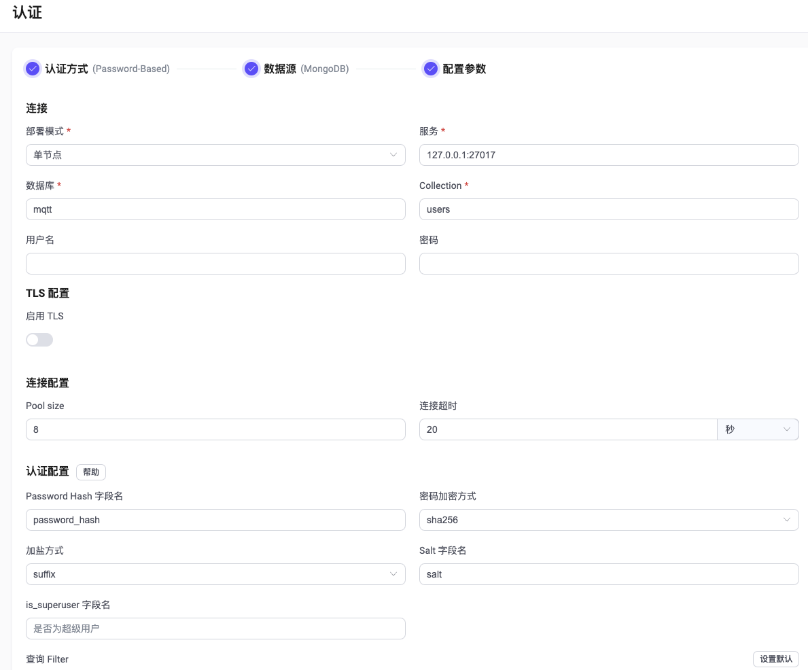

# 使用 MongoDB 进行密码认证

作为密码认证方式的一种，EMQX 支持通过集成 MongoDB 进行密码认证，目前 EMQX 支持**单节点**、**[Replica Set](https://www.mongodb.com/docs/manual/reference/replica-configuration/)**、**[Sharding](https://www.mongodb.com/docs/manual/sharding/)** 三种模式部署的 MongoDB 服务器。

::: tip 前置准备：

- 熟悉 [EMQX 认证基本概念](../authn/authn.md)。
:::

## 数据结构与查询语句

MongoDB 认证器支持将认证数据存储为 MongoDB 文档。用户需要提供一个查询语句模板，且确保查询结果包含以下字段：

- `password_hash`: 必需，数据库中的明文或散列密码字段，可以设置为其他字段名
- `salt`: 可选，为空或不存在时视为空盐（`salt = ""`），可以设置为其他字段名
- `is_superuser`: 可选，标记当前客户端是否为超级用户，默认为 `false`，可以设置为其他字段名

添加用户名为 `emqx_u`、密码为 `public`、盐值为 `slat_foo123`、散列方式为 `sha256` 且超级用户标志为 `true` 的用户示例：

```js
> db.mqtt_user.insertOne(
  {
      "username": "emqx_u",
      "salt": "slat_foo123",
      "is_superuser": true,
      "password_hash": "44edc2d57cde8d79c98145003e105b90a14f1460b79186ea9cfe83942fc5abb5"
  }
);
{
  "acknowledged" : true,
  "insertedId" : ObjectId("631989e20a33e26b05b15abe")
}
```

:::tip
当系统中有大量用户时，请确保查询使用的集合已优化并使用有效的索引，以提升大量连接时的数据查找速度并降低 EMQX 负载。
:::

对应的配置参数为：

- 密码加密方式：`sha256`
- 加盐方式：`suffix`
- Collection：`mqtt_user`
- 查询 Filter：`{ username = "${username}" }`
- Password Hash 字段名：`password_hash`
- Salt 字段名：`salt`
- is_superuser_field： `is_superuser`

## 通过 Dashboard 配置

在 [EMQX Dashboard](http://127.0.0.1:18083/#/authentication) 页面，点击左侧导航栏的**访问控制** -> **认证**，在随即打开的**认证**页面，单击**创建**，依次选择**认证方式**为 `Password-Based`，**数据源**为 `MongoDB`，进入**配置参数**页签：



您可根据如下说明完成相关配置：

**连接**：在此部分完成到 MongoDB 数据库的连接设置。

- **部署模式**：选择 MongoDB 数据库的部署模式，可选值：**单节点**、**Replica Set**、**Sharding**
- **服务**（**列表**）：填入 MongoDB 服务器地址 (`host:port`) ；当**部署模式**选为 **Replica Set** 或 **Sharding** 时，您需在此提供所有相关 MongoDB  服务器的地址，不同地址之间以 `,` 分隔，格式为 `host1:port1,host2:port2,...`
- **Replica Set Name**：字符串，用于指定 Replica Set 的名称，仅需在**部署模式**设置为 **Replica Set** 时设置。
- **数据库**：数据库名称。
- **Collection**： MongoDB 集合名称。
- 用户名（可选）：填入用户名。
- **密码**（可选）：填入认证密码。
- **读模式**（可选）：读取模式，可选值：**master、slave_ok**；默认值：**master**；**master** 意味着序列中的每个查询都必须从主服务器读取新数据。 如果连接的服务器不是主服务器，则第一次读取将失败，其余操作将中止。**slave_ok** 表示允许每个查询从从服务器读取陈旧数据（来自主服务器的新数据也可以）；仅需在**部署模式**设置为 **Replica Set** 时设置。
- **写模式**（可选）：写入模式，仅需在**部署模式**设置为 **Replica Set** 时设置；可选值：`unsafe`、 `safe`；默认值：`unsafe`。仅需在**部署模式**设置为 **Replica Set** 时设置。

**TLS 配置**：配置是否启用 TLS。

**连接配置**：在此部分设置并发连接以及连接超时等待时间。

- **Pool size**（可选）：填入一个整数用于指定从 EMQX 节点到 MongoDB 数据库的并发连接数；默认值：**8**。
- **连接超时**（可选）：填入连接超时等待时长，可选单位：**小时**、**分钟**、**秒**、**毫秒**。

**认证配置**：在此部分进行认证加密算法相关的配置。

- **Password Hash 字段名**：指定密码的字段名称。

- **密码加密方式**：选择存储密码时使用的散列算法，如 plain、md5、sha、bcrypt、pbkdf2 等。
  - 选择 **plain**、**md5**、**sha**、**sha256** 或 **sha512** 算法，需配置：
    - **加盐方式**：用于指定盐和密码的组合方式，除需将访问凭据从外部存储迁移到 EMQX 内置数据库中外，一般不需要更改此选项；可选值：**suffix**（在密码尾部加盐）、**prefix**（在密码头部加盐）、**disable**（不启用）。注意：如选择 **plain**，加盐方式应设为 **disable**。

  - 选择 **bcrypt** 算法，无需额外配置。

  - 选择 **pkbdf2** 算法，需配置：

  - **伪随机函数**：指定生成密钥使用的散列函数，如 sha256 等。
  - **迭代次数**：指定散列次数，默认值：**4096**。<!--后续补充取值范围-->
  - **密钥长度**（可选）：指定希望得到的密钥长度。如不指定，密钥长度将由**伪随机函数**确定。

- **is_superuser 字段名**：指定 MongoDB 数据中超级用户标志位字段。
- **salt 字段名**：指定 MongoDB 数据中盐的字段。
- **查询 Filter**：MongoDB filter，用于过滤数据，支持[认证占位符](../authn/authn.md#认证占位符)

点击**创建**完成相关配置。

## 通过配置文件配置

您也可以通过配置文件完成相关配置，关于 单节点、ReplicaSet 和 Sharding 的详细配置方式，可参考：

- [authn-mongodb:standalone](../../configuration/configuration-manual.md#authn-mongodb:standalone)
- [authn-mongodb:sharded-cluster](../../configuration/configuration-manual.md#authn-mongodb:sharded-cluster) 
- [authn-mongodb:replica-set](../../configuration/configuration-manual.md#authn-mongodb:replica-set)

以下为各部署模式下的配置文件示例：

:::: tabs type:card

::: tab 单节点部署模式

```hocon
{
  mechanism = password_based
  backend = mongodb
  enable = true

  password_hash_algorithm {
    name = sha256
    salt_position = suffix
  }

  collection = "mqtt_user"
  filter { username = "${username}" }

  mongo_type = single
  server = "127.0.0.1:27017"

  database = "mqtt"
  username = "emqx"
  password = "secret"
}
```

:::

::: tab Replica Set 部署模式

```hocon
{
  mechanism = password_based
  backend = mongodb
  enable = true

  password_hash_algorithm {
    name = sha256
    salt_position = suffix
  }

  collection = "mqtt_user"
  filter { username = "${username}" }

  mongo_type = rs
  servers = "10.123.12.10:27017,10.123.12.11:27017,10.123.12.12:27017"
  replica_set_name = "rs0"

  database = "mqtt"
  username = "emqx"
  password = "secret"
}
```

:::

::: tab Sharding 部署模式

```hocon
{
  mechanism = password_based
  backend = mongodb
  enable = true

  password_hash_algorithm {
    name = sha256
    salt_position = suffix
  }

  collection = "mqtt_user"
  filter { username = "${username}" }

  mongo_type = sharded
  servers = "10.123.12.10:27017,10.123.12.11:27017,10.123.12.12:27017"

  database = "mqtt"
  username = "emqx"
  password = "secret"
}
```

:::

::::
