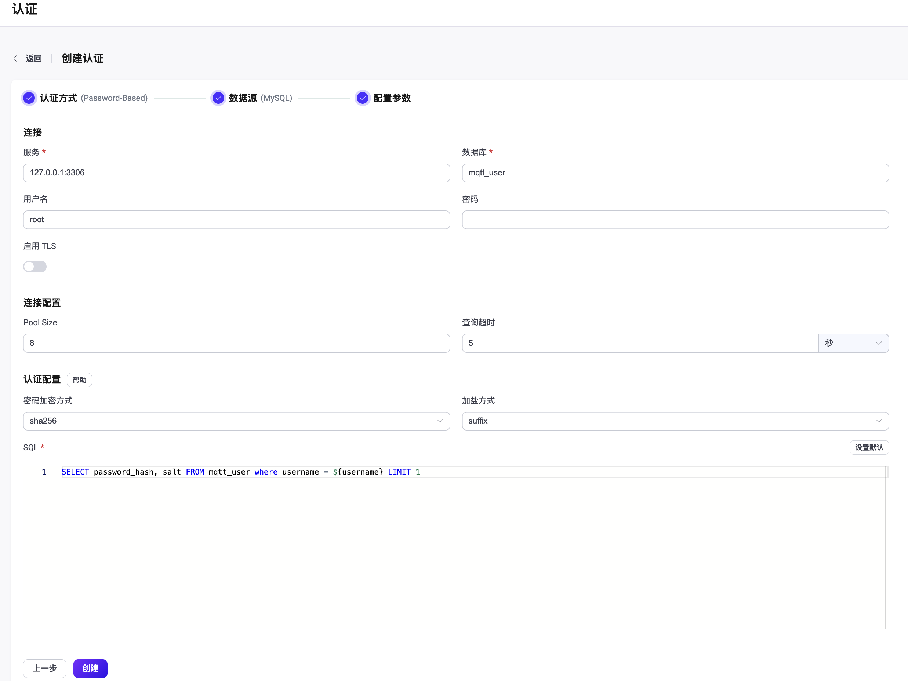

# 使用 MySQL 进行密码认证

作为密码认证方式的一种，EMQX 支持通过集成 MySQL 进行密码认证。

::: tip
前置准备：

- 熟悉 [EMQX 认证基本概念](../authn/authn.md)
:::

### 通过 Dashboard 配置

在 [EMQX Dashboard](http://127.0.0.1:18083/#/authentication)页面，点击左侧导航栏的**访问控制** -> **认证**，在随即打开的**认证**页面，单击**创建**，依次选择**认证方式**为 `Password-Based`，**数据源**为 `MySQL`，进入**配置参数**页签：

您可按照如下说明完成相关配置：

**连接：**在此部分完成到 MySQL 数据库的连接设置。

- **服务**：填入 MySQL 服务器地址 (`host:port`) 。
- **数据库**：填入 MySQL 的数据库名称。
- **用户名**（可选）：填入用户名称。
- **密码**（可选）：填入用户密码。

**TLS 配置**：配置是否启用 TLS。

**连接配置**：在此部分设置并发连接、是否自动重连以及连接超时等待时间。

- **Pool size**（可选）：填入一个整数用于指定从 EMQX 节点到 MySQL 数据库的并发连接数；默认值：**8**。
- **自动重连**：指定连接中断时 EMQX 是否自动重新连接到 MySQL；可选值：**True**（自动重连），**False**（不自动重连）；默认值：**True**。
- **查询超时**：填入连接超时等待时长，可选单位：**小时**、**分钟**、**秒**、**毫秒**。

**认证配置**：在此部分进行认证加密算法相关的配置。

- **密码加密方式**：选择存储密码时使用的散列算法，如 plain、md5、sha、bcrypt、pbkdf2 等。

  1. 选择 **plain**、**md5**、**sha**、**sha256** 或 **sha512** 算法，需配置：
     - **加盐方式**：用于指定盐和密码的组合方式，除需将访问凭据从外部存储迁移到 EMQX 内置数据库中外，一般不需要更改此选项；可选值：**suffix**（在密码尾部加盐）、**prefix**（在密码头部加盐）、**disable**（不启用）。注意：如选择 **plain**，加盐方式应设为 **disable**。

  1. 选择 **bcrypt** 算法，无需额外配置。

  1. 选择 **pkbdf2** 算法，需配置：

     - **伪随机函数**：指定生成密钥使用的散列函数，如 sha256 等。
     - **迭代次数**：指定散列次数，默认值：**4096**。<!--后续补充取值范围-->
     - **密钥长度**（可选）：指定希望得到的密钥长度。如不指定，密钥长度将由**伪随机函数**确定。
     - **SQL**：<!--需要补充-->

### 通过配置文件配置

您也可以通过配置文件完成以上配置，具体操作，请参考 xxxx
