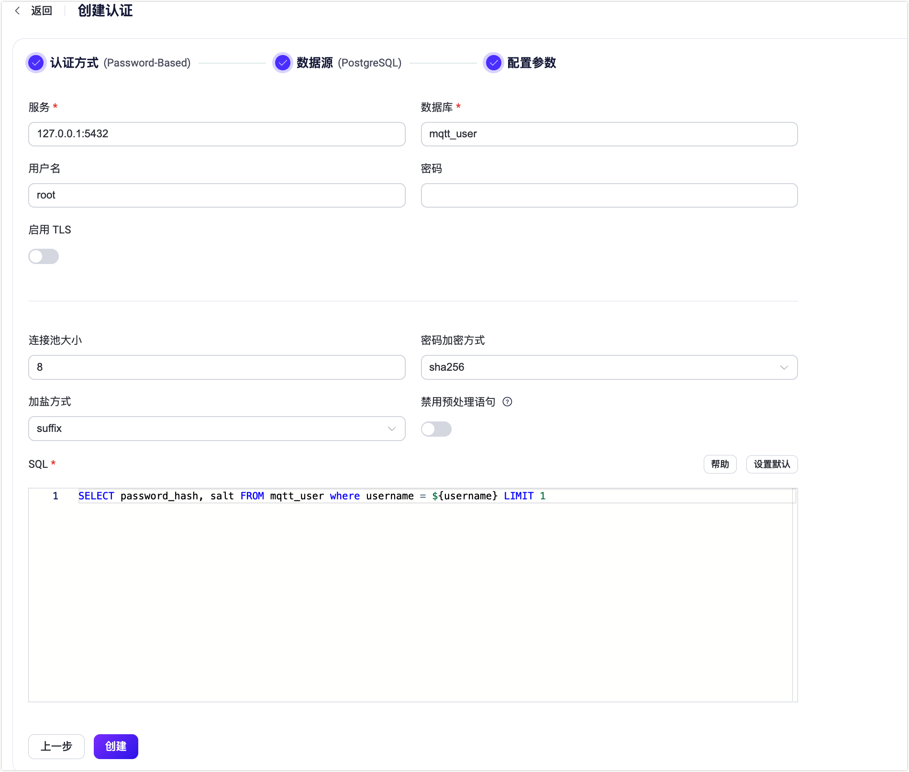

# 使用 PostgreSQL 进行密码认证

作为密码认证方式的一种，EMQX 支持通过集成 PostgreSQL 进行密码认证。

::: tip 前置准备：

- 熟悉 [EMQX 认证基本概念](../authn/authn.md)
:::

## 表结构与查询语句

PostgreSQL 认证器可以支持任何表结构，甚至是多个表联合查询、或从视图中查询。用户需要提供一个查询 SQL 模板，且确保查询结果包含以下字段：

- `password_hash`: 必需，数据库中的明文或散列密码字段
- `salt`: 可选，为空或不存在时视为空盐（`salt = ""`）
- `is_superuser`: 可选，标记当前客户端是否为超级用户，默认为 `false`

示例表结构：

```sql
CREATE TABLE mqtt_user (
  id serial PRIMARY KEY,
  username text NOT NULL UNIQUE,
  password_hash  text NOT NULL,
  salt text NOT NULL,
  is_superuser boolean DEFAULT false,
  created timestamp with time zone DEFAULT NOW()
);
```

:::tip
上面的示例创建了一个有助于查询的隐式 `UNIQUE` 索引字段（ `username` ）。当系统中有大量用户时，请确保查询使用的表已优化并使用有效的索引，以提升大量连接时的数据查找速度并降低 EMQX 负载。
:::

在此表中使用 `username` 作为查找条件。

例如我们希望添加一位名为 `emqx_u`、密码为 `public`、盐值为 `slat_foo123`、散列方式为 `sha256` 且超级用户标志为 `true` 的用户，SQL 如下：

```sql
INSERT INTO mqtt_user(username, password_hash, salt, is_superuser) VALUES ('emqx_u', '44edc2d57cde8d79c98145003e105b90a14f1460b79186ea9cfe83942fc5abb5', 'slat_foo123', true);
INSERT 0 1
```

对应的查询语句和密码散列方法配置参数为：

- 密码加密方式：`sha256`
- 加盐方式：`suffix`
- SQL：

```sql
SELECT password_hash, salt, is_superuser FROM mqtt_user WHERE username = ${username} LIMIT 1
```

## 通过 Dashboard 配置

在 EMQX Dashboard 页面上点击左侧导航栏的**访问控制** -> **客户端认证**，在随即打开的**客户端认证**页面，单击**+ 创建**，依次选择**认证方式**为 `Password-Based`，**数据源**为 `PostgreSQL`，点击**下一步**进入**配置参数**页签：



您可按照如下说明完成相关配置：

- **服务**：填入 PostgreSQL 服务器地址 (`host:port`) 。
- **数据库**：填入 PostgreSQL 的数据库名称。
- **用户名**（可选）：填入用户名称。
- **密码**（可选）：填入用户密码。
- **禁用预处理**（可选）：如果您使用的是不支持预处理语句会话的 PostgreSQL 服务，例如在事务模式下的 PGBouncer 或 Supabase，请启用此项。这个选项在  EMQX v5.7.1 中引入。
- **启用 TLS**：配置是否启用 TLS。

- **连接池大小**（可选）：填入一个整数用于指定从 EMQX 节点到 PostgreSQL 数据库的并发连接数；默认值：**8**。

- **密码加密方式**：选择存储密码时使用的散列算法，如 plain、md5、sha、bcrypt、pbkdf2 等。

  - 如果选择 **plain**、**md5**、**sha**、**sha256** 或 **sha512** 算法，还需配置：
    - **加盐方式**：用于指定盐和密码的组合方式，除需将访问凭据从外部存储迁移到 EMQX 内置数据库中外，一般不需要更改此选项；可选值：**suffix**（在密码尾部加盐）、**prefix**（在密码头部加盐）、**disable**（不启用）。注意：如选择 **plain**，加盐方式应设为 **disable**。

  - 如果选择 **pkbdf2** 算法，还需配置：

    - **伪随机函数**：指定生成密钥使用的散列函数，如 sha256 等。

  - **加盐方式**：用于指定盐和密码的组合方式，除需将访问凭据从外部存储迁移到 EMQX 内置数据库中外，一般不需要更改此选项；可选值：**suffix**（在密码尾部加盐）、**prefix**（在密码头部加盐）、**disable**（不启用）。注意：如选择 **plain**，加盐方式应设为 **disable**。
- 选择 **bcrypt** 算法，需配置:
- **Salt Rounds**：指定散列需要的计算次数（2^Salt Rounds），也称成本因子。默认值：**10**，可选值：**5～10**；数值越高，加密的安全性越高，因此建议采用较大的值，但相应的用户验证的耗时也会增加，您可根据业务需求进行配置。
- 选择 **pkbdf2** 算法，需配置：

    - **密钥长度**（可选）：指定希望得到的密钥长度。如不指定，密钥长度将由**伪随机函数**确定。

- **SQL**：根据表结构填入查询 SQL，具体要求见 [SQL 表结构与查询语句](#sql-表结构与查询语句)。

点击**创建**完成配置。

### 通过配置文件配置

您也可通过配置文件完成相关配置。 <!-- 具体操作步骤，请参考： [authn-postgresql:authentication](../../configuration/configuration-manual.html#authn-postgresql:authentication)。-->

配置示例：

```bash
{
  mechanism = password_based
  backend = postgresql

  password_hash_algorithm {
    name = sha256
    salt_position = suffix
  }

  database = mqtt
  username = postgres
  password = public
  server = "127.0.0.1:5432"
  query = "SELECT password_hash, salt, is_superuser FROM users where username = ${username} LIMIT 1"
}
```
