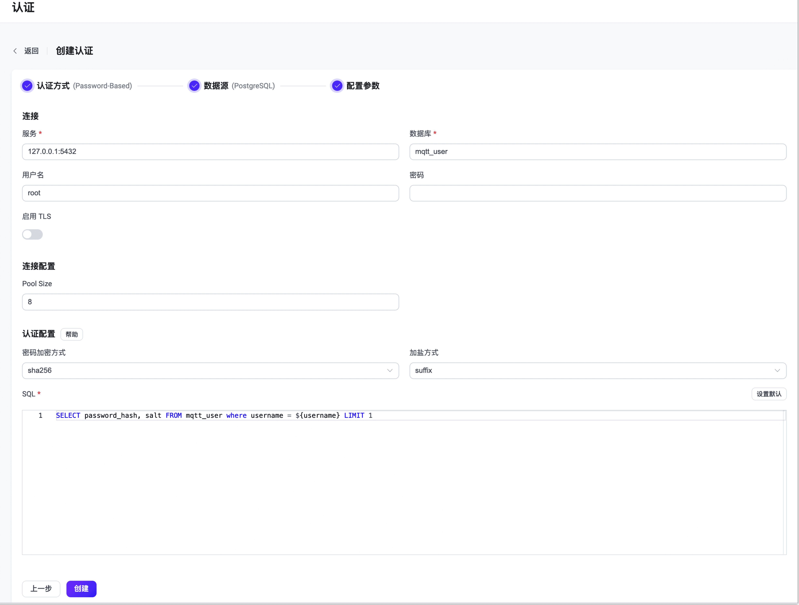

# 使用 PostgreSQL 进行密码认证

作为密码认证方式的一种，EMQX 支持通过集成 PostgreSQL 进行密码认证。

::: tip 前置准备：

- 熟悉 [EMQX 认证基本概念](../authn/authn.md)
:::

## 表结构与查询语句

PostgreSQL 认证器可以支持任何表结构，甚至是多个表联合查询、或从视图中查询。用户需要提供一个查询 SQL 模板，且确保查询结果包含以下字段：

- `password_hash`: 必需，数据库中的明文或散列密码字段
- `salt`: 可选，为空或不存在时视为空盐（`salt = ""`）
- `is_superuser`: 可选，标记当前客户端是否为超级用户，默认为 `false`

示例表结构：

```sql
CREATE TABLE mqtt_user (
  id serial PRIMARY KEY,
  username text NOT NULL UNIQUE,
  password_hash  text NOT NULL,
  salt text NOT NULL,
  is_superuser boolean DEFAULT false,
  created timestamp with time zone DEFAULT NOW()
);
```

:::tip
上面的示例创建了一个隐式的 `UNIQUE` 索引，当系统中有大量用户时，请确保查询使用的表已优化并使用有效的索引，以提升大量连接时的数据查找速度并降低 EMQX 负载。
:::

在此表中使用 `username` 作为查找条件。

例如我们希望添加一位名为 `emqx_u`、密码为 `public`、盐值为 `slat_foo123`、散列方式为 `sha256` 且超级用户标志为 `true` 的用户：

> PostgreSQL 中使用加密函数需要启用 pgcrypto 扩展。

```sql
postgres=# create extension pgcrypto;
CREATE EXTENSION

postgres=# INSERT INTO mqtt_user(username, password_hash, salt, is_superuser) VALUES ('emqx_u', encode(digest('public' || 'slat_foo123', 'sha256'), 'hex'), 'slat_foo123', true);
INSERT 0 1
```

对应的查询语句和密码散列方法配置参数为：

- 密码加密方式：`sha256`
- 加盐方式：`suffix`
- SQL：

```sql
SELECT password_hash, salt, is_superuser FROM mqtt_user WHERE username = ${username} LIMIT 1
```

## 通过 Dashboard 配置

在 [EMQX Dashboard](http://127.0.0.1:18083/#/authentication)页面，点击左侧导航栏的**访问控制** -> **认证**，在随即打开的**认证**页面，单击**创建**，依次选择**认证方式**为 `Password-Based`，**数据源**为 `PostgreSQL`，进入**配置参数**页签：



您可按照如下说明完成相关配置：

**连接**：在此部分完成到 PostgreSQL 数据库的连接设置。

- **服务**：填入 PostgreSQL 服务器地址 (`host:port`) 。
- **数据库**：填入 PostgreSQL 的数据库名称。
- **用户名**（可选）：填入用户名称。
- **密码**（可选）：填入用户密码。

**TLS 配置**：配置是否启用 TLS。

**连接配置**：在此部分设置并发连接数据。

- **Pool size**（可选）：填入一个整数用于指定从 EMQX 节点到 PostgreSQL 数据库的并发连接数；默认值：**8**。

**认证配置**：在此部分进行认证加密算法相关的配置。

- **密码加密方式**：选择存储密码时使用的散列算法，如 plain、md5、sha、bcrypt、pbkdf2 等。

  - 选择 **plain**、**md5**、**sha**、**sha256** 或 **sha512** 算法，需配置：

    - **加盐方式**：用于指定盐和密码的组合方式，除需将访问凭据从外部存储迁移到 EMQX 内置数据库中外，一般不需要更改此选项；可选值：**suffix**（在密码尾部加盐）、**prefix**（在密码头部加盐）、**disable**（不启用）。注意：如选择 **plain**，加盐方式应设为 **disable**。

  - 选择 **bcrypt** 算法，无需额外配置。

  - 选择 **pkbdf2** 算法，需配置：

    - **伪随机函数**：指定生成密钥使用的散列函数，如 sha256 等。
    - **迭代次数**：指定散列次数，默认值：**4096**。<!--后续补充取值范围-->
    - **密钥长度**（可选）：指定希望得到的密钥长度。如不指定，密钥长度将由**伪随机函数**确定。

- **SQL**：根据表结构填入查询 SQL，具体要求见 [SQL 表结构与查询语句](#sql-表结构与查询语句)。

### 通过配置文件配置

您也可通过配置文件完成相关配置，具体操作步骤，请参考： [authn-postgresql:authentication](../../configuration/configuration-manual.md#authn-postgresql:authentication)。

配置示例：

```
{
  mechanism = password_based
  backend = postgresql
  enable = true

  password_hash_algorithm {
    name = sha256
    salt_position = suffix
  }

  database = mqtt
  username = postgres
  password = public
  server = "127.0.0.1:5432"
  query = "SELECT password_hash, salt, is_superuser FROM users where username = ${username} LIMIT 1"
}
```
