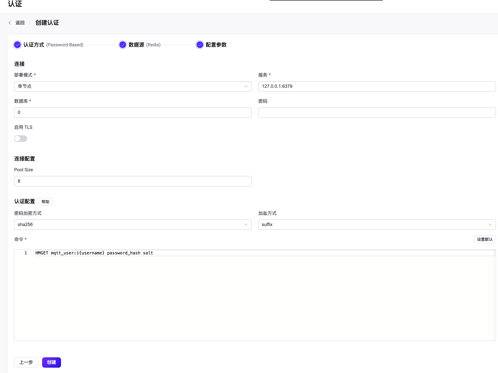

# 使用 Redis 进行密码认证

作为密码认证方式的一种，EMQX 支持通过集成 Redis 进行密码认证。EMQX 支持三种 Redis 部署模式：单节点 <!--需要插入对应连接-->、[Redis Sentinel](https://redis.io/docs/manual/sentinel/)、 [Redis Cluster](https://redis.io/docs/manual/scaling/)，本节将介绍如何进行相关配置。

::: tip
前置准备：

- 熟悉 [EMQX 认证基本概念](../authn/authn.md)
:::

### 通过 Dashboard 配置

在 [EMQX Dashboard](http://127.0.0.1:18083/#/authentication)页面，点击左侧导航栏的**访问控制** -> **认证**，在随即打开的**认证**页面，单击**创建**，依次选择**认证方式**为 `Password-Based`，**数据源**为 `Redis`，进入**配置参数**页签：



您可按照如下说明完成相关配置：

**连接**：在此部分完成到 Redis 数据库的连接设置。

- **部署模式**：选择 Redis 数据库的部署模式，可选值：**单节点**、**Sentinel**、**Cluster**
- **服务**（**列表**）：填入 Redis 服务器地址 (`host:port`) ；当部署模式选为 Sentinel 或 Cluster，您需在此提供所有相关 Redis 服务器的地址，不同地址之间以 `,` 分隔，格式为 `host1:port1,host2:port2,...`
- **Sentinel 名字**：指定 Redis Sentinel 配置需要的[主服务器名称](https://redis.io/docs/manual/sentinel/#configuring-sentinel)，仅需在**部署模式**设置为 **Sentinel** 时设置。
- **数据库**：整数，用于指定 Redis 数据库的 Index。
- **密码**（可选）：填入认证密码。

**TLS 配置**：配置是否启用 TLS。

**连接配置**：在此部分设置并发连接以及是否自动重连。

- **Pool size**（可选）：填入一个整数用于指定从 EMQX 节点到 MySQL 数据库的并发连接数；默认值：**8**。
- **自动重连**：指定连接中断时 EMQX 是否自动重新连接到 Redis；可选值：**True**（自动重连），**False**（不自动重连）；默认值：**True**。

**认证配置**：在此部分进行认证加密算法相关的配置。

- **密码加密方式**：选择存储密码时使用的散列算法，如 plain、md5、sha、bcrypt、pbkdf2 等。

  1. 选择 **plain**、**md5**、**sha**、**sha256** 或 **sha512** 算法，需配置：
     - **加盐方式**：用于指定盐和密码的组合方式，除需将访问凭据从外部存储迁移到 EMQX 内置数据库中外，一般不需要更改此选项；可选值：**suffix**（在密码尾部加盐）、**prefix**（在密码头部加盐）、**disable**（不启用）。注意：如选择 **plain**，加盐方式应设为 **disable**。

  1. 选择 **bcrypt** 算法，无需额外配置。

  1. 选择 **pkbdf2** 算法，需配置：

     - **伪随机函数**：指定生成密钥使用的散列函数，如 sha256 等。
     - **迭代次数**：指定散列次数，默认值：**4096**。<!--后续补充取值范围-->
     - **密钥长度**（可选）：指定希望得到的密钥长度。如不指定，密钥长度将由**伪随机函数**确定。
     - **命令**：<!--需要补充-->

## 通过配置文件配置

您可通过配置文件完成相关配置，详细配置步骤请参考 [authn-redis:standalone](../../admin/cfg.md#authn-redis:standalone)、[authn-redis:sentinel](../../admin/cfg.md#authn-redis:sentinel) 与 [authn-redis:cluster](../../admin/cfg.md#authn-redis:cluster)。

以下为各部署模式下的配置文件示例：

:::: tabs type:card

::: tab 单节点

```hocon
{
  mechanism = password_based
  backend = redis
  enable = true

  redis_type = single
  server = "127.0.0.1:6379"

  password_hash_algorithm {
      name = sha256
      salt_position = suffix
  }

  cmd = "HMGET mqtt_user:${username} password_hash salt is_superuser"
  database = 1
  password = "public"
  auto_reconnect = true
}
```

:::

::: tab Redis Sentinel 部署模式

```hocon
{
  mechanism = password_based
  backend = redis
  enable = true

  redis_type = sentinel
  servers = "10.123.13.11:6379,10.123.13.12:6379"
  sentinel = "mymaster"

  password_hash_algorithm {
      name = sha256
      salt_position = suffix
  }

  cmd = "HMGET mqtt_user:${username} password_hash salt is_superuser"
  database = 1
  password = "public"
  auto_reconnect = true
}
```

:::

::: tab Redis Cluster 部署模式

```hocon
{
  mechanism = password_based
  backend = redis
  enable = true

  redis_type = cluster
  servers = "10.123.13.11:6379,10.123.13.12:6379"

  password_hash_algorithm {
      name = sha256
      salt_position = suffix
  }

  cmd = "HMGET mqtt_user:${username} password_hash salt is_superuser"
  database = 1
  password = "public"
  auto_reconnect = true
}
```

:::

::::
