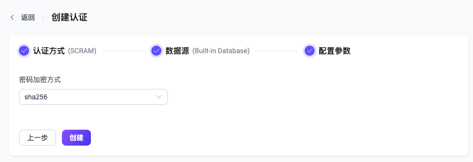

# MQTT 5.0 增强认证

EMQX 还为用户提供了基于 [Salted Challenge Response Authentication Mechanism（SCRAM）](https://doubleoctopus.com/security-wiki/protocol/salted-challenge-response-authentication-mechanism/)的增强认证功能。

SCRAM 认证是一种比密码认证更复杂的机制，它依赖与 MQTT 5.0 提供的增强认证机制，需要在连接期间交换额外的 MQTT 报文。同时由于 SCRAM 认证不依赖外部数据源，因此使用更加简单轻量。

::: tip
SCRAM 认证仅支持使用 MQTT v5.0 的连接。
:::

## 通过 Dashboard 配置

在 [EMQX Dashboard](http://127.0.0.1:18083/#/authentication) 页面，点击左侧导航栏的**访问控制** -> **认证**，在随即打开的**认证**页面，单击**创建**，依次选择**认证方式**为 `SCRAM`，**数据源**为 `Built-in Database`，进入**配置参数**页签：



按照实际需求选择**密码加密方式**为 **sha256** 或 **sha512**，点击**创建**完成设置。

## 通过配置文件配置

SCRAM 认证由 `mechanism = scram` and `backend = built_in_database` 标识，您也可以通过配置项完成相关配置，具体可参考：<!--需要添加连接文件-->

配置示例如下：

```
{
    mechanism = scram
    backend = built_in_database
    enable = true

    algorithm = sha512
    iteration_count = 4096
}
```

其中：

- `algorithm `对应 Dashboard 的密码加密方式；可选值：**sha256** 或 **sha512**
- `iteration_count`（可选）：输入一个整数以指定迭代次数，默认值： **4096**
