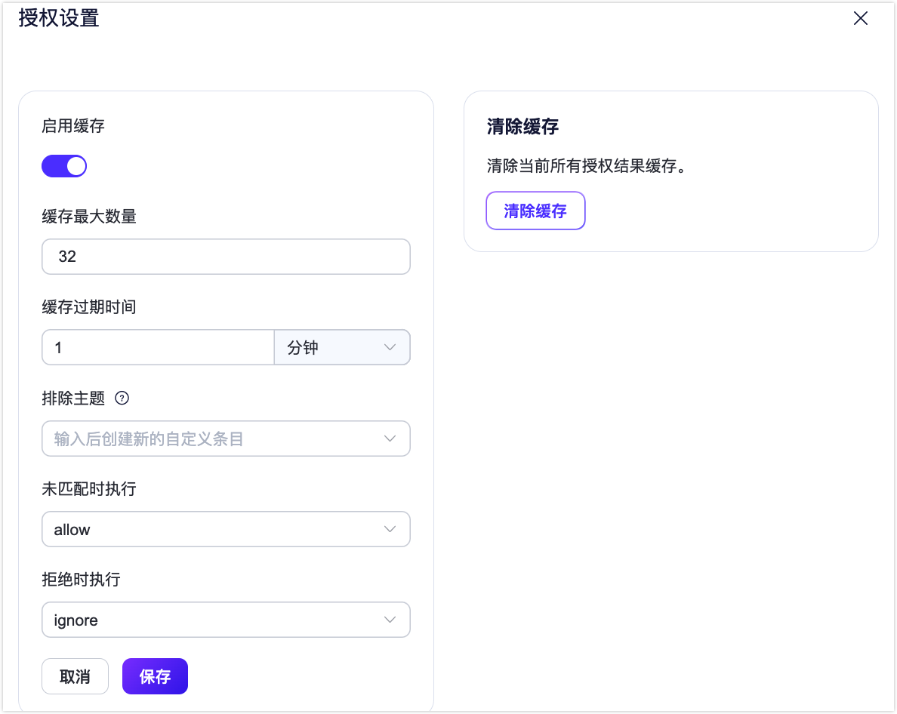

# 简介

在 EMQX 中，授权是指对 MQTT 客户端的发布和订阅操作进行权限控制。

## 工作原理

### 认证原理

授权机制在 EMQX 中的基本运作原理为：在客户端发布或订阅时，EMQX 将使用特定的流程或用户指定的查询语句从数据源中查询该客户端的权限列表，并根据匹配结果允许或拒绝当前操作。

### 授权链

除配置单个授权检查器外，EMQX 支持用户通过配置多个授权检查器构成授权链，以便更好地保护系统中的敏感信息和资源。EMQX 将按照授权链中配置的检查器顺序依次执行授权检查。如果在当前授权检查器中未检索到权限数据，将会切换至链上的下一个启用的授权检查器继续权限检查。

授权检查流程如下：

1. 当前授权检查器执行时检索到了客户端的权限信息，匹配当前执行的操作与客户端的权限信息：
   - 操作与权限匹配，根据权限允许或拒绝客户端的操作；
   - 操作与权限不匹配，交由下一授权检查器继续检查。
2. 当前授权检查器执行时没有检索到了客户端的权限信息，EMQX 将继续检查授权链中是否还有其他授权检查器：
   - 如有，EMQX 将跳过当前授权检查器，并将请求交由下一授权检查器继续检查；
   - 如当前授权检查器是链中最后一个授权检查器：根据**未匹配时执行**（ `no_match ` ）配置决定检查结果（允许或拒绝）。

有关如何设置并调整授权链及其运行数据统计，可查看管理认证器章节。<!--TODO这里需要加一个页面内超链接，另外如果能画一张流程图就更好了-->

### 授权数据缓存

EMQX 支持对授权数据进行缓存，以便缓解由于大量客户端的订阅和发布请求对授权数据后端造成的访问压力。您可直接通过 EMQX Dashboard 的**授权**页面（**访问控制** -> **授权** -> **设置**）设置是否启用缓存。



**启用缓存**：设置是否启用授权数据缓存。

**单客户端缓存条数**：单个客户端允许的最大缓存条数。<!--TODO这里需要解释下相关字段的配置，默认值、推荐值-->

**缓存 TTL**：<!--TODO需要补充-->

**未匹配时执行**：已配置的授权检查器中未找到相关客户端的授权信息时，应执行的操作；**可选值**：**allow**（允许操作）、**deny**（拒绝操作）<!--TODO需要补充默认值-->

**拒绝时执行**：已配置的授权检查器拒绝当前客户端的操作请求时，应执行的操作；可选值：**ignore**（忽略该操作请求）、**disconnect**（断开当前客户端的连接）<!--TODO需要补充默认值-->

**清除缓存**：清除当前所有授权结果缓存

<!--TODO这里需要增加配置文件的操作方式-->

::: tip
启用授权数据缓存后，系统性能将受到一定的影响，建议及时根据系统表现调整缓存参数的设置。
:::

### 占位符

EMQX 允许使用占位符动态构造授权数据查询语句、HTTP 请求，占位符会在授权检查器执行时替换为真实的客户端信息，以构造出与当前客户端匹配的查询语句或 HTTP 请求。

以 MySQL 授权检查器为例，默认的查询 SQL 中使用了 `${username}` 占位符：

```sql
SELECT action, permission, topic FROM mqtt_acl where username = ${username}
```

当用户名为 `emqx_u` 的客户端触发授权检查时，实际执行权限数据查询 SQL 将被替换为：

```sql
SELECT action, permission, topic FROM mqtt_acl where username = 'emqx_u'
```

#### 数据查询占位符

在查询权限数据时，EMQX 支持以下占位符：

- `${clientid}`: 将在运行时被替换为客户端 ID。客户端 ID 一般由客户端在 `CONNECT` 报文中显式指定，如果启用了 `use_username_as_clientid` 或 `peer_cert_as_clientid`，则会在连接时被用户名、证书中的字段或证书内容所覆盖。

- `${username}`: 将在运行时被替换为用户名。用户名来自 `CONNECT` 报文中的 `Username` 字段。如果启用了 `peer_cert_as_username`，则会在连接时被证书中的字段或证书内容所覆盖。

- `${password}`: 将在运行时被替换为密码。密码来自 `CONNECT` 报文中的 `Password` 字段。

- `${peerhost}`: 将在运行时被替换为客户端的 IP 地址。EMQX 支持 [Proxy Protocol](http://www.haproxy.org/download/1.8/doc/proxy-protocol.txt)，即使 EMQX 部署在某些 TCP 代理或负载均衡器之后，用户也可以使用此占位符获得真实 IP 地址。

- `${cert_subject}`: 将在运行时被替换为客户端 TLS 证书的主题（Subject），仅适用于 TLS 连接。

- `${cert_common_name}`: 将在运行时被替换为客户端 TLS 证书的通用名称（Common Name），仅适用于 TLS 连接。

#### 主题占位符

EMQX 还允许在匹配规则时将占位符用于主题，以实现动态主题。支持的占位符如下：

- `${clientid}`
- `${username}`

占位符只能用于替换主题的整个字段，例如 `a/b/${username}/c/d`，但是不能用于替换字段的一部分，例如 `a/b${username}c/d`。

为了避免占位符跟想要的主题冲突的问题，EMQX 5.0 中引入了一个 `eq` 语法，例如 `eq a/b/${username}/c/d`。
这样规则将会不做替换，而是保持 MQTT 主题 `a/b/${username}/c/d` 不变。

### 授权检查优先级

除了缓存与授权检查器之外，授权结果还可能受到认证阶段设置的[超级用户角色与权限](../authn/authn.md#超级用户与权限)影响。

如果客户端在认证阶段设置了超级用户角色，则发布订阅操作不会再触发授权检查；如果设置了权限列表，则优先匹配客户端权限数据。三者匹配优先级如下：

```bash
超级用户 > 权限数据 > 授权检查
```

::: tip

客户端权限列表需要提前存储到特定数据源（数据库、文件）中，更新对应的数据即可实现权限的运行时动态更新。

:::

## <!--管理认证器-->

### <!--设置并调整认证连-->

### <!--授权检查器状态-->

### <!--统计指标-->

## 集成授权数据存储对象

EMQX 授权机制支持与多种数据存储方式集成，包括内置数据库、文件、MySQL、PostgreSQL、MongoDB 和 Redis。用户可以通过 REST API 或 Dashboard 管理权限数据，或从 CSV 或 JSON 文件批量导入数据。

此外，EMQX 还支持用户通过 HTTP 对接自己开发的服务，借此实现更复杂的授权逻辑。

按照数据源来划分，EMQX 支持以下 7 种授权检查器，您可点击下方表格中的链接获取各授权检查器的配置方式：

| 数据存储    | 描述                                              |
| ----------- | ------------------------------------------------- |
| 内置数据库  | [使用内置数据库存放授权数据](./mnesia.md)         |
| MySQL       | [使用 MySQL 存放授权数据](./mysql.md)             |
| PostgreSQL  | [使用 PostgreSQL 存放授权数据](./postgresql.md)   |
| MongoDB     | [使用 MongoDB 存放授权数据](./mongodb.md)         |
| Redis       | [使用 Redis 存放授权数据](./redis.md)             |
| HTTP 服务器 | [通过访问外部 HTTP 服务来获取授权信息](./http.md) |
| File        | [通过文件存放授权信息](./file.md)                 |

例如，MySQL 授权检查器的配置文件为：

```hocon
{
    enable = true

    type = mysql
    database = "mqtt"
    username = "root"
    password = "public"

    query = "SELECT permission, action, topic FROM mqtt_acl WHERE username = ${username}"
    server = "127.0.0.1:3306"
}
```

### 配置方式

EMQX 提供了 3 种使用权限的配置方式，分别为：Dashboard、配置文件和 HTTP API。

#### Dashboard

在 Dashboard 的授权页面，您可直接完成相关授权检查器的配置，查看授权检查器状态，以及调整认证器在认证链中的位置。


#### 配置文件

您也可通过调整配置文件 `emqx-enterprise.conf` 中 `authentication` 相关字段进行授权检查器的配置。有关配置文件的存放路径，见 [安装与部署 - 文件和目录位置](../../deploy/install-introduction.md)。<!--TODO 这里需要加一个锚点，而且目前的跳转也不太正常-->

授权配置结构如下：

```hocon
authorization {
  sources = [
    { ...   },
    { ...   }
  ]
  no_match = allow
  deny_action = ignore
  cache {
    enable = true
    max_size = 32
    ttl = 1m
  }
}
```

其中：

- `sources`(可选)：带顺序的数组，用于配置授权检查器的数据源。有关各授权检查器的具体配置信息，请参考相应的配置文件文档。<!--TODO 这里需要加上对应的超链接-->
- `no_match`：如当前客户端操作无法匹配到任何规则，将基于此规则决定允许或拒绝操作；可选值： `allow` 、 `deny`；默认值： `allow`。此配置也是黑名单/白名单模式的开关。
- `deny_action`：如当前客户端的操作被拒绝，后续应执行的操作；可选值： `ignore` 、 `disconnect`；默认值： `ignore`。
  - `ignore`: 丢弃当前操作，例如，如针对发布动作，该消息会被丢弃；如针对订阅操作，该请求将被拒绝。
  - `disconnect`: 丢弃当前操作，并将客户端连接断开。
- `cache`：授权缓存的相关配置，包括以下字段：
  - `cache.enable`: 是否为授权开启缓存；默认值： `true`；注意：如果仅使用认证中提供权限信息进行权限检查，建议关闭缓存。
  - `cache.max_size`: 每个客户端允许缓存的最大授权结果数量 ；默认值 `32`；当缓存结果的数量超过上限时，老的记录将被删掉。
  - `cache.ttl`：缓存的有效时间，默认值： `1m`（一分钟）。

#### HTTP API

EMQX 为授权参数暴露如下 REST API 来支持进行运行时动态修改。

- `/api/v5/authorization/settings`: 查看、修改授权参数，例如 `no_match`， `deny_action` 和 `cache`
- `/api/v5/authorization/sources`: 用于管理授权检查器
- `/api/v5/authorization/cache`: 清除授权数据缓存
- `/api/v5/authorization/sources/built_in_database`: 内饰数据库数据管理

详细的请求方式与参数请参考 [HTTP API](../../admin/api.md)。
