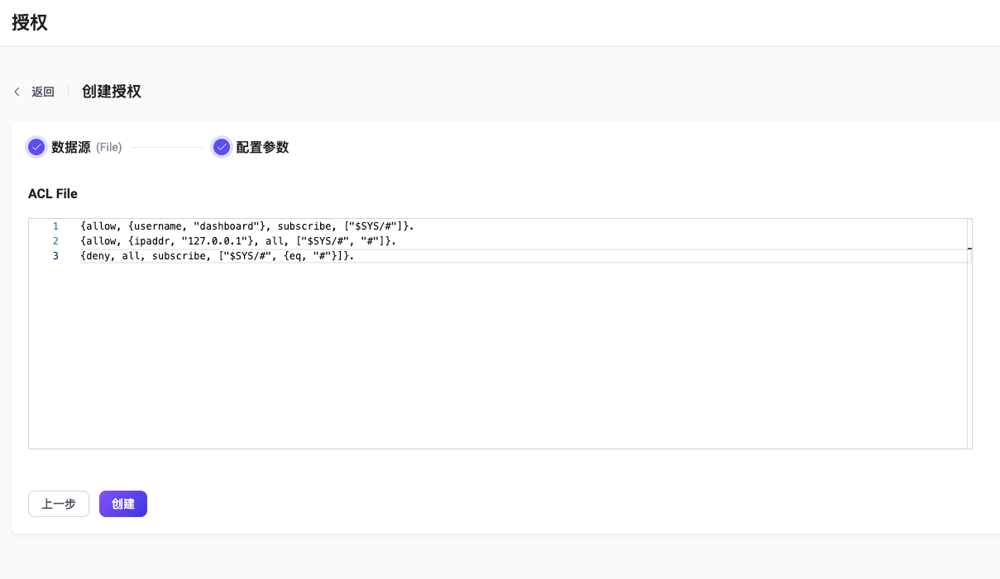

# ACL 文件

EMQX 支持基于 ACL 文件中存储的规则进行授权检查。您可在文件中配置多条授权检查规则，在收到客户端的操作请求后，EMQX 会按照从上到下的顺序进行授权规则匹配；在成功匹配到某条规则后，EMQX 将按设定允许或拒绝当前请求，并停止后续规则的匹配。

对于大量或复杂的授权检查规则配置，建议采用[基于数据库的方式](./mnesia.md)进行配置。

:::tip 前置准备：

- 熟悉 [EMQX 授权基本概念](./authz.md)
:::

## 文件格式

基于文件进行授权检查前，您需要将授权规则以 [Erlang 元组](https://www.erlang.org/doc/reference_manual/data_types.html#tuple) 数据列表的形式存储在文件中。

基本语法和概念如下：

- 元组是用花括号包起来的一个列表，各个元素用逗号分隔
- 每条规则应以 `.` 结尾
- 注释行以 `%%` 开头，在解析过程中会被丢弃

代码示例：

```erlang
%% 允许用户名是 dashboard 的客户端订阅 "$SYS/#" 这个主题
{allow, {user, "dashboard"}, subscribe, ["$SYS/#"]}.

%% 允许来自127.0.0.1 的用户发布和订阅 "$SYS/#" 以及 "#"
{allow, {ipaddr, "127.0.0.1"}, pubsub, ["$SYS/#", "#"]}.

%% 拒绝其他所有用户订阅 "$SYS/#" 和 "#" 主题
{deny, all, subscribe, ["$SYS/#", {eq, "#"}]}.

%% 如果前面的规则都没有匹配到，则允许所有操作
{allow, all}.
```

在每个元组中：

第一个元素表示该条规则对应的权限；可选值：

- `allow` （允许）
- `deny`（拒绝）

第二个元素用来指定适用此条规则的客户端，比如：

- `{username, "dashboard"}`：用户名为 `dashboard` 的客户端；也可写作`{user, "dashboard"}`
- `{username, {re, "^dash"}}`：用户名匹配 [正则表达式](https://www.erlang.org/doc/man/re.html#regexp_syntax) `^dash` 的客户端
- `{clientid, "dashboard"}`：客户端 ID 为 `dashboard` 的客户端，也可写作`{client, "dashboard"}`
- `{clientid, {re, "^dash"}}`：客户端 ID 匹配 [正则表达式](https://www.erlang.org/doc/man/re.html#regexp_syntax) `^dash` 的客户端
- `{ipaddr, "127.0.0.1"}`：源地址为 `127.0.0.1` 的客户端；支持 CIDR 地址格式。注意：如果 EMQX 部署在负载均衡器后侧，建议为 EMQX 的监听器开启 `proxy_protocol` 配置 <!--这里需要一个超链接，告诉用户如何配置-->，否则 EMQX 可能会使用负载均衡器的源地址。
- `{ipaddrs, ["127.0.0.1", ..., ]}`：来自多个源地址的客户端，不同 IP 地址之间以 `,` 区分
- `all`：匹配所有客户端
- `{'and', [Spec1, Spec2, ...]}` — 满足列表中所有规范的客户端。
- `{'or', [Spec1, Spec2, ...]}` — 满足列表中任何规范的客户端。

第三个元素用来指定该条规则对应的操作：

- `publish`：发布消息
- `subscribe`：订阅主题
- `all`：发布消息和订阅主题

第四个元素用于指定当前规则适用的 MQTT 主题，支持通配符（主题过滤器），可以使用[主题占位符](./authz.md#主题占位符)：

- `"t/${clientid}"`：使用了主题占位符，当客户端 ID 为 `emqx_c` 的客户端触发检查时，将精确匹配 `t/emqx_c` 主题
- `"$SYS/#"`：通过通配符匹配 `$SYS/` 开头的所有主题，如 `$SYS/foo`、 `$SYS/foo/bar`
- `{eq, "foo/#"}`：精确匹配 `foo/#` 主题，主题 `foo/bar` 将无法匹配，此处 `eq` 表示全等比较（equal）

另外还有 2 种特殊的规则，通常会用在 ACL 文件的末尾作为默认规则使用。

- `{allow, all}`：允许所有请求

- `{deny, all}`：拒绝所有请求

  

您可以通过 Dashboard 或直接编辑 `acl.conf` 文件修改规则。下面将指导您如何启用 File 授权检查器并编辑 `acl.conf` 文件。

## 通过 Dashboard 配置

在 [EMQX Dashboard](http://127.0.0.1:18083/#/authentication) 页面，点击左侧导航目录的 **访问控制** -> **授权** 进入**授权**页面。

EMQX 已默认配置了基于文件的授权检查器。您可点击 **File** 数据源对应的**操作**栏下的 **设置** 按钮查看或更改 ACL 文件中配置的授权规则。

在 **授权**页面，单击**创建**，选择**数据源**为 **File**，点击**下一步**，进入**配置参数**页签：



您可在 **ACL File** 区域编辑客户端访问规则，有关文件格式和对应字段的说明，可参考 [文件格式](#文件格式) 部分。

## 通过配置文件配置

<!--TODO 这部分需要在配置样例修改后修改，补充关键参数的解释。-->

您也可通过配置文件中的 `authorization` 字段配置文件规则。

配置示例：

```hocon
authorization {
  deny_action = ignore
  no_match = allow
  sources = [
    {
      type = file
      enable = true
      path = "etc/acl.conf"
    }
  ]
}
```

其中

- `type`：授权检查器的数据源类型，此处填入 `file`
- `enable`：是否激活该检查器，可选值：`true`、`false`
- `path`：配置文件路径，默认为：`etc/acl.conf`。 如果通过 Dashboard 或 REST API 对 File 授权检查器进行过修改，EMQX 会把新的文件保存到 `data/authz/acl.conf`，并且不再读取原文件中的配置。

详细参数列表，可参考 [authz-file](../../configuration/configuration-manual.md#authz-file)。

