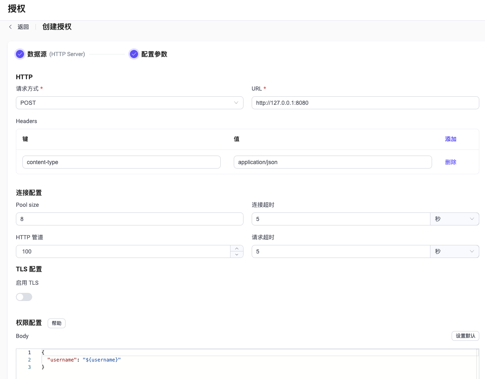

# 基于 HTTP 应用进行授权

EMQX 支持基于 HTTP 应用进行授权。此时，用户需在外部自行搭建一个 HTTP 应用作为数据源，EMQX 将向 HTTP 服务发起请求并根据 HTTP API 返回的数据判定授权结果，从而实现复杂的授权逻辑。

在 4.x 版本中，EMQX 仅会提示 HTTP API 返回的状态码，如  `200` 、`403`，内容则会被丢弃。为了向用户提供更多的信息，我们在 EMQX 5.0 版本中增加了对请求内容的返回。

::: tip 前置准备：

- 熟悉 [EMQX 授权基本概念](./authz.md)
  :::


## 通过 Dashboard 配置

在 [EMQX Dashboard](http://127.0.0.1:18083/#/authentication) 页面，点击左侧导航栏的**访问控制** -> **授权**，在随即打开的**授权**页面，单击**创建**，选择**数据源**为 `HTTP Server`，点击**下一步**，进入**配置参数**页签：



**HTTP**：<!--插入简要说明，这快要配置什么-->

- **请求方式**：选择 HTTP 请求方式，可选值： `get` 、 `post`

  ::: tip
  推荐使用 `POST` 方法。 使用 `GET` 方法时，一些敏感信息（如纯文本密码）可能通过 HTTP 服务器日志记录暴露。此外，对于不受信任的环境，请使用 HTTPS。
  :::

- **URL**：输入 HTTP 应用的 IP 地址。

- **Headers**（可选）：完成 HTTP 请求头的配置 <!--键、值和添加这块内容需要补充下-->

**连接配置**：在此部分进行并发连接、连接超时等待时间、最大 HTTP 请求数以及请求超时时间。

- **Pool size**（可选）：整数，指定从 EMQX 节点到外部 HTTP Server 的并发连接数；默认值：**8**。<!--有范围吗？-->
- **连接超时**（可选）：填入连接超时等待时长，可选单位：**小时**、**分钟**、**秒**、**毫秒**。
- **HTTP 管道**（可选）：正整数，指定无需等待响应可发出的最大 HTTP 请求数；默认值：**100**。
- **请求超时**（可选）：填入连接超时等待时长，可选单位：**小时**、**分钟**、**秒**、**毫秒**

**TLS 配置**：配置是否启用 TLS。

**权限配置**：在此处完成 HTTP 请求体的配置。

<!--需要补上相关信息-->

最后点击**创建**完成相关配置。


## 请求格式与返回结果

当客户端发起订阅、发布操作时，HTTP Authorizer 会根据配置的请求模板构造并发送请求。用户需要在授权服务中实现授权逻辑并按以下要求返回结果：

- 响应编码格式 `content-type` 必须是 `application/json`
- 认证结果通过 body 中的 `result` 标示，可选 `alow`、`deny`、`ignore`
- 响应状态码 `Status Code` 应当为 `200` 或 `204`，返回 4xx/5xx 状态码时将忽略 body 并判定结果为 `ignore`，继续执行认证链

请求示例：

```json
HTTP/1.1 200 OK
Headers: Content-Type: application/json
...
Body:
{
    "result": "allow" | "deny" | "ignore" // Default `"ignore"`
}
```

::: tip EMQX 4.x 兼容性说明
在 4.x 中，EMQX 仅用到了 HTTP API 返回的状态码，而内容则被丢弃。例如 `200` 表示 `allow`，`403` 表示 `deny`。

因为缺乏丰富的表达能力，在 5.0 中对这一机制进行了不兼容的调整。
:::

::: tip
推荐使用 `POST` 方法。 使用 `GET` 方法时，一些敏感信息可能通过 HTTP 服务器日志记录暴露。
对于不受信任的环境，应使用 HTTPS。
:::

## 配置项

支持 HTTP `POST` 和 `GET` 请求，它们各自都有一些特定的选项。详细配置请参考  [authz:http_post](../../configuration/configuration-manual.md#authz:http_post)与 [authz:http_get](../../configuration/configuration-manual.md#authz:http_get)。

HTTP 授权必需使用 `type=http`的配置。

使用 POST 请求配置的示例：

```hocon
{
    type = http
    enable = true

    method = post
    url = "http://127.0.0.1:8080/authz?clientid=${clientid}"
    body {
        username = "${username}"
        topic = "${topic}"
        action = "${action}"
    }
    headers {
        "Content-Type" = "application/json"
        "X-Request-Source" = "EMQX"
    }
}
```

使用 GET 请求配置的示例：

```hocon
{
    type = http
    enable = true

    method = get
    url = "http://127.0.0.1:8080/authz"
    body {
        clientid = "${clientid}"
        username = "${username}"
        topic = "${topic}"
        action = "${action}"
    }
    headers {
        "X-Request-Source" = "EMQX"
    }
}
```

### method

该配置为必填字段，用于指定 http 方法，可以是 `get` 或者 `post`。

### url

发送 HTTP 请求的 URL，可以使用如下[占位符](./authz.md#数据查询占位符):

- `${clientid}`: 客户端的 ID。
- `${username}`: 客户端登录是用的用户名。
- `${peerhost}`: 客户端的源 IP 地址。
- `${proto_name}`: 客户端使用的协议名称。例如 `MQTT`，`CoAP` 等。
- `${mountpoint}`: 网关监听器的挂载点（主题前缀）。
- `${action}`: 当前执行的动作请求，例如 `publish`，`subscribe`。
- `${topic}`: 当前请求想要发布或订阅的主题（或主题过滤器）

如果 URL 为 `https`，必须同时启用 `ssl`：

```hocon
{
    ...
    url = "https://127.0.0.1:8080/authz?clientid=${clientid}"
    ssl {
        enable = true
    }
}

```

### body

请求模板，对于 `post` 请求，它以 JSON 形式在请求体中发送。
对于 `get` 请求，它被编码为 URL 中的查询参数。映射键和值可以包含 [占位符](./authz.md#数据查询占位符).

根据配置项的不同 `body` 的序列化方式也可能不同。

假设一个 MQTT 客户端使用客户端标识符 `emqx_c`、用户名 `emqx_u` 向 `t/1` 主题发布消息。

1. `GET` 请求配置如下：

```hocon
{
    method = get
    url = "http://127.0.0.1:8080/authz/${clientid}"
    body {
        username = "${username}"
        topic = "${topic}"
        action = "${action}"
    }
}
```

最终的 HTTP 请求会是下面这样：

```bash
GET /authz/emqx_c?username=emqx_u&topic=t%2F1&action=publish HTTP/1.1
... Headers ...
```

2. `POST` JSON 格式的请求配置如下：

```hocon
{
    method = post
    url = "http://127.0.0.1:8080/authz/${clientid}"
    body {
        username = "${username}"
        topic = "${topic}"
        action = "${action}"
    }
    headers {
        "content-type": "application/json"
    }
}
```

最终的 HTTP 请求会是下面这样：

```bash
POST /authz/emqx_c HTTP/1.1
Content-Type: application/json
... Other headers ...

{"username":"emqx_u","topic":"t/1", "action": "publish"}
```

### headers

配置 HTTP 授权请求中的 Headers，可选。

对于 `GET` 请求有以下默认 Headers：

```hocon
{
    "accept" = "application/json"
    "cache-control" = "no-cache"
    "connection" = "keep-alive"
    "keep-alive" = "timeout=30, max=1000"
}
```

`GET` 请求的 Headers 不能包含 `Content-Type` Header。

对于 `POST` 请求有以下默认 Headers：

```hocon
{
    "accept" = "application/json"
    "cache-control" = "no-cache"
    "connection" = "keep-alive"
    "keep-alive" = "timeout=30, max=1000"
    "content-type" = "application/json"
}
```

`content-type` Header 的值定义了 `POST` 请求的 `body` 编码方式，目前仅支持 `application/json`。

### enable_pipelining

正整数，用于指定可以无需等待响应发出的 HTTP 请求的最大数量 [HTTP pipelining](https://wikipedia.org/wiki/HTTP_pipelining)。可选，默认值为 `100`，设置为 `1` 表示关闭 HTTP pipelining 功能，即恢复成常规的同步请求响应模式。

### 请求配置

以下都是可选字段，

```hocon
  connect_timeout = 15s # 连接超时
  max_retries = 5 # 最大重试次数
  request_timeout = 30s # 请求超时限制
  retry_interval = 1s # 重试中间间隔
```

### pool_size

可选的整型配置，用于指定 EMQX 节点到 HTTP 服务器的并发连接数，默认值为 8。

### ssl

用于连接到外部 HTTP 服务器的标准 [SSL 选项](../../configuration/configuration.md#tls-ciphers)。
