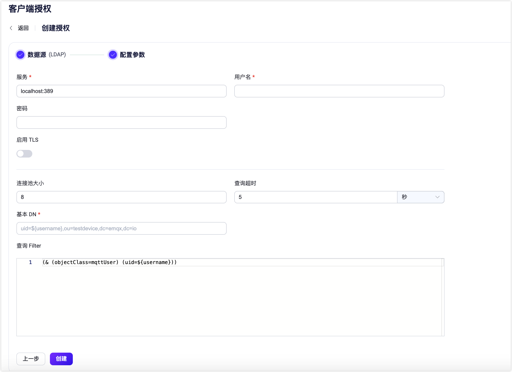

# 基于 LDAP 进行授权

[轻量级目录访问协议（LDAP）](https://ldap.com/) 是一种用于访问和管理目录信息的协议。EMQX 支持与 LDAP 服务器集成，用于进行授权检查。LDAP 授权器通过将发布/订阅请求与存储在LDAP服务器中的属性列表进行匹配来实施授权检查。

::: tip 前置准备

- 熟悉 [EMQX 认证基本概念](../authn/authn.md)。

:::

## 数据结构与查询

LDAP 授权器根据存储在 LDAP 目录中的授权数据检查客户端授权。LDAP 数据格式定义了组织和存储授权数据的结构和规则。LDAP 授权器支持几乎任何 LDAP 数据结构。以下是 OpenLDAP 的一个数据格式示例：

```sql

attributetype ( 1.3.6.1.4.1.11.2.53.2.2.3.1.2.3.4.1 NAME ( 'mqttPublishTopic' 'mpt' )
	EQUALITY caseIgnoreMatch
	SUBSTR caseIgnoreSubstringsMatch
	SYNTAX 1.3.6.1.4.1.1466.115.121.1.15
	USAGE userApplications )
attributetype ( 1.3.6.1.4.1.11.2.53.2.2.3.1.2.3.4.2 NAME ( 'mqttSubscriptionTopic' 'mst' )
	EQUALITY caseIgnoreMatch
	SUBSTR caseIgnoreSubstringsMatch
	SYNTAX 1.3.6.1.4.1.1466.115.121.1.15
	USAGE userApplications )
attributetype ( 1.3.6.1.4.1.11.2.53.2.2.3.1.2.3.4.3 NAME ( 'mqttPubSubTopic' 'mpst' )
	EQUALITY caseIgnoreMatch
	SUBSTR caseIgnoreSubstringsMatch
	SYNTAX 1.3.6.1.4.1.1466.115.121.1.15
	USAGE userApplications )

objectclass ( 1.3.6.1.4.1.11.2.53.2.2.3.1.2.3.4 NAME 'mqttUser'
    SUP top
	STRUCTURAL
	MAY ( mqttPublishTopic $ mqttSubscriptionTopic $ mqttPubSubTopic  ) )

```
LDAP 授权器采用允许列表策略。用户需要为每个操作定义一个主题列表（支持通配符）。只有当操作的主题匹配时，操作才会被允许，否则 LDAP 授权器将忽略它。

以下是基于 OpenLDAP 数据格式示例、使用 [LDAP 数据交换格式（LDIF）](https://ldap.com/ldif-the-ldap-data-interchange-format/) 定义的 LDAP 授权数据示例：

```sql

## create organization: emqx.io
dn:dc=emqx,dc=io
objectclass: top
objectclass: dcobject
objectclass: organization
dc:emqx
o:emqx,Inc.

## create organization unit: testdevice.emqx.io
dn:ou=testdevice,dc=emqx,dc=io
objectClass: top
objectclass:organizationalUnit
ou:testdevice

dn:uid=mqttuser0001,ou=testdevice,dc=emqx,dc=io
objectClass: top
objectClass: mqttUser
uid: mqttuser0001
## allows publishing to these 3 topics
mqttPublishTopic: mqttuser0001/pub/1
mqttPublishTopic: mqttuser0001/pub/+
mqttPublishTopic: mqttuser0001/pub/#
## allows subscribe to these 3 topics
mqttSubscriptionTopic: mqttuser0001/sub/1
mqttSubscriptionTopic: mqttuser0001/sub/+
mqttSubscriptionTopic: mqttuser0001/sub/#
## the underneath topics allow both publish or subscribe
mqttPubSubTopic: mqttuser0001/pubsub/1
mqttPubSubTopic: mqttuser0001/pubsub/+
mqttPubSubTopic: mqttuser0001/pubsub/#

dn:uid=mqttuser0002,ou=testdevice,dc=emqx,dc=io
objectClass: top
objectClass: mqttUser
uid: mqttuser0002
mqttPublishTopic: mqttuser0002/pub/#
mqttSubscriptionTopic: mqttuser0002/sub/1
mqttPubSubTopic: mqttuser0002/pubsub/#

```

所提供的示例为每个操作定义了一个多值属性。每个属性可以根据允许的主题数量重复零次或多次。

编辑 LDAP 配置文件 `sladp.conf`，使其包含数据结构和 LDIF 文件。在启动 LDAP 服务器时将引用数据结构。下面是一个示例`sladp.conf` 文件：

::: tip

您可以根据您的业务需求决定如何存储和访问认证信息。

:::

```sh
include         /usr/local/etc/openldap/schema/core.schema
include         /usr/local/etc/openldap/schema/cosine.schema
include         /usr/local/etc/openldap/schema/inetorgperson.schema
include         /usr/local/etc/openldap/schema/emqx.schema

TLSCACertificateFile  /usr/local/etc/openldap/cacert.pem
TLSCertificateFile    /usr/local/etc/openldap/cert.pem
TLSCertificateKeyFile /usr/local/etc/openldap/key.pem

database mdb
suffix "dc=emqx,dc=io"
rootdn "cn=root,dc=emqx,dc=io"
rootpw {SSHA}eoF7NhNrejVYYyGHqnt+MdKNBh4r1w3W

directory       /usr/local/etc/openldap/data
```

## 通过 Dashboard 配置

您可以使用 EMQX Dashboard 配置如何使用 LDAP 进行授权。

1. 在 EMQX Dashboard 页面上点击左侧导航栏的**访问控制** -> **客户端授权**，进入**客户端授权**页面。

2. 单击**+ 创建**，选择 **LDAP** 作为 **数据源**。点击**下一步**进入**配置参数**页签：

   

3. 按照以下说明进行配置：

   - **连接设置**：填写连接到 LDAP 服务器所需的信息。
     - **服务器**：指定 EMQX 要连接的服务器地址（`主机：端口`）。
     - **用户名**：指定 LDAP 根用户名称。
     - **密码**：指定 LDAP 根用户密码。

   **TLS 配置**：如果要启用TLS，请打开切换按钮。有关启用TLS的更多信息，请参见[网络和TLS](../../network/overview.md)。

   - **连接配置**：设置并发连接数和连接超时前的等待时间。
     - **连接池大小**（可选）：输入一个整数值来定义EMQX节点到 LDAP 的并发连接数。默认值：`8`。
     - **查询超时**（可选）：指定 EMQX 在查询超时之前的等待时间。支持的单位包括毫秒、秒、分钟和小时。

   **授权配置**：填写与授权相关的设置：

   - **基本 DN**：相对于要执行搜索的基本对象条目（或可能是根）的名称。有关更多信息，请参见 [RFC 4511搜索请求](https://datatracker.ietf.org/doc/html/rfc4511#section-4.5.1)，支持使用占位符。

     ::: 提示

     DN 指的是专有名称。这是每个条目的唯一标识符，它还描述了条目在信息树中的位置。

     :::

   - **查询 Filter**：LDAP 查询筛选器，定义搜索匹配给定条目必须满足的条件。 过滤器的语法遵循 [RFC 4515](https://www.rfc-editor.org/rfc/rfc4515)，也支持占位符。

   - **发布属性**: 填写列出允许发布主题的属性。

   - **订阅属性**: 填写列出允许订阅主题的属性。

   - **发布订阅属性**: 填写列出允许发布和订阅主题的属性。

4. 点击**创建**完成设置。

## 通过配置文件配置

您也可通过配置文件配置 LDAP 授权器。

LDAP 授权通过 `type = ldap` 进行标识。

配置示例：

```bash
{
  type = ldap
  enable = true

  server = "127.0.0.1:389"
  publish_attribute = "mqttPublishTopic"
  subscribe_attribute = "mqttSubscriptionTopic"
  all_attribute = "mqttPubSubTopic"
  query_timeout = "5s"
  username = "root"
  password = "root password"
  pool_size = 8
  base_dn = "uid=${username},ou=testdevice,dc=emqx,dc=io"
  filter = "(objectClass=mqttUser)"
}
```
