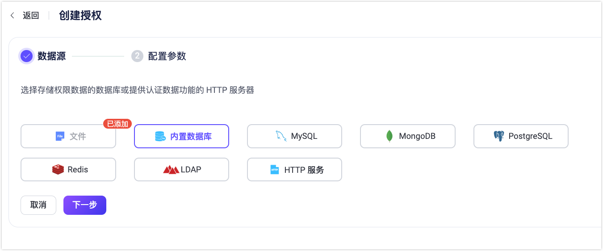
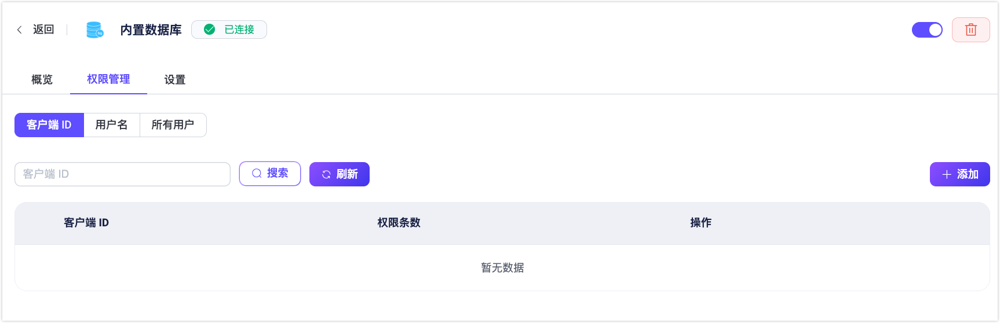

# 内置数据库授权

EMQX 通过内置数据库为用户提供了一种低成本、开箱即用的授权规则存储方式。您可以通过 Dashboard 或配置文件设置使用内置数据库作为数据源，通过 Dashboard 或 HTTP API 添加相关授权检查规则。

::: tip 前置准备

熟悉 [EMQX 授权基本概念](./authz.md)
:::

## 通过 Dashboard 创建内置数据库授权器

1. 在 [EMQX Dashboard](http://127.0.0.1:18083/#/authentication) 中，点击左侧菜单的**访问控制** > **授权**，进入**授权**页面。

2. 点击右上角的**创建**按钮，在**数据源**中选择**内置数据库**，然后点击 **下一步**。

   

3. 在**配置参数**步骤中，设置**最大规则数**（默认值为 `100`），该参数用于限制每个客户端或用户允许配置的最大权限规则数量。

   ::: tip 提示

   设置过多的权限规则可能会影响系统性能。

   :::

4. 点击**创建**完成设置。

## 通过配置文件创建内置数据库授权器

您也可通过配置文件中的 `authorization` 字段配置通过 EMQX 内置数据库存储授权规则。

代码示例：

```hcl
{
    type = built_in_database
    enable = true
}
```

其中

- `type`：授权检查器的数据源类型，此处填入 `built_in_database`
- `enable`：是否激活该检查器，可选值：`true`、`false`

<!--详细参数列表，请参考 [authz-mnesia](../../configuration/configuration-manual.html#authz-mnesia)。-->

## 创建授权检查规则

您可以通过 Dashboard 或 REST API 创建授权检查规则。

### 通过 Dashboard 创建授权检查规则

您可以在 EMQX Dashboard 中的**内置数据库**后端**权限管理**页面直接定义授权检查规则。

#### 进入权限管理页面

1. 在 Dashboard 中，进入**访问控制**页面。
2. 在已创建的**内置数据库**后端的**操作**列中，点击**权限管理**。



#### 授权检查规则作用范围

权限规则可以在以下三个作用范围内配置：

- **客户端 ID**：将规则应用于特定客户端 ID。
- **用户名**：将规则应用于特定用户名。
- **全部用户**：将规则应用于所有客户端/用户，可选按匹配模式或 IP 范围进行过滤。

#### 通用规则字段

以下字段适用于所有类型的规则：

| 字段            | 说明                                                         |
| --------------- | ------------------------------------------------------------ |
| **操作**        | 规则适用的操作类型，可选：`发布时`、`订阅时`、`发布和订阅时`。 |
| **权限**        | 是否允许该操作，可选：`允许`、`拒绝`。                       |
| **主题**        | 规则适用的 MQTT 主题，支持通配符（`+`、`#`）。               |
| **QoS**         | 允许的 QoS 等级，可多选：`0`、`1`、`2`。                     |
| **Retain**      | 是否将规则应用于保留消息，可选：`true`、`false`、`全部`。    |
| **IP 地址范围** | 规则适用的客户端 IP 范围，支持 CIDR 表示法（如 `192.168.1.0/24`）或精确 IP。 |
| **监听器**      | 规则适用的监听器，格式 `{监听器类型}:{监听器名称}`，如 `tcp:default`、`ws:default`。 |
| **Zone**        | 规则生效的 Zone 区域，适用于多 Zone 部署。                   |

#### 不同作用范围规则的专用字段

| 作用范围      | 字段                                                         |
| ------------- | ------------------------------------------------------------ |
| **客户端 ID** | **客户端 ID**：（必填）规则适用的精确客户端 ID。<br />**用户名表达式**：（可选）匹配用户名的正则表达式。 |
| **用户名**    | **用户名**：（必填）规则适用的精确用户名。<br />**客户端 ID 表达式**：（可选）匹配客户端 ID 的正则表达式。 |
| **全部用户**  | **客户端 ID 表达式**：（可选）匹配客户端 ID 的正则表达式。<br/>**用户名表达式**：（可选）匹配用户名的正则表达式。 |

**匹配模式示例：**

- `^device-user-.*`：匹配以 `device-user-` 开头的用户名。
- `^sensor-.*`：匹配以 `sensor-` 开头的客户端 ID。

#### 创建规则

1. 在**权限管理**页面中，选择目标标签页：**客户端 ID**、**用户名**或**全部用户**。
2. 点击**添加**。
3. 填写[通用规则字段](#通用规则字段)以及对应作用范围的[专用字段](#不同作用范围规则的专用字段)。
4. （可选）点击**添加权限**可一次性新增多条规则（仅适用于”客户端 ID“ 和”用户名“规则）。可使用**上移**或**下移**调整规则执行顺序。
5. 点击**添加**保存规则。

#### 管理规则顺序（仅适用于“全部用户”）

对于**全部用户**规则，您可以通过**操作**列的**更多**菜单调整规则顺序：

- 上移
- 下移
- 移到顶部
- 移到底部

规则按从上到下的顺序依次执行，顺序会影响优先级。

#### 编辑和管理规则

在**权限管理**页面，您可以对已有规则进行编辑或删除：

- 点击对应规则**操作**列中的**编辑**按钮可修改规则字段、匹配模式或 IP 范围等设置。
- 点击**删除**按钮可移除规则。

### 通过 REST API 创建授权检查规则

您也可以通过 REST API 来管理授权规则。API 的端点与 Dashboard 中的三种作用域直接对应：用户名、客户端 ID 和全部用户。

#### 接口端点

- **用户名规则**
  - `POST /authorization/sources/built_in_database/rules/users`：为指定用户创建规则。
  - `PUT /authorization/sources/built_in_database/rules/users/:username`：替换某个用户的规则。
- **客户端 ID 规则**
  - `POST /authorization/sources/built_in_database/rules/clients`：为指定客户端创建规则。
  - `PUT /authorization/sources/built_in_database/rules/clients/:clientid`：替换某个客户端的规则。
- **全部用户规则**
  - `POST /authorization/sources/built_in_database/rules/all`：创建或替换适用于所有客户端/用户的全局规则。
  - 不支持 `PUT` 请求，仅支持使用 `POST` 来更新或创建所有规则。

#### 步骤 1：获取认证 Token

你需要先通过 EMQX Dashboard 登录认证，以获取 API 访问所需的 Token：

```bash
export EMQX_TOKEN=$(curl --silent -X 'POST' "http://localhost:18083/api/v5/login" \
  -H 'Accept: application/json' \
  -H 'Content-Type: application/json' \
  -d '{"username": "admin","password": "public"}' | jq -r ".token")
```

#### 步骤 2：创建内置数据库授权源

在创建规则之前，请确保已创建内置数据库授权源：

```bash
curl -X 'POST' \
  'http://localhost:18083/api/v5/authorization/sources' \
  -H "Authorization: Bearer $EMQX_TOKEN" \
  -H 'Accept: */*' \
  -H 'Content-Type: application/json' \
  -d '{
        "enable": true,
        "max_rules": 100,
        "type": "built_in_database"
  }'
```

#### 步骤 3：创建授权规则

你可以为以下对象创建规则：

- **指定 client ID 的客户端**：

  ```bash
  curl -X 'POST' \
    'http://localhost:18083/api/v5/authorization/sources/built_in_database/rules/clients' \
    -H "Authorization: Bearer $EMQX_TOKEN" \
    -H 'Accept: */*' \
    -H 'Content-Type: application/json' \
    -d '[
    {
      "clientid": "client1",
      "rules": [
        {
          "action": "publish",
          "permission": "allow",
          "topic": "test/topic/1"
        },
        {
          "action": "subscribe",
          "permission": "allow",
          "topic": "test/topic/2"
        },
        {
          "action": "all",
          "permission": "deny",
          "topic": "eq test/#"
        }
      ]
    }
  ]'
  ```

- **指定用户名的客户端**：

  ```bash
  curl -X 'POST' \
    'http://localhost:18083/api/v5/authorization/sources/built_in_database/rules/users' \
    -H "Authorization: Bearer $EMQX_TOKEN" \
    -H 'Accept: */*' \
    -H 'Content-Type: application/json' \
    -d '[
    {
      "username": "user1",
      "rules": [
        {
          "topic": "v1/devices/#",
          "permission": "allow",
          "action": "publish",
          "qos": [0,1,2],
          "retain": "all"
        }
      ]
    }
  ]'
  ```

#### 示例：为用户更新规则

```bash
curl -X PUT 'http://localhost:18083/api/v5/authorization/sources/built_in_database/rules/users/user1' \
  -H "Authorization: Bearer $EMQX_TOKEN" \
  -H 'Content-Type: application/json' \
  -d '{
    "username": "user1",
    "rules": [
      {
        "topic": "v1/devices/+/state",
        "permission": "allow",
        "action": "subscribe",
        "qos": [0,1],
        "retain": "all"
      }
    ]
  }'
```

#### 示例：为全部用户创建规则

```bash
curl -X POST 'http://localhost:18083/api/v5/authorization/sources/built_in_database/rules/all' \
  -H "Authorization: Bearer $EMQX_TOKEN" \
  -H 'Content-Type: application/json' \
  -d '[
    {
      "rules": [
        {
          "topic": "v1/#",
          "permission": "deny",
          "action": "all"
        }
      ]
    }
  ]'
```

#### 规则字段说明

每条规则可以包含以下字段：

| 字段                        | 描述                                                         |
| --------------------------- | ------------------------------------------------------------ |
| **username** / **clientid** | 规则所应用的用户名或客户端 ID（根据调用的端点而定）。        |
| **topic**                   | 规则所应用的 MQTT 主题，支持通配符 (`+`, `#`) 以及 [主题占位符](./authz.md#主题占位符)。 |
| **permission**              | 是否允许或拒绝当前客户端/用户的操作请求。可选值：`allow`、`deny`。 |
| **action**                  | 操作类型。可选值：`publish`、`subscribe`、`all`。            |
| **qos**                     | （可选）规则允许的 QoS 等级，例如 `[0,1]`。默认支持所有等级。 |
| **retain**                  | （可选）规则是否应用于保留消息。可选值：`true`、`false`、`all`。 |
