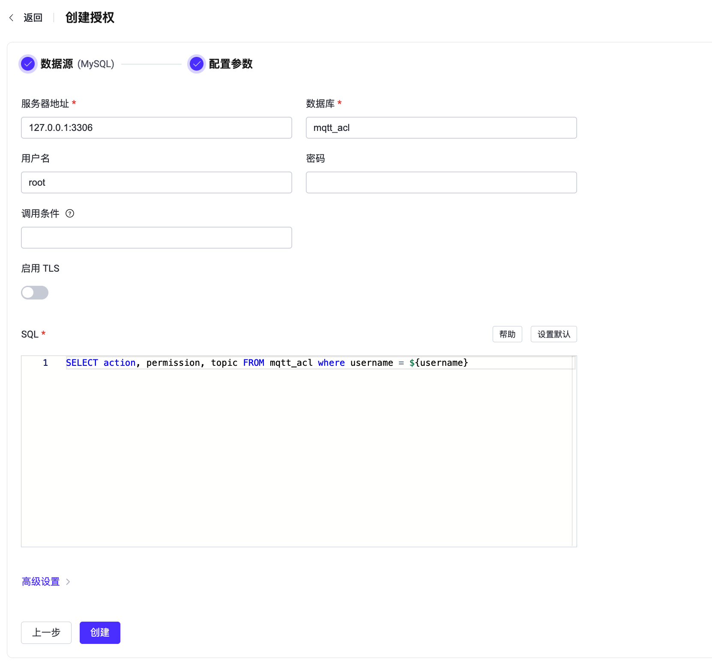

# 基于 MySQL 进行授权

MySQL Authorizer 支持客户端的权限列表存储在 MySQL 数据库中。

::: tip 前置准备

熟悉 [EMQX 授权基本概念](./authz.md)
:::

## 表结构与查询语句

MySQL Authorizer 可以支持任何表结构，甚至是多个表联合查询、或从视图中查询。用户需要提供一个查询 SQL 模板，且确保查询结果包含以下字段：

- `permission`: 用于指定操作权限，可选值有 `allow` 和 `deny`。
- `action`: 用于指定当前规则适用于哪些操作，可选值有 `publish`、`subscribe` 和 `all`。
- `topic`: 用于指定当前规则适用的主题，可以使用主题过滤器和[主题占位符](./authz.md#主题占位符)。
- `qos`: (可选)用于指定规则适用的消息 QoS，可选值为 `0`、`1`、`2`，也可以用 `,` 分隔的字符串指定多个 QoS，例如 `0,1`。默认为全部 QoS。
- `retain`: （可选）用于指定当前规则是否支持发布保留消息，可选值有 `0`、`1`，默认允许保留消息。

## 示例表结构

在数据库中创建如下表结构：

```sql
CREATE TABLE `mqtt_acl` (
  `id` int(11) unsigned NOT NULL AUTO_INCREMENT,
  `username` varchar(100) NOT NULL,
  `permission` varchar(5) NOT NULL,
  `action` varchar(9) NOT NULL,
  `topic` varchar(100) NOT NULL,
  `qos` tinyint(1),
  `retain` tinyint(1),
  INDEX username_idx(username),
  PRIMARY KEY (`id`)
) ENGINE=InnoDB DEFAULT CHARSET=utf8mb4;
```

::: tip
当系统中有大量权限数据时，请确保查询使用的表已优化并使用有效的索引，以提升大量连接时的数据查找速度、并降低 EMQX 负载。
:::

## 查询语句

在 EMQX 中配置以下查询参数，使用 `mqtt_acl` 表并以 `username` 作为查找条件，查询出权限数据。

```bash
SELECT 
  permission, action, topic, qos, retain 
FROM mqtt_acl 
  WHERE username = ${username}
```

## 权限测试

成功添加 MySQL 授权器后，向 MySQL 中添加权限数据，并使用 MQTTX CLI 连接到 EMQX 进行测试。

1. 用户名为 `emqx_u`、禁止发布到 `t/1` 主题的规则示例：

```bash
INSERT INTO mqtt_acl(username, permission, action, topic) VALUES ('emqx_u', 'deny', 'publish', 't/1');
```

使用以下命令进行发布测试，测试结果表明没有发布权限：

```bash
$ mqttx pub -u emqx_u -t t/1 -q 1 -m '{ "msg": "Can I publish it?" }'
[2023-9-20] [18:43:38] › …  Connecting...
[2023-9-20] [18:43:39] › ✔  Connected
[2023-9-20] [18:43:39] › …  Message publishing...
[2023-9-20] [18:43:39] › ⚠  Error: Publish error: Not authorized
```

2. 用户名为 `emqx_u`、禁止发布保留消息到 `t/2` 主题的规则示例：

```bash
INSERT INTO mqtt_acl(username, permission, action, topic, retain) VALUES ('emqx_u', 'deny', 'publish', 't/2', 1);
```

使用以下命令进行发布测试，测试结果表明仅对保留消息没有发布权限：

```bash
# 可以发布成功
$ mqttx pub -u emqx_u -t t/2 -q 1 -m '{ "msg": "Can I publish it?" }'
[2023-9-20] [18:47:10] › …  Connecting...
[2023-9-20] [18:47:10] › ✔  Connected
[2023-9-20] [18:47:10] › …  Message publishing...
[2023-9-20] [18:47:10] › ✔  Message published

# -r 参数指定消息为保留消息时，没有发布权限
$ mqttx pub -u emqx_u -t t/2 -q 1 -r -m '{ "msg": "Can I publish it?" }'
[2023-9-20] [18:46:00] › …  Connecting...
[2023-9-20] [18:46:00] › ✔  Connected
[2023-9-20] [18:46:00] › …  Message publishing...
[2023-9-20] [18:46:00] › ⚠  Error: Publish error: Not authorized
````

3. 用户名为 `emqx_u`、禁止以 QoS1 订阅 `t/3` 主题的规则示例：

```bash
INSERT INTO mqtt_acl(username, permission, action, topic, qos) VALUES ('emqx_u', 'deny', 'subscribe', 't/3', 1);
```

使用以下命令进行发布测试，测试结果表明仅对保留消息没有发布权限：

```bash
# 指定 QoS0 时可以订阅成功
$ mqttx sub -u emqx_u -t t/3 -q 0
[2023-9-20] [18:49:00] › …  Connecting...
[2023-9-20] [18:49:00] › ✔  Connected
[2023-9-20] [18:49:00] › …  Subscribing to t/3...
[2023-9-20] [18:49:00] › ✔  Subscribed to t/3

# 指定 QoS1 时无法订阅主题
$ mqttx sub -u emqx_u -t t/3 -q 1
[2023-9-20] [18:49:45] › …  Connecting...
[2023-9-20] [18:49:45] › ✔  Connected
[2023-9-20] [18:49:45] › …  Subscribing to t/3...
[2023-9-20] [18:49:45] › ✔  Subscribed to t/3
[2023-9-20] [18:49:45] › ✖  Subscription negated to t/3 with code 135
```

## 通过 Dashboard 配置

1. 在 EMQX Dashboard 页面上点击左侧导航栏的**访问控制** -> **客户端授权**。

2. 在**客户端授权**页面，点击**创建**，选择 **MySQL** 作为**数据源**，点击**下一步**进入**配置参数**页签。

   

3. 按照以下说明配置数据源：
   - MySQL 数据库的连接设置：
     - **服务器地址**：填入 MySQL 服务器地址（`host:port`）。
     - **数据库**：填入 MySQL 的数据库名称。
     - **用户名**：填入用户名称。
     - **密码**：填入用户密码。
   - **调用条件**：输入可选的 Variform 表达式。仅当表达式计算结果为 `true` 时，EMQX 才调用此授权检查器。有关表达式语法和可用变量，请参见[授权检查器调用条件](./authz.md#授权检查器调用条件)。
   - **启用 TLS**：如果要启用 TLS，请打开切换按钮。有关启用 TLS 的更多信息，请参见[网络和 TLS](../../network/overview.md#启用-tls-加密访问外部资源)。
   - **SQL**：根据表结构填入查询 SQL，具体要求见[表结构与查询语句](#表结构与查询语句)。
   - **高级设置**：配置连接池、超时及预处理语句相关选项。
     - **连接池大小**（可选）：填入一个整数用于指定从 EMQX 节点到 MySQL 数据库的并发连接数；默认值：`8`。
     - **连接超时**（可选）：指定 EMQX 等待数据库连接建立的最长时间。支持毫秒、秒、分钟、小时等单位。默认值：`15` 秒。
     - **禁用预处理语句**（可选）：禁止在数据库查询中使用预处理语句（Prepared Statements）。如果您的 MySQL 代理或中间件（例如事务模式下的 PGBouncer 或 Supabase）不支持会话级功能（如预处理语句），请启用此选项。默认：禁用。

4. 点击**创建**完成相关配置。

## 通过配置文件配置

您也可以通过配置文件完成以上配置。详细参数说明请参考 [EMQX 企业版配置手册](https://docs.emqx.com/zh/enterprise/v@EE_VERSION@/hocon/)。

MySQL 授权器由 `type = mysql` 标识，配置示例：

可选配置项 `precondition` 接受 Variform 表达式。仅当表达式计算结果为 `true` 时，EMQX 才调用此授权检查器。未配置 `precondition` 或将其留空时，不应用调用条件。有关详细信息，请参见[授权检查器调用条件](./authz.md#授权检查器调用条件)。

```bash
{
  type = mysql

  server = "127.0.0.1:3306"
  database = "mqtt"
  username = "root"
  password = "public"
  pool_size = 8
  connect_timeout = "15s"
  disable_prepared_statements = false

  query = "SELECT permission, action, topic FROM mqtt_acl WHERE username = ${username}"
}
```
