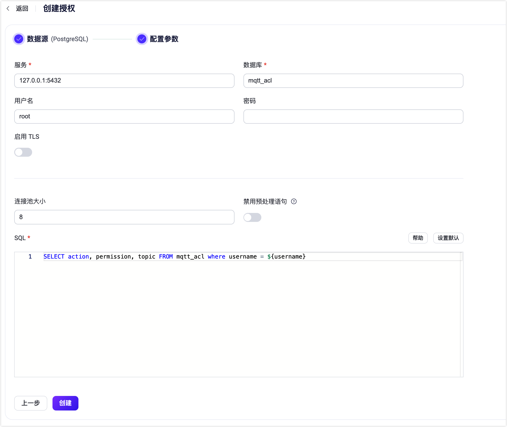

# 基于 PostgreSQL 进行授权

PostgreSQL Authorizer 支持客户端的权限列表存储在 PostgreSQL 数据库中。

::: tip 前置准备

熟悉 [EMQX 授权基本概念](./authz.md)
:::

## 表结构与查询语句

PostgreSQL Authorizer 可以支持任何表结构，甚至是多个表联合查询、或从视图中查询。用户需要提供一个查询 SQL 模板，且确保查询结果包含以下字段：

- `permission`: 用于指定操作权限，可选值有 `allow` 和 `deny`。
- `action`: 用于指定当前规则适用于哪些操作，可选值有 `publish`、`subscribe` 和 `all`。
- `topic`: 用于指定当前规则适用的主题，可以使用主题过滤器和[主题占位符](./authz.md#主题占位符)。
- `qos`: （可选）用于指定当前规则适用的消息 QoS，可选值有 `0`、`1`、`2`，默认为所有 QoS。
- `retain`: （可选）用于指定当前规则是否支持发布保留消息，可选值有 `0`、`1`，默认允许保留消息。

示例表结构：

```sql
CREATE TABLE mqtt_acl(
  id serial PRIMARY KEY,
  username text NOT NULL,
  permission text NOT NULL,
  action text NOT NULL,
  topic text NOT NULL,
  qos tinyint,
  retain tinyint
);
CREATE INDEX mqtt_acl_username_idx ON mqtt_acl(username);
```

::: tip
上面的示例创建了一个索引，当系统中有大量权限数据时，请确保查询使用的表已优化并使用有效的索引，以提升大量连接时的数据查找速度并降低 EMQX 负载。
:::

添加用户名为 `emqx_u`、禁止发布到 `t/1` 主题的规则示例：

```sql
postgres=# INSERT INTO mqtt_acl(username, permission, action, topic) VALUES ('emqx_u', 'deny', 'publish', 't/1');
INSERT 0 1
```

对应的配置参数为：

```bash
query = "SELECT permission, action, topic, qos, retain FROM mqtt_acl WHERE username = ${username}"
```

## 通过  Dashboard 配置

您可以使用 EMQX Dashboard 配置如何使用 PostgreSQL 进行用户授权。



1. 在 [EMQX Dashboard](http://127.0.0.1:18083/#/authentication)，点击左侧目录上的 **访问控制** -> **客户端授权** 进入授权检查器页面。
2. 点击右上角的**创建**，然后点击选择 **PostgreSQL** 作为**数据源**。单击**下一步**。
3. 按照以下说明进行配置。

   - **服务**：指定 EMQX 要连接的服务器地址（`host:port`）。
- **数据库**： PostgreSQL 数据库名称。
   - **用户名**（可选）： 指定用户名。
   - **密码**（可选）： 指定用户密码。
   - **启用 TLS**：如果要启用 TLS，请启用此项。
   - **连接池大小**（可选）： 输入一个整数值，以定义从 EMQX 节点到 PostgreSQL 的并发连接数。默认值： `8`.
   - **禁用预处理语句**（可选）：如果使用的 PostgreSQL 服务不支持预处理语句，如事务模式下的 PGBouncer 或 Supabase，请启用此选项。该选项在 EMQ X v5.7.1 中引入。
- **SQL**： 根据数据模式填写查询语句。有关详细信息，请参阅 [表结构与查询语句](#表结构与查询语句)。
4. 单击**创建**完成设置。

## 配置项

<!--详细配置请参考 [authz:postgresql](../../configuration/configuration-manual.html#authz:postgresql)。-->

PostgreSQL authorizer 由 `type=postgresql` 标识。

配置示例：

```hcl
{
  type = postgresql

  database = "mqtt"
  username = "postgres"
  password = "public"
  server = "127.0.0.1:5432"
  query = "SELECT permission, action, topic FROM mqtt_acl WHERE username = ${username}"
}
```

### query

必选的字符串类型配置，用于查询当前客户端具有的权限列表，支持[占位符](./authz.md#数据查询占位符)。

出于安全原因占位符值不会直接拼接 SQL，而是通过 PostgreSQL 预处理插入，能够有效预防 SQL 注入。

例如，以下查询语句：

```sql
SELECT permission, action, topic FROM mqtt_acl WHERE username = ${username}
```

将首先被转换为以下 Prepared statement：

```sql
SELECT permission, action, topic FROM mqtt_acl WHERE username = $1
```

然后使用 `${username}` 执行查询。

### server

必选的字符串类型配置，用于指定 PostgreSQL 服务器地址，格式为 `host:port`。

### database

必选的字符串类型配置，用于指定 PostgreSQL 数据库名称。

### username

可选的字符串类型配置，用于指定 PostgreSQL 用户名。

### password

可选的字符串类型配置，用于指定 PostgreSQL 用户密码。

#### auto_reconnect

可选的布尔类型配置，用于指定 EMQX 是否会在连接断开时自动重新连接到 PostgreSQL，默认值为 `true`。

### pool_size

可选的整型配置，用于指定 EMQX 节点到 PostgreSQL 服务器的并发连接数，默认值为 8。

### ssl

用于 [安全连接到 PostgreSQL](https://www.postgresql.org/docs/current/ssl-tcp.html) 的标准 SSL 选项。
