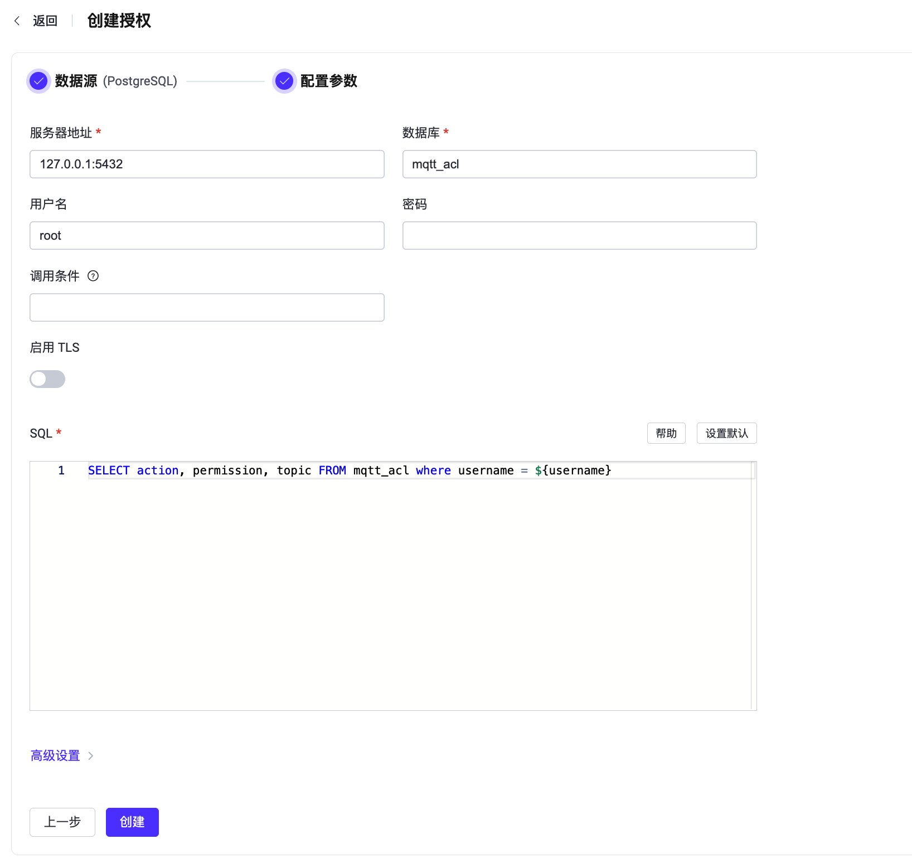

# 基于 PostgreSQL 进行授权

PostgreSQL 授权器支持客户端的权限列表存储在 PostgreSQL 数据库中。

::: tip 前置准备

熟悉 [EMQX 授权基本概念](./authz.md)
:::

## 表结构与查询语句

PostgreSQL 授权器可以支持任何表结构，甚至是多个表联合查询、或从视图中查询。用户需要提供一个查询 SQL 模板，且确保查询结果包含以下字段：

- `permission`: 用于指定操作权限，可选值有 `allow` 和 `deny`。
- `action`: 用于指定当前规则适用于哪些操作，可选值有 `publish`、`subscribe` 和 `all`。
- `topic`: 用于指定当前规则适用的主题，可以使用主题过滤器和[主题占位符](./authz.md#主题占位符)。
- `qos`: （可选）用于指定当前规则适用的消息 QoS，可选值有 `0`、`1`、`2`，默认为所有 QoS。
- `retain`: （可选）用于指定当前规则是否支持发布保留消息，可选值有 `0`、`1`，默认允许保留消息。

示例表结构：

```sql
CREATE TABLE mqtt_acl(
  id serial PRIMARY KEY,
  username text NOT NULL,
  permission text NOT NULL,
  action text NOT NULL,
  topic text NOT NULL,
  qos smallint,
  retain smallint
);
CREATE INDEX mqtt_acl_username_idx ON mqtt_acl(username);
```

::: tip
上面的示例创建了一个索引，当系统中有大量权限数据时，请确保查询使用的表已优化并使用有效的索引，以提升大量连接时的数据查找速度并降低 EMQX 负载。
:::

添加用户名为 `emqx_u`、禁止发布到 `t/1` 主题的规则示例：

```sql
postgres=# INSERT INTO mqtt_acl(username, permission, action, topic) VALUES ('emqx_u', 'deny', 'publish', 't/1');
INSERT 0 1
```

对应的配置参数为：

```bash
query = "SELECT permission, action, topic, qos, retain FROM mqtt_acl WHERE username = ${username}"
```

## 通过  Dashboard 配置

您可以使用 EMQX Dashboard 配置如何使用 PostgreSQL 进行用户授权。



1. 在 [EMQX Dashboard](http://127.0.0.1:18083/#/authentication)，点击左侧目录上的 **访问控制** -> **客户端授权** 进入授权检查器页面。
2. 点击右上角的**创建**，然后点击选择 **PostgreSQL** 作为**数据源**。单击**下一步**。
3. 按照以下说明配置数据源：
   - PostgreSQL 数据库的连接设置：
     - **服务**：填入 PostgreSQL 服务器地址（`host:port`）。
     - **数据库**：填入 PostgreSQL 的数据库名称。
     - **用户名**：填入用户名称。
     - **密码**：填入用户密码。
   - **启用 TLS**：如果要启用 TLS，请打开切换按钮。有关启用 TLS 的更多信息，请参见[网络和 TLS](../../network/overview.md#启用-tls-加密访问外部资源)。
   - **SQL**：根据表结构填入查询 SQL，具体要求见[表结构与查询语句](#表结构与查询语句)。
   - **高级设置**：配置连接池、超时及预处理语句相关选项。
     - **连接池大小**（可选）：填入一个整数用于指定从 EMQX 节点到 PostgreSQL 数据库的并发连接数；默认值：`8`。
     - **连接超时**（可选）：指定 EMQX 等待数据库连接建立的最长时间。支持毫秒、秒、分钟、小时等单位。默认值：`15` 秒。
     - **禁用预处理语句**（可选）：禁止在数据库查询中使用预处理语句（Prepared Statements）。如果您的 PostgreSQL 代理或中间件（例如事务模式下的 PGBouncer 或 Supabase）不支持会话级功能（如预处理语句），请启用此选项。默认：禁用。
4. 点击**创建**完成相关配置。

## 通过配置文件配置

您也可以通过配置文件完成以上配置。详细参数说明请参考 [EMQX 企业版配置手册](https://docs.emqx.com/zh/enterprise/v@EE_VERSION@/hocon/)。

PostgreSQL 授权器由 `type = postgresql` 标识，配置示例：

```bash
{
  type = postgresql

  server = "127.0.0.1:5432"
  database = "mqtt"
  username = "postgres"
  password = "public"
  pool_size = 8
  connect_timeout = "15s"
  disable_prepared_statements = false

  query = "SELECT permission, action, topic FROM mqtt_acl WHERE username = ${username}"
}
```
