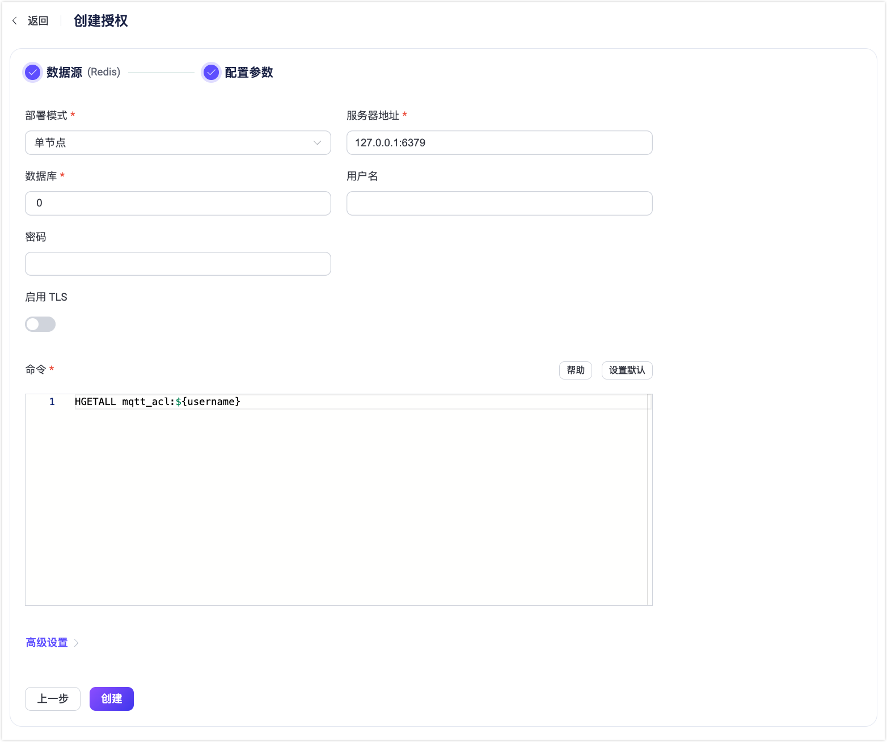

# 基于 Redis 进行授权

Redis Authorizer 支持客户端的权限列表存储在 Redis 数据库中。

::: tip 前置准备

熟悉 [EMQX 授权基本概念](./authz.md)
:::

## 数据结构与查询指令

Redis 认证器支持使用 [Redis hashes](https://redis.io/docs/manual/data-types/#hashes) 存储权限数据，用户需要提供一个查询指令模板，且确保查询结果包含以下数据：

- `topic`: 用于指定当前规则适用的主题，可以使用主题过滤器和[主题占位符](./authz.md#主题占位符)。
- `action`: 用于指定当前规则适用于哪些操作，可选值有 `publish`、`subscribe` 和 `all`。
- `qos`:（可选）用于指定当前规则适用的消息 QoS，可选值有 `0`、`1`、`2`，也可以使用 Number 数组同时指定多个 QoS。默认为所有 QoS。
- `retain`: （可选）用于指定当前规则是否支持发布保留消息，可选值有 `true`、`false`，默认允许保留消息。

添加用户名为 `emqx_u`，允许订阅 `t/1` 主题的权限数据：

```bash
HSET mqtt_acl:emqx_u t/1 subscribe
```

由于 Redis 结构限制，使用 `qos` 与 `retain` 字段时，需要将除 `topic` 外的字段放到 JSON 字符串中，例如：

- 添加用户名为 `emqx_u`，允许以 QoS1 和 QoS2 订阅 `t/2` 主题的权限数据：

```bash
HSET mqtt_acl:emqx_u t/2 '{ "action": "subscribe", "qos": [1, 2] }'
```

- 添加用户名为 `emqx_u`，拒绝向 `t/3` 主题发布保留消息的权限数据：

```bash
HSET mqtt_acl:emqx_u t/3 '{ "action": "publish", "retain": false }'
```

对应的配置项为：

```bash
cmd = "HGETALL mqtt_acl:${username}"
```

::: tip
Redis 授权器中添加的所有规则都是**允许**规则，即 Redis Authorizer 需要在白名单模式下使用。
:::

## 通过 Dashboard 配置

你可以通过 EMQX Dashboard 配置 Redis 作为用户授权的后端。

1. 在 EMQX Dashboard 中，点击左侧导航栏的**访问控制** -> **客户端权限**，进入**客户端权限控制** 页面。

2. 点击右上角的**创建**按钮，在弹出的对话框中选择 **Redis** 作为**数据源**，然后点击 **下一步**，进入**配置参数**页，如下图所示：

   

3. 按照以下说明完成配置：

   - **Redis 模式**：选择 Redis 的部署模式，包括`单节点`、`Sentinel` 和`Cluster`。

   - **服务器地址**：输入 Redis 服务器的地址（格式为 `host:port`），EMQX 将连接该地址。

   - **数据库**：填写 Redis 的数据库编号或名称。

   - **用户名**：指定用于连接 Redis 的用户名。如果您的 Redis 实例启用了 [Redis ACL](https://redis.io/docs/latest/operate/oss_and_stack/management/security/acl/#create-and-edit-user-acls-with-the-acl-setuser-command)（在 Redis 6.0 引入），则此字段为必填项。如果您的 Redis 使用默认用户（未启用或未强制启用 ACL），则可以留空此字段。

     ::: tip 提示

     `username` 字段从 EMQX 5.2.0 版本开始支持。请确保您的部署版本为 5.2.0 或更高版本，以支持 Redis ACL。

     :::

   - **密码**：指定用于连接 Redis 用户的密码。若 Redis 实例启用了身份认证，该字段为必填项。

     - 如果填写了用户名，则密码必须与 Redis ACL 中该用户配置的凭据一致。
     - 如果未填写用户名，则将使用该密码尝试以 `default` 用户身份进行身份认证（前提是该用户未被禁用）。
   
   - **启用 TLS**：如果需要启用 TLS，加上开关即可开启。有关 TLS 配置的更多信息，请参阅[网络与 TLS](../../network/overview.md)。

   - **命令**：根据数据结构填写 Redis 查询命令。

   - **高级设置**：设置连接池大小和连接超时时间。
     - **连接池大小**（可选）：输入一个整数，表示每个 EMQX 节点与 Redis 建立的并发连接数量。默认值为 `8`。
   
4. 完成配置后，点击 **创建** 保存设置。

## 使用配置项配置

Redis 授权器由 `type=redis` 标识。<!--详细配置请参考 [redis_standalone](../../configuration/configuration-manual.html#authz:redis_standalone)、[authz:redis_sentinel](../../configuration/configuration-manual.html#authz:redis_sentinel) 与 [authz:redis_cluster](../../configuration/configuration-manual.html#authz:redis_cluster)。-->

Redis 授权器支持 3 种部署模式的 Redis。

Standalone Redis:

```hcl
{
    type = redis

    redis_type = single
    server = "127.0.0.1:6379"

    cmd = "HGETALL mqtt_user:${username}"
    database = 1
    password = public

}
```

[Redis Sentinel](https://redis.io/docs/manual/sentinel/):

```hcl
{
    type = redis

    redis_type = sentinel
    servers = "10.123.13.11:6379,10.123.13.12:6379"
    sentinel = "mymaster"

    cmd = "HGETALL mqtt_user:${username}"
    database = 1
    password = public

}
```

[Redis Cluster](https://redis.io/docs/manual/scaling/):

```hcl
{
    type = redis

    redis_type = cluster
    servers = "10.123.13.11:6379,10.123.13.12:6379"

    cmd = "HGETALL mqtt_user:${username}"
    password = public
}
```

### redis_type

可选值为 `single`、 `cluster` 和 `sentinel`，分别对应 Redis 的 3 种部署类型：

1. Standalone Redis
2. [Redis Cluster](https://redis.io/docs/manual/scaling/)
3. [Redis Sentinel](https://redis.io/docs/manual/sentinel/)

### cmd

必选的字符串类型配置项。用于指定查询权限规则的命令，支持使用占位符。主题过滤器中允许使用 [主题占位符](./authz.md#主题占位符)。

### database

必选的整型配置。指定 Redis 数据库的 Index。

### password

可选的字符串类型配置。指定用于 Redis [认证](https://redis.io/docs/manual/security/#authentication) 的密码。

### auto_reconnect

可选的布尔类型配置。默认值为 `true`。指定 EMQX 是否自动重新连接到 Redis。

### pool_size

可选的整型配置。指定从 EMQX 节点到 Redis 的并发连接数。默认值为 8。

### ssl

用于 [安全连接至 Redis](https://redis.io/docs/manual/security/encryption/) 的标准 SSL options。<!--(../../configuration/configuration.md#tls-ciphers)。-->

### Standalone Redis options (`redis_type = single`).

#### server

必选的字符串类型配置，格式为 `host:port`，用于指定 Redis 服务端地址。

### Redis Cluster options (`redis_type = cluster`).

#### servers

必选的字符串类型配置，格式为 `host1:port1,host2:port2,...`，用于指定 Redis Cluster 端点地址列表。

### Redis Sentinel options (`redis_type = sentinel`).

#### servers

必选的字符串类型配置，格式为 `host1:port1,host2:port2,...`，用于指定 Redis Sentinel 端点地址列表。

#### sentinel

必选的字符串类型配置。用于指定 Redis Sentinel 配置需要的 [主服务器名称](https://redis.io/docs/manual/sentinel/#configuring-sentinel)。
