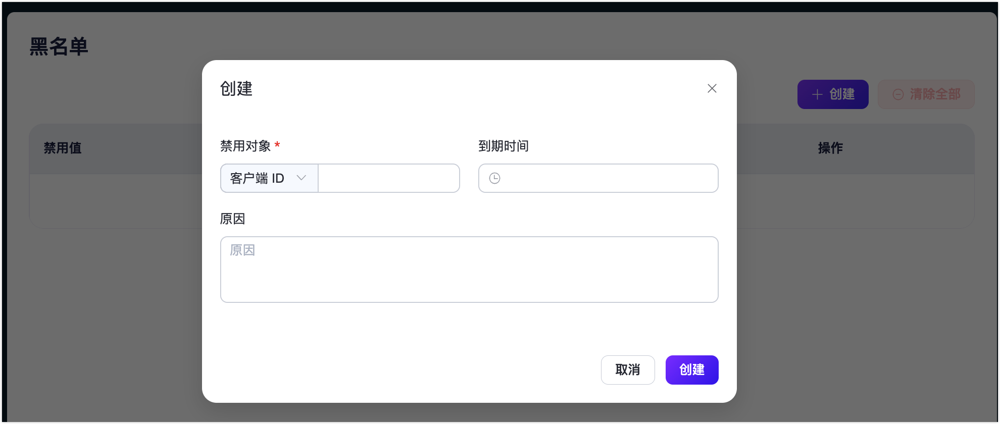

# 黑名单

EMQX 为用户提供了黑名单功能来禁止某些客户端的访问，除了可以封禁客户端 ID 以外，还支持直接封禁用户名甚至 IP 地址。

本页主要介绍了如何在 EMQX Dashboard 中创建和移除黑名单，然而您也可以通过以下 [REST API](https://docs.emqx.com/en/enterprise/v5.2/admin/api-docs.html#tag/Banned) 使用黑名单功能：

| API                      | 功能                                                         |
| ------------------------ | ------------------------------------------------------------ |
| DEL /banned              | 清除所有封禁数据。                                           |
| GET /banned              | 列出当前所有被封禁的客户端 ID、用户名和 IP 地址。            |
| POST /banned             | 将客户端添加到封禁黑名单，可以使用客户端 ID、用户名或 IP 地址。 |
| DEL /banned/ {as} /{who} | 将客户端从禁封黑名单中移除。                                 |

::: tip
黑名单只适用于少量客户端封禁需求，如果有大量客户端需要认证管理，请使用[认证](./authn/authn.md)功能。
:::

## 创建黑名单

1. 在 EMQX Dashboard 页面，点击左侧导航栏的**访问控制** -> **黑名单**，在随即打开的页面，单击**创建**。

2. 在弹出的**创建**页面，按照页面提示配置：

   

您可以按照以下说明完成相关设置： 

- **禁用对象**：添加禁用，目前支持通过**客户端 ID**、**IP 地址**、**用户名**添加禁用对象。
- **到期时间**（可选）：设置该规则的到期时间。
- **原因**（可选）：说明为该对象设置黑名单的原因。

## 移除黑名单

您可以通过点击**操作**列中的**删除**按钮来移除单个被封禁客户端记录。如果您希望一次性清除页面上的所有记录，请点击**清除全部**按钮。
