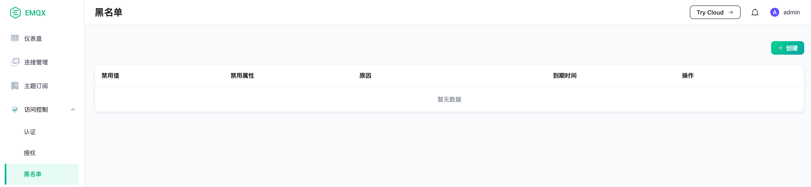
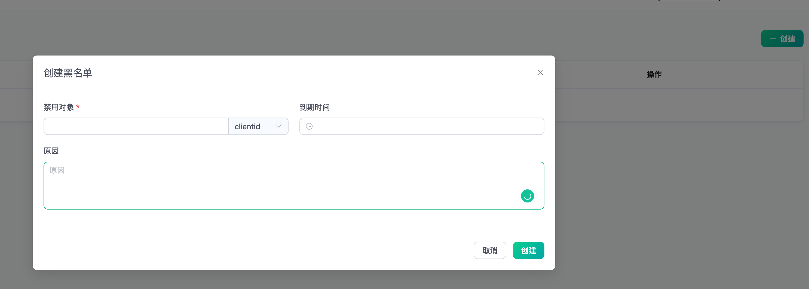

# 黑名单

EMQX 为用户提供了黑名单功能，用户可以通过 Dashboard 将指定客户端、用户名加入黑名单以拒绝该客户端访问，除了客户端标识符以外，还支持直接封禁用户名甚至 IP 地址。

::: tip
黑名单只适用于少量客户端封禁需求，如果有大量客户端需要认证管理，请使用 [认证](./authn/authn.md) 功能。
:::

## 使用

1. 打开黑名单界面



2. 点击"创建"按钮进行添加



## 自动封禁

在黑名单功能的基础上，EMQX 支持自动封禁那些被检测到短时间内频繁登录的客户端，并且在一段时间内拒绝这些客户端的登录，以避免此类客户端过多占用服务器资源而影响其他客户端的正常使用。

需要注意的是，自动封禁功能只封禁客户端标识符，并不封禁用户名和 IP 地址，即该机器只要更换客户端标识符就能够继续登录。

此功能默认关闭，用户可以在 `emqx.conf` 配置文件中添加如下配置进行开启:

```bash
flapping_detect {
  enable = true
  # 客户端最大离线次数
  max_count = 15
  # 检测的时间范围
  window_time = "1m"
  # 封禁的时长
  ban_time = "5m"
}
```

这个配置可以为每个 zone 进行单独设置。