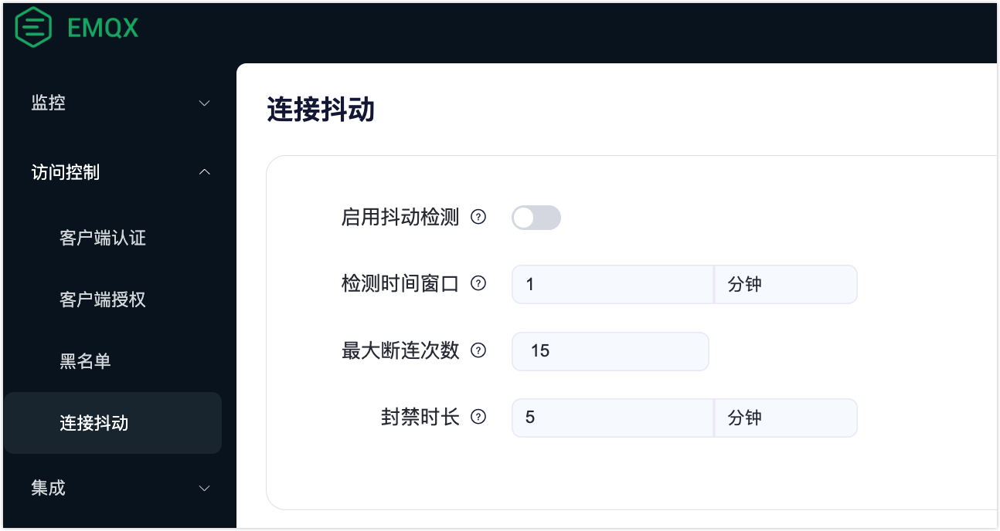

# 连接抖动检测

在黑名单功能的基础上，EMQX 支持自动封禁那些被检测到短时间内频繁登录的客户端，并且在一段时间内拒绝这些客户端的登录，以避免此类客户端过多占用服务器资源而影响其他客户端的正常使用。

需要注意的是，连接抖动检测功能只会封禁客户端 ID，并不封禁用户名和 IP 地址，即该机器只要更换客户端标 ID 就能够继续登录。

抖动检测功能默认关闭，您可以通过 EMQX Dashboard 或配置文件开启该功能。

## 通过 Dashboard 开启

前往 Dashboard，从左侧导航菜单点击**访问控制** -> **连接抖动** 进入**连接抖动**页面。通过点击切换按钮启用抖动检测功能。

- **检测时间窗口**：您可以指定系统监视客户端抖动行为的持续时间。默认值为 `1` 分钟。
- **最大断连次数**：您可以指定在检测窗口时间内允许的 MQTT 客户端的最大断开连接次数。它允许您设定准确的标准来识别和响应表现出抖动行为的客户端。默认值为 `15`。
- **封禁时长**：您可以指定客户端被封禁的时间长度。默认值为 `5` 分钟。

点击**保存更改**以完成设置。



## 通过配置文件开启

您也可以在 `emqx.conf` 配置文件中添加如下配置开启连接抖动检测:

```bash
flapping_detect {
  enable = true
  # 客户端最大离线次数
  max_count = 15
  # 检测的时间范围
  window_time = "1m"
  # 封禁的时长
  ban_time = "5m"
}
```

该配置表示当一个客户端在 1 分钟内累计断开连接次数达到 15 次时将被封禁 5 分钟。